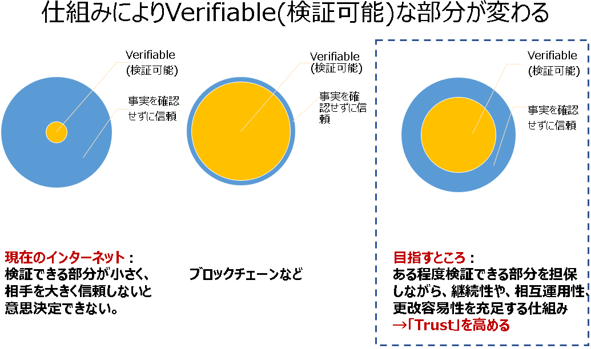
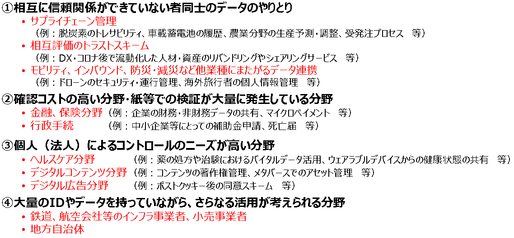
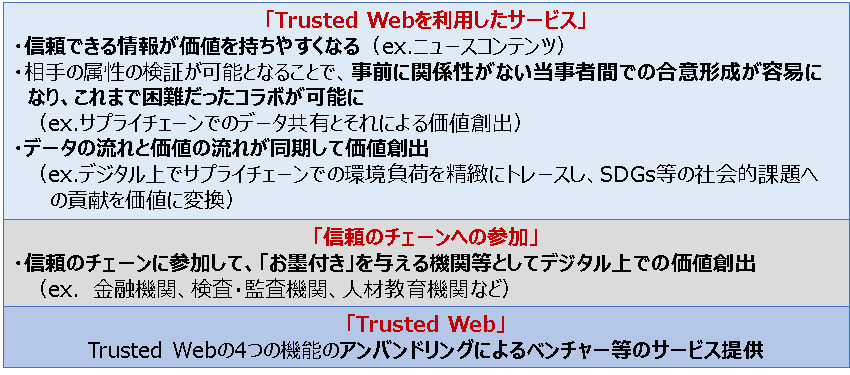
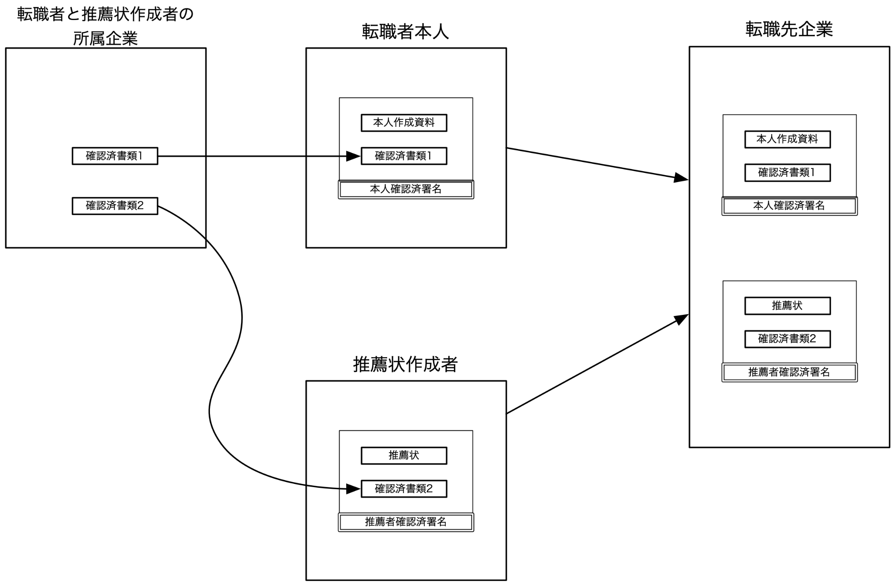
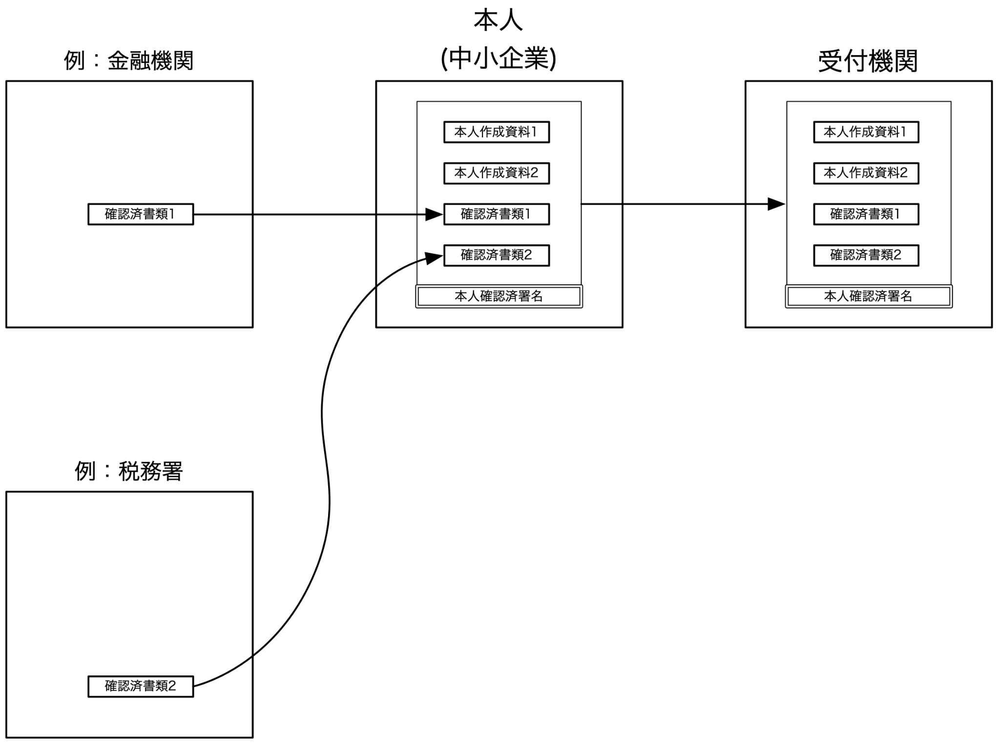
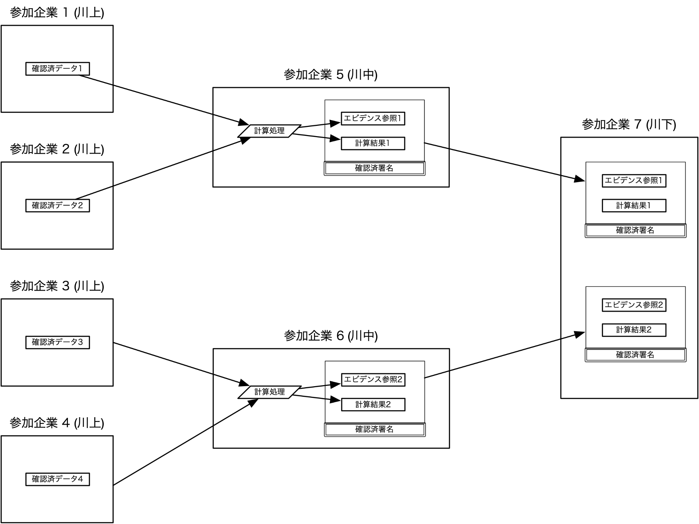
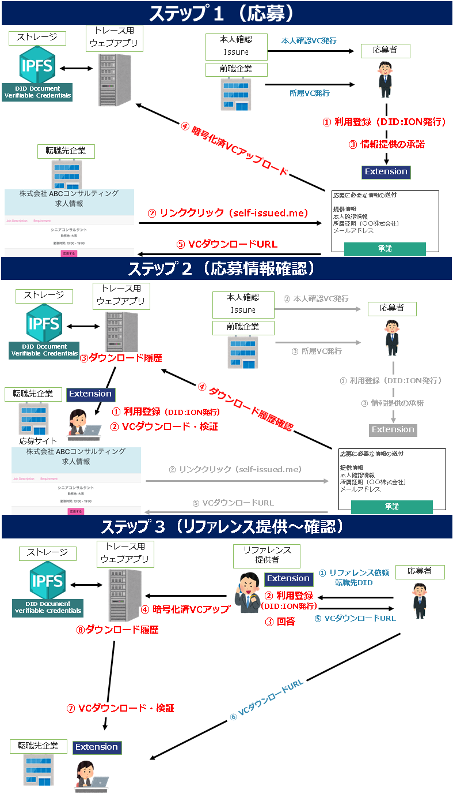
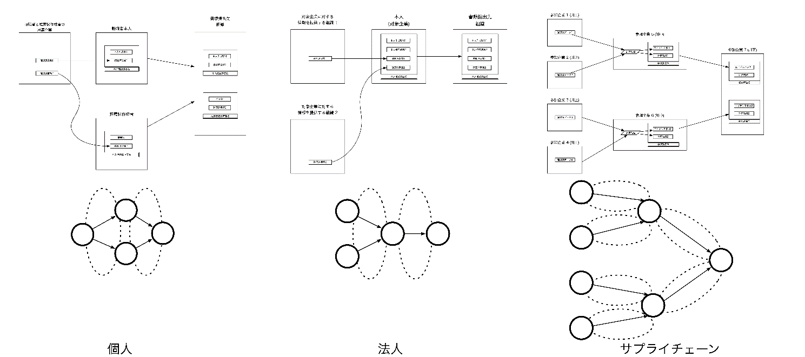
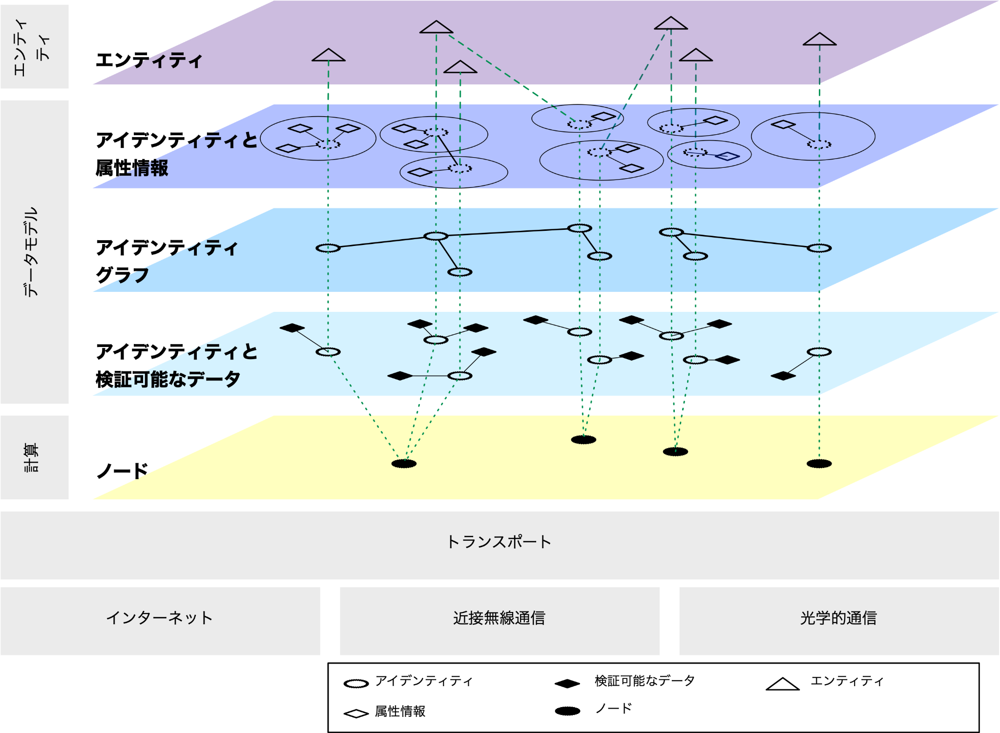
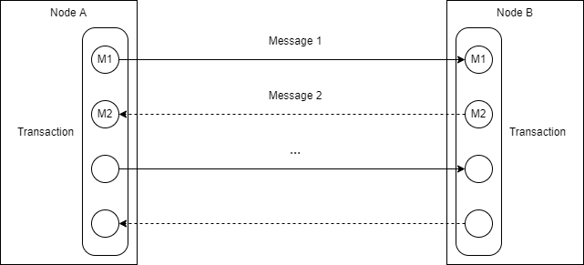

| **TRUSTED WEB WHITE PAPER DRAFT** |
| --- |

Trusted Web ホワイトペーパー（案）
===
Ver2.0
2022年7月25日
Trusted Web推進協議会

# Trusted Web White Paper Ver2.0 Executive Summary

1.背景（本文1.～2.）

-   フェイクニュースなど流れるデータの信頼性への懸念やそれに伴う社会の分断、プライバシー侵害リスク、勝者総取りに伴う特定サービスへの過度な依存、サイロ化した産業データの未活用など、デジタル化の中で様々なペインポイントが生じている。

-   「デジタル社会」への移行にあたり、通信プロトコルを主に規定する現行のインターネットやウェブでは、社会活動において求められる責任関係や安心を十分に体現できておらず、Trustの再構築が不可欠。

2.Trusted Webが目指す新たな信頼の仕組み（本文3.～4.）

-   これまでのTrustの仕組みでは、データのやりとりにおいて検証できる領域が狭く、事実を確認せずに、プラットフォーム事業者等を信頼せざるを得ない状況。データを紐づける識別子の仕組みもプラットフォーム事業者に依存。

-   特定のサービスに過度に依存せずに、データのコントロールや合意形成、トレースの仕組みを取り入れ、検証できる領域を拡大し、Trustを向上していくことが必要。

-   Trusted Webは、こうしたTrustの仕組みを現行のインターネットの上に重ね合わせ（オーバーレイ）、多様な主体による新たな価値の創出を目指すものである。

-   Trusted Webによるデータのやりとりにおける信頼の仕組みの構築は、様々な主体が業種や部門を超えて協創することが求められるデジタル・トランスフォーメーション（DX）を進めるに当たって、その前提となる事業者間連携を円滑にする上でも極めて重要な取組である。

3.Trusted Webのアーキテクチャデザイン等（本文5.～9.）

-   2021年3月のver1.0の公表後、Trusted Webの具現化に向けて、①個人（転職時）、②法人（補助金申請）、③サプライチェーン（化学物質の含有量等の伝達）の３つのユースケース分析を行うとともに、個人のユースケースをベースにプロトタイプの開発を行い、課題の抽出を行った。

-   それらを踏まえ、Trusted Webで目指す信頼の姿は以下のようなものと整理した。

-   主体（エンティティ）は外部連携等されたアイデンティティ管理システムを利用することによって自らのアイデンティティ管理を実現する。

-   検証できる領域の拡大によってTrustの向上を図る。データとデータのやり取りの過程について検証可能な範囲の拡大を図る。

-   データの検証可能性を担保するため、主にデジタル署名技術を活用する。《署名自身》の検証、《署名者》の検証、《署名の意図》の明確化[^1]によって、署名を含むデータ全体を検証できることになる。

-   データのやりとりの過程の検証可能性の担保は、やりとりをモデル化しデジタル署名技術と組み合わせることで実現する。他のエンティティとやり取りをする際、そのやり取りの過程を記録し、検証可能とする。

-   実現のためには複数の既存プロトコルを適用し組み合わせる必要があり、組み合わせの自由度が高くなるようなアーキテクチャとする。

-   以上を踏まえ、Trusted Webを実現するためのアーキテクチャを提示した。具体的には、ver1.0で示された４つの機能を、データを主体とした視点で、「検証可能なデータ」、「アイデンティティ」、「メッセージ」、「トランザクション」の４つの構成要素とし、計算資源と通信を主体とした視点で、「ノード」、「トランスポート」の２つの構成要素として、あわせて６構成要素として再整理を行った。

-   Trusted Webをデジタル・インフラとして構築していく上では、現在見られるペインポイントの再来を回避するため、現在のように、営利追求を目的とした一部の企業活動に過度に依存することとならないよう、共有財（コモンズ）としてのインフラとしていかに構築していくか、その適切なガバナンスのあり方を検討していく。

4.実現に向けた道筋（本文6.10.）

-   今後、Trusted Webが目指す仕組みを具現化する様々なサービスが提供され、その利用領域が拡大していく過程において、例えば、トランスポートと個々のアプリケーションによるサービスのレイヤとの間に、ミドルウェアのようなものが形成されていくことが考えられる。そうしたミドルウェアにおいては、その発展の過程において、共通化すべきAPIやデータモデル、プロトコルが特定されていき、それらが共通化されることにより相互運用性の確保、標準化につながり、インフラとしてのTrusted Webが形成されていくことが期待される。

-   こうした道筋の仮説を念頭に置きながら、今後、民間事業者等よりユースケースを広く集め、さらなる課題の抽出を図るとともに、国際標準化に向けた内外の関係機関との連携を深めていく。

-   今般、提示されたTrusted Webが目指す信頼の姿やアーキテクチャは、あくまで現時点での提案であり、今後内外の関係者から広くフィードバックを得、議論を重ねながら、Trusted Webの具現化に向けた取組みを進めていく。

【参考】　本ホワイトペーパーをお読みいただくに当たってのガイダンス

-   本ホワイトペーパーは読者層として、エンジニアやアカデミアにとどまらず、DXに取り組むビジネスサイドの関係者、政策立案に携わる関係者などが想定される。

-   本ホワイトペーパーには、技術面の詳細な記載がなされている部分も含まれているが、特に技術バックグラウンドを必ずしも有しないビジネスサイドの関係者や政策立案に携わる関係者などの読者におかれては、以下の順番でお読みいただくことで、大枠を理解いただけるものと考えている。

-   「１. はじめに」〜「４.Trusted Webのもたらすベネフィット」

-   「６. Trusteed Webのアーキテクチャデザイン」　（１）「Trusted Webで目指す信頼の姿」

-   「６. Trusteed Webのアーキテクチャデザイン」　（６）「オーバレイの考え方と実現に向けた道筋」

-   「７. ガバナンス」

-   「10. 今後の取組について」

# 目次

- [Trusted Web ホワイトペーパー（案）](#trusted-web-ホワイトペーパー案)
- [Trusted Web White Paper Ver2.0 Executive Summary](#trusted-web-white-paper-ver20-executive-summary)
- [目次](#目次)
- [1. 検討の背景とこれまでの検討経緯](#1-検討の背景とこれまでの検討経緯)
- [2. 直面している課題とその原因](#2-直面している課題とその原因)
  - [(1) 直面している課題（ペインポイント）](#1-直面している課題ペインポイント)
    - [① 流れるデータに対する懸念](#-流れるデータに対する懸念)
    - [② プライバシーに対する懸念](#-プライバシーに対する懸念)
    - [③ プライバシー保護と公益とのバランス](#-プライバシー保護と公益とのバランス)
    - [④ サイロ化した産業データが活用しきれない](#-サイロ化した産業データが活用しきれない)
    - [⑤ 勝者総取りなどによるエコシステムのサステナビリティへの懸念](#-勝者総取りなどによるエコシステムのサステナビリティへの懸念)
    - [⑥ ガバナンスの機能不全](#-ガバナンスの機能不全)
  - [(2) ペインポイントをもたらしている原因・背景](#2-ペインポイントをもたらしている原因背景)
    - [① インターネットとウェブの成り立ち](#-インターネットとウェブの成り立ち)
    - [② 生じている様々な歪み](#-生じている様々な歪み)
    - [③ 今後における懸念と方向性](#-今後における懸念と方向性)
- [3. Trusted Webが目指すべき方向性](#3-trusted-webが目指すべき方向性)
- [4. Trusted Webのもたらすベネフィット](#4-trusted-webのもたらすベネフィット)
  - [(1) 「事業者間連携」を前提としたDX実現に求められるデジタル・インフラのTrust構築](#1-事業者間連携を前提としたdx実現に求められるデジタルインフラのtrust構築)
  - [(2) エンドユーザーにとってのベネフィット](#2-エンドユーザーにとってのベネフィット)
  - [(3) デジタル・インフラたる「Trusted Web」の実現に企業がかかわっていくことの意義](#3-デジタルインフラたるtrusted-webの実現に企業がかかわっていくことの意義)
  - [(4) どう取り組むべきか：新たな連携の在り方](#4-どう取り組むべきか新たな連携の在り方)
  - [(5) 事業者における価値創造につながることが期待されるケースのイメージ](#5-事業者における価値創造につながることが期待されるケースのイメージ)
- [5. Trusted Webをどう実現するか](#5-trusted-webをどう実現するか)
  - [(1) （ver1.0で提起された）Trusted Webの４つの機能](#1-ver10で提起されたtrusted-webの４つの機能)
    - [① Identifier管理機能](#-identifier管理機能)
    - [② Trustable Communication機能](#-trustable-communication機能)
    - [③ Dynamic Consent機能](#-dynamic-consent機能)
    - [④ Trace機能](#-trace機能)
  - [(2) ユースケース検討とプロトタイプ開発による検証と課題の抽出](#2-ユースケース検討とプロトタイプ開発による検証と課題の抽出)
    - [① 「個人」の属性情報のやりとり](#-個人の属性情報のやりとり)
      - [(a) 背景](#a-背景)
      - [(b) ペインポイント](#b-ペインポイント)
      - [(c) Trusted Web適用により効果を期待できるポイント](#c-trusted-web適用により効果を期待できるポイント)
      - [(d) 本ユースケースにおける特異な点](#d-本ユースケースにおける特異な点)
      - [(e) 本ユースケースで抽出された検討すべき課題](#e-本ユースケースで抽出された検討すべき課題)
    - [② 「法人」の行政庁との情報のやりとり（法人と補助金）](#-法人の行政庁との情報のやりとり法人と補助金)
      - [(a) 背景](#a-背景-1)
      - [(b) ペインポイント](#b-ペインポイント-1)
      - [(c) Trusted Web適用により効果を期待できるポイント](#c-trusted-web適用により効果を期待できるポイント-1)
      - [(d) 本ユースケースにおける特異な点](#d-本ユースケースにおける特異な点-1)
      - [(e) 本ユースケースで抽出された検討すべき課題](#e-本ユースケースで抽出された検討すべき課題-1)
        - [i. データモデル](#i-データモデル)
        - [ii. エンティティ間のやりとり](#ii-エンティティ間のやりとり)
    - [③ 「サプライチェーン」における情報のやりとり](#-サプライチェーンにおける情報のやりとり)
      - [(a) 背景](#a-背景-2)
      - [(b) 最も代表的なシナリオ](#b-最も代表的なシナリオ)
      - [(c) 議論しているペインポイント](#c-議論しているペインポイント)
      - [(d) 効果を期待できるポイント](#d-効果を期待できるポイント)
      - [(e) 本ユースケースにおける特異な点](#e-本ユースケースにおける特異な点)
      - [(f) 本ユースケースで抽出された検討すべき課題](#f-本ユースケースで抽出された検討すべき課題)
    - [④ プロトタイプ開発と結果の整理](#-プロトタイプ開発と結果の整理)
      - [(a) 開発したプロトタイプについて](#a-開発したプロトタイプについて)
        - [i. プロトタイプ開発の検討経緯](#i-プロトタイプ開発の検討経緯)
        - [ii. プロトタイプ開発における前提条件](#ii-プロトタイプ開発における前提条件)
        - [iii. プロトタイプに実装されたTrusted Webの４つの機能について](#iii-プロトタイプに実装されたtrusted-webの４つの機能について)
      - [(b) 検証のまとめ](#b-検証のまとめ)
      - [(c) プロトタイプにおける課題](#c-プロトタイプにおける課題)
      - [(d) 今後のさらなる社会実装に向けた課題](#d-今後のさらなる社会実装に向けた課題)
    - [⑤ まとめ](#-まとめ)
      - [(a) Trustと検証可能性](#a-trustと検証可能性)
      - [(b) データ](#b-データ)
      - [(c) エンティティ](#c-エンティティ)
      - [(d) アイデンティティと可視性](#d-アイデンティティと可視性)
      - [(e) トランスポート](#e-トランスポート)
      - [(f) データの保管場所](#f-データの保管場所)
      - [(g) 実装に向けた検討](#g-実装に向けた検討)
- [6. Trusted Webのアーキテクチャデザイン](#6-trusted-webのアーキテクチャデザイン)
  - [(1) Trusted Webで目指す信頼の姿](#1-trusted-webで目指す信頼の姿)
    - [① アイデンティティの管理](#-アイデンティティの管理)
    - [② Trustとデータ検証](#-trustとデータ検証)
    - [③ Trusted Webで対象とするデータ](#-trusted-webで対象とするデータ)
    - [④ 検証領域の拡大](#-検証領域の拡大)
    - [⑤ やり取りのモデル化](#-やり取りのモデル化)
    - [⑥ プロトコルの組み合わせの必要性](#-プロトコルの組み合わせの必要性)
    - [⑦ データ検証の限界](#-データ検証の限界)
    - [⑧ Trusted Webの目指す信頼の姿](#-trusted-webの目指す信頼の姿)
  - [(2) Trusted Web ver1.0 の４機能の細分化](#2-trusted-web-ver10-の４機能の細分化)
    - [① Identifier管理機能](#-identifier管理機能-1)
    - [② Trustable Communication機能](#-trustable-communication機能-1)
    - [③ Dynamic Consent機能](#-dynamic-consent機能-1)
    - [④ Trace機能](#-trace機能-1)
  - [(3) Trusted Web ver2.0 の６構成要素による再整理（項目一覧）](#3-trusted-web-ver20-の６構成要素による再整理項目一覧)
  - [(4) 実現するためのアーキテクチャ](#4-実現するためのアーキテクチャ)
  - [(5) アーキテクチャの６構成要素の詳細](#5-アーキテクチャの６構成要素の詳細)
    - [① 検証可能なデータ （Verifiable Data）](#-検証可能なデータ-verifiable-data)
      - [(a) 検証可能なデータのモデル](#a-検証可能なデータのモデル)
      - [(b) 検証可能なデータに対する操作](#b-検証可能なデータに対する操作)
      - [(c) 高度なデータ操作](#c-高度なデータ操作)
      - [(d) Trusted Web ver1.0 機能との関係](#d-trusted-web-ver10-機能との関係)
    - [② アイデンティティ （Identity）](#-アイデンティティ-identity)
      - [(a) アイデンティティのデータモデル](#a-アイデンティティのデータモデル)
        - [i. アイデンティティを示すデータ](#i-アイデンティティを示すデータ)
        - [ii. アイデンティティグラフ](#ii-アイデンティティグラフ)
      - [(b) アイデンティティに関する操作](#b-アイデンティティに関する操作)
        - [i. 署名 （アイデンティティが制御下にある場合）](#i-署名-アイデンティティが制御下にある場合)
        - [ii. 発見](#ii-発見)
        - [iii. 署名自身の検証のためのデータの取得](#iii-署名自身の検証のためのデータの取得)
        - [iv. 署名者の検証のためのデータの取得](#iv-署名者の検証のためのデータの取得)
        - [v.高度なデータ操作](#v高度なデータ操作)
      - [(c) アイデンティティグラフに関する操作](#c-アイデンティティグラフに関する操作)
      - [(d) 関連するver1.0機能](#d-関連するver10機能)
    - [③ ノード （N - Node）](#-ノード-n---node)
      - [(a) ノードのデータモデル](#a-ノードのデータモデル)
      - [(b) ノードの操作](#b-ノードの操作)
        - [i. メッセージ送受信操作](#i-メッセージ送受信操作)
        - [ii. トランザクション操作](#ii-トランザクション操作)
        - [iii. アクション（合意形成等）](#iii-アクション合意形成等)
      - [(c) 関連するver1.0機能](#c-関連するver10機能)
    - [④ メッセージ （M - Message）](#-メッセージ-m---message)
      - [(a) メッセージのデータモデル](#a-メッセージのデータモデル)
      - [(b) メッセージの操作](#b-メッセージの操作)
    - [⑤ トランザクション （T - Transaction）](#-トランザクション-t---transaction)
      - [(a) トランザクションのデータモデル](#a-トランザクションのデータモデル)
      - [(b) トランザクションの操作](#b-トランザクションの操作)
      - [(c) 関連するver1.0機能](#c-関連するver10機能-1)
    - [⑥ トランスポート （P -transPort）](#-トランスポート-p--transport)
    - [⑦ Trusted Web ver1.0で検討された機能のうち、再検討が必要な機能](#-trusted-web-ver10で検討された機能のうち再検討が必要な機能)
      - [(a) 属性情報の開示における利用期間指定](#a-属性情報の開示における利用期間指定)
      - [(b) 出し手と発行者の間での属性情報や関連するデータの更新メカニズム](#b-出し手と発行者の間での属性情報や関連するデータの更新メカニズム)
    - [⑧ 実装上の留意点](#-実装上の留意点)
  - [(5) Trusted Webが実現を目指すTrustの仕組みのアーキテクチャにおけるワークフローのイメージ](#5-trusted-webが実現を目指すtrustの仕組みのアーキテクチャにおけるワークフローのイメージ)
    - [① ユーザー（自然人または法人）自身が自らに関連するデータをコントロールすることを可能とする ※1](#-ユーザー自然人または法人自身が自らに関連するデータをコントロールすることを可能とする-1)
    - [② データのやり取りにおける合意形成の仕組みを取り入れつつ、その合意の履行のトレースを可能とする※2](#-データのやり取りにおける合意形成の仕組みを取り入れつつその合意の履行のトレースを可能とする2)
    - [③ 検証（verify）できる領域を拡大し、Trustを向上する※3](#-検証verifyできる領域を拡大しtrustを向上する3)
    - [④ ver1.0におけるTrace機能について](#-ver10におけるtrace機能について)
  - [(6) オーバーレイの考え方と実現に向けた道筋](#6-オーバーレイの考え方と実現に向けた道筋)
- [7. ガバナンス](#7-ガバナンス)
  - [(1) ガバナンス検討に係る課題意識](#1-ガバナンス検討に係る課題意識)
  - [(2) Trusted Webの開発・運用において期待されるガバナンスの在り方](#2-trusted-webの開発運用において期待されるガバナンスの在り方)
  - [(3) Trusted Webの利用において期待されるガバナンスの在り方](#3-trusted-webの利用において期待されるガバナンスの在り方)
  - [(4) Trusted Webのガバナンスを構成する理念](#4-trusted-webのガバナンスを構成する理念)
    - [① マルチステークホルダー指向](#-マルチステークホルダー指向)
    - [② 政府の役割の再定義](#-政府の役割の再定義)
    - [③ 透明性、トレース、監査できること](#-透明性トレース監査できること)
    - [④ エコシステムを持続的なものとするためのインセンティブ設計](#-エコシステムを持続的なものとするためのインセンティブ設計)
- [8. Trusted Webにおけるセキュリティの考え方](#8-trusted-webにおけるセキュリティの考え方)
  - [(1) Trusted Webにおけるセキュリティ目標](#1-trusted-webにおけるセキュリティ目標)
  - [(2) Trusted Webにおけるセキュリティ目標の実現方法](#2-trusted-webにおけるセキュリティ目標の実現方法)
  - [(3) セキュリティに関する今後の検討課題](#3-セキュリティに関する今後の検討課題)
- [9. ver1.0で設定した「原則」への対応状況](#9-ver10で設定した原則への対応状況)
  - [(1) 持続可能なエコシステム](#1-持続可能なエコシステム)
  - [(2) マルチステークホルダーによるガバナンス](#2-マルチステークホルダーによるガバナンス)
  - [(3) オープンネスと透明性](#3-オープンネスと透明性)
  - [(4) データ主体によるコントロール](#4-データ主体によるコントロール)
  - [(5) ユニバーサル性](#5-ユニバーサル性)
  - [(6) ユーザー視点](#6-ユーザー視点)
  - [(7) 継続性](#7-継続性)
  - [(8) 柔軟性](#8-柔軟性)
  - [(9) 相互運用性](#9-相互運用性)
  - [(10) 更改容易性・拡張性](#10-更改容易性拡張性)
- [10. 今後の取組について](#10-今後の取組について)
  - [(1) 今後の課題](#1-今後の課題)
  - [(2) 検討にあたっての視点](#2-検討にあたっての視点)
  - [(3) 今後の道筋](#3-今後の道筋)
    - [① 2022](#-2022)
    - [② 2023〜2024](#-20232024)
    - [③ 2025 以降](#-2025-以降)
    - [④ 2030頃](#-2030頃)
  - [(4) 国際標準化の方向性](#4-国際標準化の方向性)
    - [① W3C及びIETFにおける提案活動、OIDFやDIFとの連携について](#-w3c及びietfにおける提案活動oidfやdifとの連携について)
    - [② 各対象アプリケーション領域におけるデータモデルの標準化](#-各対象アプリケーション領域におけるデータモデルの標準化)
    - [③ ISO/IEC JTC 1/SC 27 WG 5との協調可能性](#-isoiec-jtc-1sc-27-wg-5との協調可能性)
  - [(5) 海外連携の推進](#5-海外連携の推進)
  - [(6) 今後の協働において、各ステークホルダーに期待したい役割](#6-今後の協働において各ステークホルダーに期待したい役割)
    - [① エンジニア等](#-エンジニア等)
    - [② 大学等研究教育機関](#-大学等研究教育機関)
    - [③ 産業界](#-産業界)
    - [④ ユーザー](#-ユーザー)
    - [⑤ 国際標準機関](#-国際標準機関)
    - [⑥ 政府等](#-政府等)
  - [(7) Trusted Web推進協議会の今後の活動](#7-trusted-web推進協議会の今後の活動)
- [脚注](#脚注)

# 1. 検討の背景とこれまでの検討経緯

-   　昨今、データやデジタル技術の活用が急拡大し、特に、COVID-19を契機にその動きは加速している。これにより、社会全体のデジタル・トランスフォーメーションが進む「ニューノーマル」の時代を迎えようとしている。

-   　他方で、様々な課題も顕在化してきている。こうした中で、デジタル市場競争の観点から検討を行っている内閣官房デジタル市場競争会議では、サイバーとフィジカルが高度に融合するSociety5.0におけるデジタル市場の在り方について、中長期的な観点から検討を行い、2020年6月、「デジタル市場競争に係る中期展望レポート」（以下「中期展望レポート」という。）をとりまとめた。

-   　この「中期展望レポート」においては、デジタル市場の目指すべき姿として、”一握りの巨大企業への依存”でも、“監視社会”でもない第三の道として、

    -   多様な主体による競争

    -   信頼（Trust）の基盤となる「データ・ガバナンス」

    -   Trustをベースとしたデジタル市場

        の実現を目指すとの提言がなされた。  
        　そして、その実現の一つの方策として、「データ・ガバナンスの在り方をテクノロジーで変える分散型の”Trusted Web”の実現」が提言された。

-   　この提言の背景として、「中期展望レポート」においては、以下のような指摘がなされている。  
    「現行のインターネット上での通信の多くは、データの受渡しのプロトコルは決められているが、そのデータは本来誰がどこまでコントロールすべきもので、どのようなデータに対して誰がどのような条件の下でアクセスすることができ、誰がそのデータの内容に介入することができるのか、データのアクセスや移転の履歴がどうなっているかといった点を把握したり、これを検証したりするメカニズムが存在していない。  
    　こうした中で、データ・マネジメントの多くは、データを集中的に管理するプラットフォーム事業者に委ねられている現状にあり、そうしたプラットフォーム事業者を信頼できるかという問題に帰着している状況にある。」

-   　このように、プラットフォーム事業者をはじめ様々な事業者により中央集権的にデータが管理・利用されている中で、データがどのように使われるかは利用者からみてブラックボックスとなっており、これらの事業者への信頼が成り立たない場合には、パーソナルデータの利活用への懸念が高まり、事業者間のデータ連携の足かせとなっていくおそれがあると指摘されている。  
    　また、こうした状態に対し、法律や契約だけでは信頼の担保には限界があり、データの公正な取扱いのガバナンスを技術も含めた組合せによって担保することが求められている。

-   　以上のような問題意識から提起されたのが“Trusted Web[^2]”であり、  
    G20大阪サミット2019の首脳宣言[^3]に盛り込まれたData Free Flow with Trust（DFFT：信頼性のある自由なデータ流通）の具現化にもつながるものである。

-   　この「中期展望レポート」で掲げられた“Trusted Web”の構想を具現化するため、2020年10月に、産業界、学術界の専門家からなる「Trusted Web推進協議会」が立ち上げられ、その下に設置されたタスクフォースとともに精力的に検討を進めてきた。  
    　本推進協議会においては、デジタル市場という視点に限らず、広くデジタル社会における様々な社会活動に対応できる信頼の仕組みを構築する（Trustの構築）という視点から、デジタル社会の一つの基盤となるインターネットやウェブの在り方について議論を行い、2021年3月31日にTrusted Web ホワイトペーパー ver1.0を公開した。

-   　ホワイトペーパーver1.0では、直面している課題（ペインポイント）やその原因、それらを踏まえたTrusted Webが目指すべき方向性、主な機能やガバナンス、創出が期待される経済的価値、実現に向けた道筋などをとりまとめるなど、Trusted Webに係る基本的な考えを明らかにすることで、内外の様々なコミュニティと協働して検討を深めていくための「たたき台」としてまとめられた。  
    　その後、2021年度においては、内外の産官学の関係者に発信、議論を行い、Trusted Webの考え方を広め、連携して取り組む仲間づくりを進めるとともに、ホワイトペーパーver1.0で示された考え方や構想の具体化、深堀りを図るため、ユースケース分析やプロトタイプ開発を行ってきた。

-   　ホワイトペーパーver2.0は、ver1.0を改定する形で、Trusted Webの目指すべき方向性や、それによって産業界をはじめとする様々なステークホルダーに対してもたらされるベネフィットを具体化するとともに、昨年度行ったユースケース分析やプロトタイプ開発の成果を踏まえ、Trusted Webが目指す信頼の姿のさらなる具体化、それを実現するためのアーキテクチャの提示、あるべきガバナンスの検討などを行い、Trusted Webの実現に向けた今後のさらなる道筋を示すものである。

-   　本検討を進め、実現を目指すに当たっては、引き続き、内外の様々な関係者とともに議論し、共に構想を練り、実行に移していくことが不可欠である。   
    　かかる観点から、本ホワイトペーパーver2.0は、内外の様々な関係者との問題意識の共有を図り、今後、協力・連携を深めていく上での検討の現在地を示すものとして取りまとめたものである。

# 2. 直面している課題とその原因

## (1) 直面している課題（ペインポイント）

-   　前述のとおり、社会全体のデジタル化が急速に進み、サイバーとフィジカルの融合が進む中で、様々な課題（ペインポイント）が顕在化してきている。  
    　その主なものとして、例えば、以下のようなものが挙げられる。

### ① 流れるデータに対する懸念

-   　個人をはじめ、様々な主体が広く世界に情報発信し、コミュニケーションをとることが可能になった一方で、フェイクニュースやエコーチェンバー効果などにより言論空間に歪みが生じる問題が顕在化している。データを受け取る側にとっては、目に触れるデータがバイアスのかかった形で恣意的に選別されて提示されるなど、判断がコントロールされかねない状況にある。そのことが社会に混乱や分断を生み、さらには民主主義基盤を揺るがすインパクトにまでなってきている。

-   　また、そうした問題への対応の在り方について、プラットフォーム事業者が担うのか、国家の関与がどうあるべきかなど、答えが見いだされていない状況にある。  
    　特に、こうしたバイアスのかかったデータの提示が、政治的なコントロールに利用される状況もみられる中で、この問題はより複雑さを増している。

-   　一方で、今後、サイバーとフィジカルとの融合が様々な分野で進展していく中で、都市交通などの社会システムやヘルスケアなどを含む機器制御等において、虚偽のデータによって、個人の身体や財産、果ては社会全体にも思いがけない悪影響があることも懸念される。

### ② プライバシーに対する懸念

-   　ユーザーから収集されたデータは、事業者において集約・統合され、かつ、その処理がブラックボックス化することによって、そのデータの利用を通じて、深刻なプライバシー上の懸念を生んでいる。  
    　ユーザー側としては、気づかぬうちに、また、ユーザーが「同意する」をクリックしても、実質的に理解しているかには懸念がある中で、ユーザーの思いも及ばないような利用・提供がなされたり、利用によってユーザーの選別がなされたりしている。また、プラットフォーム事業者等により、個人にほぼ固定的に付与される識別子（Identifier）で名寄せされ、様々なデータの統合が行われてしまっている状況にある。  
    　今後、バイタル・データ[^4]の活用拡大などが進むことが想定される中で、ユーザーが意識する前の段階ですらリコメンドが行われるなど、人々の判断自体が左右される状況となり、プライバシー問題が更に先鋭化する懸念もある。

### ③ プライバシー保護と公益とのバランス

-   　COVID-19の患者の発生状況や行動履歴の活用などにおいて、プライバシー保護と全体の公益確保（感染拡大防止）のバランスが国際的に議論されてきた。   
    　全体の公益確保を重視しすぎると国家監視の懸念に転嫁しかねないが、こうした議論がより円滑に行われていくためには、データのやり取りにおける合意形成プロセスの中で公益目的が具体的に織り込まれ明確な合意が十分になされているか[^5]や、その後、利用目的どおりに利用されたかについての検証が担保されているかといった観点などが重要となってくると考えられる。

### ④ サイロ化した産業データが活用しきれない

-   　サプライチェーン等でサイロ化された産業データを関係者間で共有し、新たな価値を生む取組はこれまで十分に成功していない。その背景には、コストの問題やビジネスモデルの問題など様々なものが考えられるが、そのベースとして、自らのデータへのアクセスをどこまでコントロールできるか、共有するプレイヤーのデータの取扱いをどこまで信頼できるのかといった問題も懸念の一つとして考えられる[^6]。

### ⑤ 勝者総取りなどによるエコシステムのサステナビリティへの懸念

-   　デジタル・ビジネスにおいては、例えば、強い顧客接点を持つことにより、ネットワーク効果でユーザーを事実上ロックインし、顧客接点を活かしてデータを収集してAI等で分析し、顧客に新たな価値を提供するモデルが力を持つことになる。この際、強力なネットワーク効果から、勝者総取りになる傾向が強く、その結果、多様なイノベーションが妨げられる懸念がある。

-   　さらには、そうした勝者となった少数の巨大なプラットフォーム事業者が、人々の生活や企業の経済活動のインフラとなるに従い、民主主義等のプロセスを経ていない巨大プラットフォーム事業者の判断が、社会や経済のありように大きな影響を及ぼすまでに至ってきている。

-   　社会システム的には、極めて多くの者がそのサービスに依存しているため、当該サービスが障害を起こしたときの社会的影響が大きくなり、サステナビリティの観点から懸念がある。

### ⑥ ガバナンスの機能不全

-   　社会全体のデジタル化が進む一方で、デジタルでの意思決定がプログラムのコード上で自動処理され、かつ、それがAI等の活用とあいまってブラックボックスとなってしまっている結果、それが当事者の意思決定を正しく反映したものなのかも含め、どのようなプロセスやルールにより処理が行われたのか外部から検証することが困難となっている。このため、政府による法制度の執行やステークホルダーによる監査など、社会システム全体を機能させるためのガバナンスを効かせることが困難になってきている。

-   　また、AI等の活用において、コード自体がブラックボックスとなっていても、コードを実行した結果として、例えば、コンテンツに偏りが生じているといったことは証明できる可能性があり、偏りがあれば、罰金を課すなどの処置をとることも考えられるが、現時点においては、そういったガバナンスが十分に効いているとは言えない状況にある。

-   　また、デジタル上のコミュニケーションは人々の生活に大きなメリットをもたらす一方で、集団行動による誹謗中傷などが容易に規模を拡大して行われうるようになっており、また、誰が誹謗中傷したかの特定が難しいこともあいまって、これまでの規律のあり方が機能しないケースも出てきている。

## (2) ペインポイントをもたらしている原因・背景

-   　社会全体のデジタル化が進む中で顕在化してきている以上のようなペインポイントをもたらしている原因、背景は何だったのか。特に、我々が議論の対象とするインターネットやウェブにフォーカスしながら以下で考察する。

### ① インターネットとウェブの成り立ち

-   　インターネットとウェブの成り立ちに立ち返れば、インターネットという基盤が生まれ、その上で、当初からグローバルに共通なものとして設計され、情報を自由に広げるという発想でウェブが誕生した。  
    　そこでは、技術が標準化され、その技術はオープンに皆が自由に使うことのできるものとして発展していった。これにより、技術の標準化に乗れば、ブラウザで閲覧でき、ハイパーリンクを利用して飛ぶだけで情報にアクセスできる世界がもたらされた。  
    　そうした技術的な自由の上で、様々なサービスが生み出されるようになった。特に、人々が欲しい情報がどこにあるかをハイパーリンクによって示す検索サービスが登場し、その上で広告モデルが誕生してハイパーリンクのつながりを市場的価値に変えることに成功した。このモデルは、サイバー空間の「無償」サービスモデルを支える一方、人々をなるべく長時間惹きつけることに注力するアテンション・エコノミーとして発展していくこととなった。

-   　そうした中で、ネットワーク効果を活かしたプラットフォーム・ビジネスが発展し、デジタル・ビジネスにおける収益逓増・費用逓減等の特性によって、独占・寡占に至りやすい状況の中で、ユーザーをロックインすることで、その力を増していくこととなった。そして、強い顧客接点を通じて人々の趣味嗜好を捉えるための大量のデータ収集・統合が進み、プラットフォーム事業者にデータが集中していくこととなった。

-   　すなわち、サイバー空間では、データを収集・統合・分析することでアテンションを高めて成長期待を上げ、それが更なる投資を呼び込む循環を作り出し、成長したプラットフォーム事業者がそれぞれの領域の中で、データの取扱い等に関するトラストポイント[^7]を担うこととなった。  
    　このビジネスモデルは、AI等の技術ともあいまって、データを活用して新しい価値を生み出し、社会に多大なベネフィットを提供してきた。

### ② 生じている様々な歪み

　しかしながら、その過程において、様々な歪みが生じてきている。

-   　まず、アテンション・エコノミーで優位に立つべく、ユーザーの趣味嗜好を探り、ユーザーに心地よい情報を届けるため、ユーザーのデータを収集・統合・分析する動きが、技術の発展とともに先鋭化していった。こうしたデータの収集は、ユーザーが気づかぬうちに、また、同意があってもユーザーが実質的に理解しているかには懸念がある中で進められていった。  
    　  
    　また、ネットワーク効果等によって、プラットフォーム事業者が顧客接点を抑え、プラットフォームを利用する事業者（ビジネス・ユーザー）はそれに依存せざるを得ない状況となっている。こうした中で、プラットフォーム事業者がデータを活用して価値を生み出す過程において、ビジネス・ユーザーのデータがプラットフォーム事業者によって不当に利用されていないかといった懸念も生まれている。  
      
    　加えて、外部からの検証が困難なAIの活用が、ブラックボックスの度合いを更に強めている。AIによりプロファイルされ、場合によっては、差別等が生まれることにつながりかねないリスクをはらんでいる。  
      
    　これらの問題の背景として、プラットフォーム事業者側においても近年努力がなされているものの、引き続き、ユーザー側が自らのデータへのアクセスを実効性ある形でコントロールできる仕組みが十分に整えられていないことが挙げられる。加えて、双方の意思を反映した合意形成が行われ、その後の履行状況を検証する仕組みがないことが、この問題の解決をより困難にしていると考えられる。　

-   　また、人々をつなぎ、自由に情報をやり取りすることができ、人々の英知を結集するとの目的で設計されたウェブの空間において、悪意の入り込む隙があった。これが悪質な情報やフェイクニュースの氾濫や短時間での拡散を生んでいるが、それに対して、ネットの自由、表現の自由もあり、多くのプラットフォーム事業者は、しばらくの間、そうした事態に介入することについて抑制的な対応をとった。  
    　この点については、投資家に対するリターンを求められる状況において、アテンション・エコノミーとその下での広告モデルにおける競争の中で、ともすれば、より刺激的でアクセスを生みやすいコンテンツの方がリターンを生みやすいというインセンティブ構造からくる歪みのおそれも懸念されている。  
      
    　現在においては、SNS等で共有されるコンテンツに対してプラットフォーム事業者が一定の介入を行うケースがみられるが、不適切な情報の削除を行っていない、あるいは情報の削除が一方的に行われている、との両面からの批判がなされ、一民間企業であるプラットフォーム事業者が人々が触れる情報の是非の判断を左右する力を持ってよいのかとの議論に至っている。  
      
    　ここでの問題の一つは、SNS等で流れる情報について、元々の情報がどの程度信頼できるソースから発信されたものか、それがどのような経路をたどって、どの程度信頼できる介在者がどのように加工したのかなどが不透明であり、現状では一部のプラットフォーム事業者が付すラベリングに頼らざるを得ない点にあると考えられる。すなわち、本来は情報の信頼性について多角的に検証でき、判断ができることが必要である。こうした情報の信頼性の検証は、機器制御等に用いられるデータの真正性を確保する際にも同様に重要となる。

-   　サイバー空間においては、現実社会と比較すると、匿名性が強い状況にある。こうした中で、社会的規範を破ることについてのペナルティが十分に機能せず、「やった者勝ち」になりがちであることも歪みの要因の一つである。例えば、SNS上においては、多数の誹謗中傷の投稿が行われ、それが人格を深く傷つけ、社会問題となる事案も生まれている。  
      
    　これについては、本質的には、匿名性の問題というよりも、デジタル上の行き過ぎた行為に対し、フィジカル空間では機能しているはずの社会規範によるガバナンスが実効的となっていないことに起因する問題であると考えられる。  
      
    　さらに、こうしたインターネットとウェブの空間において、政府による介入は、監視社会にならないよう抑制的であるべきだが、他方で、あくまでも民主的なプロセスを踏まえることを前提とした上で、現状において、ステークホルダーの一つとして、法制度の整備や執行を担う役割としての政府の位置づけがこれまで曖昧に過ぎるのではないかという見方もある。  
      
    　これらの問題については、インターネットとウェブにおいて、政府も含めたマルチステークホルダーによるガバナンスが十分に機能していない点が背景の一つにあると考えられる。

-   　もちろん、これまでインターネットやウェブにおいては、電子署名、タイムスタンプ、発行元の組織を示すeシール、サーバ証明書、「電子書留」としてのeデリバリーなど、CA（Certification Authority：認証局）が公開鍵証明書を発行し、信頼性を高める仕組みが既に存在しており、大きな役割を果たしてきている。  
    　また、プラットフォーム事業者がそれぞれのサービス領域内でのID認証、データ保護、ポジティブリスト/ネガティブリストの策定と執行などの機能を果たしている。  
      
    　他方、信頼の源泉である電子証明書を発行するCAについて、単一障害点の問題が生じる懸念がある。さらに、データの出し手と受け手が事前に一定の関係性を構築していることが前提となることから、デジタル化が進展すればするほど生じてくる、関係性が何ら構築されていない不知の者同士のやり取りの場合の信頼を高めることには制約がある。

-   　以上でみてきたように、これらの歪みについては、これらに対応する仕組みがインターネットとウェブに存在しなかったことが要因であったと考えられる。  
    　その意味で、これらの問題は、必ずしもプラットフォーム事業者に帰責すべきものではなく、プラットフォーム事業者は、こうした課題を抱えたインターネットとウェブの上で、様々な便益をもたらす一方で、これらの問題への対応に苦慮してきた立場であったとも言える。

### ③ 今後における懸念と方向性

-   　以上、みてきたように、インターネットとウェブは、グローバルに共通な通信基盤として拡大し、広く情報へのアクセスを可能としたが、他方で、その上で動くサービスにおいては、様々な歪みが生まれている。  
    　そして、こうした歪みを抱えたままのこれまでのデジタル空間のパラダイムでは、おそらく、社会活動において求められる責任関係やそれによってもたらされる安心を体現できないのではないか。こうした状態のまま、サイバーとフィジカルの融合が更に進み、多くの社会活動のデジタル化が進行すれば、これまでの歪みが更に増幅することとなるのではないか。

-   　こうした中では、これまでのインターネットとウェブがもたらしてきたベネフィットを活かしつつ、そこに上から重ね合わせるオーバーレイのアプローチで、一定のガバナンスや運用面での仕組みとそれを可能とする機能を付加していく必要があるのではないか。  
      
    　すなわち、これまでのインターネットやウェブの空間においてはコードや市場によるガバナンスが中心となり、フィジカルで人々が社会活動を行う上で前提となってきた社会規範によるガバナンスが十分に機能していなかったと考えられる。今後、サイバーとフィジカルが融合していく中では、こうした社会規範によるガバナンスが有効となるよう基礎的な機能やそれを継続的に改善し運用する仕組みを再構築していくことが求められるのではないか。[^8]

-   　その際には、これまでみてきたペインポイント、その原因となっている歪みを解消すべく、

    -   自らがデータへのアクセスをコントロールできること

    -   アクセス数ではなく、信頼できる情報が価値を持ち、ユーザーの選択によりそうした情報に触れることができること

    -   より透明な形で合意形成を行い、その過程・履行状況を検証できること

    -   多様な主体がガバナンスに関与すること

        によって、データをやり取りしつつ、それを通じて価値を創出しながら社会活動を行っていくことができるよう、これらを具現化する仕組みを、社会の基盤となるインターネットとウェブに付加していくことが求められているのではないか。

-   　その鍵となるものがTrustである。ここでは、Trustを、「事実の確認をしない状態で、相手先が期待したとおりに振る舞うと信じる度合い」と定義する。その場合、Trustは、全てを確認するコストを引き下げ、システム全体のリスクを関係者で分担することに意義がある。利用者はTrust維持コストと問題発生時のリスク（被害の程度×蓋然性）のバランスで　Trustするか否かを判断することになる。

-   　現在のインターネットやウェブにおけるこれまでの仕組みでは、不知の者同士の信頼を確保するには制約があるなど、検証（verify）できる領域が狭くなっており、事実を確認せずに、仲介するプラットフォーム事業者等を信頼せざるを得なくなっている。  
      
    　しかしながら、プラットフォーム事業者等がその領域内において行っているデータの取扱いは、サイロ化され、ブラックボックスとなっているために外部から検証が困難であり、単一障害点となるリスクも抱えており、デジタル社会のTrustを高めるためには必ずしも適切な構造とはいえなくなってきている。こうした中で、プラットフォーム事業者への過度な依存が上述の様々な歪みを生み出している。  
      
    　これに対し、デジタル技術の進展によって、相手が不知の者であっても過程や結果の検証が可能となってきており、リスクを少なくして取引することができるようになっている。これにより、従来事実を確認せずに信頼せざるを得なかった領域を縮小し、検証できる領域との最適な組合せを再構築することが可能となっている。

図 2‑1. 仕組みによるVerifiable（検証可能）な部分

-   　以上を踏まえれば、データの「出し手」が相手に開示するデータをコントロールすることを可能にし、データのやり取りにおける条件設定に関する合意の仕組みも取り入れつつ、相手から提供されるデータや合意の履行について検証（verify）できる領域を拡大し、これまで事実を確認せずに信頼していた領域を縮小できる新しいTrustの枠組みを構築することにより、相手先が期待したとおりに振る舞うと信じる度合い、すなわち、Trustを高めることを目指すこととしてはどうか。

-   　なお、昨今、次世代のインターネットやウェブのあり方として、「Web3」という概念が広く議論されている。現状のインターネットやウェブに対する問題意識や、分散型で検証可能な部分を広げることを志向しているという意味での方向性は、Trusted Webと共通するものがあると考えられるが、「Web3」の厳密な定義については様々な見解があり、定義は定まっていないと考えられる。[^9]  
      
    　こうした中で、Trusted Webについては、アイデンティティ管理のあり方に重点を置くほか、技術中立的な取組として進めているものであり、ブロックチェーン技術の活用のみでなく、検証可能性を高める様々な枠組を活用し、組み合わせることにより、Trustのレベルを高めることを目指すものである。  
    　また、Trusted Webの実現に当たっては、インターネットやウェブといったインフラは漸進的に作っていくことが重要であるとの認識の下、現在のインターネットアーキテクチャ等との継続性や既存の仕組みとの相互運用性、特定の技術に依存しすぎることのない更改容易性を充足しながら、Trustのレベルを高めたデジタル社会のインフラを目指していくこととしている。  
    　また、Trusted Webの実装を進めていくに当たっては、こうしたデジタル・インフラにおけるガバナンスのあり方に着目することも重要となる。この点については、後述の「7ガバナンス」をご参照いただきたい。

# 3. Trusted Webが目指すべき方向性

-   　以上を踏まえ、Trusted Webは、「デジタル社会」における様々な社会活動に対応できるTrustの仕組みを作り、多様な主体による新しい価値の創出を実現することを目指していくこととする。

-   　Trusted Webが実現を目指すTrustの仕組みは、特定のサービスに過度に依存せず、

<!-- -->

-   ユーザ（自然人又は法人）自身が自らに関連するデータをコントロールすることを可能とし、

-   データのやり取りにおける合意形成の仕組みを取り入れ、その合意の履行のトレースを可能としつつ、

-   検証（verify）できる領域を拡大することにより、Trustの向上を目指すものである。

<!-- -->

-   　この際、既存のインターネットとウェブの上に、一定のガバナンスや運用面での仕組みとそれを可能とするTrustに関する機能を、上から重ね合わせるオーバーレイのアプローチで追加していくこととする。これにより、インターネットを通信基盤から、自律分散協調型の通信・情報基盤へと進化させていく。

# 4. Trusted Webのもたらすベネフィット

## (1) 「事業者間連携」を前提としたDX実現に求められるデジタル・インフラのTrust構築

-   　社会全体のデジタル・トランスフォーメーション（DX）を進める上で、ビジネスモデルを、縦割りの垂直統合型から、機能別にレイヤーごとにサービス化して相互にAPI接続される水平統合型へと移行することが求められる。すなわち、既存の部門や業種の垣根をなくし、生活者価値を共有する同業種・異業種、スタートアップ、アカデミア、政府・自治体など様々な主体が有機的かつ自律的に協創を進めるモデルの追求[^10]が求められている。その際、「事業者間接続」が大前提となってくる。

-   　事業者間接続は、例えば、サプライチェーン上で供給源を多角化し、需要サイドのデータも活用しながら全体のレジリエンスを高めたり、人手不足や気候変動問題といった社会的課題に対応するために、卸業者や物流事業者等を含む異業種間で各種データを活用したりするなど、一事業者内の最適化を超えて、複数の事業間でデータ連携する上で求められるものである。こうした複数事業者間でのデータ連携は、まちづくりや行政において、デジタル技術を活用し一人一人のニーズに合った多様なサービスを提供する上でも求められるものである。

-   　このような事業者間接続、それによる事業者間連携（さらには行政主体なども含めた連携）を進めるためには、そこでやり取りされるデータが信頼できるか、データをやり取りする相手方を信頼できるか、提供したデータの相手方における取扱いを信頼できるかといったTrustの確保が不可欠となる。しかしながら、現状においては、インターネットやウェブにおいて、データのやりとりにおけるこれらのTrustを確保する仕組みが十分に整っておらず、事業者間連携が円滑に進んでいない状況にある。また、プライバシーに対する懸念に対応することなしには、こうしたデータのやりとりを通じた価値創出は困難である。

-   　こうした状況を解決するために、社会全体のデジタル・インフラとして、インターネットの上に新たな信頼の仕組みを構築することを目指して提唱されたのが、「Trusted Web」構想である。もちろんデータの共有自体は技術的には可能であったが、Trustの仕組みを付加する「Trusted Web」の取組により、異なるプレイヤーがお互いの状況をデータで、信頼できる相手だけに、合意した目的に限定して、リアルタイムに共有していくことを促し、より多様で広範なインパクトを持ちうる課題解決手段を創造可能にすることが期待される。

## (2) エンドユーザーにとってのベネフィット

　

-   　Trusted Webにおいては、個人・エンドユーザーを中心に置き、エンドユーザーが、このデジタル・インフラ上で、自由意思に基づき、コントロールを行使してデータをやりとりすることができることを目指すものでもある。もちろん、この際、ユーザーが一定の責任を負う立場にも置かれることから、同意のみに基づくデータ提供に依存するのではなく、当該ユーザーに危害を加えないと目されるデータの使い方のみが事前にあって、その中で個人が選択する（選好（preference）を示す）といった形が追求されるべきである。

-   　また、現在は、プラットフォーム事業者などに多くのデータが集約されており、多くの場合、ユーザーがデータを利用・共有しようとするたびに、プラットフォーム事業者などのIdentity Provider[^11]によるサービスの利用が必要となっている。このため、データをユーザーのもとに集約させること等により、データを集約するプラットフォーム事業者など第三者の関与なしで情報を利用・共有できることが期待される。

-   　また、エンドユーザーにとっても、やりとりされるデータの確からしさが高まる安心感のあるインフラが整備されることによるベネフィットは大きいものと思われる。

-   　さらに、次項（5）で詳述される、事業者によって創出される様々なサービスや、それによってもたらされる価値を享受することが期待される。

## (3) デジタル・インフラたる「Trusted Web」の実現に企業がかかわっていくことの意義

-   　道路や交通網の整備が産業やまちづくりの発展を促したように、デジタル社会では、デジタル・インフラの相互運用性のある「アーキテクチャデザイン」と実装が新たな発展を加速する。第5章で紹介するユースケースのようなサービスをより速く実装・展開し、また、さらに多様なサービスの創造と実装を可能とするためにも、Trustの確保といったサービス事業者にとってはコスト側面のインフラについては、共通化・共有化を進めることが必要である。

-   　この際、これまで公共財といわれるような道路や交通網の整備は、公共セクターが主となって推進されてきたが、これからの共通財であるデジタル・インフラは産業界も積極的に官学と連携しデジタル・インフラの構築に貢献することが早期市場シェア獲得という観点でも有効と考えられる。それにより、産業界にとっては、新しく作られつつあるアーキテクチャを活用し具体的なサービスの価値をいち早く示し検証しながら、相互運用性が確保されたアーキテクチャで整備されたデジタル・インフラ上で大きく事業拡大（スケール）していくことが可能になる。  
    　また、これらのデジタル社会のインフラ創りに参加することは、新たなデジタル・インフラでの市場展開を急速に拡張しようとしている新プレイヤーの動向確認や連携の可能性を広げることにもつながるものである。

-   　逆に、こうしたインフラ作りにかかわらない場合、例えば、個人のデータを個人がコントロールし、必要に応じて企業がアクセスを求めていく形でのパラダイムシフトや、データを検証する上での検証手法において新たな技術が導入されることにより、これまでの自らのビジネスにおける手法が通用しなくなるリスクもある。むしろ、自らが先駆的に取り組むことによって、自らが新たな技術やパラダイムを導入する側に立つことが、将来のリスクの芽を摘み、今後のビジネスを優位に進める上で必要と考えられる。  
    　また、Trust基盤の構築というデジタル社会全体への貢献はもちろん、サプライチェーン上でのCO2排出削減やリサイクル・リユース市場活性化といった個別課題への対応まで、自らの競争力強化にも資し、SDGsにつながる取組としても様々なケースが考えられる。

-   　なお、このようなデジタル・インフラの相互運用性のあるアーキテクチャのデザインは国際的にも進められている。国際的な取組みに意義のある貢献をすることは、デジタル化で新たなつながりを見せる国際社会での存在意義を確保し続ける観点でも重要である。具体的には、例えば、多様なビジネスユースケースを先がけて創出することで、その分析結果に基づいて、W3C（World Wide Web Consortium）やISO/IECといった国際標準化における討議に貢献したり、議論をリードしていくことが想定される。これにより、ルール形成プロセスに参画し、影響を与えていくことが可能となる。

## (4) どう取り組むべきか：新たな連携の在り方

-   　デジタル・インフラの整備を進めるには、多様なプレイヤーが連携する必要がある。その際、アジャイル・ガバナンス[^12]の思想で産学官等が試行錯誤しながら連携していくことが求められる。例えば、

    -   産：試行段階からのサービス検証や、検証結果のフィードバックによる共有財としてのデジタル・インフラ作りへの関与

    -   学：長期的な視点に立ったデジタル・インフラのTrust設計やウェブ技術に関わる国際コミュニティとの連携推進

    -   官：ファシリテーションやインセンティブの総合デザイン

　など、それぞれの役割を果たしながら、共同で仕組みを構築していくことが必要である。

## (5) 事業者における価値創造につながることが期待されるケースのイメージ

-   　Trusted Webが実現を目指す価値は、データのコントロールを可能としつつ、検証（verify）できる領域を拡大することによりデータのやり取りにおける信頼性を確保し、様々な主体がデータのやりとりから生じる価値を創出することを可能にすることにある。  
      
    　こうした価値の実現により、企業にとっても、売上や利益の向上、さらにはSDGsへの貢献などの価値創造につながり得るビジネス上のサービスのイメージとしては、例えば、①相互に信頼関係ができていない者同士のデータのやりとり、②確認コストの高い分野・紙等での検証が大量に発生している分野、③個人（法人）によるコントロールのニーズが高い分野、④大量のIDやデータを持っていながら、さらなる活用が考えられる分野などが挙げられる。

図 4‑1. ビジネスにおける活用イメージ　

-   　また、様々なサービスの可能性にとどまらず、信頼のチェーンに参加して、お墨付きを与える機関等（例：金融機関、検査・監査機関）によるデジタル上での価値創出や、ver1.0で示されたTrusted Webの４つの機能のアンバンドリングによる新たなサービス提供など、さらなる経済的価値の広がりも想定される。

図 4‑2. （参考）Trusted Webの具現化に伴う様々なビジネスの可能性

-   　なお、これまで、例えば、セキュリティやプライバシーそのものの重要性については広く共有される一方、ビジネスの観点からはそれらに基づく収益化が必ずしも容易ではないとの認識も存在してきた。  
      
    　しかしながら、(1)で見たように、今後、事業者間連携を進め、プライバシーにも対応しながら、DXを進め、社会課題解決にも貢献していく上では、Trusted Webが実現を目指す価値を具現化したデジタル・インフラが求められており、また、(3)で見たように、そうしたデジタル・インフラに企業として積極的に関与していくことが将来の競争力強化にも資することを踏まえ、企業におかれては、今後、起こる可能性のある変化から逆算して、自らのビジネスにおいて、追求すべき「価値の特定」や「課題の特定」を明確にし、実際のユースケースに積極的に取り組むことが期待される。

# 5. Trusted Webをどう実現するか

-   　Trusted Webを具現化するため、ver1.0の公表後、ver1.0で提起された４つの機能をベースに、３つのユースケースの検討とプロトタイプの実装を行い、Trusted Web具現化における課題の深堀を行った。

-   　以下、まず、ver1.0で提起された４つの機能を改めて紹介した上で、ユースケースの検討とプロトタイプ実装の概要、そこで抽出された諸課題を記述する。

## (1) （ver1.0で提起された）Trusted Webの４つの機能

ver1.0ではTrusted Webを構成する機能として以下の４つの機能を提起した。

### ① Identifier管理機能　

-   　識別子を特定のサービスに依拠せず、各主体が発行でき、それを様々な属性（データ）と紐づけることができる。

-   　多数のIdentifierをその都度発行することでプライバシー等の特定リスクを下げることが可能である。

　

### ② Trustable Communication機能　

-   　識別子とそれに紐づく属性（データ）の組合せを各主体が管理していて、属性（データ）の発行者に都度直接照会することなく、相互に相手の属性（データ）を検証することが可能な仕組み。

-   　識別子と紐づいた属性（データ）を管理し、開示の範囲や利用期間等を選択して開示できる。　

-   　出し手や属性（データ）の発行者等に対し、トラストアンカーによる属性、第三者によるレビュー結果、ポジティブリスト/ネガティブリスト等の属性が書き込まれ、それを受け手が参照することによって、出し手から送信される属性（データ）のTrustの度合いを確認することができる。

### ③ Dynamic Consent機能

-   　合意形成の際に、やりとりする属性（データ）の取扱いについてのきめ細かな条件設定が可能。双方の条件設定が一致すると合意が成立する。  
    （注）条件設定の項目:属性確認の範囲、選択的開示、保存方法、利用期間、利用目的・方法など

-   　各主体の監督の下、意思決定を代理して執行するエージェントを利用することができる。（ヒト等の主体あるいはプログラムを含む。）

-   　その際、相手の属性等の条件を設定して絞り込むこと（フィルタリング）ができ、悪質な相手（及びその属性（データ））をブロックできる。

### ④ Trace機能　 

-   合意の確認（プロセスごとの意思確認）ができる。

-   　合意の際の選択により、合意形成後にその条件設定が履行されているか否かについて、検証に必要十分な情報を取捨選択して記録することが可能な状態となっており（トレース）、検証ができる。

-   条件が履行されていない場合には、必要に応じて合意の取消し等が可能である。

-   　属性（データ）について、当事者間のみならず、第三者に「移転」した場合にも、当初の条件設定（履行済みのものを除く。）を付随してトレースできることで検証ができ、条件設定に基づき合意の取消し等のコントロールが可能な仕組みである。

## (2) ユースケース検討とプロトタイプ開発による検証と課題の抽出

-   　2021年度は、Trusted Webの具現化を進めるため、３件のユースケース分析を行い、その成果にもとづき、具体的な機能、アーキテクチャ、ガバナンスの詳細を検討した。

-   　ユースケースの選定に当たっては、例えば、職務履歴や営業秘密といった個人や企業にとって秘匿性の高い情報を扱うケース、受け渡される情報や相手方に対する信頼性が重要となり、確認コストが生じるケース、現在の仕組みではやりとりされるデータや相手方、また、相手方における取扱いに対する「信頼」が確保されていないため、十分なデータのやり取りが進まないといったケースにおいてペインポイントの解決が期待されるなど、ニーズや必要とされる実装機能が典型的と考えられ、国際的な動きもあり関心が高いと思われることを一つの基準とした。

-   　その上で、さらなる展開も視野に他分野への適用可能性も念頭に置きつつ、ケース間のバランスも考慮し、①「個人」の属性情報のやりとり、②「法人」の行政庁との情報のやりとり、③「サプライチェーン」における情報のやりとりの３件のユースケースを選定・分析することとした。

-   　なお、以下では、各ユースケース検証の概要を記述することとし、ユースケース検証の詳細なレポートについては、AppendixA、B、Cをそれぞれ参照いただきたい。

### ① 「個人」の属性情報のやりとり

#### (a) 背景

-   　昨今のデジタル化の進展やCOVID-19の影響により、企業の採用プロセスのデジタル化が急速に進展している。こうした中で、就職・転職活動を行う個人にとっては、自らの機微な情報の取扱いに対する懸念やリスクが高まっている。

-   　一方、人口減少や人材需給逼迫の下、採用難が広がる中、採用企業にとっては、採用時のミスマッチを回避すべく、信頼できる情報を得るニーズが高まっている。このような中、人材を採用する際に、採用企業は応募者本人が作成する履歴書や職務経歴書の内容の確認に加え、応募者の現職または前職の同僚や上司に対し、応募者本人の実績や勤務状況に偽りがないかの確認を行うリファレンスチェックを実施するケースも増えてきている。しかしながら、採用企業からすると、応募者本人やリファレンス提供者について、本人確認や、現職・前職企業の在籍確認などを行うにはハードルが高く、確認手法の信頼性の担保には課題がある。また、応募者やリファレンス提供者の機微な情報については、採用企業にとっても、その取扱いに対する信頼性を高めることが求められている。応募者本人やリファレンス提供者についての情報管理の重要性は言うまでもない。すなわち、これら関係者が安心して自らの情報を提供できる環境を整えることが求められている。

-   　本ユースケースでは、応募者、リファレンス提供者、採用企業が「検証できる領域の拡大によるTrustの向上」を図るための適切なデータのあり方、やり取りの記録の可能性について検討した。

-   　検討と並行して、検討結果の一部を具現化したプロトタイプを開発した。なお、プロトタイプで実装したのは検討結果の一部であるため、たとえば、全てのペインポイントを解決した形にはなっていない。プロトタイプ実装についての議論は「5-(2)④. プロトタイプ開発と結果の整理」を参照のこと。

図 5‑1.個人のユースケース

#### (b) ペインポイント

-   ペインポイントを、整理・集約すると、以下のようになる

1)  全ての参加者の視点

    1.  情報をやりとりする相手が、主張する通りのアイデンティティに結びつく本人であるかを検証できない

    2.  相手が示した情報が正しいのかを検証できない

    3.  相手が所属（現在あるいは過去）を主張している企業への在籍の事実があるかを検証できない

    4.  やりとりする情報が改ざんされているかどうか検証できない

2)  情報の提供側の視点

    1.  提供する情報が正しく管理されていることを知り得ない

    2.  提供する情報が不正に開示されるリスクがある

    3.  目的外利用や第三者提供のリスク

    4.  提供する必要がない情報の開示を求められる場合がある

    5.  提供した情報を撤回できない

3)  情報の受け取り側の視点

    1.  受け取った情報が正しく管理されていることを情報提供側に示すことができない

    2.  不必要な情報を受け取るリスクがある

#### (c) Trusted Web適用により効果を期待できるポイント

-   　本人確認情報や在籍確認情報などを検証可能な情報として渡すことで、転職先企業側の関係者が、応募者本人であることや在籍を現実的なコストで確認可能になることが期待できる。

-   　応募者本人やリファレンス提供者が転職先企業に対して、応募にあたって必要な情報のみ転職先企業にのみ開示する形で提供することとし、検証可能な情報への一時的なアクセスを制御できるようにすることで、応募者本人は、開示先をコントロールし参照履歴も確認することができる。

-   　また、転職先企業において、例えば情報を取得する際の同意や、取得した情報を目的外利用していないことの証明・担保が容易になることにより、情報の取扱いに対する信頼性を高め、これら関係者が安心して自らの情報を提供できる環境を整えることができる。

-   　ここで述べたように、情報をやり取りする相手の確証が持て、個人のスキルや実績等のデータを各個人が開示範囲のコントロールをしつつ、情報自身の確からしさを確保しつつ伝達することが一般にできる。このような個人の情報の制御下におけるやり取りが実現することにより、①個人にとっては、自らが活躍し、自己実現できる機会を広げることができ、②採用企業にとっては、コロナ後やDXに伴う社会の変革の中で、効率的・効果的な採用を実現でき、③社会全体にとっては、人口減の中で、社会全体として人材リソース配分の最適化を図ることができる。

#### (d) 本ユースケースにおける特異な点

-   　応募者とリファレンス提供者のプライバシーを保ちつつ、企業への十分かつ検証可能な情報提供が困難である点が特異である。本人、転職先企業、リファレンス提供者のそれぞれが必要かつ十分な情報のやりとりをする必要があり、それぞれのエンティティが、どの情報を誰に見せるかを厳密にコントロールできる必要がある。また、本人確認情報に加え、現・前職における在籍確認の証明も必要となるが本人のプライバシーを確保した方法が必要である。

#### (e) 本ユースケースで抽出された検討すべき課題

-   　個人情報の開示という側面を持つため、特にTrace機能がどのように実装されるかが課題と言える。とりわけ、プロトタイプではIPFSに暗号化されたデータを保持し、アクセスコントロールするとともにアクセス記録を残すようにした点が課題と言えよう。暗号化されているとはいえ個人情報であり、少なくとも長期的な視点での安全性の確保が必要である。そして、アクセスコントロールを個人が繊細にコントロールする手段の確保も難しい。第三者に依存せずに済むような方式の検討が必要である。  
    　

-   　また、他のユースケースとも共通する課題であるが、データモデルの対象領域毎の共通化や標準化が必要であろう。  
    　

-   　さらに、前述（ｃ）で記載した「応募に当たって必要な情報のみ転職先企業にのみ開示する形で提供することとし、検証可能な情報への一時的なアクセスを制御できるようにする」ことを実現する場合に、それが、ver1.0で提起したTrustable Communication機能なのか、Trace機能なのか、機能が十分整理できていないとの認識に至った。このため、４つの機能の実装を意識して再整理を行うことが必要と考えられる。この点については、後述の２つのユースケースにおいても同様である。

### ② 「法人」の行政庁との情報のやりとり（法人と補助金）

#### (a) 背景

-   　中小企業等が補助金等を行政に対し申請する際、申請書とともに様々な提出書類を提出する。申請書は企業が用意するが、提出書類として国や中小企業支援機関等によって一定のお墨付きを与えられた書類を用意し申請書とともに提出する。現状では、申請書自体の形式が補助金によって異なるので、それに合わせて手作業により情報を入力したり、他の文書から文字情報としてコピーしたりする必要がある。ここには間違いが入り込む余地があるとともに、手間がかかる。提出書類については、確からしさを容易に確認できない場合があり、実際に改ざんされた決算申告書を用いた不正補助金申請の事例報告がある。

-   　《法人と補助金》ユースケースでは、令和4年度1月20日募集を開始した、事業再構築補助金の第5回公募[^13]の情報を元に、法人が通常枠での補助金額3,000万円を越える申請を行う場合に限定して検討した。

#### (b) ペインポイント

-   　ペインポイントを以下に列挙する:

    -   補助金の募集及び受付をする受付機関、申請者、申請に関係した情報を扱う業者等のステークホルダー間でやりとりされる情報の形式が、補助金毎に必要な情報が異なることで提出機会毎に異なることが多々あり、結果、複数の補助金申請をする場合、情報を揃えて提出する側に大きな痛みがある。

    -   デジタル技術を活用することによって、提出された書類の内容の正しさを、紙ベースの書類より少ない手数で確認することができるのではないかと期待される。

#### (c) Trusted Web適用により効果を期待できるポイント

-   　「信頼できる情報」を組み合わせることによって、情報が発信者から発信された時の状態から改変されていないこと、さらに発信者が一定の確認をしたことを示すことができる。これらの事実に頼ることで、法人の補助金申請における申請者と補助金受付機関の負担を軽減でき、不正補助金申請の削減が見込まれる。また、書類のやり取りの過程の記録により、申請先での申請書類の受理の確認ができる

#### (d) 本ユースケースにおける特異な点

-   申請手続が、申請者の営業についての情報に関与するエンティティとの連携によって実現されている。

-   申請手続において、gBizID、jGrants等の既存の事業者のためのサービスが今すぐに適用可能である。

#### (e) 本ユースケースで抽出された検討すべき課題

-   　Trusted Web ver1.0では、データモデルについては議論していないため、この部分についての追加の議論が必要である。また、エンティティ間のやり取りについて、ver1.0で議論した機能の適用可能性の検討と整理が必要である。そして、実装の詳細部分で今後議論が必要と考えるポイントについて整理が必要である。以下で議論する。

##### i. データモデル

-   　Trusted Webに基づいたシステムで、どのようなデータを対象とするのかの整理が必要である。アイデンティティ管理システム[^14]との連携は欠かせない。一方、アイデンティティ管理システムは実装によっては属性情報をサーバ側で管理することを前提としている場合があり、今回のユースケースのようにあらかじめサーバ間の連携を前提とできないシステムの場合は、アイデンティティ管理システムは適用できない場合がある。さらに、法人および法人に属する従業員についての本人性をどのように確認するのかの整理が必要である。そして、今回は法人の補助金に限っているが、法人間の情報連携におけるそれぞれの領域（ドメイン）での固有のデータモデルをどのように扱うのかの整理が必要である。

-   また、書類のやり取りにおいて、各連携組織で行われている「確認」には、程度の違いがあることが明らかとなった。たとえば、本ユースケースにおいては、銀行や認定経営革新等支援機関が計画書を精査した上で確認書を発行する。一方、税務署に提出された書類に対しては、受け取り確認を行っている[^15]。これら二つの確認は書類の中身の確認と提出事実の確認という全く異なる種類の確認であり、これらについて区別して議論する必要がある。

##### ii. エンティティ間のやりとり

-   　エンティティ間のデータのやり取りのモデル化が必要である。法人と補助金ユースケースにおける書類のやり取りのモデルを単純化した図を下記に示す。

図 5‑2.法人と補助金のユースケース

-   　今回のユースケースにおいては、確認済みの書類（確定申告書第一表の控え（収受日押印済のもの等）、金融機関による事業計画の確認証など）を本人（中小企業等）が集約し、本人の作成した資料とともに受付機関に提出する。それぞれの書類の確認という点では、受付機関は書類を提供する組織（金融機関等）に強く依存せずに書類が改ざんされていないことを確認できることが望ましい[^16]。この場合、データは各組織あるいはエンティティとは独立に確認可能となり、エンティティとの結合を解くこと（アンバンドル）が可能となる。通信の視点では、基本的には、一対一の通信では送信元および送信先が互いに確認できる必要がある。また、送信元か送信先の受信後に証明できる仕掛けが必要である。

### ③ 「サプライチェーン」における情報のやりとり 

#### (a) 背景

-   　各国・地域において、製品に含有される有害性の高い物質等の化学物質の製造・輸入や使用等に関する法規制がある。我が国においても、化学物質の審査及び製造等の規制に関する法律（以下「化審法」という）により、化学物質の製造、輸入、使用等を規制している。また、環境の保全上の支障を未然に防ぐために、特定化学物質の環境への排出量の把握等及び管理の改善の促進に関する法律により、事業者による化学物質の自主管理の改善を促している。欧州では、​​REACH規則により化学物質の登録、評価、許認可、制限、情報伝達等を規制している。また、電気・電子機器については、特にRoHS （Restriction of Hazardous Substances Directive）指令により特定有害物質の使用等を制限している。

-   　上市する最終製品（成形品）がこのような規制に適合していることを証明するためには、化学物質の含有量を管理する必要があり、材料や部品等のサプライヤーから中間製品を経由して最終製品まで情報を伝達する必要がある。特に、サプライチェーンにおいては、材料の加工や部品の組み立てにより、化学物質の含有量を集計し直す必要があり、また、化学反応を伴う工程では、規制対象の化学物質自体が変化することもあるため、これを正しく集計し適切に伝達することが重要となってくる。一方で、情報伝達の過程でデータも集計・加工されることで、最終製品まで伝達された情報の信頼性を機械的に担保したり検証することは困難である。そのため、現在のワークフローにおいては、契約や検査により信頼性を確認することが多い。

-   本ユースケースでは、サプライチェーンにおける化学物質の含有量の管理についての最も代表的なシナリオを例にとり、そのペインポイント、要求事項、Trusted Web技術の適用可能性（効果を期待できるポイント）を議論する。

#### (b) 最も代表的なシナリオ

-   　本ユースケースで取り扱うサプライチェーンにおいては、上流にある原材料メーカーや部品メーカー等の川上企業、原材料や部品から中間製品を製造する企業や商社等の川中企業、これらの中間製品から最終製品を製造する川下企業が中心的なエンティティとなる。また、化学物質の規制を行う化学物質安全管理規制当局や、各規制から業界に関連する化学物質リストを管理する各業界の業界団体や国際標準化団体もエンティティである。また、規制対象の化学物質の調査等を委託するコンサルタントや、これらの管理ソフトウェアを提供するソフトウェアプロバイダがサプライチェーンの各企業に関係する。製品上市後、消費者の手に渡った製品については、そのユーザーやリサイクラーがエンティティとなりうる。また、規制当局の検査やリサイクル時に含有化学物質を分析する業者も本ユースケースに関係するエンティティである。

-   　ここで、最も代表的なシナリオとして、成形品を上市する川下企業が製品上市前に管理対象物質の使用状況を確認し、保存、管理、規制当局への提出を行う場合を考える。本シナリオは、現状、以下の手順により化学物質の管理を実現している。

1)  川下企業が川上、川中企業に管理対象物質のデータを要求する。

2)  川上企業が川中企業にデータを送る。

3)  川中企業が様々な川上企業から集まるデータを足し合わせて一つのユニットにして川下企業にデータを送る。

4)  川下企業が様々な川中企業から集まるデータを足し合わせて一つのユニットにして保存、管理する（規制当局に提出する）。

-   　つまり、本シナリオでは、川下企業から川上、川中企業に管理対象物質のデータを要求し、取得するPull型・Request&Reply型のモデルである。また、サプライチェーンにおける製品・部品の流れとデータの流れは原則として一致する。

![][117]

図 5‑3.サプライチェーンのユースケース

#### (c) 議論しているペインポイント

-   　上述した化学物質管理の代表的なシナリオにおける課題に対するペインポイントを以下のとおりまとめ、各課題・ペインポイントについて議論する。

    -   営業秘密の保持：製品に含有する化学物質の情報は、各社の秘伝のノウハウや営業秘密など秘匿性が極めて高い情報も含まれる。そのため、川中企業が川下企業に情報を伝達する際に、川上企業に関する情報を明らかにせずに集計した情報を伝達することが多い。このような事情により、中央集権的なデータベースで各製品・部品に含有する化学物質情報を管理することには注意が必要である。

    -   開示範囲の制御：サプライチェーンにおける化学物質管理の現状では、企業間の契約による情報の提供が前提となっている。このような一対一の契約を前提としている場合、川上企業から川下企業へは川中企業を経由して開示することになるが、管理対象物質のリストは最終製品の種類ごとに異なるため、川上企業が川中企業に情報を開示する場合において、川上企業は川下企業の最終製品がわからず、開示対象の情報が最終製品の規制対象であるか（開示すべき情報であるか）どうかが不明である。このように、データの連続性・連鎖性が流通において途切れることで、適切に（必要十分な）情報の開示対象や開示範囲の制御が困難になっている。

    -   既存規制・新規制への対応：化学物質の含有量等はモノに紐付く情報であるが、サプライチェーンにおいては管理対象物質を集計した形で流通するため、新しい規制に対応するためには再度情報を収集する必要がある。

    -   製造現場の4M変更への追従：製造現場においては、4M（Man: 人、Machine: 機械、Method: 方法、Material: 材料）の変更が常に行われている。しかし、上記シナリオのように、川下企業からの問い合わせにより管理対象物質の含有量を調査する方法では、これらの4M変更に対して情報の更新が行われず、モノとそれに紐付くデータである化学物質含有量の一貫性が失われ、信頼性が担保できないおそれがある。

    -   企業・データの識別子管理：企業や製品・部品、化学物質の識別子管理は各企業の内部的な独自の識別子（製品番号・部番等）を採用していることもあり、統一的な管理方法がない。また、採用している管理ソフトウェアのソフトウェアプロバイダに依存する面もある。加えて、化学物質の識別子は標準化団体・業界団体で規制に従い策定されている。そのため、規制外・管理外の物質は識別子が振られていないこともある。さらに、規制対象となる化学物質データは業界ごとに使用する化学物質が異なり、また法規制の変更によっても規制対象が変化するため、複数の規制リストとバージョンにより管理する必要がある。このように、同一の材料・部品でも最終的な規制により管理に使用する識別子の体系が異なるということが起こりうる。

    -   データの信頼性の担保：上記シナリオにおけるデータの集計や伝達においては、システム的・機械的に担保されているわけではない。そのため、仮にデータの集計を間違えたり、改ざんがあった場合にも検証できない。また、複社購入（複数の企業から同種の製品・部品を調達すること）を行っている場合もあり、部品の調達元ごとに管理対象物質を管理しきれない場合、それらの最大量を取るなどして、規制の目的を満たす最悪値判断をしている場合もある。このため、規制は満たすものの情報としては正確性に欠くという問題もある。

#### (d) 効果を期待できるポイント

-   　本ユースケースの目的を達成するには、開示範囲を制御するために情報を集計しながら、その信頼性を担保して伝達することが重要となる。現状のワークフローでは、契約により、集計及び伝達時における一定のデータの信頼性を確保しているが、ミスや4M変更による報告漏れなどが発生しうる状況となっている。一方で、すべての情報を開示することは、製造方法や調達情報等の営業秘密の保持の観点から許容できない。

-   そこで、Trusted Webの仕組みにより「営業秘密の保持」や「開示範囲の制御」を実現しながら、「データの信頼性」を担保できる仕組みが実現できれば、このような4M変更への追従や規制当局への報告、さらには販売後の問い合わせ対応、販売終了後の対応も実現可能となりうる。また、現在は多くの過程で人手による作業が発生しているが、これらがTrusted Webの仕組みにより実現できれば、デジタル化が進むと同時に、受け取った情報の確認や情報の伝達などにおいて機械的に対応できる範囲が増えると考えられる。これにより、化学物質管理の工程を迅速に行うことができ、新規制への対応のみに留まらず、迅速性を活かした調達先の検討やサプライチェーンにおけるリスク管理等にも有用となりうると考えられる。

#### (e) 本ユースケースにおける特異な点

-   　本ユースケースの特異な点としては、営業秘密の保護や開示対象及び開示範囲の制御が必要である点が最も大きい。特に、川上企業から川中企業、川中企業から川下企業へと情報を伝達する際に、加工や組み立ての状況に従い、データを集計して伝達する。そのため、データの中身は集計後のものであり、また、流通過程におけるサプライヤー情報なども情報が中継される際に秘匿した形で伝達される。すなわち、開示範囲を制御し、連鎖性を秘匿しながら、その信頼性を担保したいという要求が、本ユースケースにおける特異な点である。

#### (f) 本ユースケースで抽出された検討すべき課題 

-   　ホワイトペーパーver1.0では通信モデルに関する機能の議論が不足していたため、本ユースケースのように、中継によりデータが加工され、その通信履歴の開示範囲を制限しながら、データの信頼性を担保するような機能の検討が不足していた。そこで、ここでは本ユースケースで必要となるエンティティ間の関係について検討する。この視点でエンティティ間の関係を整理したのが下記の図である。

-   　本ユースケースでは、川上企業と川中企業または川中企業と川下企業といった契約関係がデータのやりとりを行う通信路であり、開示範囲もこの契約関係のある間に制限されることが原則である。一方で、製品の加工や組み立ての状況に従い、受け取ったデータを集計（加工）して、次の通信先に送信する。このデータの通信経路において、データの中身は中継される際に加工され、元のデータとしては連鎖しておらず、また、通信経路も中継される際に秘匿される。そのため、データを受け取った場合には、元のデータやサプライヤーの情報などの営業秘密にあたるものは秘匿できる。一方で、信頼性を検証する場合など、元データを確認する場合には、通信経路（開示範囲の順路）を逆にたどることで、元のデータまで確認することができる。  
    　このようなデータのやり取りと開示範囲の制御は、ホワイトペーパーver1.0では十分に検討がなされていなかった。そのため、本ユースケースの要求事項から開示範囲の制御とデータの加工を行いながら、信頼を連鎖する仕組みを取り入れた機能をアーキテクチャに組み入れる必要がある。

### ④ プロトタイプ開発と結果の整理

#### (a) 開発したプロトタイプについて

[^17]

##### i. プロトタイプ開発の検討経緯

-   Trusted Webに係るプロトタイプ開発は、①シンプルながら「データが確認された状態で選択的に渡す・受け取れること」を世の中に分かりやすく「見せて」訴求すること、また、②具体的なプロトタイプを作った上で、必要な機能や課題を洗い出し、議論・検証することを目的として、実際にブラウザベースで、Trusted Webの４つの機能を兼ね備えたシンプルなものを作り、初めてTrusted Webの「見える化」を試みた取組である。

-   　具体的には、「個人」のスキル・実績等の転職時におけるやりとりのユースケースをベースに、情報の「出し手」である転職応募者本人とリファレンス提供者、その「受け手」である転職先企業との間でやリとりされる情報をVerifiable Credentials（以下、VC）[^18]を利用して自ら検証できるようにするとともに、誰がどのような情報を見られるかをそれぞれ定義して必要な情報などの精査を行った上で、必要な機能をTrusted Webの４つの機能にあてはめて実装を行った。

-   また、利用者（転職応募者本人、リファレンス提供者、転職先企業の採用担当者）へのサービス提供時のインターフェースについては、モバイルアプリ等も検討したが、そもそもTrusted “Web”が検討の起点であること、また、アプリでの提供となるとモバイルアプリプラットフォーム事業者への依存が前提となることなどを考慮し、複数のブラウザで利用できるブラウザエクステンションとして提供することを選択した。

##### ii. プロトタイプ開発における前提条件

-   １）本人であることを確認するVC、所属を証明するVCが、利用するタイミングよりも前に発行されていること、２）各VCのIssuer（発行者）が署名済みであること、３）検証のための公開鍵は公開済みであることの３点を前提条件とした。

##### iii. プロトタイプに実装されたTrusted Webの４つの機能について

-   Identifier管理機能

    -   利用者（転職応募者本人、リファレンス提供者、転職先企業の採用担当者）が自由にDecentralized Identifiers（DID）[^19]を発行でき、また、利用者自身でDIDごとに必要な情報をひもづけられるような設計とした。DIDは、ION（[https://identity.foundation/ion/）を採用した。][]

-   Trustable Communication 機能

    -   データ提供者（転職応募者本人、リファレンス提供者。以下この「5(2)④」において同じ。）がデータ受領者（転職先企業）に対してデータを提供する際に、データ受領者のDIDを指定することで、データ受領においてのみデータを復号できる形式でVCを作成し、データ受領者はそのデータが正当なIssuerによって署名されたものかどうかを検証できる機能を実装した。

-   Dynamic Consent 機能

    -   データ提供者がデータを提供する際に、必要なデータをデータ提供者自身で確認し、それをデータ提供者自身の意思決定にもとづいて提供できる機能を実装した。

-   Trace機能

    -   データ提供者が提供したデータに対して、いつ誰が（＝どのDIDが）アクセスしたのかを確認することができる機能を実装した。

図 5‑4. プロトタイプのプロセス

#### (b) 検証のまとめ

-   前述のとおり、今回のプロトタイプ開発の目的は、具体的なプロトタイプを作った上で、必要な機能や課題を洗い出し、議論・検証することであったが、以下に洗い出された課題などを述べることとする。

#### (c) プロトタイプにおける課題

-   まず、分かりやすくその価値を伝えることを念頭に検討を行ったが、DID/VCの仕組みを理解している人でないと、DIDやVCがもたらす価値が伝わりにくいユーザーインターフェースとなってしまったことについては、大きな課題となった。

-   また、今回のプロトタイプでは、「個人」の転職時のユースケースに特化した「本人確認」、「在籍確認」、「リファレンス」の情報のみを扱う実装としたが、本来であれば、DIDに様々な情報をひもづけられることが理想である。

-   一方、今回のプロトタイプでは、VCを活用したが、データはある程度様々なフォーマットに載せられるようにすることが必要であり、この点については、現時点でまだ検討されていない状況である。

-   また、データのやりとりの手段として、一部でSIOP（Self-Issued OpenID Provider）の仕組みを採用したが、データ自体はIPFS（InterPlanetary File System）[^20]に保存される仕様としたため、リファレンスに関する情報を送付する場合にはダウンロードリンクを別の手段で伝える必要があるなど、ユーザーエクスペリエンスとしては、さらに洗練させていくことが必要と考えられる。

-   加えて、IPFS自体にはファイルへのアクセスを制御する機能がないため、IPFS上でファイルを特定するコンテンツIDをそのまま伝えると、誰がいつダウンロードしたか、といった履歴が残らず、Traceができなくなることが懸念された。このため、Trace機能を実装するため、別途、集中的にアクセスを制御するサーバで認証やアクセス履歴の記録を行うこととしたが、これによっても迂回ができてしまうため、アクセス制御としても不十分なものとなった点も課題である。

-   さらに、Traceを行えるのは、あくまで一次ダウンロードだけであり、一度ダウンロードされた上で、正当なデータ受領者によって復号されたデータが誰の手に渡ったのかという点については、Traceできない点が課題となる。この課題を解決するために、例えば、デジタルデータをコピーできないようにしたり、画面キャプチャや写真で写らないようにすることも想定されるが、技術的にほぼ不可能と考えられるため、こうした点も踏まえて、どのような機能を「Trace機能」と定義するか、引き続き検討が必要である。

#### (d) 今後のさらなる社会実装に向けた課題

-   まず、今回のプロトタイプでは、「本人確認VC、所属証明VCはあらかじめ発行されており、各VCのIssuerが署名済みであること」を前提条件としていたが、社会に実装していく上では、本人確認VCを発行する主体や所属証明VCを発行する主体の公開鍵が正当性を担保した状態で公開されている必要があり、また、署名や検証をするための仕組みをすべての参加者が備えていることが求められる。  
    　加えて、DIDを持ってVCを発行する主体が正しいものか（本当に実在する組織か、なりすまし等でないか）の確認ができる仕組みも必要である。

-   次に、その公開鍵に対応する秘密鍵を各主体が管理する必要があるところ、今回のプロトタイプでは、利用者のインターフェースであるブラウザエクステンションがその管理を行った。その際、ブラウザやブラウザエクステンションを削除してしまうと秘密鍵が失われてしまうため、HDWallet[^21]の仕組みを採用したが、12種類の単語を覚えておく必要がある等、社会実装時には、さらなる利便性向上が求められるといえる。こうした中で、今後、秘密鍵を管理するサービスが提供される可能性もありうるが、そもそも、そうした鍵管理サービスやブラウザエクステンション等をいかに信頼（Trust）するかという課題が残ってしまう点には留意が必要となる。

-   さらに、今回のプロトタイプでは、ユースケース固有のデータのみを扱い、それに伴ってVCのデータフォーマットも独自の固定フォーマットを採用したが、今後、社会実装を進めていくにあたっては、様々な種類のデータを取り扱うことが想定されるため、各データに応じたVCのデータフォーマットへの対応が必要となると考えられる。

-   また、既存の広く普及しているWeb APIをどうやってレバレッジしていくかという観点からの接続性についても、今後、検討・実証が求められる。

### ⑤ まとめ

-   　Trusted Webの目指すべき方向性は、特定サービスに依存せず、相手に開示するデータへのアクセスのコントロールを可能として、データのやり取りにおける合意形成の仕組みを取り入れつつ、検証可能（Verifiable）な領域を広げることと位置づけられる。この実現には、Trusted Web上で展開されるデータのやり取りについて、上記の目指すべき方向性におけるそれぞれの事項を構成する要素を特定する必要がある。

-   ３つのユースケースの分析やプロトタイプ開発を通じて、アーキテクチャを検討する論点として、Trustと検証可能性、データ、エンティティ、トランスポート、データの保管場所等が洗い出された。この節ではこれらについて述べる。

#### (a) Trustと検証可能性

-   ユースケース検討を踏まえて｢検証可能な領域を広げる」とされていたことについては、デジタル署名に着目して、Trustと検証可能性について整理を行うこととする。これについての詳細は後述することとする。

#### (b) データ 

-   　ユースケース検討を踏まえて、データについては検証可能性の観点で整理し直すこととする。これについての詳細は後述することとする。

#### (c) エンティティ

-   　ユースケース中では様々なエンティティ（自然人や法人といった主体）がデータをやり取りしており、やりとりされるデータそれぞれが、検証の必要があるデータとして表現される。

-   　ここで、エンティティ間で予め信頼関係が構築されている場合、互いに保持するデータが個別に検証可能でなかったとしても、データが検証済みであると解釈することも可能である。一方、このような状況にあるデータは、法人のユースケースで見られたように、例えば金融機関からのデータが中小企業等を介して受付機関に提供される場合のように、一度エンティティとの関係がなくなると、検証可能性を失う。既存の信頼のモデルは、エンティティ間の信頼に頼っているものが多く、そのためエンティティから離れたデータは結果として検証可能性を失っているケースが多いと考えられる。

-   　また、エンティティが自身およびやりとりする相手を検証するためには、アイデンティティとの結びつきを検証する必要がある。そのため、ここでもデジタルアイデンティティ技術の適用が強く求められる。

-   　既存のデジタルアイデンティティ技術は主に人（自然人）の活動を念頭に開発・普及が進んでいるが、今回のユースケース分析にあるように、Trusted Webで信頼できる範囲を広げようとしているのは人（主に自然人）に直接的に結びつけられているデータに限らない。そのため、Trusted Webにおいてはそれらが自然人以外のエンティティを対象にさらに拡大されることが期待される。

-   　今回分析したユースケースにおいては、個人、法人、あるいは法人の担当者に紐付いた情報であり、人（自然人）が何らかの形で関与していると整理できる。一方、検証の対象となるデータは必ずしも人（自然人）が関与しているとは限らない。例えば、IoTデバイスから生み出されるデータを検証可能とすることは技術的に可能である。すなわち、既存の技術を活用しつつも、人以外のエンティティにも対応でき、必要に応じて適切な技術を選択できるような包括的な取組が必要となる。

#### (d) アイデンティティと可視性 

-   エンティティは、複数のアイデンティティを有することとなるが、データのやり取りをアイデンティティ間の関係の視点で見てみると、やり取りは一対一（1:1）で行われている場合もあるが、データの共有範囲の視点では、やりとりにおける送信者1に対してNの通信（1:N）、および、参加者数Nを持つグループにおけるデータの逐次同時通信と捉えることができる（N-パーティ）。メッセージの受信に伴って、アイデンティティに返信したり、あるいは、他のアイデンティティとのやり取りを続けられる。

-   　これらのやり取りを可視性という視点で見てみると、あるアイデンティティは複数のグループに属する可能性があるが、これらのグループ同士はグループの所属メンバーや、グループ自身の存在を知り得ない場合など、可視性にはバリエーションがある。また、グループ間で検証可能なデータがそのまま共有される場合もあれば、共有に制限がある場合もある一方、計算に基づきデータの変換が行われる場合もある。すなわち、やり取りそのものは必ずしもすべて可視化されるというわけではなく、求める結果に応じて設定される条件によって可視化の状態は異なる。

-   　下記の図は3つのユースケースで示した図と、それぞれにおけるアイデンティティ間の関係の一例を図示したものである。丸で示されているのはアイデンティティ、点線は相互に相手が誰であるかを知りうる範囲、実線はアイデンティティ間のデータの送受の関係である。例えば、真ん中の法人のユースケースにおいては、データの出元から、データの取りまとめをするアイデンティティにデータが渡り取りまとめが行われ、最後にデータを活用するアイデンティティへと渡る構造が見える。

図 5‑5.３つのユースケースにおけるアイデンティティ間の関係の一例

-   　このやり取りの関係と共有範囲に着目すると、グループ同士をプライベートなネットワークと捉え[^22]、インターネット上などで展開されていると想定されるシステム全体においてはネットワークのネットワーク（ネットワーク全体の中に存在する小さなネットワーク）を構成している側面があり、アイデンティティ同士の関係自体がある種のインターネットを構成していると捉えることも可能である。

#### (e) トランスポート

-   　トランスポートは、アイデンティティ間のやりとりを取り持つ技術的手段である。先に述べたアイデンティティ同士の関係を念頭に、適切な検証可能なデータのやり取りのモデルを設計する必要がある。また、トランスポートについては、様々な技術が適用可能であるため、様々な技術を適用することが可能な形での包括的な通信モデルの設計が必要である。

-   　ここで、ユースケースについて見ると、目的を達成するにあたって、法人であれば各種の書類、個人であれば推薦状や経歴書など様々な検証可能なデータを関係者間で共有している。文書、すなわち検証可能なデータを確実に相手先に届けること、そして、発信者が相手先に届いたことを後で検証できることが重要である。

-   　これらの状況を考え合わせると、通信における検証可能性を高めるのに適切な単位での通信モデルを適用する必要がある。ここで検証が必要なのは、送信者および受信者を検証できる単位での通信である。さらに、通信者間の合意形成をこの上に実現するには、これらのメッセージが会話的に進められることが必要である。これを実現するためには、情報通信技術の概念における、コネクションオリエンテッドなサービス[^23]よりは、メッセージオリエンテッドなサービス[^24]を基礎として用い、一連のやりとりを構成する複数のメッセージそれぞれの内容と関係するアイデンティティを記録する方法が有効と考えられる。具体的には、グループチャットを作成しメッセージを互いに交換、時系列の履歴をそれぞれ記録し保持するようなモデルが想定できる。

#### (f) データの保管場所

-   　ユースケースでは、やりとりの目的となっているデータ自身、そして、やり取りの経過についての記録を保持する必要があった。これらのデータを、必要な者が必要な時に取り出せる仕掛けが必要であり、データの保管場所についての検討が必要である。

-   　やりとりの目的となっているデータの場合は当該データを関係者が個別に保持し、開示の必要があれば、関係者から直接開示することができる。一方、監査記録を想定しているようなケースでは、第三者が検証できるようなメカニズムを持ち、やり取りされるデータと、やりとりの過程の記録が必要となる。

　

-   　ここで、トランスポートをメッセージオリエンテッドなサービスで構成するならば、送受したメッセージをメッセージ単位でやり取りに参加した者それぞれが管理する方法がとれるため、第三者に記録と管理を委ねる必要はない。もし特定のエンティティの管理下で監査記録を保持したい場合は、メッセージ受信者として監査者を置くことで解決できる可能性があるほか、トランスポートの機能の一部として監査記録を可能とする方法もとりうる。この場合、そのメッセージのやり取りを構成する誰かがデータを保持していることが、構成する者全体で検証・合意できていれば、明示的な記録保持の手段は必要としない。

-   　なお、データの保管場所の容量の視点では、端末やサーバには容量の上で制限があると仮定する必要がある。一方、やり取りの参加者それぞれの管理下にある限り、記録を保持する場所は自由であるとも言える。また、検証可能にしようとしている情報は、各参加者が短期間に破棄する種類ではないと考えられ、それぞれのやりとりの参加者の管理下で、端末やサーバ外にバックアップあるいはアーカイブするということが考えられる。さらに、適切な期間経過した後にデータを破棄する運用も可能である。

-   　実装手段としては、データの保管場所としての視点で、ウォレットはその一つになり得る。

#### (g) 実装に向けた検討

-   実装に向けて、以下の点の検討がさらに必要である。

    -   実装の詳細として、シリアライゼーション、アルゴリズム選択、検証鍵（公開鍵）[^25]の指定、パッケージングといった視点での技術適用において、適切なフレキシビリティを持たせつつも共通化（標準化）していく必要性がある。

    -   信頼の起点（root of trust）と信頼を構成する要素との関係についても整理が必要である。特に信頼の起点は特定の技術に固有な形で表現されているため、包括的な整理をしないと、複数の技術に跨がった要素を繋ぐことができない。

    -   独立した事項であるが、誰にでも使えるようなユーザーインターフェースとできるよう、それを可能とするようなアーキテクチャとすることが重要である。

# 6. Trusted Webのアーキテクチャデザイン

　Trusted Webにおける相互運用性の高い検証可能なデータモデル、検証可能な通信モデルの設計の方向性を、Trusted Webの「アーキテクチャ」として示す。

## (1) Trusted Webで目指す信頼の姿

-   本節では、Trusted Webで目指す信頼の姿を、アイデンティティの管理、Trustとデータ検証、Trusted Webで対象とするデータ、検証領域の拡大、やり取りのモデル化、プロトコルの組み合わせの必要性、データ検証の限界の7点で整理し、最後にまとめる。

### ① アイデンティティの管理

-   エンティティは、外部連携等されたアイデンティティ管理システム[^26]を利用することによって自らのアイデンティティ管理を行う。この際、その管理を自らの制御下に置くことができる技術を活用できる。アイデンティティ管理システムは、特定の技術に依存せず、既存の技術、あるいは、新しい技術を組み合わせて活用することを想定する。

### ② Trustとデータ検証

-   ホワイトペーパー ver1.0では、Trustを「事実の確認をしない状態で、相手先が期待したとおりに振る舞うと信じる度合い」とした。この定義にはデジタルでの要素だけでなく認知の視点での要素を含んでいる。

-   一方、Trusted Webでの根源的な価値は「検証できる領域の拡大によるTrustの向上」である。デジタルにおけるTrustを別の言葉で表現するなら「何者かによって検証済みと認められたデータを、検証した者を信じることによって、検証の詳細にまで立ち戻った確認を省略できること」と表現できる。

### ③ Trusted Webで対象とするデータ

-   Trusted Webにおける検証の対象は、何者かによって生み出されたデータと、生み出されたデータのやり取りの過程と整理できる。このため、それぞれの検証可能性を何らかの形で担保する必要がある。前者については、デジタル署名技術により実現[^27]する。後者については、やりとりをモデル化しデジタル署名技術と組み合わせることで実現する。

### ④ 検証領域の拡大 

-   　ここで、デジタル署名技術を用いてデータの検証を実現するためのデジタル署名のモデルを整理する。データの検証においては、1) 署名対象となるデータ、署名、署名に用いられた鍵の3点とその関係によって署名を検証できるとともにデータの完全性が確認できたことになり（《署名自身》の検証）、2) 署名に対応する検証鍵から鍵のアイデンティティを示すデータ（例：証明書）を必要に応じて取得し、検証でき（《署名者》の検証）、さらに、3) 署名の意図（intention）が明確であること（《署名の意図》の明確化）によって、署名を含むデータ全体を検証できることになる。

-   このうち１点目は署名自体の技術的検証であり、２点目は署名者の技術的検証である。  
    ３点目の署名の意図（intention）の明確化とは、予め合意されたデータのやりとりの枠組み（例：ある目的を達成するためにステークホルダー間で合意された業務プロセスやそれを表現するフレームワーク）において、目的を達成するために署名が果たす機能が特定されている状態を指す。署名者による署名の意図は、社会一般ですべて共通化・一般化されるものでは必ずしもなく、データのやりとりの枠組み（及びそれによって達成が期待される目的）によって個別に異なる場合がある。また実際には、対象となるデータのやりとりの枠組みを採用している時点で、ステークホルダーは署名の意図に事前に合意しているので、データのやりとりが発生する際に意図そのものが都度問われることはなくなる。

-   Trusted Webで検証可能な領域を拡大しようとしているデータの範囲は多岐にわたる。利用範囲の拡大にあたっては、この三つの段階について注意を払う必要がある。  
    　すなわち、デジタルデータの署名を検証し、署名者を検証できると、署名者がデータをある時点で確認したということを検証できる（ここでいう「《署名自身》の検証」と「《署名者》の検証」）。一方、その署名自身がどのような意味をもっているかについては、署名が行われた意図に依存する。そのため、署名対象となっているデータのモデルと署名の意図について一定の規定を導入しない限り、容易には確定できない（署名の意図が明確である、すなわち「《署名の意図》の明確化」ができた場合に初めて署名を含むデータ全体の検証が可能となる）。  
    　なお、デジタル署名技術は、様々なネットワークプロトコルと組み合わせて用いられる。プロトコルで活用されている場合は、プロトコルでデザインされている意図に従って署名されている（例えば、X.509証明書やDNSSECなど）。また、Verifiable Credentialsのように、デジタル化された証明のためのデータに対する署名は、データによって示された内容を証明するという点で意図が明確である。このため、これらはデータのやりとりの枠組みの例と言える。

-   Verifiable Credentialsのようなデジタル証明書に対する証明書発行者の署名の意図や、　X.509証明書に対する認証局による署名の意図は、証明書に記載されている事実の証明である。一方、X.509 エンドエンティティ証明書で示された検証鍵を用いて、検証鍵の所有者が実施した署名は、署名対象中に署名の意図が記載されているか、データモデルとして意図を表現しているのでなければ、意図が明確とは言えない。そのため、署名対象において意図が明確になっていない場合は、署名対象となるデータに署名の意図を示せるような形でのプロトコルのデザインや、何らかのデータモデルの導入が必要である。

-   例えば、様々な書類の提出に対する受け取り確認のように、受け取ったという事実だけを示す必要がある場合、その意図が明らかとなるような形でデータモデルが用意される必要がある。提出した書類自身との関連性を示すことができ、かつ、受け取ったという事実だけを確認しているという意図を示す必要がある[^28]。

-   以上に加え、既存のモデルは、エンティティに対する信頼に頼っているものが多く、多くの場合、ユーザーがデータを利用・共有しようとするたびに、データを集約しているIdentity Provider等によるサービスの利用が必要となっている。このため、検証できる領域を拡大する上では、データをユーザーのもとに集約させること等により、Identity Providerなど第三者の関与なしに検証可能な形でデータを利用・共有できるようにすることも期待される。

### ⑤ やり取りのモデル化

-   あるエンティティから生み出されたデータは、そのエンティティの中で閉じているなら外部的に検証可能性を高める必要もない。他のエンティティに提供するからこそ、検証可能性を高める必要がある。

-   他のエンティティとやり取りをする際、そのやり取りの過程（やりとりの順序、内容、実際にそれを受け取ったかどうかなど）を記録し、検証可能とすることで、データを確実に受け渡した上で、受け渡しのためのやり取りが実際起きたことであることを後で示すことができるようになる。様々な側面で、やり取りの検証可能性は意味を持つ。やりとりを検証できるようにすることによって、Trustの向上を図ることができる。

-   検証可能なデータのやりとりのモデルは、メッセージとトランザクションという形で整理した。まず、やりとりの最小単位をメッセージとする。複数のメッセージのやり取りはトランザクションを構成する。やり取りの開始にあたっては、相手を検証した上でメッセージを送信できる仕掛けを用意する。そして、トランザクションを、トランザクションに含まれるメッセージとともに記録する。

-   また、メッセージの送受信を司るものをノードとした。ノードはアイデンティティ間の通信を司る構成要素で、言うならばアイデンティティの代理としてメッセージを送受する。トランザクションに参加したそれぞれのノードがトランザクションを保管することで、検証可能性が担保される。

-   メッセージの送信において、データを選ぶことによってデータの選択的開示を行うことができる[^29]。

### ⑥ プロトコルの組み合わせの必要性

-   デジタル署名技術を用いたデータ検証という視点で、既存の標準やプロトコル群といった手段を見る限りでは、単一の標準やプロトコル群のみによって Trustの向上を図ることができるのは、ごく限られた範囲である。そのため、検証する対象によっては、標準やプロトコル群を組み合わせることによってはじめてTrustできるようになる場合もある。適用できる手段としては、IETFやW3Cで標準化、あるいは、関連文書として事実上の標準として活用されている技術がある。手段を最大限に活用するには、これらの組み合わせにおける自由度が高いアーキテクチャとなっていることが重要である。この視点では、DID/VCといったTrust関連技術の組み合わせの助けになる技術が登場しており、これらを活用することで、組み合わせの多様性を上げることができる。

-   ただし、自由度の高さによる不必要な選択肢の増大はセキュリティリスクの爆発的増大や、ソフトウェア資源的な意味での開発やテストの増大といった無駄を増やすことにつながりうる。そのため、仕掛けとしては自由度を担保しつつ、何らかの方法で適切に選択肢を絞る必要がある[^30]。 
    　これらの組み合わせの多様性を十分取り入れることを想定しつつ、単に組み合わせるのではなく、限られた数ではあるがユースケース分析をした上での課題を整理し、十分検証可能性を高められる形で全体のアーキテクチャの方向性を整えている点にTrusted Webの特徴がある。

-   組み合わせの例として、デジタル庁による新型コロナワクチン接種証明書アプリがある。接種証明書自体の検証を可能とするには、証明書発行に用いた署名鍵（秘密鍵）[^31]の検証手段が必要である。このために、証明書発行に使われた鍵の位置をURLで示し、Webサーバに適切な信頼の連鎖を確保できるX.509証明書を含むJWK形式[^32]の鍵ファイルを配置することによって、検証を確実にしている。

### ⑦ データ検証の限界

-   　前節で示したような形でTrustのために組み合わせたX.509 PKIやDNSSEC等のプロトコルは、デジタル署名技術を用い、複数のエンティティ間の関係を表現することができる。そして、それぞれのプロトコルでデジタル署名の適用方法が決まっているため、署名の意図は明らかである。したがって、データとして検証可能であり、Trustの向上に寄与する。

-   一方、この署名の意図についてさらに細かく見るなら、検証に必要とされる複数の署名がそれぞれの署名者の運用と運用を規定するポリシーに影響を受けている[^33]。そして、それぞれの署名におけるポリシーは、それぞれの署名を行うエンティティのガバナンス下にある。すなわち、検証の対象となる署名は、署名を行うという行為自体についてのガバナンスに依存するため、署名の意図はガバナンスによる影響がある。しかし、組み合わされたデータ全体として検証可能かどうかの判断においては、署名の意図、すなわち、ガバナンスによる影響が考慮されていないのが現状である。さらにデジタル署名の運用上の安全性は、署名のための鍵が安全に管理されていることが前提としてある。これは運用視点でのTrust成立のための必須要素であり、この部分についても考慮に入れる必要がある。

-   これらのことから、Verifiable Credentials 標準でのTrust モデルの議論[^34]では、発行された証明書に対して検証者が発行者を直接的に信頼するかどうかを決めることを求めている。

-   一言で言うならば、デジタル検証可能であることは、用いられる手段によっては、単純に真偽判定してよいものとはならない。この部分については精度を高めた議論が必要であり、今後の課題である。

### ⑧ Trusted Webの目指す信頼の姿 

-   繰り返しになるが、ここで、目指す信頼の姿を整理する。  
    Trusted Webでは、検証できる領域の拡大によってTrustの向上を図る。データと、データのやり取りの過程について、検証可能な範囲の拡大を図る。検証可能性を担保するためには、主にデジタル署名技術を活用する。《署名自身》の検証、《署名者》の検証、《署名の意図》の明確化によって、署名を含むデータ全体を検証できることになる。実現のためには複数の既存プロトコルを適用し組み合わせる必要があり、組み合わせの自由度が高くなるようなアーキテクチャとする。ただし、署名の意図の視点ではガバナンスの影響があるため、その部分への検討が今後必要である。

## (2) Trusted Web ver1.0 の４機能の細分化

-   　Trusted Webにおいてデジタルアイデンティティは主要な要素であるが、Trusted Webの４機能においては、デジタルアイデンティティ管理として整理されるべき部分と、Trusted 　Webが目指すところを実現するためにデジタルアイデンティティ技術の適用によって実現すべき部分（たとえば、デジタルアイデンティティとの紐付きが必要となるデータの検証性の確保など）の整理が不足していた。また、扱うデータにはアイデンティティの属性情報[^35]が含まれるのは事実であるが、属性以外にどのようなデータを扱うか不明瞭であった。

-   そこで、本節では、Trusted Web ver1.0の４つの機能を細かく分解した上で、本節（3）において、検証可能なデータ、アイデンティティ、ノード、メッセージ、トランザクション、トランスポートの６構成要素に割り当てる形で整理する。

-   まず、４つの機能を細分化すると、以下のようになる。分類のため、それぞれに接頭辞と番号を振った。（なお、ここでの細分化は、あくまでもver1.0における記載に忠実に行ったものである。）

### ① Identifier管理機能

I-1.  主体による自由な識別子生成[^36]

I-2.  識別子を連携する相手ごとに生成することによるプライバシーリスクの低減

I-3.  属性情報と識別子の紐付け

### ② Trustable Communication機能

C-1.  （各エンティティにおける）識別子と紐付く属性情報の管理

C-2.  識別子と紐づく属性情報を利用した通信相手の特定

C-3.  属性情報の検証可能性の拡大（都度直接照会の条件付き回避）

C-4.  属性情報の選択的開示

C-5.  属性情報の開示における利用期間指定

C-6.  出し手と発行者の間での属性情報や関連するデータの更新メカニズム

C-7.  受け渡された属性情報についてのTrustの度合いの確認

### ③ Dynamic Consent機能

D-1.  合意のモデルを定義

- 合意形成のために必要な属性情報群

- 合意条件の規定

- 合意の内容: 属性確認の範囲、選択的開示、保存方法、利用期間、利用目的・方法など

D-2.  合意のモデルに基づき、合意を形成できる

D-3.  悪質な相手を条件に基づいて拒否（ブロック）できる

D-4.  主体の代理として動作する（ver1.0 では「エージェントが代理を利用できる」）

### ④ Trace機能

T-1.  合意の履行状況について必要十分な情報を後に検証可能であること

T-2.  特定条件下で合意を取り消せること

T-3.  合意形成にともなうやり取りの記録

T-4.  合意形成にともなうやり取りの記録（第三者移転した場合を含む）

T-5.  Trustable Communicationにおけるやり取りの記録

## (3) Trusted Web ver2.0 の６構成要素による再整理（項目一覧）

-   　次に、Trusted Web ver1.0 における４機能で記載されている細分化された機能を、データを主体とした視点で、検証可能なデータ、アイデンティティ、メッセージ、トランザクションの４つの構成要素とし、計算資源と通信を主体とした視点でノード、トランスポートの２つの構成要素として、あわせて６構成要素にて以下のように整理した。

-   検証可能なデータ （D - verifiable Data）

D-1.  データモデル

- D-1-1.  検証可能なデータの構成要素

- D-1-2.  高度なデータ操作に関わるデータの構成要素

D-2.  検証可能データに対する操作

- D-2-1.  検証可能な情報の作成

- D-2-2.  署名自身の検証

- D-2-3.  署名者の検証

D-3.  高度なデータ操作

-   アイデンティティ （I - Identity）

I-1.  データモデル

- I-1-1.  単一のアイデンティティ

- I-1-2.  アイデンティティグラフ

I-2.  アイデンティティに対する操作

- I-2-1.  アイデンティティに対する操作

- I-2-2.  署名（アイデンティティが制御下にある場合）

- I-2-3.  発見

- I-2-4.  署名自身の検証のためのデータ取得

- I-2-5.  署名者の検証のためのデータ取得

- I-2-6.  高度なデータ操作

I-3.  アイデンティティグラフへの操作

- I-3-1.  アイデンティティ間の関係の追加

- I-3-2.  アイデンティティ間の関係の削除

- I-3-3.  アイデンティティ間の関係の更新

- I-3-4.  パスの発見

- I-3-5.  パスに対する検証可能性の評価

-   ノード （N - Node）

N-1.  データモデル

N-2.  ノードの操作

- N-2-1.  メッセージ送受信操作

- N-2-2.  トランザクション操作

- N-2-3.  アクション（合意形成等）

-   メッセージ （M - Message）

M-1.  データモデル

M-2.  メッセージの操作

- M-2-1.  メッセージの作成

- M-2-2.  メッセージの検証

-   トランザクション （T - Transaction）

T-1.  データモデル

T-2.  トランザクションの操作

- T-2-1.  トランザクションの開始

- T-2-2.  トランザクションの終了

- T-2-3.  トランザクションの検証

-   トランスポート （P -transPort）

<!-- -->

-   （詳細は今後の議論）

## (4) 実現するためのアーキテクチャ

<!-- -->

-   　Trusted Web ver1.0 の４機能で記載されている機能を考慮しながら、データモデルと操作を組み合わせ、それぞれの構成要素に割り当てる形でアーキテクチャを検討した。次ページに概念図を示す。

-   以下、説明のため、検証者という視点を導入する。検証者は、検証者の視点で可視性のある範囲のアイデンティティ、すなわち検証者が利用可能なアイデンティティグラフを頼りに、検証可能なデータの検証可能性を判定する。検証可能なデータを扱う計算可能な構成要素は必然的に検証者になり得る。

図 6‑1.アーキテクチャ図

エンティティは、自然人や法人といった主体を示す。複数のアイデンティティを持ちうる。アイデンティティは属性情報によって構成される。アイデンティティグラフはアイデンティティ間の関係を示す。アイデンティティグラフはアイデンティティグラフを持つアイデンティティの視点での可視性を反映するので、アイデンティティ毎に異なる（この図では可視性の視点は表現されていない）。検証可能なデータは、アイデンティティによって署名されて検証可能なデータとなるので、そのアイデンティティに直接的に紐付いていると整理できる。

## (5) アーキテクチャの６構成要素の詳細 

### ① 検証可能なデータ （Verifiable Data） 

-   　Trusted Web での操作の対象となるデータを、検証可能性の視点での特性を手がかりにして整理したもの、および、それについての操作を含む。

#### (a) 検証可能なデータのモデル

-   「6-(1)-④ 検証領域の拡大」で議論したように、《署名自身》の検証、《署名者》の検証、《署名の意図》の明確化によって、署名を含むデータ全体を検証できるとの考え方に基づき、整理を行った。さらに、活用の提案が進みつつある高度なデータ操作を伴うデータについても区分した。

-   以下に、データの種類それぞれを構成する要素について順に示す。

    -   検証可能なデータの構成要素

    -   データ

    -   データに対する、デジタル署名

    -   デジタル署名を検証するための検証鍵、あるいは、検証鍵を導出可能なアイデンティティに関するデータ

    -   署名の意図（データとして意図を示せる場合）

    -   高度なデータ操作に関わるデータの構成要素

    -   （適用する暗号プロトコル依存）

#### (b) 検証可能なデータに対する操作

-   想定されている操作

    -   検証可能なデータの作成

    -   署名自身の検証

    -   署名者の検証

-   データの作成にあたっては、アイデンティティを所有し制御下である（公開鍵暗号を用いているのであれば、署名鍵を所有しているということ）必要がある。

-   検証には、デジタル署名自身の検証が必要で、検証鍵の取得が必要である。そのため、検証鍵がデータの構成要素として送られている場合は、それをもって検証鍵の取得ができていることになる。また、検証鍵を導出可能なアイデンティティに関するデータが送られている場合は、何らかの方法でアイデンティティが署名時に用いた署名鍵に対応する検証鍵を入手する必要がある。その上で、署名自身の検証が可能となる。

-   また、署名者の検証を行うために、署名に対応する検証鍵から鍵のアイデンティティを示すデータ（例：証明書）を必要に応じて取得し、検証する。

-   　検証可能なデータについては、署名の意図の明確化のために、何らかの形で署名の意図が署名者と検証者[^37]の間で共有される仕掛けが必要である。仕掛けとしては、署名対象のデータモデルによって表現する方法（例: Verifiable Credentails データモデル）、署名に関与するプロトコルで規定されたデータモデルによって表現する方法（例: DNSSEC）などが例であろう。

-   ここでは、「署名の意図」が共有される必要があると表現するにとどめ、具体的なデータモデルや、操作については議論しない。

-   デジタル署名の有効性についての議論が各所で進んでいることもあり、署名の意図についての議論が今後深まることが期待できる。

#### (c) 高度なデータ操作

-   　ゼロ知識証明や秘密計算等、データに対する高度な暗号技術による操作が提案されている。それらの利用のための操作を導入できるが、アーキテクチャ視点ではアイデンティティと連携した操作として整理した。

-   たとえば、データの選択開示は、後で述べるようにエンティティ間の関係によってデータの送付自体の選択によっても行えるが、ゼロ知識証明等のプロトコルを用いる方法が開発されており、これらの利用が期待される。

-   高度な暗号化操作それぞれにおいて必要となるアイデンティティとの関係はそれぞれの暗号化操作に依存する。このことから、高度な暗号化操作はアイデンティティに対する操作と連携しながら実装しうる、という形に議論をとどめる。  
    　この操作が行われたデータは、データであるが、検証可能性の視点で分類できない可能性がある。

#### (d) Trusted Web ver1.0 機能との関係 

-   本構成要素では、「6.(2)Trusted Web ver1.0 の４機能の細分化」で議論した細分化されたTrusted Web ver1.0の機能のうち、以下の項目の実現に関係がある。

C-3.  属性情報の検証可能性の拡大（都度直接照会の条件付き回避）。

C-4.  属性情報の選択的開示

### ② アイデンティティ （Identity） 

-   アイデンティティは検証可能なデータの一種である。

-   データを検証可能とするためには、アイデンティティに結びつけられている署名にまつわる情報との連携が必須である。

-   一方、検証可能性を確保しつつ、プライバシー視点でのアイデンティティの保護も実現されなければならない。また、それぞれのエンティティ（人、法人等）は、複数のアイデンティティを持ち、使い分けられる。

-   エンティティはアイデンティティ管理システムを活用することによって自らのアイデンティティを管理することができる。この際、その管理を自らの制御下に置くことができる技術を活用できる。アイデンティティ管理システムは、特定の技術に依存せず、既存の技術、あるいは、新しい技術を組み合わせて活用することを想定する。

-   本構成要素は様々なアイデンティティ管理システムとの連携をとりながら、アイデンティティ間の関係を表現したグラフを参照可能にし、データの検証可能性を拡大する。

#### (a) アイデンティティのデータモデル

-   　Trusted Webで必要となるアイデンティティとアイデンティティの関係をモデル化したのがアイデンティティデータモデルである。アイデンティティ間の関係によってアイデンティティグラフが構成される[^38]。

##### i. アイデンティティを示すデータ

-   　アイデンティティによって示されたデータを検証できる必要がある。そのために、アイデンティティから署名の際に用いられたデジタル署名に関する属性情報を入手できる必要がある。それぞれのアイデンティティを示すデータが、以下のデータを持つ。

    -   デジタル署名に関する属性情報

    -   例: X.509 証明書など、証明書自身のコピーや、証明書へのアクセスに必要な情報

    -   その他の属性情報

-   　なお、これらのデータは適用したアイデンティティのデータモデルに依存する。また、アイデンティティを発見するための手がかりとしての属性が場合によっては必要となるが、現時点では議論しない。

##### ii. アイデンティティグラフ

-   　それぞれのアイデンティティは、アイデンティティ間の関係を表現したアイデンティティグラフを個別に管理する。それぞれのアイデンティティが独自にグラフを管理する必要があるのは、それぞれのアイデンティティの視点で、自身と他のアイデンティティ、あるいは、他のアイデンティティ同士の関係の可視性が異なることから、異なって見えるためである。

    それぞれのアイデンティティは、それ自身から直接的につながっているアイデンティティについてのデータをもつ。加えて、自身から直接的にはつながっていなくても存在を知るアイデンティティや、そのようなアイデンティティ同士の関係についてのデータをもつ場合もある。例えば、個人のユースケースを例にとるなら、応募者は現在所属の法人やリファレンスを依頼する知人との直接的な関係がある。一方、応募前は、応募先企業に対して直接的な関係はないが存在は知っているという状態だといえるだろう。

-   グラフを構成するために必要なデータは、アイデンティティの属性として表現することも、アイデンティティと独立に表現することもできる。アイデンティティグラフは、アイデンティティを《節点》とし、1対1の関係を《辺》とするグラフである。この1対1の関係には、例えば、検証可能な関係であるかどうか等といった情報が含まれうる。アイデンティティグラフを構成するためにアイデンティティに加えて必要な要素は以下の二つである:

    -   二つのアイデンティティそれぞれを識別する情報（アイデンティティ識別子等）

    -   アイデンティティ間の関係を示すデータ

-   　二つのアイデンティティ間での関係を示すためには、例えば、二つのアイデンティティを識別可能でかつ同一の名前空間中の識別子をもって区別する[^39]といった手段がとれる。ただし、それぞれのアイデンティティの視点で関係を表現できるのであれば、手段は問わない。

-   アイデンティティグラフを構成する要素は、グローバルに入手可能なものもあれば、アイデンティティ間のやり取りで入手できるものもある。ユースケースの議論にもあったように、アイデンティティの関係が外部から見えてよい場合も、見られては困る場合もある。そのため、それぞれの検証者が持つグラフは、検証者が知っている関係を反映しているので、各検証者によって異なることになる。

-   グラフを構成する要素の具体例をあげると、もっとも細かく表現するのであれば、先に議論したX.509 PKI証明書における証明対象と証明書発行者の関係や、DNSSECにおける署名されたゾーンの間の管理委譲の関係はグラフの辺を構成しうる。また、関係を表現する手段としてVerifiable Credentialsも適用可能である。あるいは、特定のアイデンティティ管理システム下のアイデンティティとの関係も辺を構成しうる。

-   一方、アイデンティティグラフの目的は、必要なアイデンティティの関係をたぐることによって検証のためのデータを入手することにあるので、検証可能性を担保できる範囲で、一部のアイデンティティ間の関係を圧縮して表現することが可能である。例えば、ワクチン接種証明書で議論したX.509 PKIの中間証明書は、root CAとissuerの２通の　X.509証明書の関係を示す以外には用いられないので、デジタル庁がワクチン証明書のために専用に用意したroot CAから中間証明書を経由してissuerへと繋がっている情報を、root CAとissuerの関係へと圧縮して表現することが可能であろう。

#### (b) アイデンティティに関する操作 

-   アイデンティティに関連して、以下の５種の操作が必要である。

    -   署名 （アイデンティティが制御下にある場合）

    -   発見

    -   署名自身の検証のためのデータの取得

    -   署名者の検証のためのデータの取得

    -   高度な暗号化にまつわる操作

##### i. 署名 （アイデンティティが制御下にある場合）

-   　アイデンティティが制御下にある場合、あるいは、アイデンティティに紐付く署名鍵を用いた署名が可能である場合は、当該アイデンティティによる署名が可能である。アイデンティティには、この署名のための操作が必要である。

##### ii. 発見

-   アイデンティティは何らかの手段で発見できる必要がある。

-   Trusted Web独自のメカニズムの構築も考えられるが、現時点では、既存のアイデンティティ管理システムに頼ったり、既存のメッセージングシステムを起点として信頼できる形で発見できるようにする必要があるだろう。

-   なお、一つのアイデンティティを発見するのに伴い、検証に関連するアイデンティティが同時に発見される場合もある。

##### iii. 署名自身の検証のためのデータの取得

-   あるアイデンティティによるデジタル署名を検証するためには、当該アイデンティティに結びついた鍵（検証鍵）が必要である。これの取得操作が必要である。

##### iv. 署名者の検証のためのデータの取得

-   署名者の検証を行うために、署名に対応する検証鍵から鍵のアイデンティティを示すデータ（例：証明書）を必要に応じて取得し、検証できる必要がある。

##### v.高度なデータ操作

-   高度な暗号化技術を実装している場合は、これに関連した操作が実装されることが想定される。

#### (c) アイデンティティグラフに関する操作 

-   　アイデンティティグラフは、アイデンティティの関係にまつわる情報を、検証の視点で整理保存し、必要なアイデンティティの関係を取り出せるようにしておく必要がある。検証者が手がかりとして依存するアイデンティティを起点とし、検証対象となるデータを署名したアイデンティティまで到達できるようにグラフをたどる。たどることができる節と辺の組み合わせをパスと呼ぶことにする。

-   アイデンティティグラフへの操作は以下の5つである：

    -   アイデンティティ間の関係の追加

    -   アイデンティティ間の関係の削除

    -   アイデンティティ間の関係の更新

    -   パスの発見

    -   パスに対する検証可能性の評価

-   　アイデンティティグラフ自身の管理をするために、アイデンティティ間の関係の追加と削除、そして、検証可能性に変更があった場合はアイデンティティ間の関係の更新が必要である。

-   パスの発見のため、起点となるアイデンティティと、終点となるアイデンティティを指定し、パスを発見する仕掛けが必要である。与えられたパスは、信頼の起点となるアイデンティティから、対象となるアイデンティティに至る複数のアイデンティティ間の関係が明らかになる。

-   例えば、知人（A）からある人（B）を紹介されたとする。Bに紐付いたアイデンティティについてのデータを得られたとしても、それだけではBのアイデンティティのデータは検証可能とならない。そのため、BとAとの関係が検証可能な形でAから示されれば、Aを経由した関係をもって、Bのアイデンティティについてのデータを検証できるようになる。

-   最後にパスに対して、パスを構成する辺についての検証可能性を評価することで、パス全体の検証可能性が評価でき、最終的に、終点となるアイデンティティが示したデータの検証可能性が評価できることになる。

-   評価方法は、署名の意図との整理もあり、今後の議論となるが、例えば、以下のような整理ができる。

    -   デジタルデータの場合

    -   検証可能なデータの場合は、署名の意図から導出する

    -   検証可能なデータでない場合は、判断は評価者の解釈依存

    -   デジタルデータでない場合は、判断は評価者の解釈依存

#### (d) 関連するver1.0機能

I-1.  主体による自由な識別子生成

I-2.  アイデンティティ識別子を連携する相手ごとに生成することによるプライバシーリスクの低減

I-3.  属性情報と識別子の紐付け

<!-- -->

C-1.  （各エンティティにおける）識別子と紐付く属性情報の管理

C-2.  識別子と紐づく属性情報を利用した通信相手の特定

<!-- -->

C-7.  受け渡された属性情報についてのTrustの度合いの確認

### ③ ノード （N - Node）

-   　ノードはメッセージの送受信を司る。ノードはアイデンティティ間の通信を司る構成要素で、言うならばアイデンティティの代理としてメッセージを送受する。メッセージの受信に伴って、様々な計算処理ができる。

-   ノードは、様々な通信手段を用いてメッセージを送受する。通信手段はトランスポートによって抽象化され、ノードからは区別をせずに使い分けられる。

-   ノードは、自身を識別するためにノード識別子（Node Identifier）を用いることができ、ノード識別子が当該ノードの制御下にあることを証明する手段を持つ[^40]。ノード識別子は、アイデンティティの属性情報としてアイデンティティ側で保持し紐付けすることもできる。すなわち、アイデンティティからノードを特定しメッセージを送信することができる。用いるトランスポートによっては、トランスポート依存の識別子（トランスポート識別子）が必要な場合があり、この場合はトランスポートおよびアイデンティティと連携を取りながら必要な読み替えをする。

-   ノードは、必要に応じて複数のノード識別子を用いることができる。また、ノードは、この後のトランザクションの項で説明する、トランザクションの記録をアイデンティティと連携しつつ記録する。

#### (a) ノードのデータモデル

-   ノードは、以下のデータをアイデンティティに対応する形で保持し制御する。

    -   ノード識別子（複数）

    -   アイデンティティあるいはアイデンティティへの参照

    -   当該アイデンティティ視点でのアイデンティティグラフ

    -   トランザクション記録

    -   アクション

#### (b) ノードの操作

##### i. メッセージ送受信操作 

-   　メッセージの送受信は、トランスポート依存であり、トランスポートに応じたパラメータをもって操作する。メッセージは、宛先として単一あるいは複数の送信先を指定して同時送信できる。

-   メッセージの送信において、状況によって開示するデータを選ぶことにより、データの選択的開示を行うことができる。

-   メッセージを受信した時に、事前にプログラムされているアクション、すなわち計算処理を実行できる。

##### ii. トランザクション操作

-   　同一の送信先を対象として送受したメッセージを順次記録することでトランザクションを構成できる。トランザクションについての議論はこの後を参照。

-   ノードは、送信先と協調してトランザクションを記録する。トランザクションは適宜開始、終了でき、後に検証できる。

-   記録はアイデンティティに紐付けて保持される。したがって、保管場所としては、アイデンティティデータを保持するウォレットにアイデンティティにまつわるトランザクション記録を併せて保持するのも一つの手段と考えられる。

##### iii. アクション（合意形成等）

-   　受信したメッセージに対して、事前にプログラムされたアクションを実行することができる。

-   アクションのプログラミングモデルについては今後検討するが、例えば、アイデンティティ間の合意形成をアクションを用いて記述するのが目的の一つである。また、必要に応じて受信拒否をすることも、アクションの機能として実装できる。

-   合意形成にまつわるモデルは、今後の議論であるが、合意形成に必要なデータ、合意条件、合意の内容などのモデル化とともに、合意の破棄の記録も必要である。

#### (c) 関連するver1.0機能

D-1.  合意のモデルを定義

-   合意形成のために必要な属性情報群

-   合意条件の規定

-   合意の内容: 属性確認の範囲、選択的開示、保存方法、利用期間、利用目的・方法など

D-2.  合意のモデルに基づき、合意を形成できる

D-3.  悪質な相手を条件に基づいて拒否（ブロック）できる

D-4.  主体の代理として動作する（ver1.0 では「エージェントが代理を利用できる」）

<!-- -->

T-2.  特定条件下で合意を取り消せること

### ④ メッセージ （M - Message）

-   　メッセージは、送信元から送信先への配送の確実性のある一方向メッセージ送信である。データ（あるいはペイロード）には検証可能なデータや他のデータを含む。

-   メッセージはノード間でやりとりされるデータであり、機能としてはノードで実装される。

#### (a) メッセージのデータモデル

-   　メッセージのデータモデルは以下の要素を含む。

-   メッセージは、ヘッダ（送信元ノードと送信先ノード）、ペイロード（送信するデータ自身）、署名（送信元ノードによるヘッダとペイロード全体に対するもの）で構成される。

    -   ヘッダ

    -   送信先ノードを識別する情報（ノード識別子）

    -   送信元ノードを識別する情報（ノード識別子）

    -   ペイロード

    -   送信するデータ自身

    -   送信元による署名

-   　メッセージ自体の送受は、実際はトランスポートで行われるため、送信先および送信元ノードについての情報は、トランスポートに依存した形で、読み替えられる。

#### (b) メッセージの操作

-   　メッセージのデータに対する操作は以下の二つである。

    -   メッセージの作成

    -   メッセージの検証

### ⑤ トランザクション （T - Transaction）

-   　トランザクションは、ノード間でのメッセージのやり取りの送受の順番を、関連するノード間で確認できるようするためのデータとメカニズムである。

-   トランザクションは、トランザクションに参加するノードを特定して開始手続を取ることで開く。その後、トランザクションを閉じるまで、関係するノードは当該トランザクションに対するメッセージをそれぞれ独自に記録し、かつ、受信通知をする。受信通知にあたって履歴を交差[^41]させることによって、トランザクションを分散保持しつつ、同じトランザクション記録を全てのノードで保持することを保証する[^42]。外部に記録を依存することなく、やりとりに関係のない者に秘匿した形で関係者間のみで共有できる。

図 6‑2. トランザクションとメッセージの関係

#### (a) トランザクションのデータモデル

-   　トランザクションは、トランザクションに参加する全てのノードで、以下の情報を記録することで実現する

    -   トランザクション

    -   トランザクション参加ノード

    -   やりとりされたメッセージ

#### (b) トランザクションの操作

-   　トランザクションに関する操作は以下の3つである:

    -   トランザクションの開始

    -   トランザクションの終了

    -   トランザクションの検証

#### (c) 関連するver1.0機能

T-1.  合意の履行状況について必要十分な情報を後に検証可能であること

<!-- -->

T-3.  合意形成にともなうやり取りの記録

<!-- -->

T-4.  合意形成にともなうやり取りの記録（第三者移転した場合を含む）

T-5.  Trustable Communicationにおけるやり取りの記録

### ⑥ トランスポート （P -transPort）

-   　トランスポートは、ノードに対し、他のノードに対してメッセージを送信するための適切な手段を提供する。ノードから見てトランスポートの違いは区別の必要がない。

-   トランスポートについては、様々な技術を適用可能とするため、技術を自由に選んで適用することが可能な形での包括的な通信モデルの設計が必要である。用いることができるのは配送の確実性の担保された手段で、インターネットを用いた通信、近接型無線通信、光学的読み取りなどといった手段が考えられる。

-   　通信手段に応じて、ノードと連携をとりながら、必要に応じて相手先のトランスポートレベルの識別子を入手し、用いる。

-   　検証可能なデータを確実に相手先に届けること、発信者が相手先に届いたことを検証できることが重要であり、通信における検証可能性を高めるのに適切な単位での通信モデルを適用する必要がある。ここで必要なのは、送信者および受信者を検証できる単位での通信である。さらに、通信者間の合意形成をこの上に実現するには、これらのメッセージが会話的に進められることが必要である。

-   　これを実現するためには、情報通信技術の概念における、コネクションオリエンテッドなサービスよりは、メッセージオリエンテッドなサービスを基礎として用いるとするのが有効と考えられる。

-   トランスポートの具体的な実装については、今後検討を進める。

### ⑦ Trusted Web ver1.0で検討された機能のうち、再検討が必要な機能

-   　Trusted Web （ver1.0） で機能に盛り込まれた機能のうち、以下の点については、検討の結果、将来における再検討あるいは前提を入れた形での再検討が必要であると整理した。

#### (a) 属性情報の開示における利用期間指定 

-   　属性情報の開示において、利用期間を指定した上で利用禁止にする機能について検討があった。既存の一般的な計算機環境を用いてる範囲において、データのコピーについては制限がなく、一度コピーされたデータについては制御が及ばない。TEE（Trusted Execution Environment）等のハードウェア支援を得る方法もとり得るが、データのコピーについての実質的な禁止方法はないのが現状である。開示についての合意を取り消したことの記録を互いに保持するにとどめるのが現実であり、後述の合意の取り消しと同様の扱いと考える。（後述のトレース機能に関する整理を参照。）

#### (b) 出し手と発行者の間での属性情報や関連するデータの更新メカニズム

-   　Trusted Web（ver1.0） では、アイデンティティに直接的に結びついているデータと、検証可能性を高めるデータとの区別が今回のバージョンでの整理と比べ不明瞭であった。そのため、ここで更新メカニズムが対象とする属性情報が、アイデンティティに直接的に結びついているデータか、検証可能性を高める対象となるデータか、あるいは、アイデンティティマネジメントの範囲のデータかそうでないかが不明瞭であった。

-   今回、属性情報はアイデンティティに直接的に紐付く情報と位置づけ、管理をアイデンティティ管理システムに依存する形で整理している。そのため、アイデンティティにひもづく属性情報の更新はアイデンティティ管理に依存し、検証可能性を高める対象のデータの更新について、ノード間の通信とアクションによる実装という形で整理した。

### ⑧ 実装上の留意点

-   　実装する上で、現時点で分かっている検討が必要な点を述べる。

-   トランスポート識別子の開示は用いる下位レイヤプロトコルによってはプライバシーリスクに繋がるため、開示範囲を限定するなど、秘匿化の工夫が必要である。ある主体が用いているアイデンティティ複数が単一のノードを用い、かつ、同じトランスポート識別子を用いている場合、アイデンティティ間の関係が見いだされてしまうリスクがある。

-   上記のトランスポート識別子の開示との関係もあり、1:N 通信は、例えば、TCPによるフルメッシュ接続が想定される。フルメッシュ接続する場合はNの大きさに制限がある。拡大する場合は妥当な手段で中継する仕掛けが必要となりうる。プライバシーリスクの低減の必要性の程度に応じてメカニズムを選択する方法も取り得る。また、ブロックチェーンを用いるテクニックも適用可能と考えられる[^43]。

## (5) Trusted Webが実現を目指すTrustの仕組みのアーキテクチャにおけるワークフローのイメージ

-   Trusted Webが目指すTrustの仕組みを、今回検討を行ったアーキテクチャに当てはめて整理すると以下のとおりとなる。詳細は議論の余地があるが、あくまで一例として、どういう流れを想定しているかをイメージしていただくために、記載している。

### ① ユーザー（自然人または法人）自身が自らに関連するデータをコントロールすることを可能とする ※1

-   【アイデンティティ】双方がアイデンティティ管理システムなどを利用して事前に作成されている相手のアイデンティティを発見する

-   【メッセージ】ヘッダとペイロードと署名からなるメッセージを作成する

    -   ヘッダはアイデンティティグラフのパスをたどって取得した送信先ノードの情報

    -   ペイロードはアイデンティティに紐付く開示したい属性情報

    -   署名は検証可能なデータ

-   【ノード】における操作でメッセージ送受信を行う

![][118]

図 6‑3. アーキテクチャにおけるワークフロー①

### ② データのやり取りにおける合意形成の仕組みを取り入れつつ、その合意の履行のトレースを可能とする※2

-   【メッセージ】ヘッダとペイロードと署名からなるメッセージを作成する

    -   ヘッダはアイデンティティグラフのパスをたどって取得した送信先ノードの情報

    -   ペイロードは合意条件（開示範囲・開示期間など）

    -   ペイロードとヘッダ全体に対して発信者の署名鍵で署名し、メッセージの署名とする

-   【トランザクション】を開始する

-   【ノード】における操作でメッセージ送受信を行う

-   【ノード】に受信したメッセージに対してアクションを実行し、合意形成する

-   【ノード】送受信したメッセージを順次記録し、トランザクションを構成する

-   【ノード】各送受信ノードはメッセージの送受に伴い、逐次、トランザクションを記録する

-   【トランザクション】を終了する

-   【トランザクション】の検証をする

![][119]

図 6‑4. アーキテクチャにおけるワークフロー②

### ③ 検証（verify）できる領域を拡大し、Trustを向上する※3

-   【検証可能なデータ】検証可能なデータを作成する

-   【検証可能なデータ】署名の意図が署名者と検証者の間で共有される仕掛けを活用する

-   【アイデンティティ】アイデンティティによる署名を行う

-   【メッセージ】ヘッダとペイロードと署名からなるメッセージを作成する

-   【ノード】検証可能なデータをメッセージとして送信する

-   【ノード】検証可能なデータをメッセージとして受信する

-   【アイデンティティ】アイデンティティグラフのパスを発見する

-   【アイデンティティ】アイデンティティグラフのパスから検証可能性を評価する

-   【アイデンティティ】アイデンティティを発見する

-   【アイデンティティ】署名自身の検証のためのデータの取得

-   【アイデンティティ】署名者の検証のためのデータの取得

-   【検証可能なデータ・メッセージ】メッセージの検証をする

![][120]

図 6‑5. アーキテクチャにおけるワークフロー③

※1：ver1.0でのIdentifier管理機能とTrustable Communication機能と関連する

※2：ver1.0でのDynamic Consent機能とTrace機能と関連する

※3：ver1.0でのTrustable Communiation機能に関連する

### ④ ver1.0におけるTrace機能について

-   　ver1.0におけるTrace機能の実現については、以下のように整理する。  
    　Ver2.0での構成要素の一つであるトランザクションにおいては、メッセージのやり取りに参加している全てのエンティティがそれぞれのやりとりの記録を手元に保持していることを前提として、やりとりする相手にその都度確認を取りながらメッセージをやりとりの単位として渡していくこととなる。  
    　このため、メッセージのやりとりにおいて合意された内容（利用規約やプライバシー通知の変遷の記録などを含む）やデータそのもののやりとりの記録（データへのアクセスの記録を含む）を後から検証することができることから、ver1.0におけるTrace機能が実現できているといえる。

-   　ここでver1.0において、「条件が履行されていない場合には、必要に応じて合意の取消し等が可能である。」とされている部分については、取消しを求めるメッセージのやり取りがトランザクションとして記録され、受け取り確認が記録されることにより、取消しにおける合意の成立が記録されることとなる。これにより、データ自体の削除はできないが、トランザクションの結果をもって取消しについて合意した記録が残り、検証することができる。

-   　なお、データを受け取った側が、そのデータをダウンロードしたり、コピーしたりしたものについては、トレースは困難であり、例えば、コピーをしないといった合意を得たという記録を持ちながら、それを基に担保されるという範囲での対応となる。この際、例えば、再提供されないようなマネジメントシステムがとられているかどうかをデータ提供の条件にするといったガバナンス面のコントロールを入れることが考えられる。

-   　第三者に移転した場合については、第三者との連携に関する合意をトランザクションの中に記録されるようにやりとりが行われる場合は、上記のように記録の検証によりトレースが可能となるが、合意形成を伴わずに移転された場合は、トレースは困難である。

## (6) オーバーレイの考え方と実現に向けた道筋

-   　Trusted Webは、オーバーレイのアプローチでの実装を目指すものであり、インターネット、あるいは、近接通信のプロトコル群を下支えにして、その上に実装することが想定される。ネットワークにおけるOSI 7階層参照モデルでは、Trusted Webは基本的にセッション層である5層以上に関するアーキテクチャであり、トランスポート層（4層）も通信効率を上げるために検討する可能性がある。

-   　アイデンティティ周りの部分も、下回りの実装（OpenID、X.509、 DID/VCの組み合わせ等）を下支えにしてアイデンティティグラフを構築するという意味においてオーバーレイ・アプローチを取っている。

-   　Trusted Webの実現に向けては、例えば、以下のような道筋が仮説として考えられる。

-   Trusted Webが目指す仕組みを具現化する様々なサービスが提供され、その利用領域が拡大していく。

-   この過程において、例えば、トランスポートと個々のアプリケーションによるサービスのレイヤーとの間に、ミドルウェアのようなものが形成されていくことが考えられる。その際、例えば、用途に応じた多種多様な特性に対応できるミドルウェア（API含む）が提供されることが考えられる。

-   そして、個々のサービスに特化したAPI群からなるミドルウェアにおいては、その発展の過程において、トランザクションを行う上で共通化すべきAPIやデータモデル、プロトコルが特定されていき、それらが共通化されることにより相互運用性が確保され、標準化につながり、インフラとしてのTrusted Webが形成されていくこととなる。

-   　こうした道筋を想定しながら、ver2.0の公表とともに、民間事業者から様々な分野におけるユースケースを募ることとしており、こうしたユースケース検討や実装を通じて、Trusted Webがもたらすベネフィットを様々な領域のステークホルダーに提示するとともに、今回検討を行ったアーキテクチャなどに対する課題や改善点等のフィードバックを得ることとする。

# 7. ガバナンス

-   Trusted Webにおいてガバナンスの在り方は重要だが、本ホワイトペーパーに係る取組ではガバナンスについての検討が十分に尽くされたとはいえない。今後は協議会を中心とした集中検討、またそれを踏まえた諸外国を含む有識者との討議等を通じ、より詳細なガバナンスのモデルに係る議論を深めることが期待される。そのため本項は、将来的な検討の基礎として、ここまでの検討内容を整理したものという位置づけで取りまとめる。

## (1) ガバナンス検討に係る課題意識

-   Trusted Webは、既存のインターネットとウェブというインフラの上に新たなTrustの枠組みをオーバーレイで付加することを目指すものである。この際、新たにインフラとして付加されるTrustの枠組みの部分におけるガバナンスの在り方がどのようなものであるべきかについて、検討する必要がある。

-   これまでのインターネットとウェブは、当初からグローバルに共通のものとして設計され、技術を標準化し、情報を自由に拡大していくことが中心のアプローチであった。しかしながら、社会活動において求められる責任関係やそれによってもたらされる安心を体現できる仕組みになっていない。

-   こうしたインターネットの課題に対し、特定のプラットフォーム事業者が解決策を提示するようになったが、その結果として特定のプラットフォームによるデータの囲い込みや勝者総取りによる富の偏在が生じることとなった。こうした状況を是正するには、デジタル空間が結果として中央集権型となっている状況に対し、より分散化され、信頼性を確保したインターネットやウェブの推進を目指すことが不可欠である。

    しかしながら、こうした集中型から分散型へという流れを目指す動きは、特定のプラットフォーム事業者の台頭を背景とした現在の状況を受けての局面的な現象というよりは、むしろインターネットやウェブの歴史において循環的に繰り返されてきたものといえる。このため、それらをもたらしてきた構造に着目することが重要である。

-   すなわち、いわゆるWeb2.0に転換していった局面においても、Web2.0の主要プレーヤーであるプラットフォーム事業者は、当初は、必ずしも、現在のような少数の巨大な事業者に中央集権的にデータが集中する姿を志向していたとは言い切れない。しかしながら、営利を目的とした企業が経済活動を行う以上、デジタル・ビジネスにおけるネットワーク効果や収益逓増・費用逓減等の要因によって、独占・寡占に至りやすく、ロックイン効果が働きやすいという特性があることが考えられる。

-   したがって、Trusted Webの実現により、新たなTrustの枠組みをデジタル・インフラにおいて構築していく上では、現在見られるペインポイント、ある種の負の外部性（外部不経済）の再来を回避するため、現在のように、営利追求を目的とした一部の企業活動に過度に依存することとならないよう、共有財（コモンズ）としてのインフラとしていかに構築していくか、その適切なガバナンスのあり方を検討することが不可欠である。

-   かかる観点から、Trusted Webの実現にあたり、例えば、標準化や実装、運用、コミュニティ形成等を進めていく際に、一部の限られたプレイヤーのみが強い影響力を持つのではなく、（特定少数のコミュニティや個人の善意に基づく貢献等も含め）様々なステークホルダーが関与していくこと、それ自体が重要といえる。

-   このため、Trusted Webにおいては、グローバルかつ技術中立指向であるインターネットガバナンス（次項（Trusted Webの開発・運用において期待されるガバナンスの在り方）を参照）を準用し、共通機能仕様を策定することが必要である。

-   また、「デジタル社会」のTrustは、コードとして実装される機能的な枠組みと、利用も含めた社会システム全体として提供する枠組みを峻別した上で、それらを組み合わせて実現する必要がある。

-   このため、Trusted Webをシステムとして開発・運用する際のガバナンスと、同じく利用する際のガバナンスを、さらに検討する必要がある。

## (2) Trusted Webの開発・運用において期待されるガバナンスの在り方

-   ここでは、Trusted Webを技術基盤（インフラ）として開発・運用する際に期待されるガバナンスについて、その考え方や構成要素について論じる。一方、インフラとしてのTrusted Webの上で、検証を行う際に、既存の制度などに根差した仕組みとどのように協調するか、といったことは、次項のTrusted Webの利用のガバナンスで述べる。

-   インターネットがその開発・運用においてガバナンスを意識しはじめたのは、ネットワーク資源管理の必要性が顕在化したこと（1972-1994 年）に端を発する。その後、ICANN 設立に向けた gTLD（generic Top Level Domain：国に依らないTLDのこと、代表的には.comや.net等）の議論（1996-1998年）、ICANN が米国の監督下に（1998-2016年）、そして米国政府からの離脱（2016年-）と続き、現在に至る。

-   インターネットはICANN設立時からマルチステークホルダー指向を強め、政治的中立性のあるガバナンスを目指してきた。またインターネットとは個別ネットワークが共通のプロトコルによって相互接続（インターネットワーキング）されたネットワークの総体であり、インターナショナル（政府の連携による国際的な構造）ではなくグローバル（インターネットをネットワークの複合によって構成される単一の系とみなす構造）での相互接続性の担保を重視してきた。ウェブも基本的にそのパラダイムの上に立脚しており、グローバルかつ技術中立指向であることが期待される。

-   一方、インターネットやウェブは、単に技術優位によるガバナンスによる、機能（コード）がシステムのすべてを支配するような体系を標榜してきたわけではない。むしろ技術があらゆる人間社会に調和することを理念として目指しており、暫定的な合意形成（ラフ・コンセンサス）と自由な開発・実装（ランニング・コード）を両立させてきた。そのことが、インターネットを構成するネットワーク同士の相互接続性や、インターネットが普及した後のシステムとしてのスケールの担保を実現してきた。

-   インターネットは、技術階層ごとに存在する要素技術を組合せることで、サービスが提供される。この技術階層の代表的な構造としてOSI7層モデルが存在するが、この第1層から第7層までそれぞれに存在する技術が、標準化団体によって定められたプロトコルに沿って実装され、それらの組合せによって、インターネットサービスは構成される。

-   インターネットの主要なサービスの一つであるウェブも同様で、HTTP（Hyper Text 　　　　Transfer Protocol）という標準化されたプロトコルに準拠して技術が実装されている。具体的には、OSI7層モデルにおいて、第4層（トランスポート層）まではTCPやUDPといったプロトコルを、ウェブ以外のサービス（例：電子メール）と同様に用いる。一方、第5層（セッション層）以上がHTTPによって定義され、ウェブとしての振る舞いを構成している。このように、標準技術の組合せによる構成によって、インターネットそのもの、またはインターネットで提供されるサービスの相互運用性が実現する。

-   しかしながら現実は、たとえばHTTPやTLS（Transport Layer Security：TCP/IPネットワークでデータを暗号化して送受信するプロトコルの一つで、デジタル証明書（公開鍵証明書）による通信相手の認証（一般的にはサーバの認証）と、共通鍵暗号（秘密鍵暗号）による通信の暗号化、ハッシュ関数による改竄検知などの機能を提供する）では、サーバの運用者証明以外のTrustに係る機能が提供されていないこと、認証は OIDC（OpenID Connect）などで取り組まれているがそれも担保している範囲が限られていることなど、Trustを実現するための技術が十分には提供されていない。

-   こうした状況に対し、Trusted Webによりデータとトランザクションの確からしさが高まったウェブ空間を実現していくため、特定の事業者が過度に影響力を持ちすぎない形で、ウェブブラウザ部分やサーバ、プロトコル（HTTP）等も含めたウェブ技術の総体のインフラとしてTrustを構成する機能が提供され、また、グローバルかつ技術中立指向に基づく運用がなされることが求められる。

-   Trusted Webは、インターネットとウェブに立脚し、さらに自律性の高いアーキテクチャに基づくウェブシステムの改善を目指し、（OSI7層構造などで表現される）既存の技術要素に対するオーバーレイ・アプローチによる開発を進める。またそのように開発される技術基盤は、相互運用性が技術中立的に実現する状態の実現と継続を目指す。このため、Trusted Webの開発におけるガバナンスの基本理念は、それらを体現してきたインターネットガバナンスの考え方に原則として準じる。

-   また、Trusted Webの開発・運用に際しては、必要な技術のライフサイクルを常に意識し、適正なメンテナンス（アップデート等）が継続的に実施されることが求められる。こうしたライフサイクル指向の実現には、それに適したアプローチ（例：オープンソース化等）の採用が期待されるところ、今後Trusted Webの普及に向けて現実的な推進体制の検討とその具体化を進めることが望ましい。

## (3) Trusted Webの利用において期待されるガバナンスの在り方

-   Trusted Webは技術基盤（インフラ）としてグローバルかつ技術中立的に機能が提供されることを目指す。一方でインフラであるTrusted Webの上で利用されるアプリケーションは、各国の既存の法制度や商習慣を尊重し、それらが構成するTrustに根ざした仕組みとも必要に応じて協調する。

-   そのため、Trusted Web上で利用されるアプリケーションのガバナンスは、各国ないしは各事業者（アプリケーション提供者）のガバナンスやその構造を尊重するものとする。その場合、相互に干渉を受けず、また相互に連携や協調が必要な場合は個別の協議に基づいて対処する。

-   Trusted Webの利用は、エンティティに認められた権利・利益を、公益に反しない範囲で尊重する。この際、エンティティ同士の共通理解や合意（民間同士であれば契約等）に準拠し、エンティティ同士の利用の個別のガバナンスは、遵法であることを前提に、自由に定められるものとする。

## (4) Trusted Webのガバナンスを構成する理念

### ① マルチステークホルダー指向 

-   属性に対してTrustを裏付けする様々な経路及びその連鎖について、様々なステークホルダーが分散協業してそれを支え、系全体としてのTrustを形成していく。

-   また、様々なステークホルダーが、ルールや共有されたゴールに基づき、定期的な対話等を通じて合意形成を行うことにより、ルールを変える際のルールの整備も含め、系全体が機能しているかについて、持続的なガバナンスを行う。

-   ステークホルダーには、従来のエンジニア、プラットフォーム事業者のみならず、サービス提供事業者、インフラ提供事業者、大学研究機関、利用者、消費者保護団体、シビルソサイエティ、法曹界、政府など様々なものを含む。これらは、ICANN創設時にそうであったように、それぞれの経済合理性を尊重しながら、特定事業者の経済合理性だけに全体の系が強く影響されることを避けるよう、高い次元での中立性の実現を目指す。

### ② 政府の役割の再定義 

-   言論の自由や営業の自由をはじめとした個人や企業の権利・利益に大きく干渉したり、監視したりするのではなく、いわゆるトラストアンカー（あるトラストシステムを構成する際、最終的にそれ以上の確認は必要ない主体として定義される、Trustの源泉やその位置づけ。なお、トラストアンカー自体は必ずしも政府に限定されない）としての役割や、デジタル上の社会活動を裏付ける法制度の整備とそれを執行する役割に限定した上で、ステークホルダーの一人として位置づける。

-   前述の「Trusted Webが目指すべき方向性」で示されたTrustの仕組みが安心感をもってユーザーに利用されるようになるためには、トラストアンカーとしての政府の役割が重要である。Trustを担保するための制度を整備、執行し、ユーザーが自由に結び付けられるよう、個人や法人等の証明基盤を整えて、つなげられるようにすることが必要である。

-   法制度を整備・執行する役割としては、例えば、法制度上のグレーゾーンがあって踏み出せないような場合に明確性を高めるなど、法的安定性を高めることが重要であり、フィードバックループを回し、市民社会や開発者と協働で、ガバナンスに関与する。

### ③ 透明性、トレース、監査できること 

-   ①、②の実現においては、透明性の確保が必要な要件となる。AIによるアルゴリズムの結果も含め、合意形成の過程・結果・事後が記録されて検証可能性を持ち、様々なステークホルダーが検証・牽制することによって、悪意あるプレイヤーによる系全体のTrustの棄損を防ぐことを目指す。またその際、責任の在り方や責任分界点の設定についても、今後検討が必要である。

### ④ エコシステムを持続的なものとするためのインセンティブ設計 

-   上記のマルチステークホルダープロセスを採用することによって、ステークホルダーにルールメイキングに参加できるというインセンティブが与えられると考えられる。

-   一方、長期にわたり共有財のような性格を持つ基盤について、そのコストを誰がどのように負担するのかという問題がある。そうした基盤に貢献するエンジニアやTrustを付与する機関・事業者等に対しては、共有財の構築・運用に携わる役割を担う者（「デジタル公務員」というような新たな主体）として、何らかのインセンティブ付けをすることなどについて、今後検討していく必要がある。

# 8. Trusted Webにおけるセキュリティの考え方

## (1) Trusted Webにおけるセキュリティ目標

-   　Trusted Webで指向しているシステムのセキュリティは、ユースケースごとにセキュリティ目標が異なり、また技術的な実装方法も異なるため、一般的には、ISO/IEC 27000シリーズのような情報セキュリティマネジメントの考え方に基づき、個別のシステムのユースケースとシステム構成に応じて、リスク分析を行い、その上でリスク管理に見合うセキュリティ対策しての技術と運用を設計し実行する。  
    　また、そのセキュリティ設計と運用は、定期的に見直される必要がある。  
    　つまり、セキュリティ目標は、ユースケースと実装に依存し、かつ、レイヤー化による共通化ができるものではない。Trusted Webのホワイトペーパーにおいては、技術的中立を重視して設計することを考えると、具体的な実装方針に関連したセキュリティ目標を挙げることは難しい。  
    　一方で、今回行ったユースケースに対する設計を踏まえ、Trusted Webにおける共通的なセキュリティ目標としては、以下のものがあると考えられる。

-   属性情報の発行者の特定と検証

-   属性情報の検証（改ざん検知）

-   属性情報の通信における提供元の特定と検証

-   属性情報の通信における提供先の特定と検証

-   選択された属性情報のみの開示の保証

-   トランザクションの非改ざん

## (2) Trusted Webにおけるセキュリティ目標の実現方法

-   　今回のユースケースに応じたプロトタイプの設計においては、現実的な実装としてDID（ION）を用いた方法の経緯が述べられている。この設計を念頭に、先述のセキュリティ目標を達成しようとすると、以下の技術が必要であるとともに、以下の技術は第三者によってグローバルに安全性の確認とその確認内容に対する合意がとれたものである必要がある。

-   電子署名、および属性証明

-   DIDプロトコル

-   （必要であれば）基盤としてのブロックチェーン（署名のハッシュによる連鎖、分散合意、インセンティブメカニズム等）

-   認証プロトコル（ISO/IEC 9798など）

-   認証付き鍵交換（ISO/IEC 11770など）

-   セキュアなウォレットの実現技術、Trusted Execution Environment（TEE）など

## (3) セキュリティに関する今後の検討課題

-   　インターネット上でのTrusted Webで指向しているシステムの構築においては、リスク分析そのものの実行や、リスク分析結果に基づいたセキュリティ対策の立案や運用が、利益を産まない、あるいは利益の阻害要因になるなどの理由で、後回しになることが非常に多い。  
    　そのため、長年の間、セキュリティ・バイ・デザインやプライバシー・バイ・デザインの考え方が提唱されているが、これらの考えは、総論としては賛同されるものが多いものの、ベンチャー企業やスタートアップでも実現可能な現実的な実行方法そのものが存在しておらず、現在の多くのシステムで、現実には実行されていない。また、いわゆるWeb3などの、新しいウェブに関するアーキテクチャの議論でも、デジタル署名のような暗号技術を使い、セキュリティの向上を目指しつつ、全体のセキュリティデザインについての議論が進んでいない。  
    　そのため、Trusted Web推進協議会におけるウェブの新しいアーキテクチャとガバナンスの議論においては、Trustの重要な構成要素として、セキュリティ・バイ・デザインとプライバシー・バイ・デザインの実現に向けた取組みを検討する必要がある。

-   Trusted Webにおける主要な性質である、検証について、それが、情報数学におけるプロトコル仕様や、その実行コードとしてどう反映させるか、どうセキュアに設計するか、についての検討が必要である。現在までの議論は、自然言語として、その要求条件を議論しているが、セキュアに実装するためには、形式的にアルゴリズムや数式で記述できる必要がある。Trusted Webのセキュリティを考えるために、プロトコルの要件と仕様について、自然言語ではなく、数式で記述するための取り組みを行う必要がある。この記述が、プロトコルセキュリティの安全性証明、あるいは検証のためには不可欠であることがその理由である。

-   また、プロトコル設計におけるセキュリティの評価には、攻撃者の特定と、攻撃者の能力の想定が必要である。前者は、ユースケースに依存する。後者については、暗号プロトコルの一般的な攻撃者モデルとしてDolev-Yaoモデルなどの既存のモデルについて、その適用方法を今後検討すべきである。これらの検討により、例えばよく知られた中間者攻撃（Man in the Middle攻撃）に対する安全性の検証などが可能になる。

# 9. ver1.0で設定した「原則」への対応状況

-   ver1.0では、Trusted Webの設計・運用などに当たって考慮されるべき原則を、以下のとおり整理しているところ、現時点での対応状況は以下のとおり。

【支える仕組み】

## (1) 持続可能なエコシステム

ステークホルダーがそれぞれの責任を分担し、責任を果たすインセンティブがあること。

-   従来のエンジニア、プラットフォーム事業者のみならず、サービス提供事業者、インフラ提供事業者、大学研究機関、利用者、消費者保護団体、シビルソサイエティ、法曹界、政府といった様々なステークホルダーがルールメイキングに参加できることや、そのためのインセンティブ付けの必要性について認識されており、今後は具体化に向け検討を進めていく。

## (2) マルチステークホルダーによるガバナンス

マルチステークホルダーがガバナンスに関与し、ステークホルダーの責任が明確で、問題が発生したときに原因究明ができること。

-   ガバナンスにおいて、マルチステークホルダーによる関与の必要性が認識されており、今後それに向けた働きかけを行う。

-   データのやりとりを検証できるようにすることによって、問題が発生したときに、追跡・検証可能な領域が拡大するような設計を目指している。

## (3) オープンネスと透明性

アーキテクチャ設計、実装とそのプロセスがオープンであり、透明性が高く相互に検証可能であること。

-   今回のアーキテクチャの検討をグローバルなコミュニティに広く発信し、オープンな形での議論を行っていく。

【機能をシステムとして実装する際に必要なこと】

　\<ユーザーの観点\>　

## (4) データ主体によるコントロール

データへのアクセスのコントロールは、データ主体（個人・法人）に帰属すること。

-   アーキテクチャの検討において、その具現化を目指している。今後、様々なユースケースでの検討を踏まえ、実現に向けた課題の抽出などを行っていく。

## (5) ユニバーサル性

誰も排除せず、弱い立場にある人を取り残さないこと。誰でも自由に参加できること。

-   今後の検討において、議論を深めていく。

## (6) ユーザー視点

ロックインフリーでユーザーに選択肢があること。ユーザーにとって分かりやすく安心して使えること。

-   共有財（コモンズ）としてのインフラとしていかに構築していくか、その適切なガバナンスのあり方を検討することで、ロックインフリーの実現を目指していく。

-   ユーザーにとってわかりやすいインターフェースは今後の課題である。

\<システムの観点\>

## (7) 継続性

既存のインターネットアーキテクチャを基礎として、上位に構築することとし、transitionalな形で現行ウェブに付加されること。既存のTrust手段とのフェデレーションも考慮すること。

-   インターネットやウェブといったインフラは漸進的に作っていくことが重要であるとの認識の下、現在のインターネットアーキテクチャ等との継続性を充足しながら、オーバーレイ・アプローチにより、Trustのレベルを高めたデジタル社会のインフラを目指していくこととしている。

-   検証可能性を高める様々な枠組みを活用し、組み合わせることにより、Trustのレベルを高めることを目指している。

## (8) 柔軟性

構成部品が疎結合で構成され、拡張可能なアーキテクチャであること。

-   今後のアーキテクチャのさらなる検討において、議論を深めていく。

## (9) 相互運用性

技術のみだけでなく、法制度、ガバナンス、組織等の社会システム全体について異なるシステム間で連携可能であること。

-   インターネットやウェブといったインフラは漸進的に作っていくことが重要であるとの認識の下、既存の仕組みとの相互運用性を充足しながら、オーバーレイ・アプローチにより、　Trustのレベルを高めたデジタル社会のインフラを目指していくこととしている。

-   検証可能性を高める様々な枠組みを活用し、組み合わせることにより、Trustのレベルを高めることを目指している。

-   インフラであるTrusted Webの上で利用されるアプリケーションは、各国の既存の法制度や商習慣を尊重し、それらが構成するTrustに根ざした仕組みとも必要に応じて協調するようなガバナンスを検討している。

## (10) 更改容易性・拡張性

特定の技術に依存し過ぎず、中長期での利用を意識して継続的に機能拡張が容易でスケーラブルであること。

-   インターネットやウェブといったインフラは漸進的に作っていくことが重要であるとの認識の下、特定の技術に依存しすぎることのない更改容易性を充足しながら、オーバーレイ・アプローチにより、Trustのレベルを高めたデジタル社会のインフラを目指していくこととしている。

-   検証可能性を高める様々な枠組を活用し、組み合わせることにより、Trustのレベルを高めることを目指している。

# 10. 今後の取組について

## (1) 今後の課題

ここまで見てきた検討を踏まえ、今後、以下の点についてさらに深掘り検討していく。

-   全般

<!-- -->

-   公募プロジェクトによるユースケースベースでの具体的な実装の検証とそれによるさらなる課題の抽出

-   デジタル・インフラの構築に対する産学官連携による関与のあり方の検討

<!-- -->

-   アーキテクチャについて

<!-- -->

-   「署名の意図」が共有されるための具体的なデータモデルや、操作についての検討

-   合意形成にまつわるモデルについて、合意形成に必要なデータ、合意条件、合意の内容などのモデル化とともに、合意の破棄の記録の検討

-   例えば「合意形成の前に、その内容が倫理的に正当かどうかの検査をし、足切りした上でユーザーは足切り後の安全な空間の中だけで選択する。相手の提示したtermはウォレットに入って管理され、それを使って権利行使ができる」といったユーザー保護の観点からの検討

-   トランスポートの具体的な実装についての検討

-   そのほか、アーキテクチャにおいて、今後の議論とされた諸点についてのさらなる検討

<!-- -->

-   実装における課題

<!-- -->

-   シリアライゼーション、アルゴリズム選択、公開鍵の指定、パッケージングといった視点での技術適用において、適切なフレキシビリティを持たせつつも共通化（標準化）していくための検討

-   信頼の起点（root of trust）と信頼を構成する要素との関係性についての整理（特に信頼の起点は特定の技術に固有な形で表現されているため、包括的な整理をしないと、複数の技術に跨がった要素を繋ぐことができない）

-   ベネフィットが分かり、誰にでも使えるようなユーザーインターフェース、それを可能とするようなアーキテクチャの検討

-   プロトタイプ検証において、さらなる社会実装に向けた課題として提起された「署名や検証をするための仕組みをすべての参加者が備えている」状態をいかに実現していくかについてのさらなる検討

-   プロトタイプ検証において、ブラウザエクステンションへの実装を通じて得られた課題を踏まえた、適切な実装場所のさらなる検討

-   そのほか、プロトタイプ検証において提起された諸課題についてのさらなる検討

<!-- -->

-   ガバナンスについて

<!-- -->

-   新たにインフラとして付加されるTrustの枠組みの部分におけるガバナンスの在り方がどのようなものであるべきかのさらなる検討

    -   共有財（コモンズ）としてのインフラとしていかに構築していくか、その適切なガバナンスのあり方

    -   デジタル・インフラの開発・運用・利用におけるガバナンスのあり方など

-   マルチステークホルダーによるガバナンスの具体的なあり方（政府の役割のあり方を含む）の検討

-   インセンティブの具体的なあり方の検討

<!-- -->

-   セキュリティについて

<!-- -->

-   Trusted Webにおける共通的なセキュリティ目標のさらなる検討

-   Trustの重要な構成要素として、セキュリティ・バイ・デザインとプライバシー・バイ・デザインの実現に向けた取組みの検討

-   検証について、情報数学におけるプロトコル仕様や、その実行コードとしてどう反映させるか、どうセキュアに設計するかについての検討

-   プロトコル設計におけるセキュリティの評価における攻撃者の能力の想定のための既存のモデルの適用方法の検討

-   仕組みの普及について

-   社会実装を行っていくに当たり、どのようにTrusted Webの仕組みを広げていくかについても検討していく必要がある。仕組みを広げる際のポイントとして、以下のような観点が考えられる。

    -   利用者観点

    -   仕組みを利用する際に、手続が煩雑であるために利用できないことを防ぐ（誰も取り残さない）。

    -   事業者観点

    -   法令等で利用を義務付けることは難易度が高く、コストに対してインセンティブを付与する等の検討が必要。

## (2) 検討にあたっての視点

-   今後の検討深掘りや実装に当たっては、特に以下の点が重要となる。

-   Trustが担保されていることが、ユーザーにとって分かりやすく実感できるようにすることが重要であり、その観点からUI/UXを重視する。例えば、検証されていることをユーザーが分かりやすく実感できるようにすること、合意の際にどのような検証がなされたかが容易に理解できるようにすること等が重要である。

-   誰も取り残さないという観点から、見逃しているステークホルダーがいないか、常に意識し、配慮する。そして、ユーザーにとって敷居の高いものにならないようにすることが重要である。

-   作って終わりではなく、運用が重要であり、テストし、評価するサイクルが重要である。

-   中長期的な視点に立って、実装と運用について持続的、継続的に発展させていくためのサイクルを回し続けることが重要である。

-   ラフなコンセンサスをとりながら、ワークしない場合にすり合わせを行うなど、相互運用性を担保していく。

-   各機能やビジネス面でのアイデアを幅広く集める手段として、ハッカソン、アイデアソン、ワークショップのような機会を活用していく。

## (3) 今後の道筋

### ① 2022 

〜STEP1〜　　始動期（後半）

\<コミュニティ形成\>

-   ウェブサイトの立ち上げ・運営、GitHubの更なる活用によるコミュニティの形成・活性化

-   GitHubを活用して、昨年度開発されたプロトタイプの独自改変・独自実装を促すとともに、フィードバックを得てアップデート

-   GitHubを活用して、issues などを用いて技術的な検討を常時更新（下記の各ユースケースに関与するエンジニア等関係者の積極的な関与も想定）

\<ユースケース創出\>

-   「Trusted Web共同開発支援事業」を通じて、様々な産業分野における10件程度のユースケースを選定

-   ユースケースの開発の進捗に応じたレビュー及びフィードバックを通じた課題の抽出

-   開発中や開発されたユースケースについて、上記ウェブサイト上で紹介しつつ、それをベースにエンジニア間のアイデア創発を活性化

\<海外連携\>

-   ユースケースの検討状況も踏まえ、国際標準化の方向性（どの機関に何を働きかけるべきか等）を議論、国際標準化機関等（例：W3C、IETF、IEEE、ISO、OpenID Foundation）への必要な働きかけ

-   EU等の海外の政府機関やGAIN（Global Assured Identity Network）などの類似の取組みをしている団体との情報交換、更なるネットワーク構築

\<全体\>

-   今年度の取組状況（上記ユースケースの紹介を含む）について、昨年度同様、イベントを開催するなどにより情報発信

-   「ホワイトペーパー3.0」の策定

### ② 2023〜2024 

〜STEP2〜　　各コンポーネントを提供するサービスやそれを利用したサービスの創出

\<さらなるユースケースの拡大\>

-   相互運用可能性を担保しながら、ベンチャーも含めた様々な企業によりTrusted Webを具現化する多様なサービスの提供を広げる

-   ブロックチェーン等の関連技術とも融合していく可能性も

-   Trusted Webにおける各コンポーネントを利用したサービスの展開

\<国際標準化活動の進展\>

-   様々なユースケースの分析結果を踏まえた、国際標準化機関への議論の打ち込み

### ③ 2025 以降 

〜STEP3〜　　各分野での実装、普及フェーズ

-   Trusted Webを具現化する開発・応用のサービスが収斂していき、おおむね確立。

-   それを各分野で利用し、信用を価値変換につなげる多様なサービスが定着、普及。

-   他方、各コンポーネントは、収斂するだけでなく、運用しやすいように進化していくことが必要であり、そのサイクルは維持。

### ④ 2030頃 

〜STEP4〜　　インターネット全体での実装

## (4) 国際標準化の方向性

-   　Trusted Webの技術仕様を確立していくにあたり、①互換性・品質の確保、②安心・安全の確保、③利便性向上、といった観点から標準を目指した取組が必要となる。

-   　Trusted Webは特定の企業・団体の利益を目指した製品・サービスではなく、広く社会一般で利用されることを目指した技術であることから、デジュール標準及びフォーラム標準によるアプローチが望ましいと考えられる。

-   関連するデジュール標準としては、代表的な技術標準策定団体 （SDO - Standards Development Organization）として、ISO/IECが挙げられる。

-   また、フォーラム標準としては、インターネット技術の標準化を担い、ネットワーク上を流れるデータの取扱いをプロトコルとして策定することを目的としたIETF（Internet Engineering Task Force）、WWW技術の標準化を担い、ウェブ上の技術、ブラウザAPI、あるいはアプリケーション層における抽象度の高いデータモデルを対象とするW3Cが挙げられる。

-   以下では、これらのSDO等との関係での今後の連携可能性について、現時点での検討を述べる。

-   なお、検討の詳細については、「Trusted Webの国際標準化に向けた調査」[^44]を参照されたい。

### ① W3C及びIETFにおける提案活動、OIDFやDIFとの連携について

-   例えば、W3CやIETFにおいて議論がなされているVerifiable Credentialsについての課題のうちのいくつかは、Trusted Webを実現するためにも解決しなければならないことでもあるが、以下のように整理できる。

1.  今回のユースケースの議論で、対象領域を絞りつつ、議論をできた課題:

-   既存のトラストフレームワークとの連係

-   ドメイン知識とスキーマ

-   国際化と多言語化

2.  Trusted Webの実現のために広く議論され、標準化された上で、デプロイされる必要がある課題:

-   インターオペラビリティ

-   ドメイン知識とスキーマ

-   国際化と多言語化

-   トランスポート

-   セキュリティ

-   これらのうちB群については、一部は既に議論を始めているものもあり、各SDOでも課題として認識されているものもある。

-   Verifiable Credentials を中心とした取り組みは、W3Cにおいては主には特定のアプリケーションに寄らない、抽象度の高いデータモデルについての議論である。従ってデータモデルに関連した部分についてはW3Cでの議論が自然である。

-   また、データ自身をどのようにやり取りするのかというトランスポートの視点では、IETFにて標準化を進める必要もあり、実際、Verifiable Credentialsに関連した標準化の一部はIETFで行われている。

-   また、IETFは、OIDF（OpenID Foundation）やDIF（Decentralized Identity Foundation）で検討したことが部分的に切り出されるので、これらの組織との連携を深めていくことが重要である。

### ② 各対象アプリケーション領域におけるデータモデルの標準化

-   一方、データモデルにおけるドメイン知識についての議論にあるように、適用対象となる業界毎に扱うデータは異なり、業界内でデータモデルが整っている業界もそうでない業界もある。また、仮に国内での業界標準があったとしても、国際的に共通したデータモデルが存在しない場合もある。すなわち、業界毎にデータモデルの成熟度にはばらつきがあるのが実情である。

-   しかし、高度かつグローバルなデータ流通を志向するのであれば、データモデルは適用するアプリケーション領域ごとにグローバルスタンダードとして整える必要がある。そのような整備が進まない限り、Trusted Webによってデータの正しさが検証できたとしても、十分な効果は得られないと考えられる。従って、Trusted Webを適用するためには、業界によっては、データモデルの共通化を併せて進める必要があり、Trusted Webの適用自身がデータモデル共通化を後押しする形にできる可能性はあると考えられる。

### ③ ISO/IEC JTC 1/SC 27 WG 5との協調可能性

-   Trusted Webとの協調可能性を探る上では、ISO/IEC JTC 1/SC 27（情報セキュリティ、サイバーセキュリティとプライバシー保護に関する小委員会）におけるWG5（プライバシー、アイデンティティ管理とバイオメトリクス）、特にアイデンティティ管理領域に関する検討が関連性が強いと考えられる。当該領域では、現在ISO/IEC 24760-2の改訂作業が進められている。

-   このWG5の議論には、Trusted Web推進協議会やタスクフォースの委員が議論に参画しており、まずは、こうした委員の協力も得ながら、議論の検討状況を注視していくことが望ましい。

-   一方で、こうしたデジュール標準化の伝統的なアプローチについては、以下のような論点に基づき、その合理性を評価する必要がある。

-   時間が大幅にかかることをどのように評価するか

-   将来にわたって標準化にどの程度の（人的）資源を割けるか

-   デジュール標準の社会的位置づけが変化する中で、Trusted Webの目指す世界観や関連する技術のコミュニティとの整合が取れるか

-   こうした論点の評価においては、①Trusted Webそのものの目的、②Trusted Webの標準化の目的、③Trusted Webそのものとその周辺のケーパビリティ、④関連する標準化活動の状況、等を見定めることが求められることから、標準化に係る戦略や作戦の具体化に向けて、今後検討を深めていくことが必要である。

-   また、まずは、Trusted Webがどのようなものかの理解を広める活動を行い、その理解を踏まえて協調してもらうための「仲間作り」から始めることが必要である。

-   この際、デジタル技術の対象が極めて広範囲に広がり、またそれらが細分化されて社会に深く浸透し、さらに技術革新の速度が高速化したことで、技術開発に従事するエンジニアにとっての標準化の意味や価値は変化してきていることに留意することが必要である。

-   特にアイデンティティ管理のような領域はシステムの規模が極めて大きくなりやすい中、むしろ、ISOのような「標準化機構」よりも、以下の表で記載された機関において、仕様が決められ、実装され、利用された上で、その後に、アーカイブ的にISOなどに持ち込まれる傾向がある。

-   実際にこうした認識は、ISO TC 307がW3CやKantara Initiativeと連携していること、またISO/IEC JTC 1/SC 27 WG 5において取組が複雑化していることなどからも裏付けられる。このため、これらの機関との連携の模索も重要である。

表 10‑1. 標準化における協調先機関の例

<table>
<colgroup>
<col style="width: 22%" />
<col style="width: 16%" />
<col style="width: 60%" />
</colgroup>
<tbody>
<tr class="odd">
<td>機関名</td>
<td>活動対象としている地域</td>
<td>概要</td>
</tr>
<tr class="even">
<td>NIST</td>
<td>米国</td>
<td>National Institute of Standards and Technology：米国立標準技術研究所。米国政府機関で利用される情報セキュリティ技術等の標準化を行う、商務省傘下の機関。ISO/IEC JTC 1/SC27 WG 5等の米国の国内審議団体でもある。</td>
</tr>
<tr class="odd">
<td>MITRE</td>
<td>米国</td>
<td>米国の連邦政府が資金を提供するセキュリティ分野の非営利組織であり、R＆Dセンターと官民のパートナーシップを通じて、国の安全性、安定性、福祉に関する事項に取り組んでいる。NISTの連邦研究開発センター（Federally funded research and development center：FFRDC）の運営主体でもある。</td>
</tr>
<tr class="even">
<td>ENISA</td>
<td>欧州</td>
<td>European Network and Information Security Agency：欧州 ネットワーク情報セキュリティ機関。ネットワークと情報に関する欧州の中心的な機関で、 EU 加盟国や民間の部門と緊密に連携することにより、サイバーセキュリティ対策を向上するためのアドバイスや提言を行う。 また、国家情報セキュリティに関する EU の政策と法案の開発や実施もサポートする。</td>
</tr>
<tr class="odd">
<td>Kantara Initiative</td>
<td>米、欧、豪、日</td>
<td>アイデンティティ管理に関する技術仕様と推奨事項を提言する非営利団体。﨑村氏は創業者の一人でもある。</td>
</tr>
<tr class="even">
<td>OpenID Foundation （OIDF）</td>
<td>米、英、欧、豪、伯、中東、アフリカ、日等</td>
<td>アイデンティティ管理・API保護に関する技術標準規格策定団体。米国非営利法人。DIFとの提携により、VCの連携規格はここで策定されている他、金融機関などの持つ情報の連携などの観点で各国当局と共同で規格開発、適合性試験開発をしている。</td>
</tr>
<tr class="odd">
<td>Decentralized Identity Foundation （DIF）</td>
<td>米国、欧州</td>
<td>DIDに関する各種規格を開発する団体。</td>
</tr>
<tr class="even">
<td>
Modular

Open Source Identity Platform（MOSIP）
</td>
<td>印</td>
<td>インド国内のデジタルIDプログラム （India 　Stack）をベースに、eガバメント（電子政府） のあらゆるデジタル公共サービス提供メカニズムの基礎的なビルディング・ブロックを形作るデジタル身分証明（デジタルID）プラットフォームを、第三国展開用にパッケージ化</td>
</tr>
<tr class="odd">
<td>iSpirt</td>
<td>印</td>
<td>2013年にバンガロールで設立された非営利のシンクタンクで、India Stackの設計を主導した団体。ソフトウェアやデジタルプラットフォームを用いて社会のトランスフォーメーションを行うという趣旨に賛同した多数のボランティアで構成されている。</td>
</tr>
</tbody>
</table>

## (5) 海外連携の推進

-   EUでは、2021年6月、分散型で自らの属性情報を管理するDigital Identity Walletを域内各国政府等において導入する法案が発表され[^45]、2030年までに広く普及することを目指している。Trusted Webと類似した発想であるといえる。大規模プラットフォーム事業者などに　　Walletの受入れを義務付けているといった特色もあり、2022年10月までに技術仕様を定めた　Toolboxを公表することが予定されているところである[^46]。

-   グローバルコミュニティとの協働の観点から、例えば、上記のDigital ID Wallet構想を手がけるEU当局と、日EUデジタルパートナーシップを踏まえて必要な情報共有を行うなど、引き続き、海外連携を推進していくことが不可欠である。

-   （参考）日EUデジタルパートナーシップ  
    （日EU定期首脳協議（令和４年５月12日）において立ち上げ）＜抜粋＞

    セクション４　強化されたデジタル協力のための優先分野における共同の結果の達成  
    ３９　双方は、公共部門の相互運用性の分野において、優良事例、枠組み及び内容を共有し、対話を継続する。双方は、トラストサービスの相互運用性に向けたユースケース及びパイロット・プロジェクトに基づく取組を継続するべく取り組む。<u>双方は、トラステッド・ウェブ／ＥＵデジタル・アイデンティティ・ウォレットに関する情報交換の継続</u>及び適切なチャネルの使用を含むデジタル・アイデンティティ・ソリューション<u>について協力する</u>。

-   また、EUのみでなく、その他の諸外国政府との連携、GAINをはじめとする産学官等様々な組織との連携を広げていくことが必要である。

## (6) 今後の協働において、各ステークホルダーに期待したい役割

-   今後、Trusted Webの構想を具現化していくためには、内外の各ステークホルダーが協働していくことが必要であり、また、各ステークホルダーが連携していくことのできる場を形成していくことも必要である。

-   各ステークホルダーに期待したい役割としては、例えば以下のとおり。

### ① エンジニア等

-   　エンジニアは、疎結合を志向するTrusted Webの中で協働して、アーキテクチャの検討を深化させ、リファレンスモデルを作って普及を拡大し、様々なモジュール開発やサービス開発を行うとともに、保守運用を担うことなどが期待される。これらについては、オープンかつ高い透明性を持って取組が進むことが望まれる。

（基盤に関する標準化やリファレンスモデルづくり）

-   Trusted Webを実現する上で肝となるのが、様々なウェブ上の標準化やリファレンスモデルづくりである。特にこうした標準化やリファレンスモデルづくりに貢献したエンジニアに対しては、その貢献が評価され、Trusted Webの価値を向上させることが自らの利益にも資するようなインセンティブ設計を検討していく必要がある。

（開発）

-   アーキテクチャの中でモジュールごとに、Trusted Webを具現化するために組み合わせて利用できるようにすることが期待される。

（保守・運用）

-   系を正しく運用していくこと、系が正しく動いているかをモニターし、改善を加えていくこと、中期的にもサステイナブルにしていくことが重要であり、こうした運用面を担うエンジニアの役割も重要である。

（試験）

-   長期運用性、セキュリティ・バイ・デザイン視点で、システムの設計、実装、運用保守にわたり、それぞれの段階で、試験可能性、動作の検証可能性を追求する必要がある。

（サービス）

-   これまでのプラットフォームサービスとは異なる競争軸で、データ主体のコントロールを尊重する新しいビジネスモデルを創出していくことが期待される。

（UI/UX）

-   Trustが担保されていることが、ユーザーにとって分かりやすく実感できるよう、デザイナーの参画によって、UI/UXを重視した実装を行うことが期待される。

### ② 大学等研究教育機関

-   　大学等については、中立的な立場でTrusted Webの技術開発や技術評価、国際標準化等を進めることが期待される。

-   　技術的に進んだ事例の標準化に当たっては、参加するステークホルダーの思惑から国際標準の精度が不十分となったり、十分に活用されない標準となったり、実際に運用することが不可能なものとなるような事例が過去にある。プロトタイプの実装など、｢動くコード｣で実証していくことが求められるが、大学等の研究機関が他のステークホルダーと共に中立的な立場で開発に参加することで、Trusted Web を、実験的な利用にとどまらず、広く使われる技術として成熟化させることが可能になる。

-   　特に、Trusted Webはセキュリティ関連技術と密接な関係がある。エンジニアと連携しながら設計段階から検証を可能とするようにするなど、手法の確立などを含め、セキュリティ・バイ・デザイン思想で進める点では、研究機関からの協力が欠かせない。

-   　また、大学に限らないが、Trustに関する技術の教育の不足は対応すべき課題である。大学が教育推進の中心的な役割を担う必要がある。

### ③ 産業界

-   　産業界は、自らのデータの「出し手」あるいはデータの「受け手」でもあり、Trusted Web上の新たなサービスのビジネス化を担う重要な主体である。

-   　「4.Trusted Webのもたらすベネフィット」で触れたとおり、データの利活用や信頼の価値変換などにより、様々な分野での新たなサービスを提供すること、信頼の創出に貢献するサービスを提供すること、Trusted Webを具現化する機能等を提供することなどが期待される。

-   　従来型のビジネスの延長線上でなく、デジタル社会におけるTrustを新たなビジネスモデルの競争軸としてこうした新しいビジネスを生み出していくことが期待される。特にベンチャー企業にとっては、アンバンドルされた基盤の開発・提供はよいビジネス機会にもなると考えられる。

-   　また、Trusted Web に関連する様々な技術開発を行いつつ、社会の課題解決のための実装プロジェクトを推進するとともに、国際標準化などに参加することが期待される。

-   　今後のデジタル社会のインフラの形成に関与を深めることは、各企業にとっても意義があることと考えられ、自社のエンジニアが標準化やリファレンスモデルの構築に貢献する活動に対し、産業界としてインセンティブを与えていくことも期待される。

-   　プラットフォーム事業者にとっても、その技術力を生かし、マルチステークホルダーの一員として、Trusted Webを具現化する機能等の開発に協力参加することなどにより、Trustの基盤形成に参画することが期待される。こうした基盤の上での多様な主体による競争とイノベーションが実現されれば、自らもコアサービスに集中できるメリットを享受できるとともに、社会からの信頼を高める機会と考えられる。

### ④ ユーザー

-   　ユーザーは、Trusted Web においては、その自由意思に基づき、コントロールを行使してデータをやりとりすることができる主体である。場合によってはプラットフォームを介さず、直接相手とやり取りし、自らが情報のTrustや合意形成について自由な判断を行う反面、一定の責任を追う立場でもある。

-   　従来の受動的立場だけではなく、系全体のTrustを支えることが自らの利益にも資することからTrustをレビューして評価属性を与える、あるいは検証する側に回るなど、能動的なプレイヤーとしてルール形成にも参画することが期待される。

-   さらに、UI/UXの観点からレビューを行い、その改善について開発・運用者に対して積極的にフィードバックしていくことが期待される。

-   また、消費者保護の視点や、誰も取り残さないという観点から、例えば消費者保護団体やシビルソサイエティなどからのインプットも期待される。

### ⑤ 国際標準機関

-   　Trusted Webの実現に向けては、国際標準機関との協働が不可欠である。まずは、本ホワイトペーパーにおける今後の課題も含め、フィードバックが得られることを期待する。技術面だけでなく、運用やガバナンスも併せて考えていく必要があり、こうした点も含めて、今後議論が活発に行われていくことが期待される。この際、当協議会としては、検討や実装によって得られる知見をフィードバックする等により、貢献していく。

### ⑥ 政府等

-   　政府は、Trusted Web上の機能としては、本人確認や登記等についてのトラストアンカーとしての役割（なお、トラストアンカー自体は、必ずしも政府に限定されない）や、Trustを担保するための制度を整備し、執行する役割を担っている。

-   このため、トラストアンカーを担う制度等の整備とそれへの接続を可能とすること、国際標準機関に政府としてのユースケースを提示するなどにより議論に貢献すること、関連する法制度を整備し、コード上も含めたエンフォースメントの担保やルールメイキングを担うこと、Trusted Webのマルチステークホルダーによるガバナンスに参加することが期待される。

-   また、各国政府間で問題意識を共有し、議論を深めていくことも必要である。

## (7) Trusted Web推進協議会の今後の活動

-   　上記の今後の様々な取組を推進していくため、引き続き、関係するステークホルダーの活動を活性化し、ファシリテートする役割を果たしていく。

# 脚注
[^1]:
    「《署名の意図》の明確化」とは、予め合意されたデータのやりとりの枠組みにおいて、目的を達成するために署名が果たす機能が特定されている状態を指す。

[^2]: 
    後述するように（[3. (1)][]参照）、Trusted Webは、新たなTrustの仕組みを既存のインターネットとウェブの上にオーバーレイのアプローチで追加していくことを目指すものであるが、命名としては「Trusted Web」とした。

[^3]:
    首脳宣言においては、「データ、情報、アイデア及び知識の越境流通は、生産性の向上、イノベーションの増大及びより良い持続的開発をもたらす一方で、プライバシー、データ保護、知的財産権及びセキュリティに関する課題を提起する。これらの課題に引き続き対処することにより、我々は、データの自由な流通を更に促進し、消費者及びビジネスの信頼を強化することができる。この点において、国内的及び国際的な法的枠組みの双方が尊重されるべきことが必要である。このようなデータ・フリー・フロー・ウィズ・トラスト（信頼性のある自由なデータ流通）は、デジタル経済の機会を活かすものである。」とされている。  
    https://www.mofa.go.jp/mofaj/gaiko/g20/osaka19/jp/documents/final_g20_osaka_leaders_declaration.html

[^4]:
    人間が生きている状態であるということを示す兆候を「バイタル・サイン」と呼び、それらをデータ化したものを「バイタル・データ」という。

[^5]:
    「公益目的」は、公共における Legitimate Interestを意味するが、それが本人に危害を与えないということをPIAを通じて立証する必要がある。それによって、無制限な公益目的利用という、OECDで議論されているUnlimited Government Access に類するようなプライバシー侵害が未然に防げると考えられる。

[^6]:
    なお、規格が統一されることは、データの提供を容易にする上で、重要である。実際、英国やブラジルなどのように強制的に規格統一した法域ではデータが流れ始めている一方、規格が統一されていない法域ではこれが進んでいないという現実もある。

[^7]:
    「トラストポイント」とは、利用者等が無条件にトラストせざるを得ない中央集権的要素をいう。  
    https://www.fsa.go.jp/policy/bgin/ResearchPaper_Summary_qunie_ja.pdf

[^8]:
    社会規範によるガバナンスについては、例えば、OECDでも昨年末から注目されており、デンマークでは法制化されるなど、倫理規定やその運用（倫理審査委員会など）に関する取組みもみられている。こうした取組みは、同意に依存せざるを得ない範囲を小さくするという意味でも価値があると思われる。

[^9]:
    なお、Web3とは異なる考え方として、2022年６月には、ジャック・ドーシー氏（元Twitter 社CEO）が、真の分散型インターネットレイヤーの構築を目指すビジョンとして、「web5」を発表した。現時点で詳細は不明であるものの、アイデンティティ管理のあり方に重点を置くなど、その基本コンセプトにおいて、Trusted Webの考え方とオーバーラップする点も多いと見られる。

[^10]:
    日本経済団体連合会は「協創DX」として、事業体が連携して業界再編レベルの変革を推進することを提唱している。

[^11]:
    ユーザーのアイデンティティを管理するデータベースを持つサービスをいう。

[^12]:
    「アジャイル・ガバナンスの概要と現状」報告書(2022年1月経済産業省「新たなガバナンスモデル検討会」)では① 主体:マルチステークホルダー、② 手順:アジャイル、③ 構造:マルチレイヤーの3つの要素からなるガバナンスモデルを「アジャイル・ガバナンス・モデル」と呼んでいる。

[^13]:
    [https://jigyou-saikouchiku.go.jp/][]

[^14]:
    OpenID等の標準を用いたシステムや、DID/VCといった技術を用いた実装などが考えられる。

[^15]:
    紙での確定申告書の控えの収受日押印済のもの、あるいは申告に対するe-Tax受信通知が該当。

[^16]:
    ここでの「強く依存しない」は、認証認可などのその時点での有効性確認が極めて重要な場面ケースと異なり、書類を提供する組織から直接受領して、その場で当該書類の有効性を確認することを行わないユースケースを想定している。

[^17]:
    開発したプロトタイプは以下のリポジトリにて公開されている。
    https://github.com/TrustedWebPromotionCouncil/

[^18]:
    VCは、さまざまな「証明書」のデジタル化手段であり、デジタル署名技術を用いた発行者(Issuer)により、対象者(Subject)が特定の条件を満たしていることを保持者(Holder) が示すことができ、W3Cでも標準化されている。

[^19]:
    グローバルにユニークな識別子であり、中央集権的な登録機関を必要とせず、多くの場合、暗号的に生成および/または登録されるもの。

[^20]:
    今回のプロトタイプではIPFSを利用したが、Trusted Webにおけるデータの保管場所としてIPFSのみを想定しているものではなく、データの保管場所としては様々な実現方式がありうる。

[^21]:
    Hierarchical Deterministic Wallets（階層的な決定論的ウォレット）。コインを使用する機能の有無にかかわらず、さまざまなシステムと部分的または完全に共有できるウォレットを指す。

[^22]:
    グループは外形的には単一のアイデンティティとして捉える事が可能であるため、再帰的構造を持ちうる。

[^23]:
    通信路を確保した上でデータの通信を行い、通信の終了後に通信路を解放する通信の形式。TCP/IPにおけるTCPが代表例である。通信において一定の信頼性が確保され、送信順に相手先に届くことが保証される。

[^24]:
    通信路を確保せずにデータの通信を行うプロトコル。TCPにおけるUDPの位置づけと言えるが、UDPに信頼性がなく、送信順に相手に届く保証がない。ここでのメッセージオリエンテッドなプロトコルは、送信順が明確であり、通信に一定の信頼性があることが前提である。(IETFでも類似のプロトコルについての議論はある)

[^25]: 
    この文章では、公開鍵暗号の鍵ペアについて、公開鍵を「検証鍵」、秘密鍵を「署名鍵」として記述している。

[^26]:
    OpenID等の標準を用いたシステムや、DID/VCといった技術を用いた実装などが考えられる。

[^27]:
    ゼロ知識証明のようなアルゴリズムの適用によって検証可能性を担保する手法を排除するものではない

[^28]:
    なお、続く節で示すように、やりとりの記録によって書類提出の事実を検証可能とすることもできる。

[^29]:
    ゼロ知識証明のような手段を援用する形で選択的開示を実装することもできるが、ここでは、やり取りの過程によって選択的開示が可能であることを示した。

[^30]:
    たとえば、暗号アルゴリズムの選択方法を自由にしつつ、CRYPTRECを頼りに選択肢を絞るという方法がとれるだろう。

[^31]:
    この文章では、公開鍵暗号の鍵ペアについて、公開鍵を「検証鍵」、秘密鍵を「署名鍵」として記述している。

[^32]:
    RFC7517: JSON Web Key (JWK) <https://www.rfc-editor.org/rfc/rfc7517>

[^33]:
    DNS/DNSSECのルートゾーンにおけるガバナンスはICANNによって行われていて、極めて中立的な立場で公平に行われている。一方、ドメインによっては何らかの規定に従っている場合もある。たとえば、日本の国別ドメイン名である jpゾーンのうち、属性型のゾーンに登録できるのは「属性型（組織種別型）・地域型JPドメイン名登録等に関する規則」( [<u>https://jprs.jp/doc/rule/rule.html</u>][] )に従ったもののみである。

[^34]:
    Verifiable Credentials Data Model v1.1、 Sec. 5.2. Trust Model (NOTE部分)　
https://www.w3.org/TR/vc-data-model/#trust-model

[^35]:
   ver1.0 では「属性データ」としていたが、「属性情報」として統一する。

[^36]:
    発行という語は、やや馴染まないと判断し、「生成」とした。

[^37]:
    検証可能なデータを扱う計算可能な構成要素は必然的に検証者になり得る。以下「検証者」について、同じ。

[^38]:
    一般的に、アイデンティティは属性情報によって構成されていると整理されている。そして、アイデンティティ間の関係も属性情報としてアイデンティティに内包することが可能である。他方、アイデンティティ間の関係を示すデータは属性情報としてもアイデンティティと独立したデータとしても表現できる。この視点で、属性情報における関係を示すために用いるデータ、特に識別子として用いることができるデータは特別である。一方、この区分は用いるシステムによって、差異がある。これらの事情を全て包含した形でデザインするのは複雑さを増すため、アイデンティティの関係に関する情報をアイデンティティグラフが保持するとし、実装では必要に応じてアイデンティティの属性から引き出して用いることを想定して、この形で整理している。

[^39]:
    実装上はアイデンティティグラフ中の全ての節点に個別かつ検証者の視点でユニークな識別子を付与する必要があるが、ここで議論しているグラフ構成要素を識別する情報とは独立である。

[^40]:
    たとえば、それぞれのノードは、公開鍵暗号技術を用い、識別子に紐付けられた検証鍵に対応する署名鍵を保持していることを署名によって証明することが可能であり、これはDecentralized Identifiers 技術によっても実現可能である

[^41]:
    履歴交差については、以下の論文で議論されている:  
洲崎誠一, et al. 電子署名アリバイ実現機構-ヒステリシス署名と履歴交差. 情報処理学会論文誌, 2002, 43.8: 2381-2393.

[^42]:
    この分散した記録方式は、パーミッションドブロックチェーンを構成すると捉えることも可能である。

[^43]:
    S. Suzuki and J. Murai, "Blockchain as an Audit-Able Communication Channel," *2017 IEEE 41st Annual Computer Software and Applications Conference (COMPSAC)*, 2017, pp. 516-522, doi: 10.1109/COMPSAC.2017.72.

[^44]:
    「令和３年度産業標準化推進事業委託費（戦略的国際標準化加速事業：ルール形成戦略に係る調査研究　Trusted Webの国際標準化に向けた調査）」

[^45]:
    Proposal for a REGULATION OF THE EUROPEAN PARLIAMENT AND OF THE COUNCIL amending Regulation (EU) No 910/2014 as regards establishing a framework for a European Digital Identity (2021年６月３日公表)：新たなRegulationの下で、加盟国は市民とビジネスに対して、運転免許、学位、銀行口座等の個人的属性の証明と加盟国内におけるデジタルＩＤとをリンクできるデジタルウォレットを提供しなければならないこと等を規定。  
    　Digital Identity Walletは、オンラインやオフラインのサービスを利用するために、オンラインやオフラインで認証するために、ユーザーが必要な個人の識別データや属性情報の電子証明を取得、保存、共有等することを可能とするものを指す。

[^46]:
    COMMISSION RECOMMENDATION of 3.6.2021 on a common Union Toolbox for a coordinated approach towards a European Digital Identity Framework：上記Proposalをできるだけ早く現実のものとするため、2021年６月３日にRecommendationを公表。今後のスケジュール見通しについても言及あり。