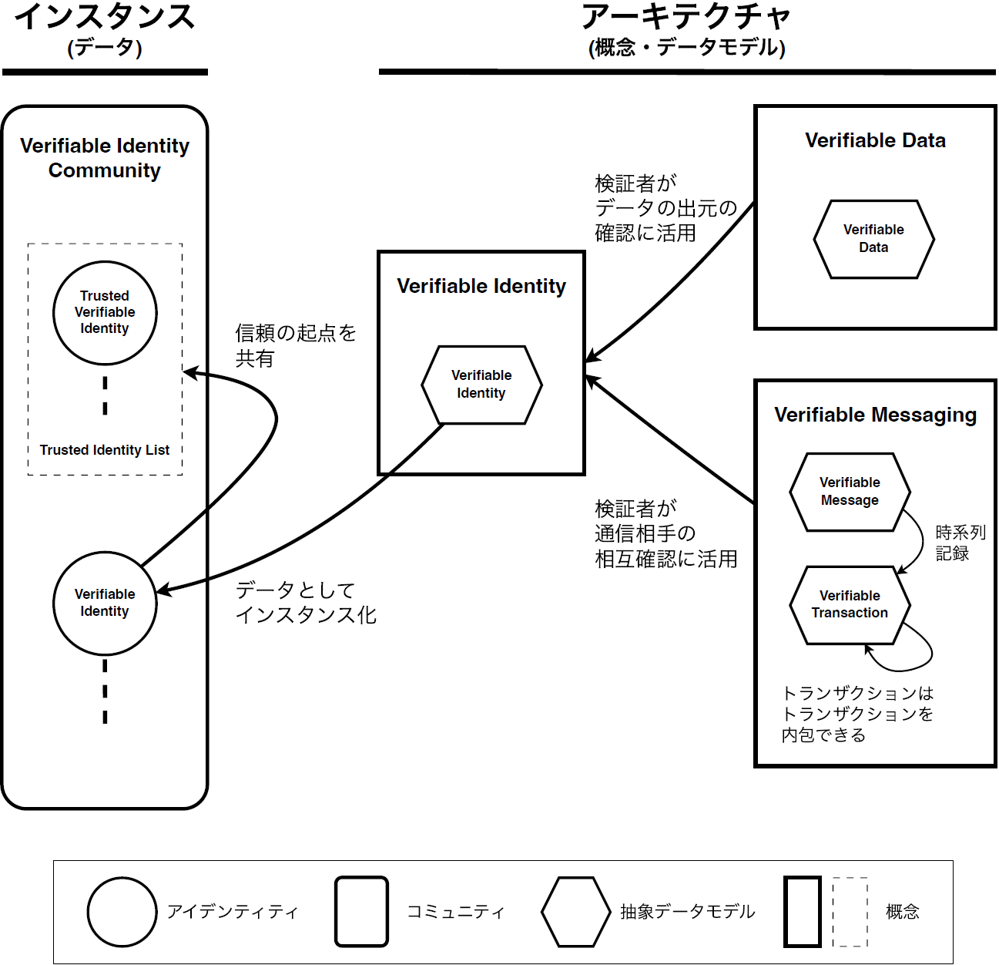
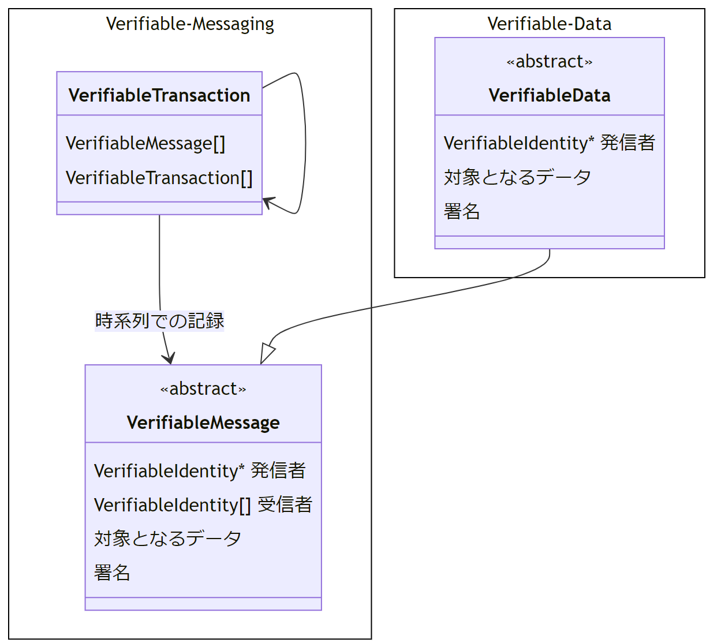
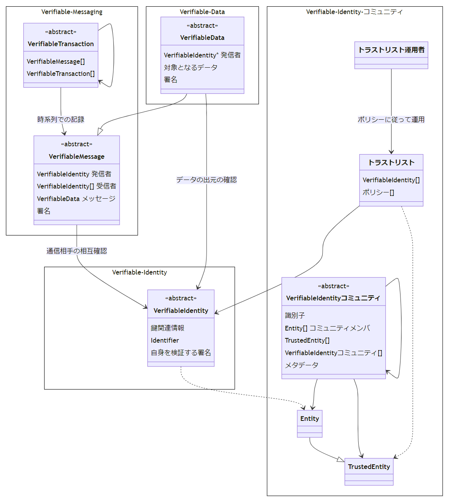
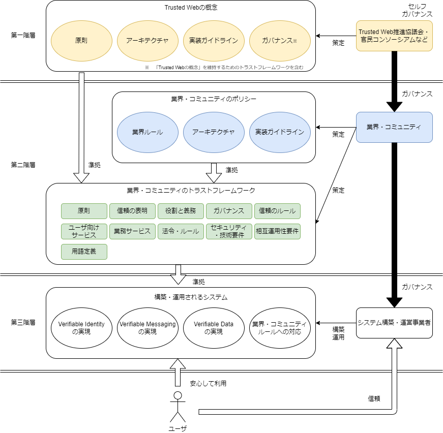

| **TRUSTED WEB WHITE PAPER DRAFT** |
| --- |

Trusted Web ホワイトペーパー（案）
実装編
===
Ver3.0
2023年11月15日
Trusted Web推進協議会

- [実装編](#実装編)
- [1.用語定義](#1用語定義)
- [2. Trusted Webが目指すべき方向性](#2-trusted-webが目指すべき方向性)
  - [(1). 目指すべき方向性](#1-目指すべき方向性)
  - [(2). 必要となる原則](#2-必要となる原則)
- [3. Trusted Webのアーキテクチャデザイン](#3-trusted-webのアーキテクチャデザイン)
  - [(1). 概要](#1-概要)
  - [(2). Trusted Web アーキテクチャ概観](#2-trusted-web-アーキテクチャ概観)
    - [a.  Verifiable Data（検証可能なデータ）](#a--verifiable-data検証可能なデータ)
    - [b.  Verifiable Messaging（検証可能なメッセージ交換）](#b--verifiable-messaging検証可能なメッセージ交換)
    - [c.  Verifiable Identity（検証可能なアイデンティティ）](#c--verifiable-identity検証可能なアイデンティティ)
    - [d.  Verifiable Identity コミュニティ（検証可能なアイデンティティのコミュニティ）](#d--verifiable-identity-コミュニティ検証可能なアイデンティティのコミュニティ)
  - [(3). Verifiable Data（検証可能なデータ）](#3-verifiable-data検証可能なデータ)
    - [a.  Verifiable Data 概要](#a--verifiable-data-概要)
    - [b.  Verifiable Dataの抽象データモデル](#b--verifiable-dataの抽象データモデル)
    - [c.  Verifiable Dataの操作](#c--verifiable-dataの操作)
    - [d.  Verifiable Dataとして解釈できる実装の例](#d--verifiable-dataとして解釈できる実装の例)
  - [(4). Verifiable Messaging](#4-verifiable-messaging)
    - [a.  Verifiable Messaging 概要](#a--verifiable-messaging-概要)
    - [b.  Verifiable Message抽象データモデル](#b--verifiable-message抽象データモデル)
    - [c.  Verifiable Transaction抽象データモデル](#c--verifiable-transaction抽象データモデル)
    - [d.  Verifiable Messagingの操作](#d--verifiable-messagingの操作)
    - [e.  Verifiable Messaging として解釈できる実装例](#e--verifiable-messaging-として解釈できる実装例)
  - [(5). Verifiable Identity（検証可能なアイデンティティ）](#5-verifiable-identity検証可能なアイデンティティ)
    - [a.  アイデンティティとエンティティ](#a--アイデンティティとエンティティ)
    - [b.  Verifiable Identity](#b--verifiable-identity)
    - [c.  Verifiable Identity抽象データモデル](#c--verifiable-identity抽象データモデル)
    - [d.  Verifiable Identity に対する操作](#d--verifiable-identity-に対する操作)
      - [(a). 信頼の連鎖を構成する X.509 PKI と Web of Trust](#a-信頼の連鎖を構成する-x509-pki-と-web-of-trust)
      - [(b). X.509 PKI](#b-x509-pki)
      - [(c). Web of Trust](#c-web-of-trust)
      - [(d). 信頼の起点（エンティティ）とトラストアンカー（Trust Anchor）](#d-信頼の起点エンティティとトラストアンカーtrust-anchor)
      - [(e). Verifiable Identityコミュニティ](#e-verifiable-identityコミュニティ)
      - [(f). Verifiable Identity コミュニティとTrust Framework](#f-verifiable-identity-コミュニティとtrust-framework)
      - [(g). Verifiable Identityコミュニティの構成](#g-verifiable-identityコミュニティの構成)
        - [(ア). Verifiable Identityコミュニティのポリシー](#ア-verifiable-identityコミュニティのポリシー)
        - [(イ). 識別子と名前空間](#イ-識別子と名前空間)
        - [(ウ). アイデンティティ一覧](#ウ-アイデンティティ一覧)
        - [(エ). 信頼の起点](#エ-信頼の起点)
        - [(オ). その他のメタデータ](#オ-その他のメタデータ)
      - [(h). Verifiable Identityにおけるやりとり](#h-verifiable-identityにおけるやりとり)
      - [(i). Verifiable Identityの発見](#i-verifiable-identityの発見)
    - [e.  Verifiable Identityとして解釈できる実装の例](#e--verifiable-identityとして解釈できる実装の例)
- [4. Trusted Webにおけるガバナンス](#4-trusted-webにおけるガバナンス)
  - [(1). Trusted Webの実現におけるガバナンスの必要性](#1-trusted-webの実現におけるガバナンスの必要性)
  - [(2). ガバナンスの検討に関する課題と考え方](#2-ガバナンスの検討に関する課題と考え方)
  - [(3). Trusted Webにおけるガバナンス](#3-trusted-webにおけるガバナンス)
- [5. Trusted Webにおけるセキュリティの考え方](#5-trusted-webにおけるセキュリティの考え方)
  - [(1). Trusted Webにおけるセキュリティ目標](#1-trusted-webにおけるセキュリティ目標)
  - [(2). Trusted Webにおけるセキュリティ目標の実現方法](#2-trusted-webにおけるセキュリティ目標の実現方法)
  - [(3). セキュリティに関する今後の検討課題](#3-セキュリティに関する今後の検討課題)
- [6. 今後の取組について](#6-今後の取組について)
  - [(1). 今後の課題](#1-今後の課題)
    - [a.  アーキテクチャについて](#a--アーキテクチャについて)
    - [b.  実装における課題](#b--実装における課題)
    - [c.  ガバナンスについて](#c--ガバナンスについて)
    - [d.  セキュリティについて](#d--セキュリティについて)
  - [(2). 国際連携の方向性](#2-国際連携の方向性)
  - [(3). 今後の社会実装において、各ステークホルダーに期待したい役割](#3-今後の社会実装において各ステークホルダーに期待したい役割)

# 1.用語定義 

<table>
<colgroup>
<col style="width: 5%" />
<col style="width: 27%" />
<col style="width: 66%" />
</colgroup>
<tbody>
<tr class="odd">
<td>項番</td>
<td>用語</td>
<td>解説</td>
</tr>
<tr class="even">
<td>1</td>
<td>
アイデンティティ

(Identity)
</td>
<td>
エンティティに関連する属性のセット

出典：ISO/IEC 24760-1
</td>
</tr>
<tr class="odd">
<td>2</td>
<td>
アイデンティティ管理

(Identity Management)
</td>
<td>
組織の権限とアイデンティティに関連するその目的を実現するために使用される一連の原則、実践、プロセス、および手順。

出典：Pan-Canadian Trust Framework
</td>
</tr>
<tr class="even">
<td>3</td>
<td>
エンティティ

(Entity)
</td>
<td>
個人や組織のように、明確で独立した存在を持ち、文脈の中で立法、政策、規制を受けることができ、一定の権利、社会的及び法的責務を持つことができるもの。エンティティは、デジタルエコシステムで4つの役割(すなわち、Subject、Issuer、Holder、Verifierである。)の1つ以上を実行できる。

出典：Pan-Canadian Trust Framework
</td>
</tr>
<tr class="odd">
<td>4</td>
<td>
合意

(Agreement)
</td>
<td>
ユーザーが自分のデジタル・アイデンティティや属性がどのように共有されるかを理解していることを確認するもの。

出典：UK digital identity and attributes trust framework beta version (0.3)
</td>
</tr>
<tr class="even">
<td>5</td>
<td>
真正性

(Authenticity)
</td>
<td>
データが意図された情報源から得られたものであるというプロパティ。

出典：NIST Special Publication 800-63
</td>
</tr>
<tr class="odd">
<td>6</td>
<td>
相互運用性

(Interoperability)
</td>
<td>技術のみだけでなく、法制度、ガバナンス、組織等の社会システム全体について異なるシステム間で連携可能であること。</td>
</tr>
<tr class="even">
<td>7</td>
<td>
属性情報

(Attribute)
</td>
<td>
名前、生年月日、パスポート番号、資格、予防接種など、誰かまたは何かに固有または起因する品質または特徴

出典：The Open Identity Exchange "A Guide to Trust Frameworks for Smart Digital ID"
</td>
</tr>
<tr class="odd">
<td>8</td>
<td>
DID

(Decentralized Identifiers)
</td>
<td>
DIDとは、Decentralized Identifiers （分散型識別子）の略で、新しいタイプのグローバルに一意な識別子である。個人や組織が、自らが信頼できるシステムを使って自分の識別子を生成できるように設計されている。この新しい識別子は、デジタル署名などの暗号証明を用いて認証することにより、エンティティがその識別子を管理していることを証明することが可能。

これらの識別子の使用は、さまざまな状況に応じて適切に設定が可能であり、識別子の継続的な存在を保証する中央機関に依存することなく、個人情報やプライベートデータをどの程度公開するかを制御しながら、エンティティが自分自身や自分が管理するものを識別することをサポートする。

出典：W3C Decentralized Identifiers (DIDs) v1.0

<u>https://www.w3.org/TR/did-core/</u>
</td>
</tr>
<tr class="even">
<td>9</td>
<td>
デジタル署名

(Digital Signature)
</td>
<td>公開鍵暗号技術を用いて、デジタル文書が公開鍵で特定されるエンティティが認めたものであることを確認できるデータ列</td>
</tr>
<tr class="odd">
<td>10</td>
<td>
トラストアンカー

（Trust Anchor）
</td>
<td>公開鍵暗号の公開鍵<a href="#fn1" class="footnote-ref" id="fnref1" role="doc-noteref">1</a></td>
</tr>
<tr class="even">
<td>11</td>
<td>
トラストフレームワーク

(Trust Framework)
</td>
<td>
運用規則、スキーム規則、運用方針などの仕様、規則、協定の集合。エコシステム内においてトラストフレームワークに準拠していることを示すことができる認証プロセスや、準拠状態を維持・監査するための、ガバナンスや監査機関を含むこともある。

出典：Open Identity Exchange “A Guide to Trust Frameworks for Smart Digital ID”。
</td>
</tr>
<tr class="odd">
<td>12</td>
<td>
信頼

(Trust)
</td>
<td>事実の確認をしない状態で、相手先が期待したとおりに振る舞うと信じる度合い</td>
</tr>
<tr class="even">
<td>13</td>
<td>
VC

(Verifiable Credentials）
</td>
<td>
クレデンシャルとは、発行者による一つまたは複数の「発行者によって主張された属性の集合」の集合である。検証可能クレデンシャルとは、改ざん検出が容易なクレデンシャルであり、誰が発行したかを暗号学的に検証できるものである。

出典：W3C Verifiable Credentials Data Model 1.0

<u>https://www.w3.org/TR/vc-data-model/</u>
</td>
</tr>
</tbody>
</table>
<section class="footnotes footnotes-end-of-document" role="doc-endnotes">

<ol>
<li id="fn1" role="doc-endnote">
トラストアンカーの定義は文書によって揺れがある。NIST のGlossary( <u>https://csrc.nist.gov/glossary/term/trust_anchor</u> ) にもあるようにNISTの文書間でも定まっていない。例えば、NIST SP800-63-3 による定義では “A public or symmetric key that is trusted because it is directly built into hardware or software, or securely provisioned via out-of-band means, rather than because it is vouched for by another trusted entity (e.g. in a public key certificate). A trust anchor may have name or policy constraints limiting its scope.”となっており、公開鍵あるいは共通鍵を直接さしている。一方、NIST SP800-57 Part 1 Rev.5 の定義では “An authoritative entity for which trust is assumed. In a PKI, a trust anchor is a certification authority, which is represented by a certificate that is used to verify the signature on a certificate issued by that trust-anchor.”となっている。これらの事情から、本文書では、より狭い定義である「公開鍵暗号の公開鍵」とした。<a href="#fnref1" class="footnote-back" role="doc-backlink">↩︎</a>
</li>
</ol>
</section>

#  2. Trusted Webが目指すべき方向性

## (1). 目指すべき方向性

1.  　Trusted Webは、「デジタル社会」における様々な社会活動に対応できる　Trustの仕組みを作り、多様な主体による新しい価値の創出を実現することを目指していくこととする。

2.  　Trusted Webが実現を目指すTrustの仕組みは、特定のサービスに過度に依存せず、

    -  ユーザー（自然人又は法人）自身が自らに関連するデータをコントロールすることを可能とし、

    -  データのやり取りにおける合意形成の仕組みを取り入れ、その合意の履行のトレースを可能としつつ、

    -  検証（verify）できる領域を拡大することにより、Trustの向上を目指すものである。

3.  　この際、既存のインターネットやウェブに、一定のガバナンスや運用面での仕組みとそれを可能とするTrustに関する機能を、上から重ね合わせるオーバーレイのアプローチで追加していくこととする。

4.  　Trusted Webの実現に向けては、例えば、以下のような道筋が仮説として考えられる。

    -   Trusted Webが目指す仕組みを具現化する様々なサービスが提供され、その利用領域が拡大していく。

    -   この過程において、既存のTrustを向上させる仕組みも活用しながら、例えば、用途に応じた多種多様な特性に対応できる（APIを含む）ミドルウェアが提供されることが考えられる。

    -   そして、個々のサービスに特化したAPI群からなるミドルウェアにおいては、その発展の過程において、トランザクションを行う上で共通化すべきAPIやデータモデル等が特定されていき、そして、それらが共通化されることにより相互運用性が確保され、標準化につながり、インフラとしての信頼の枠組みが形成されていくこととなる。

    -   この際、実際にユーザーが利用するのは、インフラの上で展開される様々なサービスである。このインフラとしての信頼の枠組みは、その上で動くサービスから共通化すべき部分等へ、得られた知見を逐次取り入れることにより、社会的受容性を高めつつ、社会実装が進められる形でアップデートがなされていくこととなる。

## (2). 必要となる原則

5.  　Trusted Webの設計・運用などに当たって考慮されるべき原則は、ホワイトペーパーver.1.0において、以下のとおり整理している。

【支える仕組み】

   ① 持続可能なエコシステム

<!-- -->

6.  ステークホルダーがそれぞれの責任を分担し、責任を果たすインセンティブがあること。

<!-- -->

②  マルチステークホルダーによるガバナンス

<!-- -->

7. マルチステークホルダーがガバナンスに関与し、ステークホルダーの責任が明確で、問題が発生したときに原因究明ができること。

<!-- -->

③    オープンネスと透明性

<!-- -->

8. アーキテクチャ設計、実装とそのプロセスがオープンであり、透明性が高く相互に検証可能であること。

【機能をシステムとして実装する際に必要なこと】

　\<ユーザーの観点\>　

④  データ主体によるコントロール

<!-- -->

9. データへのアクセスのコントロールは、データ主体（個人・法人）に帰属すること。

<!-- -->

⑤  ユニバーサル性

<!-- -->

10. 誰も排除せず、弱い立場にある人を取り残さないこと。誰でも自由に参加できること。

<!-- -->

⑥  ユーザー視点

<!-- -->

11. ロックインフリーでユーザーに選択肢があること。ユーザーにとって分かりやすく安心して使えること。

\<システムの観点\>

⑦.  継続性

<!-- -->

12. 既存のインターネットアーキテクチャを基礎として、上位に構築することとし、transitionalな形で現行ウェブに付加されること。既存のTrust手段とのフェデレーションも考慮すること。

<!-- -->

⑧.  柔軟性

<!-- -->

13. 構成部品が疎結合で構成され、拡張可能なアーキテクチャであること。

<!-- -->

⑨.  相互運用性

<!-- -->

14. 技術のみだけでなく、法制度、ガバナンス、組織等の社会システム全体について異なるシステム間で連携可能であること。

<!-- -->

⑩. 更改容易性・拡張性

<!-- -->

15. 特定の技術に依存し過ぎず、中長期での利用を意識して継続的に機能拡張が容易でスケーラブルであること。

# 3. Trusted Webのアーキテクチャデザイン

## (1). 概要

16. 　Trusted Webでは、検証可能なアイデンティティ（Verifiable Identity）を中心として、検証可能な領域を拡大する抽象度の高いアーキテクチャを提示する。アーキテクチャにおいては、既存のTrustのメカニズムとの組み合わせの可能性を提示し、より高いインターオペラビリティの確保を目指す。アーキテクチャでは、Verifiable Identityや、Verifiable Data (検証可能なデータ)、Verifiable Messaging（検証可能なメッセージ交換）、およびVerifiable Identity コミュニティ（検証可能なアイデンティティのコミュニティ）を活用することにより、Verifiable（検証可能な領域）を拡大し、データのやり取りにおける Trustの向上を目指す。

## (2). Trusted Web アーキテクチャ概観

17. 　Trusted Webでの根源的な価値は「検証できる領域の拡大によるTrustの向上」である。デジタルにおけるTrustを別の言葉で表現するなら「何者かによって検証済みと認められたデータを、検証した者を信じることによって、検証の詳細にまで立ち戻った確認を省略できること」と表現できる。

18. 　Trusted Webにおける検証の対象は、「何者かによって生み出されたデータ」と、「生み出されたデータのやり取りの過程」と整理できる。このため、それぞれの検証可能性を何らかの形で担保する必要がある。前者の検証については、デジタル署名技術により実現する。後者の検証については、やりとりをモデル化しデジタル署名技術と組み合わせることで実現する。

19. 　この際、エンティティが提示する「検証可能なデータ（Verifiable Data）」と、検証可能なデータを含む様々なエンティティ（主体）間のメッセージのやり取りを検証可能な形で実現する「検証可能なメッセージ交換（Verifiable Messaging）」を実現するために、「検証可能なデジタル・アイデンティティ（Verifiable Identity）」を活用する。これらは、様々な既存のテクノロジーを組み合わせることで実現できるものである。下記の図 3‑1で関係を図示する。また、構成要素の詳細については後述する。

【ver.2.0からの変更点】

20. 　ver.2.0では、アイデンティティグラフは、アイデンティティ間の関係であり、アイデンティティの視点での可視性を反映するグラフ構造を持つと定義していた。一方で、実証事業から、システム設計上の目的が不明瞭であると指摘があり、新たにコミュニティという考え方を議論した。議論の中で、ピア・ツー・ピア、もしくはコミュニティを丸ごと信用する、もしくはコミュニティの中のメンバをお互いに信用するというモデルを援用することによって段階的に、通信先や署名元の相手を確認できる形で整理を行った。

21. 　ver.2.0では、「Trusted Webは基本的にセッション層であるOSI参照モデルにおける5層以上に関するアーキテクチャであり、トランスポート層（4層）も通信効率を上げるために検討する可能性がある」と記載されており、実証事業の設計や実装を担当するエンジニアからトランスポート層を検討するかの懸念が示された。そこで、ver.3.0では、トランスポートについては規定せず、活用可能な通信手段を貪欲に活用する点を明記した。

【Trusted Webアーキテクチャ概観と構成要素】

図 3‑1 Trusted Webアーキテクチャ概観

### a.  Verifiable Data（検証可能なデータ）

22. 　デジタル署名技術を活用することにより、「対象となるデータが署名者によって確認されていること」を検証者が確認できるデータ。

### b.  Verifiable Messaging（検証可能なメッセージ交換）

23. 　複数のエンティティ間での確実な配送をメッセージの送受信の順序性を含め確認することができるもの。単一のメッセージを表現するVerifiable Message（検証可能なメッセージ）と、複数のVerifiable Messageを送受信順も含め検証できるVerifiable Transaction （検証可能なトランザクション）で表現される。なお、Verifiable Transactionには、Verifiable MessageあるいはVerifiable Transactionを、複数かつ混在的かつ再帰的に内包できる。

### c.  Verifiable Identity（検証可能なアイデンティティ）

24. 　メッセージそのものや発信者、メッセージのやりとりを検証可能とする（Verifiable Data と Verifiable Messagingを実現する）には、少なくともデータの出元、メッセージの発信者や宛先の情報が必要であるとともに、対象となるコンテクスト（状況）に応じて適切な検証がなされている必要がある。

    　このように、Verifiable Identityは、検証可能かつコンテクストに応じて最低限必要な属性からなるデジタル・アイデンティティである。Verifiable Identityによって、対象となるデータが署名者によって確認されていることを検証者が確認でき（Verifiable Dataの実現）、データのやり取りが検証できる（Verifiable Messagingの実現） 。

25. 　なお、一つのエンティティ（自然人、法人、等）は、一つのアイデンティティを用いている場合もあれば、コンテクスト（状況）に応じた属性の使い分けのために、複数のアイデンティティを使い分ける場合もある。

### d.  Verifiable Identity コミュニティ（検証可能なアイデンティティのコミュニティ）

26. 　Trusted Webでは、必要に応じて、高い確度で信頼できるエンティティ（Trusted Entity）によって運用されたアイデンティティ（Trusted Identity）を起点とした信頼の連鎖を構築する。

27. 　データのやり取りに関係するエコシステム参加者の下でTrusted Identityを共有することにより、信頼関係の構築を容易にする。

30. 　このような信頼の起点を含む情報を一定のガバナンス下で共有し、Verifiable Identityの確立を支援するアイデンティティの集合をVerifiable Identityコミュニティと呼ぶ。

【アーキテクチャの構成要素とTrusted Webの目指すべき方向性との関係】

29. 　以上の４つの構成要素とTrusted Webの目指すべき方向性との関係を以下に示す。

Trusted Webが実現を目指すTrustの仕組みは、特定のサービスに過度に依存せず、

-   ユーザー（自然人又は法人）自身が自らに関連するデータをコントロールすることを可能とし、

-   データのやり取りにおける合意形成の仕組みを取り入れ、

> Verifiable Identityによってユーザ自身が自らに関連するデータの受け渡し先を検証でき、Verifiable Dataと組み合わせることで選択的情報開示等をサポートする。一方で、 事前合意や開示範囲の妥当性はテクノロジーのサポートを受けつつ、ガバナンスと分担する

-   その合意の履行のトレースを可能としつつ、

> Verifiable Messagingによってトレースを可能とする

-   検証（verify）できる領域を拡大することにより、Trustの向上を目指すものである。

> Verifiable Data、Verifiable Identity、Verifiable Identity コミュニティの組み合わせによって検証可能性を拡大する

30.  　なお、Trusted Webアーキテクチャでは、実際の情報のやり取りを行うトランスポートについては規定せず、活用可能な通信手段を貪欲に活用していく。その上で、情報をやり取りするコンテクストや、Trusted Webの原則に適合する範囲において、Verifiable Data、Verifiable Messaging、Verifiable Identityについての検証は、通信プロトコルの支援によって達成され得る。

31.  　例えば、Trusted Webは、エンティティからデータをアンバンドルすることを指向するものである。一方で、主体間の関係性において、検証可能性が十分担保されており、エンティティがデータを保持することに対して、「2.(2)必要となる原則」に見合った妥当性がある場合は、エンティティとデータがアンバンドルされていないことを許容する。

## (3). Verifiable Data（検証可能なデータ）

### a.  Verifiable Data 概要

32. 　Verifiable Dataは、デジタル署名技術を活用することにより、対象となるデータが署名者によって確認されていることを示す。これを実現するためには、署名者がVerifiable Identityとして検証可能であること、また、デジタル署名を検証する際に、必要な鍵関連情報[^1]を取得可能であることの双方が必要である。

### b.  Verifiable Dataの抽象データモデル

33. 　Verifiable Dataの抽象データモデルは、「対象となるデータ」や「署名及び発信元を示すVerifiable Identityそのもの」、あるいは、「Verifiable Identityを参照するための情報」の3つで構成される。

34. 　なお、Verifiable Dataが暗号化されていることは必要要件ではないが、必要に応じて暗号化してもよいものとする。

### c.  Verifiable Dataの操作

35. 　Verifiable Dataを生成するためには、

    -   署名に用いるVerifiable Identityを必要に応じて検証した後に、

    -   鍵関連情報を取り出し、

    -   対象となるデータと署名に用いるVerifiable Identityそのもの、あるいはVerifiable Identityへの参照とともに、鍵関連情報を用いて署名し、

    -   署名対象と署名結果を合わせること

        が必要である。

36. 　Verifiable Dataを検証するためには、発信元のVerifiable Identityを参照し検証した上で、鍵関連情報を取り出す。その後、署名対象となるデータと署名に対して鍵関連情報を適用することで、署名を検証できる。

### d.  Verifiable Dataとして解釈できる実装の例

37. 　デジタル署名は様々な状況で活用されている。署名が検証でき、かつ、検証者が十分に署名者の検証ができているのであれば、Verifiable Dataである。一方、何が検証できているのかについては、Verifiable Identityの検証と、Verifiable Dataの署名における署名の意図（intention）が明確化されているか否かに依存する。

38. 　署名の意図（intention）の明確化とは、予め合意されたデータのやりとりの枠組み（例：ある目的を達成するためにステークホルダー間で合意された業務プロセス）において、目的を達成するために署名が果たす機能が特定されている状態を指す[^2]。

39. 　X.509 PKIにおける各種証明書はVerifiable Dataである。署名のコンテクストはそれぞれの署名書発行におけるポリシーに従っているとみなすことができる。

40. 　デジタル庁の発行したワクチン証明書のSMART Health Cards形式のVerifiable Credentialsによるデジタル化されたワクチン証明書などは、Verifiable Dataである。

41. 　署名されたPDFファイルは、署名者の検証可能性に依存するが、Verifiable Dataである。

## (4). Verifiable Messaging

### a.  Verifiable Messaging 概要

42. 　Verifiable Messagingは、複数のエンティティ間でのメッセージのやりとりにおいて、発信者と受信者のアイデンティティとメッセージ本文によって「Verifiable Message（検証可能なメッセージ）」を構成し、この検証可能なメッセージの“やりとりの並び”をトランザクションとしてメッセージ送受の順序関係とともに「Verifiable Transaction（検証可能なトランザクション）」として記録する。これにより個々のメッセージを含めたメッセージのやりとり全体を検証可能とする。

### b.  Verifiable Message抽象データモデル

43. 　Verifiable Messageは抽象データモデルとして表現される。Verifiable Messageは、「発信者（単一）と受信者（単一または複数）それぞれにおけるVerifiable Identity、またはVerifiable Identityを参照するための情報」や「メッセージ自身」、「発信者による署名」で構成される。すなわち、受信者（単一または複数）が追加されたVerifiable Dataの一形態（サブクラス）であり、Verifiable Dataと同様に検証できる。

44. 　なお、Verifiable Messageに関しては、メッセージが暗号化されていることは必要要件ではないが、必要に応じて暗号化してもよいものとする。

図 3‑2 Verifiable Message抽象データモデル

### c.  Verifiable Transaction抽象データモデル

45. 　Verifiable Transaction（検証可能なトランザクション）は、Verifiable Message あるいは Verifiable Transactionについて、発信の順序が検証出来る形で記録されたものである。

46. 　なお、Verifiable Message、またはVerifiable Transactionを含む仮想的なTransaction Recordを想定した場合、発信の順序が検証可能な形でTransaction Recordを並べることができ、発信の順序の検証が可能であることが最低条件である。

47. 　発信の順序の検証可能性を担保する方式については特に規定しない。想定される実現手段としては、Transaction Recordのブロックチェーンへの記録や、Transaction Record をハッシュリンク（あるいはハッシュチェーン）でつなぐ方法、Transaction Recordそれぞれにタイムスタンプを打って記録していくなど、手法は複数想定される。

48. 　また、発信者と受信者の秘匿については必要要件ではなく、必要に応じて導入していくものと考える。その場合、高度な手法としては、個々のメンバによるそれぞれのトランザクションレコードについてアクセスコントロール等の可視性の制御可能な方式の適用も考えられる。また、Verifiable Transactionをチャットメッセージの記録と捉える方法もある。この場合、グループへの新規参加者がある場合について、過去の記録に対する可視性制御といった技術的あるいはプロトコルデザイン上の高度な話題もある。Verifiable Transactionは、入れ子構造も取れるようにデザインしているため、一定の設計は可能と考えられるが、本ホワイトペーパーでは、アウトオブスコープとする。

### d.  Verifiable Messagingの操作

49. 　Verifiable Messageは、

    -  送信者や受信者のVerifiable Identityを準備し、

    -  ペイロードにあたるメッセージとともにVerifiable Messageに含まれる情報を用意した後、

    送信者のVerifiable Identityを用いて生成する。

50. 　なお、Verifiable Messageの検証は、Verifiable Dataと同等の検証を行った後、受信者それぞれのVerifiable Identityを検証することである。

51. 　Verifiable Transactionは、Verifiable Messageを順に記録していくことで生成される。このとき、Verifiable Messageにおけるメッセージへの関与者（メッセージ送信者または受信者のどちらかに含まれる者の一覧）に変化があった場合等においては、必要に応じて、Verifiable Transactionを入れ子構造に作成し記録を続けることとなる。

52. 　なお、Verifiable Transactionの検証は、Verifiable Transactionに含まれるVerifiable MessageまたはVerifiable Transactionの発生順を検証できること、そして、含まれるすべてのVerifiable Messageに対する検証が必要となる。

### e.  Verifiable Messaging として解釈できる実装例

53. 　Verifiable Messaging を忠実に実装している例は現時点ではないと認識している。一方で、Verifiable MessageおよびVerifiable Transaction に近い実装をしている例は存在する。

54. 　PGP（Pretty Good Privacy）によるメールは、Verifiable Messageの一形態である。相手先及び発信元のVerifiable Identityに相当するPGPのWeb of Trustで検証できている範囲において、発信者と受信者を指示した形で単一方向のメッセージ送信が可能である。

55. 　S/MIME[^3] によるメールの場合は、X.509 PKIのエンドエンティティ証明書をそれぞれのユーザーが用い、発信者と受信者の検証ができているという前提において、Verifiable Messageである。

56. 　一般的なグループチャットシステムの場合、個々のチャットの参加者がすべての参加者に向けたメッセージを受け取った上で、それぞれのアカウントに紐付いた形でメッセージを保存していると解釈できる。チャットシステムにおける送信元や送信先の検証が十分であると捉え、サービス側でのメッセージ削除があるというリスクを想定する前提で、Verifiable Messagingの一形態とすることが可能である。

## (5). Verifiable Identity（検証可能なアイデンティティ）

57. 　ここまで示してきたように、Verifiable DataとVerifiable Messagingを実現するためには、Verifiable Identityが必要である。本節では、Verifiable Identityの概念と、抽象データモデルに加えて、Verifiable Identityの発見と検証について議論するとともに、実際のアプリケーションで構築する指針を示す。

### a.  アイデンティティとエンティティ

58. 　アイデンティティは、あるエンティティが他のエンティティとやりとりする際に相手に見せる一つの面、俗に表現するならば《顔》である。

59. 　つまり、一つのエンティティ（自然人、法人、等）は、一つのアイデンティティを用いる場合もあれば、コンテクストに応じて属性を使い分けるために、複数のアイデンティティを用いる場合もある。

60. 　Trusted Webに限らず、一般的な例を用いて説明するならば、自然人であれば、ソーシャルネットワークごとに異なるアイデンティティを使い分ける場合がある。法人においても、やりとりする相手によってアイデンティティを使い分けることがある。

61. 　例えば、対外的なアイデンティティと社内、あるいは社内と協業している企業とのやりとりでは、異なるアイデンティティを使い分ける場合がある。さらに、プライバシーを確保するための技術的な手法として、アイデンティティをやりとりする相手ごとに使い分ける、といったことも行われている。

### b.  Verifiable Identity

62. 　アイデンティティにおけるそれぞれの属性は、単にその属性が提示されただけでは真偽は不明である。例えば、ある人が自身の年齢を主張したとき、その年齢が実際の年齢かどうかはわからない。

63. 　Verifiable Identity（検証可能なアイデンティティ）とは、検証可能かつコンテクストに応じて最低限必要な属性からなるデジタル・アイデンティティである。 Verifiable Identityによって、対象となるデータが署名者によって確認されていることを検証者が確認でき（Verifiable Dataの実現）、データのやり取りが検証できる（Verifiable Messagingの実現）。Verifiable Identityの発見と検証は後述する。

### c.  Verifiable Identity抽象データモデル

64. 　Verifiable Identityの抽象データモデルは、以下で構成される。

    -  Verifiable DataやVerifiable Messagingの検証に用いられるVerifiable Identityに紐付いた鍵関連情報、

    -  Verifiable Identityコミュニティ中での識別（identification）に用いられるidentifier（識別子）、

    -  Verifiable Identity自身を検証するための必要となる自身への署名などといったデータ

65. また、詳細は後述するが、Verifiable Identityが検証者（Verifier）として振る舞う場合は、

    -  相手先のVerifiable Identityを検証するために、期待される相手先のVerifiable Identityそのものを保持する《Verifiable Identityリスト》と、

    -  期待される相手先のVerifiable Identityが属する可能性があるVerifiable Identityコミュニティからなる《Verifiable Identityコミュニティリスト》の

    二つのリストを持ち得る。リストを持つことで、検証者がVerifiable Identityからのアクセスを第三者視点で検証可能となる。

### d.  Verifiable Identity に対する操作

66. 　Verifiable Identityの生成は、抽象データモデルで示された情報を持つだけでなく、実装に応じて、固有の情報を追加で持つことが想定される。

67. 　Verifiable Identityは、Verifiable Dataに紐付けられている。Verifiable Dataが検証される際は、Verifiable Identityが発見され、鍵関連情報が取り出されて用いられる。

68. 　Verifiable Identityを成立させるためには、アイデンティティにおけるそれぞれの属性を検証可能にする必要がある。このためには、信頼できる第三者に依存しつつ信頼関係を拡張する信頼の連鎖を活用する必要がある。

69. 　以下の節で信頼の連鎖について議論する。

#### (a). 信頼の連鎖を構成する X.509 PKI と Web of Trust

70. 　あるデジタル署名の正当性を確認するためには、署名者についての情報が必要である。その署名者の情報は署名者本人から信頼できる形で直接的に入手できれば、そのまま信用できる。一方、署名者本人から信頼できる形で直接的に入手できない場合は、信頼できる第三者に頼ることによって、間接的に入手することが可能である。このとき、信頼関係が連鎖的に確保できる場合、連鎖上の信頼の程度の判断は必要となるが、対象となる署名者についての情報を信頼できると考えられる。このような信頼における連鎖的な関係を「信頼の連鎖」と呼ぶ。

71. 　この連鎖を確立するためには、鎖を構成する部品である鎖の輪（link of chain）を入手し、繫いでいく必要がある。この連鎖として、主に根元から枝分かれするようなツリー構造を用いるのがX.509 PKIであり、蜘蛛の巣状の関係を用いるのがWeb of Trustである。

#### (b). X.509 PKI

72. 　X.509 証明書を用いたPKI（以下X.509 PKI）は、ツリー構造をなしており、根元と節の位置に配置される認証局（Certificate Authority — CA）群と、末端についた葉にあたるエンドエンティティによって構成される。CA群とエンドエンティティに対して証明書が結びつけられる。木の根元に位置するルートCAからエンドエンティティに至る複数の証明書によって信頼の連鎖が構成されている。ルートCAを信頼することによって、ツリー上のX.509証明書を信頼することができる。

73. 　X.509 証明書によって、使われている公開鍵と、証明書中に明記されている各種属性情報との関係を信頼できる形で入手できる。さらに、X.509 PKI に加えて運用規程を導入することによって、証明書がどのような対象に対して発行されているかを、付帯する属性情報と併せて示すことができる。

74. 　例えば、マイナンバーカード付帯の証明書は、公的個人認証サービス（JPKI）によるものであり、利用者証明用認証局運用規程[^4]に従って利用者証明用認証局が運用されている。利用者証明用認証局による証明書は、「住所地市区町村に備えられている住民基本台帳に記録されている者に対して、その者の申請に応じて、利用者証明用電子証明書を発行し、利用者証明用CAの運用に必要な電子証明書を発行」するので、利用者が本人であることの証明に用いることができる

75. 　一方、アイデンティティにまつわる運用規程を取り入れていないX.509 PKIが提供する基本的な仕掛けだけでは、公開鍵とその属性情報の結びつきについての情報を得られる以上のことは担保されない。例えば、Web PKIにおいて現在広く用いられているDV証明書は、完全解決後のドメイン名（Fully Qualified Domain Name）と公開鍵の結びつきを表現したにすぎないので、メリットは限定的であるといえる。これに加え、OV証明書やEVの場合は、それぞれ、属性情報が検証済みであることが保証されている。

#### (c). Web of Trust

76. 　エンティティが用いているそれぞれのアイデンティティ、そして、アイデンティティ同士の間のTrustに基づいた蜘蛛の巣状 — ウェブ — に張り巡らされた関係を活用する。このようなアイデンティティ間のTrustの関係を示した情報を Web of Trustと言う。

77. 　Web of Trust は、PGPで導入された概念であり、直接実際に会合した人の間でお互いを示す公開鍵（実際は公開鍵のハッシュであるフィンガープリント）とe-mailアドレスの結びつきを対面で確認した上で、PGPソフトウェアを用いてお互いの鍵に署名する。このような対面の署名の会合[^5]によって集めた公開鍵に対する署名群を公開・共有することで、PGP参加者の間で網の目のような信頼関係を構築し、公開鍵と本人についての情報の紐付けを確認できるようにしたものである。これにより、PGPでは、発信者による署名を確認できるとともに、複数の受取人を対象とした暗号化されたメッセージを作成することができる。

#### (d). 信頼の起点（エンティティ）とトラストアンカー（Trust Anchor）

78. 　高い確度で信頼できるエンティティを起点とした信頼の連鎖によって署名者についての情報を得られるのであれば、得られた署名者の情報は信頼のおけるものと見なすことができる。このような信頼の起点となりえるようなエンティティが用いる公開鍵暗号の公開鍵のことをトラストアンカーという。X.509 PKIでは、検証者があらかじめ複数のCA（通常はroot CA）の情報をトラストアンカーとして手元に持つ形で信頼の連鎖の起点として用いる。

#### (e). Verifiable Identityコミュニティ

79. 　Trusted Webでは、必要に応じて、信頼の起点を共有する[^6]ことにより、信頼関係の構築と、Verifiable Dataの共有やVerifiable Messagingの実現を容易にする。

80. 　このような信頼の起点を含む情報をガバナンスとともにメンバ間で共有し、Verifiable Identityの確立を支援するアイデンティティの集合をVerifiable Identityコミュニティと呼ぶ。[^7]

81. 　Verifiable Data や Verifiable Messaging を実現するためには、何らかの方法で通信相手を信頼できる形で特定あるいは発見できる必要がある、すなわち、Verifiable Identityの発見が必要である。相手を発見したり、検証したりするために一番確実な方法は Web of Trustのように、それぞれのエンティティ間の直接的なやりとりの積み重ねによる信頼関係の構築が一つの手段である。ただし、直接的なやりとりには限界がある。

82. 　そこで、複数のアイデンティティからなるVerifiable Identityコミュニティを構成し、このVerifiable Identityコミュニティを信頼あるいは参照するモデルを検討する。

83. 　こうしたVerifiable Identityコミュニティにおいて、個々のVerifiable Identityコミュニティのメンバであるそれぞれのアイデンティティは、Verifiable Identityコミュニティ内での識別子（identifier）に識別（identify）されるとともに、信頼の起点を共有するモデルを想定する。このモデルにおいて、それぞれのアイデンティティは、個別のアイデンティティを直接的に信頼することに加え、これらのVerifiable Identityコミュニティを信頼あるいは参照するという関係を確立する。

84. 　それぞれのアイデンティティは、様々な組織等の複数のVerifiable Identityコミュニティに属していると考えられる。Verifiable Identityコミュニティの例を挙げる。

85. 　例えば、会社で働いている日本人であれば、日本という国籍をもち日本人であること、住んでいる国、都道府県、市区町村、所属する会社や部署、卒業した大学の卒業生として等、様々なVerifiable Identityコミュニティに顕名のアイデンティティをもって属していることが想定される。一方、匿名のSNSに対し、匿名のアイデンティティをもって参加することができ、アイデンティティを使い分けることもできる。この関係を図 3‑3に示す。

![][4]

図 3‑3エンティティとアイデンティティの使い分け

86. 　法人の場合は、法人の所在する市区町村や都道府県、サプライチェーンを構成する様々な企業連合（コンソーシアム）もVerifiable Identityコミュニティといえる。例えば、サプライチェーンに着目するなら（図 3‑4参照）、ある企業Xは、

    -   サプライチェーン全体や、

    -   川上から川中企業までで構成されるサプライチェーン、

    -   川中から川下企業までで構成されるサプライチェーン、

        それぞれのVerifiable Identityコミュニティに属するものとして捉えることができる。

        この場合は、それぞれの構成メンバに応じて可視性をコントロールするようなVerifiable Identityコミュニティとすることも可能と考えられる。

![][5]

図 3‑4サプライチェーンにおけるVerifiable IdentityコミュニティとVerifiable Identity

87. 　一方、成立するための要素が共有されている限りにおいては、Verifiable Identityコミュニティは任意に成立し得る。例えば、家庭もVerifiable Identityコミュニティの一形態と考えられる。また、任意の目的を共有するグループやタスクフォースなどもVerifiable Identityコミュニティの一形態と考えられる。特定のアプリケーションプログラムを用いているユーザーもVerifiable Identityコミュニティを形成していると捉えることも可能である。

#### (f). Verifiable Identity コミュニティとTrust Framework

88. 　Verifiable Identityコミュニティは、いわゆるTrust Framework に置き換え、あるいは、Trust Frameworkを包含できるようにデザインしている。抽象的な意味でのTrust Frameworkの定義や、比較対象となる実際のTrust Frameworkによっては、Trust Frameworkとそれを活用するエンティティ群をVerifiable Identityコミュニティ[^8]と解釈することが可能である。

#### (g). Verifiable Identityコミュニティの構成

89. 　Verifiable Identityコミュニティは、複数のアイデンティティから構成されるグループと、そのグループで共有されるトラストマネージメント、そしてそれら全体に対してガバナンスが適用されたものと考えることができる。さらに、Verifiable Identityコミュニティの中にVerifiable Identityコミュニティを構成する再帰的な構造を取り得る。

90. 　共有される情報は、Verifiable Identityコミュニティのポリシーや、アイデンティティ間を区別するために用いられるVerifiable Identityコミュニティ固有の名前空間、アイデンティティの一覧、信頼の起点、その他必要に応じてメタデータが用意される。Verifiable Identityコミュニティの全体像を図 3‑5に示す。

![][6]

図 3‑5 Verifiable Identityコミュニティ

91. 以下、それぞれについて説明する。

##### (ア). Verifiable Identityコミュニティのポリシー

92. 　Verifiable Identityコミュニティが成立するためには、最低限のポリシーが必要である。以下にポリシーの例を挙げる:

     -   Verifiable Identityコミュニティ参加のためのポリシー

     -   信頼の起点 –Trusted Identity --管理のためのポリシー（トラストマネージメント）

     -   Verifiable Identityコミュニティ内で用いられるプロトコルの合意

     -   Verifiable Identityコミュニティ内で用いられるデータモデルの合意

##### (イ). 識別子と名前空間

93. 　Verifiable Identityコミュニティ内でのアイデンティティそれぞれを識別するためには、アイデンティティそれぞれに対して、Verifiable Identityコミュニティ内でユニークな識別子（identifier）が付与されている必要がある。識別子の割り当てについては、Verifiable Identityコミュニティのポリシーで規定される。

##### (ウ). アイデンティティ一覧

94. 　Verifiable Identityコミュニティ内では、必要に応じて、Verifiable Identityコミュニティを構成するアイデンティティの一覧が管理される。識別子の割り当て方法によっては、技術的な理由でメンバ一覧が必要になる。また、このアイデンティティ一覧は、Verifiable Identityコミュニティ内あるいはVerifiable Identityコミュニティ外に対し、共有される場合も、されない場合もあるだろう。

##### (エ). 信頼の起点

95. 　Verifiable Identityコミュニティ内では、共通の基盤として、信頼の起点を共有する。信頼の起点に対するマネージメント、すなわちトラストマネージメントは、Verifiable Identityコミュニティのポリシーで規定される。

96. 　信頼の起点は、アイデンティティとも表現できる。または、コミュニティの信頼の起点の成り立ちによって、エンティティとアイデンティティの関係とも整理できる。このようなアイデンティティをTrusted Identityとし、その運用者をTrusted Entityと呼ぶ。

97. 　また、コミュニティによっては、Trustできる検証者のみを許す場合がある。そのような検証者はある種のTrusted Identityである。

##### (オ). その他のメタデータ

98. 　必要に応じて、その他の情報が共有される。

#### (h). Verifiable Identityにおけるやりとり

99. 　各Verifiable Identityは、相手先のVerifiable Identityを検証するために、期待される相手先のVerifiable Identityそのものを保持する《Verifiable Identityリスト》と、期待される相手先のVerifiable Identityが属する可能性があるVerifiable Identityコミュニティからなる《Verifiable Identityコミュニティリスト》の二つのリストをもつ。

100. 　各Verifiable Identityは、直接的なやりとりにより得たVerifiable Identityを《Verifiable Identityリスト》に登録する。あるいは、Verifiable Identityが直接または間接的に得たVerifiable Identityコミュニティを示す情報を《Verifiable Identityコミュニティリスト》に登録する。

101. 　直接的なやりとりの手法としては、例えば、《Verifiable Identityリスト》に既に登録されているアイデンティティからの紹介や、QRコードなどを用いたout-of-band通信を伴う方法等が考えられる。

#### (i). Verifiable Identityの発見

102. 　あるVerifiable Identityの視点で、既知であり相手先として期待されるVerifiable Identityか否かを、以下の二つの条件によって決定できる。

     -   《Verifiable Identityリスト》に登録されているVerifiable Identityである

     -  相手先のVerifiable Identityが《Verifiable Identityコミュニティリスト》で示されるVerifiable Identityコミュニティに属しており、かつ、当該コミュニティのメンバ全てに対して期待される相手先として用いるようにopt-inされている

103. 　どちらのリストも、最低でもVerifiable IdentityまたはVerifiable Identityコミュニティごとに利用する、あるいは拒否するといった形で利用の可否を表現できるようにする必要がある。例えば、特定のVerifiable Identityを指定してやりとりを拒否するようなコントロールができるようにすることを想定しており、Verifiable Identityコミュニティは対象とするが、そのコミュニティに含まれる一部のVerifiable Identityを拒否するような繊細な制御も必要となると考えられる。

104. 　また、コミュニティに属する者の一覧に対する閲覧あるいは検索が可能であれば、直接面識がない対象であっても、発見できる。

105. 　身近な例としては、連絡先管理があげられる。連絡先管理アプリのユーザーは、連絡先を発見するのに、氏名や社名など何らかの手がかりを元に検索し、検索結果から発見する。連絡先の登録にあたっては、相手と直接やり取りをする場合、もしくは誰かに紹介してもらうというステップを踏むことが想定される。直接やり取りする場合は、例えば名刺情報から連絡先をコピーして登録したり、QRコードなどの手段で名刺相当情報のコピーを受け取ったりできる。これがVerifiable Identityを《Verifiable Identityリスト》に登録することに相当する。また、《Verifiable Identityコミュニティリスト》への登録も同様である。

106. 　一方、誰かに紹介してもらう場合は、紹介してもらった相手がどのような会社やサークル等のコミュニティに属しているという情報から突合したり、コミュニティに対して問い合わせたりするなどのステップを経て、発見することができる。これが、《Verifiable Identityコミュニティリスト》からVerifiable Identityを発見することに相当する。

### e.  Verifiable Identityとして解釈できる実装の例

107. 　例えば、ウェブブラウザがウェブサイトに接続するとき、指定されたURLに基づいて接続を行う。このとき、Web PKIで可能な範囲において、X.509 PKIを用いて、実際に通信を行っているときの証明書を取得できる。これはアイデンティティといえる。アイデンティティには用いられる公開鍵暗号の公開鍵が記載されている。ここから、アクセスしているサーバのドメイン名や、証明書上で示されているドメイン名、そして実際に通信時に用いられている秘密鍵と証明書に記載のある公開鍵の一致を検証することができる。これらのことから、ここでの証明書は、一定の検証ができたアイデンティティとなる。すなわち、Web PKIはVerifiable Identityであると解釈できる。

108. 　また、OpenID Connectを利用したフェデレーションが構成されたRelying Party（クライアント）とOpenID Provider（ID基盤）の間でユーザーのアイデンティティ情報のやりとりを行う際、OpenID Providerは自身の秘密鍵を利用してid_tokenに署名を行い、Relying PartyはOpenID Providerが提供するjwks_uriエンドポイントより取得できる公開鍵を利用して真正性の検証を行う。また、OpenID ConnectのベースレイヤであるOAuth2.0においても高度なセキュリティが要求されるプロファイル（例：Financial-grade API/FAPI）においてはmTLSを用いたクライアント認証やクライアント証明書に紐づいたトークンの処理を行うことにより、トークンの発行先となるクライアントを検証することができる。これらのことから、Verifiable Identityはシステムで提供できると解釈できる。

109. 　また、デジタル庁が発行していたワクチン証明書の発行者は、ある種のVerifiable Identityである。この場合、ワクチン証明書の発行者欄に示されているデジタル庁の管理するウェブサイトのURLを起点として、アイデンティティを取得できる。そのアイデンティティには、ある種のVerifiable Dataであるワクチン証明書の署名を検証するための公開鍵が記載されている。

110. 　なお、ここで定義される検証とは、必要とされる範囲で行われるものである。一定レベルの本人確認がなされているといった状況が均一に用意されることを前提としていないことに留意されたい。

111. 　最後に、それぞれの抽象データモデルのクラスの全体像は図 3‑6に示す。

図 3‑6　抽象データモデルのクラスの全体像

# 4. Trusted Webにおけるガバナンス

112. 　Trusted Webの実現において、データのやり取りに関係するエコシステム参加者がそれぞれ講ずるべき取組についてのガバナンス、およびガバナンスを有効に働かせるための仕組み（トラストフレームワーク）は、Trusted Webのパフォーマンスを左右する極めて重要な要素である。

113. 　2022年度に実施されたユースケース実証においては、様々なガバナンス上の課題が指摘された。また、G7などの国際連携の場でも、デジタル・アイデンティティやデジタル証明書（Digital Credentials）に関する諸外国の取組において、データ及びデータのやり取りの相手方に関する信頼を供与するトラストサービスのエコシステムに関して、ガバナンス・フレームワークを策定する取組が共有され、それらの間での相互運用性が共通課題として認識されている。

114. 　一方で、ホワイトペーパーver.3.0への改訂に向けた議論では、こうしたガバナンスについての検討が十分に尽くされたとはいえない。今後はTrusted Web推進協議会を中心とした議論、また、それを踏まえた諸外国を含む有識者との討議等を通じて、ガバナンスに係る議論を深めていくことが期待される。このため、本項は、将来的な検討の基礎として、これまでの検討内容を整理したものという位置付けで取りまとめる。

## (1). Trusted Webの実現におけるガバナンスの必要性

115. 　前述のとおり、ガバナンスはTrusted Webの実現に大きな影響を与える要素である。例えば、下記の側面においてはガバナンスに関する考慮が重要である。

<!-- -->

a.  .  テクノロジーだけでは解決できないことへの対応

<!-- -->

116. 　Trusted Webはテクノロジーだけで実現するものではない。例えば、Trusted Webで定義するアーキテクチャを適用する際、システムを構成するエンティティ[^9]がコミュニティ単位のルールや既存のトラストフレームワークに則っていることを求めるケースが存在する。そのようなケースにおいては、コミュニティ毎のガバナンスが有効であることを確認する必要がある。

<!-- -->

b.  .  技術的な中立性の維持

<!-- -->

117. 　検証可能性を高めることがTrusted Webの目指す姿の一つではあるが、特定の技術によって実現することを前提としてしまうとスケーラビリティや中立性の観点で問題が発生する。このため、Trusted Webを実現するために利用される技術が中立性を維持するためには、一定のガバナンスを効かせる必要がある。

<!-- -->

c.  .  ステークホルダー間での合意

<!-- -->

118. 　Trusted Webはマルチステークホルダーによる合意を前提としている。中長期にわたりTrusted Webの考え方を維持するためには特定のステークホルダーへの過度な依存が発生しないためのガバナンスの仕組みが必要となる。

## (2). ガバナンスの検討に関する課題と考え方

119. 　Trusted Webは、既存のインターネットとウェブというインフラの上に新たなTrustの枠組みをオーバーレイで付加することを目指すものである。この際、新たにインフラとして付加されるTrustの枠組みの部分に関して、ガバナンスの在り方がどうあるべきかについて、Trusted Webの特性を踏まえて検討する必要がある。

120. 　こうした、ガバナンス検討を行う上で特に考慮すべきTrusted Webの特性として下記が挙げられる。

-   Trusted Webの原則は特定の技術に依存するものではない

121. 　将来的な技術や業界構造の変化に対応し、特定のエンティティ（政府や事業者等）により主導されることなく自律的に理念や原則が維持され続ける必要がある。

-   特定の業界・コミュニティに対してのみ適用されるものではない

122. 　業界・コミュニティ毎の自由度を残しつつTrusted Webの原則（表 4‑1に再掲）から乖離しないようにする必要がある。

表 4‑1 Trusted Webの原則（再掲）

|                |                                        |
|----------------|----------------------------------------|
| カテゴリ       | 原則                                   |
| 支える仕組み   | 持続可能なエコシステム                 |
|                | マルチステークホルダーによるガバナンス |
|                | オープンネスと透明性                   |
| ユーザーの視点 | ユーザー主体によるコントロール         |
|                | ユニバーサル性                         |
|                | ユーザー視点                           |
| システムの視点 | 継続性                                 |
|                | 柔軟性                                 |
|                | 相互運用性                             |
|                | 更新容易性・拡張性                     |

123. 　上記の特性を踏まえ、マルチステークホルダー環境を前提とし、透明性を維持しつつ、持続可能なエコシステムを構築するためのインセンティブ設計を意識したガバナンスモデルの構築が必要となる。このモデルはインターネットのガバナンスモデルを参考にすることができる。（下記コラム参照）

<table>
<colgroup>
<col style="width: 100%" />
</colgroup>
<tbody>
<tr class="odd">
<td>
[コラム] インターネットのガバナンスとTrusted Web

インターネットがその開発・運用においてガバナンスを意識しはじめたのは、ドメイン名やIPアドレスなどのネットワーク資源管理の必要性が70年代以降顕在化したことに端を発する。gTLD（generic Top Level Domain：国に依らないTLDのこと、代表的には.comや.net等）の議論を得て、The Internet Corporation for Assigned Names and Numbers（以下、ICANN） が1998年に設立され、米国の監督下を経て、2016年に民営化された。

インターネットはICANN設立時からマルチステークホルダー指向を強め、政治的中立性のあるガバナンスを目指してきた。また、インターネットとは、個別ネットワークが共通のプロトコルによって相互接続（インターネットワーキング）されたネットワークの総体であり、インターナショナル（政府の連携による国際的な構造）ではなくグローバル（インターネットをネットワークの複合によって構成される単一の系とみなす構造）での相互接続性の担保を重視してきた。ウェブも基本的にそのパラダイムの上に立脚しており、グローバルかつ技術中立指向であることが期待されている。

一方、インターネットやウェブは、単に技術優位なガバナンスによる、機能（コード）がシステムのすべてを支配するような体系を標榜してきたわけではない。むしろ、技術があらゆる人間社会に調和することを理念として目指しており、暫定的な合意形成（ラフ・コンセンサス）と自由な開発・実装（ランニング・コード）を両立させてきた。これにより、インターネットを構成するネットワーク同士の相互接続性や、インターネットが普及した後のシステムとしてのスケールの担保を実現してきた。

また、インターネットやウェブは、オペレーションテクノロジーであり、安定的運用のためのデザインも極めて重要である。すなわち、インターネットやウェブは、停止してはならず、発展・変化し続けることが求められる。そして、それを実現ならしめているものが、自律分散処理である。中央処理とは異なり、自律分散処理であるからこそ、何かがあっても自律的に動作し、それを修復して運用を持続することが可能であり、そうであるからこそ、オペレーションがスケーラブルとなり、成長し続けることが可能となった。

インターネットは、技術階層ごとに存在する要素技術を組み合わせることで、サービスが提供される。ネットワークの技術が持つ階層性の理解のために参照される構造としてOpen System Interconnection (以下、OSI)参照モデルが存在する。OSI参照モデルは第1層の物理層から第7層のアプリケーション層の機能及びこれら層の間でやりとりされる情報を定義している。現在のインターネットでは、このような層上の構造を持つ、Transmission Control Protocol/Internet Protocol (以下、TCP/IP)やEthernetなどが標準的に実装されている。

インターネットの主要なサービスの一つであるウェブも同様で、HTTP（以下、Hyper Text Transfer Protocol）という標準化されたプロトコルに準拠して技術が実装されている。具体的には、OSI参照モデルの7層モデルにおいて、第4層（トランスポート層）まではTCPやUDPといったプロトコルを、ウェブ以外のサービス（例：電子メール）と同様に用いる。一方、第5層（セッション層）以上がHTTPによって定義され、ウェブとしての振る舞いを構成している。このように、標準技術の組合せによる構成によって、インターネットそのもの、またはインターネットで提供されるサービスの相互運用性が実現する。

しかしながら、データ及びデータのやりとりの相手方に関する真正性の点においては、たとえばHTTPやTLS（Transport Layer Security<a href="#fn1" class="footnote-ref" id="fnref1" role="doc-noteref">1</a>）では、サーバの運用者証明以外のTrustに係る機能が提供されていないこと、また、認証は OIDC（OpenID Connect）などで取り組まれているがそれも担保している範囲が限られていることなどの観点から、Trustを実現するための技術は十分には提供されていないと考えられる。

このため、Trusted Webにおいては、やりとりするデータ及びデータのやりとりの相手方についての検証可能性を向上するための技術（例えば、クレデンシャルフォーマット）の利用を促進する。また、特定の事業者が過度に影響力を持ちすぎない形で、グローバルな相互運用性及び技術的中立性を目指すことに留意することが必要である。

Trusted Webは、現在のインターネットとウェブに立脚し、既存の技術要素に対するオーバーレイのアプローチによって進める。また、その際、相互運用性と技術中立性の実現と継続を目指す。さらに、オペレーションが止まらずに持続し、発展し続けることができるように自律分散処理が担保される必要がある。こうした点で、Trusted Webの基本理念は、上述のインターネットガバナンスの考え方に原則として準じている。
</td>
</tr>
</tbody>
</table>
<section class="footnotes footnotes-end-of-document" role="doc-endnotes">

<ol>
<li id="fn1" role="doc-endnote"><blockquote>

TCP/IPネットワークでデータを暗号化して送受信するプロトコルの一つ。デジタル証明書（公開鍵証明書）による通信相手の認証（一般的にはサーバの認証）と、共通鍵暗号（秘密鍵暗号）による通信の暗号化、ハッシュ関数による改竄検知などの機能を提供するもの

</blockquote>
<a href="#fnref1" class="footnote-back" role="doc-backlink">↩︎</a></li>
</ol>
</section>

## (3). Trusted Webにおけるガバナンス

124. 　前述のとおりTrusted Webは、特定の技術へ依存しない技術中立的な考え方であるとともに、特定の業界やコミュニティに特化した考え方でもない。これらのことからTrusted Webの考え方に則って構成された具体的なシステムのみならず、Trusted Webのアーキテクチャ等についても、将来的な技術の発展・変化、法令等の社会システムの変化に応じて将来変化していくことが想定される。一方で、こうした変化によりTrusted Webの根源となる原則が失われることがないようにするための仕組み・枠組みが必要となる。

125. 　上記を勘案すると、Trusted Webにおけるガバナンスは、対象、目的、主体が異なる複数の階層で構成されるものとして定義できる。（下図参照）

図 4‑1 Trusted Webにおけるガバナンスの全体像

126.   　図 4‑1に示した階層構造ごとのガバナンスの目的、対象、主体は以下の通りとなる。

第一階層 Trusted Webという考え方自体に関するガバナンス

127. 目的：Trusted Webの原則の維持

128. 対象：Trusted Web推進協議会、将来的に検討する官民コンソーシアム※セルフガバナンス

129. 主体：Trusted Web推進協議会、将来的に検討する官民コンソーシアム

第二階層 Trusted Webの考え方に準拠したトラストフレームワーク提供者に関するガバナンス

130. 目的：トラストフレームワーク提供者を含むエコシステムの維持

131. 対象：業界・コミュニティ毎のトラストフレームワーク提供者

132. 主体：Trusted Web推進協議会、将来的に検討する官民コンソーシアム

第三階層 トラストフレームワークに従って構成・運営されるシステムに関するガバナンス

133. 目的：各システムがTrusted Webの原則に則って構成・運営される状態の維持

134. 対象：システム（構築・運営事業者）

135. 主体：業界・コミュニティ毎のトラストフレームワーク提供者

136. 　各階層に関するガバナンスについて解説する。

<!-- -->

a.   第一階層 Trusted Webという考え方自体に関するガバナンス

<!-- -->

137.   　本階層におけるガバナンスはTrusted Webの原則が一部の事業者等によって改変され、失われることを防ぐことを目的としている。現在、Trusted Web推進協議会により定義されているTrusted Webの概念（ホワイトペーパーのTrusted Webの原則やアーキテクチャ、実装ガイドライン等）を将来的な技術の進歩や社会環境の変化等に適応させていくための運営体制に関する考え方を整理しておく必要がある。

138.   　運営体制を考える上では、Open Identity Exchange（OIX）[^10]が公開している「A Guide to Trust Framework for Smart Digital ID[^11]（以下、OIXガイドライン）」を参考にすることができる。OIXガイドラインではトラストフレームワーク（本階層におけるトラストフレームワークは図4-1内の「Trusted Webの概念」を維持するためのルール等を指す）を維持するためのガバナンス主体となる組織の在り方として、以下のような形態を挙げている。

-  独立した運営組織

    例）カナダのDIACC（Digital ID and Authentication Council of Canada）[^12]のような官民のリーダーシップによる非営利連合

- 参加者によるコンソーシアム型組織

     例）CA/Browserフォーラム[^13]（ブラウザベンダーと認証局が参加するコンソーシアム）のようなトラストフレームワークに参加している主体により組成されるコンソーシアム型組織

- 単一主体による管理組織

     例）米国政府の運営するlogin.gov[^14]やGoogleが運営するIDプロバイダのような単一の主体により構成される管理組織

- 非政府の標準・認定団体

     例）Kantara Initiative[^15]など独立した非政府の標準化・認定団体・組織

- 全ての参加者による相互合意

- 特別なガバナンス主体を設けず参加者全員による合意に基づく運営

139. 　これら列挙されている形態とTrusted Webの特徴（マルチステークホルダー）に鑑みると、カナダのDIACCに類する独立した運営組織を、官民のリーダーシップにより構成していくことが望ましいと考えられる。この際、現在内閣官房デジタル市場競争本部に設置されているTrusted Web推進協議会をより中立的かつ持続可能な組織形態へと移行していくため、こうした官民コンソーシアムの組成なども今後の検討課題となってくる。

140. 　また、以上のようなトラストフレームワークの「ガバナンス主体」は、OIXガイドラインによれば以下の役割を持つとされており、Trusted Webにおいても同様の役割を持つことが想定される。なお、ここでトラストフレームワークに参加するエンティティはTrusted Web推進協議会や将来的に検討する官民コンソーシアムを構成する主体を指す。

<!-- -->

(a).  トラストフレームワークの執行

 　トラストフレームワークに参加する各エンティティは定義されたルールに従いその状態を維持する必要がある。場合によっては強制力を持って統制を行うこともガバナンス主体の役割となる。

例えば、執行には以下のような内容が含まれる。

<!-- -->

- 参加エンティティの管理

  -   参加エンティティの管理・登録・認証・紛争解決

-   対外的な情報提供によるネットワークの発展

    -   マーケティング、コミュニケーションに関する戦略立案と実行

-   参加エンティティおよび対外的な情報提供や不正管理のための仕組みの構築と運用（トラストリストの作成・公開・維持など）によるルールが遵守されていることの保証（評価・監査を含む）、変更・リリース管理

<!-- -->

(b).  トラストフレームワークの認証

   トラストフレームワークに参加する各エンティティが定義されたルールに従っていることを認証する必要がある。各エンティティは自己評価を行い、ガバナンス主体による承認を経て認証される。

<!-- -->

(c).  トラストフレームワークの運用

　先述の通り、ガバナンスの在り方を含むトラストフレームワーク自体も将来的な技術の進歩や社会環境の変化等に適応させていく必要がある。

<!-- -->

141. 　なお、各種のガバナンス主体がトラストフレームワークの執行の結果として、トラストリストを作成・管理することは従前から行われている手法の一つである。このため、Trusted Webにおいても検討すべき手法である。トラストリストの作成にあたり、Trusted Webの構成要素と同様にトラストリスト自体の検証可能性を担保することが重要となる。

142. 　その他、トラストフレームワークの作成・維持を行う際には、業界毎（場合によっては国を跨ぐ）に成熟度は異なること、また、特定の場所（対面・非対面、国・地域）や技術（デバイス、ネットワーク環境）、分野（公共・民間）は限定されないこと、について十分に配慮する必要がある。これらの点についてはOECD理事会によるデジタル・アイデンティティのガバナンスに関する勧告[^16]が参考となる。

<!-- -->

b.  [第二階層 Trusted Webの考え方に準拠したトラストフレームワーク提供者に関するガバナンス

<!-- -->

143.   　本階層におけるガバナンスは、Trusted Webの原則に加え業界・コミュニティ単位のルール・慣習等に従い策定される、業界・コミュニティ単位のTrusted Web準拠のトラストフレームワークを取り巻くエコシステムの維持を目的としている。

144.   先述の通りTrusted Webは特定の業界・コミュニティに特化するものではない汎用的な概念であり、適用対象となる業界・コミュニティが解決する課題は様々である。例えば、Trusted Webのアーキテクチャに則ってシステムを構成する場合も、システムを構成するエンティティを信頼するために、業界・コミュニティ毎のルールや認定制度によって認められていることが必要とされるケースも存在[^17]する。このように、ある程度の自由度を維持しつつもTrusted Webとして機能するためには、各業界・コミュニティにおいてトラストフレームワークの策定・提供を行う事業者等に対する「適度な」ガバナンスが重要となる。

145.   　なお、OIXのガイドラインでは、トラストフレームワークを構成する要素として以下を挙げている。Trusted Web推進協議会もしくは今後の検討事項である官民コンソーシアムは、業界・コミュニティがトラストフレームワークを策定する際に、そのトラストフレームワークの各構成要素にTrusted Webの概念が正しく反映されることを求めていく必要がある。

表 4‑2トラストフレームワークの構成要素とTrusted Webに求められること

| 構成要素[^18]                                                 | Trusted Webに求められること（例）                                                                                                                       |
|---------------------------------------------------------------|---------------------------------------------------------------------------------------------------------------------------------------------------------|
| 用語定義（Glossary）                                          | \-                                                                                                                                                      |
| 原則（Principles）                                            | Trusted Webの原則に準拠すること                                                                                                                         |
| 信頼の表明（Trust Mark）                                      | 仮にユーザー等に向けてTrusted Webに準拠したトラストフレームワークであることを表明する場合は原則の遵守状況のモニタリングの必要性などについて検討すること |
| 役割と義務（Roles and Obligations）                           | Trusted Webの原則の遵守を義務として定義すること                                                                                                         |
| ガバナンス（Governance）                                      | Trusted Webのガバナンスの概念を踏襲すること（マルチステークホルダー等）                                                                                 |
| 信頼のルール（Trust Rules）                                   | Trusted Webの原則に則り構成されるエンティティを信頼すること                                                                                             |
| ユーザー向けサービス（User Services）                         | Trusted Webの原則に則り構成されること（検証可能性、透明性など）                                                                                         |
| 業務サービス（Relying Party Services）                        | 同上                                                                                                                                                    |
| 法令・ルール（General and Legal Rules）                       | \-                                                                                                                                                      |
| セキュリティ・技術要件（Security and Technical Requirements） | 検証可能性を担保できる技術を採用すること。特定の事業者によってのみ策定された技術ではなく、標準として広く受け入れられている技術を採用すること。          |
| 相互運用性要件（Interoperability Requirements）               | 標準として広く受け入れられている技術を採用し、必要に応じてエコシステムの拡大を容易に行うことが可能なこと                                                |

146.   　なお、業界・コミュニティの規模や、組成されてからの期間などの要素によってはトラストフレームワークの策定が不必要、もしくは十分な運営体制の整備ができないケースも存在する。こうしたケースにおいては、業界・コミュニティ内でTrusted Webに準拠していく旨を合意（例えば、Trusted Webの原則に賛同していることを自主的に表明する等）しつつ運営していくことが重要となる。

<!-- -->

c.  第三階層 トラストフレームワークに従って構成・運営されるシステムに関するガバナンス

<!-- -->

147.   　本階層におけるガバナンスは、業界・コミュニティ毎に策定されたトラストフレームワークに準拠した形で実際に構築・運用されるシステムが、トラストフレームワークに定義された状態を維持し続けること、つまり、Trusted Webの原則に則って構成・運用されている状態を維持することを目的としている。実際の運用は業界・コミュニティ毎に異なるが、基本的には、第二階層で策定されたトラストフレームワークに則って各システムが構成・運用されていることを確認（例えば、アセスメント等により認定する等）する運用を継続的に実施していくこととなる。

148. 　以上を踏まえ、Trusted Webでは、上記の通り第一階層から第三階層までのガバナンスが有効に機能することによって、ユーザーに対して信頼を与え、安心してシステムを利用することが可能となる姿を目指す。

# 5. Trusted Webにおけるセキュリティの考え方

## (1). Trusted Webにおけるセキュリティ目標

149. 　Trusted Webで指向しているシステムのセキュリティは、ユースケースごとにセキュリティ目標が異なり、また技術的な実装方法も異なるため、一般的には、ISO/IEC 27000シリーズのような情報セキュリティマネジメントの考え方に基づき、個別のシステムのユースケースとシステム構成に応じて、リスク分析を行い、その上でリスク管理に見合うセキュリティ対策しての技術と運用を設計し実行する。

     　また、そのセキュリティ設計と運用は、定期的に見直される必要がある。

     　つまり、セキュリティ目標は、ユースケースと実装に依存し、かつ、レイヤー化による共通化ができるものではない。また、技術的中立を重視して設計することを考えると、Trusted Webのホワイトペーパーにおいて、具体的な実装方針に関連したセキュリティ目標を挙げることは難しい。

     　一方で、アーキテクチャの設計検討や机上検討、ユースケース実証事業の実施によるセキュリティ上の課題の抽出が進んだver.3.0においては、[1] Trusted Webの主要な目標であるデータのやり取りにおける検証可能性の向上による信頼の向上のための仕組みそのものの安全性、および[2] Trusted Webを支える仕組みの安全性の2つに分けてセキュリティを検討する必要性が明らかとなった。それは[1]の部分で、特定のエンティティに依存しない検証の仕組み（プロトコルなど）が構成できたとしても、[2]の部分が特定のエンティティに依存していたり、単一障害点となったりする場合、Trusted Webの目標達成の阻害要因となるからである。

     　具体的には、[1]に含まれるセキュリティ目標として以下のものが挙げられる。これは、主にTrusted Webでやり取りされる属性情報とそれに付随する電子署名の付与と検証に係る部分である。

     -   属性情報の発行者の特定と検証

     -   属性情報の検証（改ざん検知）

     -   属性情報の通信における提供元の特定と検証

     -   属性情報の通信における提供先の特定と検証

     -   選択された属性情報のみの開示の保証

     -   トランザクションの非改ざん

150. 　一方、[2]に関係するセキュリティ目標として以下のものが挙げられる。

- Trusted Webで用いられる暗号技術の鍵（特に秘密鍵、公開鍵）の安全な管理

     -   秘密鍵や公開鍵が、Hardware Security Module (HSM)、スマートカード、CPU上のTrusted Execution Environment（TEE）などの秘密に計算できる領域から外に出ないこと

     -   鍵の生成、活性化、不活性化、廃棄などのライフサイクルマネジメント、有効期限の管理ができていること。利用者による紛失に対応できるように、安全にリカバーする仕組みを有すること。

- VCなどの電子署名に基づいたデータには、有効期限が存在するため、これらのデータのライフサイクルマネジメントが正しくなされること。

     -   クレデンシャルの生成や活性化、不活性化、廃棄などのライフサイクルマネジメント、また、有効期限の管理ができていること。利用者による紛失に対応できるように、安全にリカバーする仕組みを有すること。

     -   有効期限外のクレデンシャルによって誤って認証・認可されないようにすること

- Trusted Webに基づいて構築された個別システムのリスク評価、およびセキュリティ評価結果の公開検証性

- Trusted Webにおける暗号プロトコルの実行ノードが自動実行可能なIoTデバイスの場合のセキュリティ確保

- データの保管場所として、InterPlanetary File System（IPFS）などの大規模分散ストレージが想定されるユースケースが多いが、これらのストレージのデータの信頼性や、IPFS以外の情報からのデータの信頼性については、Trusted Webと同等の検証可能性やトラストが期待できない場合が多いため（いわゆるオラクル問題）、これらのデータの信頼性を確保する手段が用意される必要がある。

- 各ノードにおけるセキュリティマネジメントのポリシーやプロセスが明確化され、そのプロセスに従って実行していることを検証可能であること。

- 秘密計算など、高度な暗号プロトコルを組み込む場合には、証明可能な安全性を有すること。

## (2). Trusted Webにおけるセキュリティ目標の実現方法

151. 　今回のユースケースに応じたプロトタイプの設計においては、現実的な実装としてDIDを用いた方法の経緯が示されている。この設計を念頭に、先述のセキュリティ目標を達成しようとすると、以下の技術が必要であるとともに、これらの技術は第三者によってグローバルに安全性の確認とその確認内容に対する合意がとれたものである必要がある。

     -   電子署名、および属性証明

     -   DIDプロトコル（暗号プロトコルに関する安全性の検証（形式検証等））

     -   （必要であれば）基盤としてのブロックチェーン（署名のハッシュによる連鎖、分散合意、インセンティブメカニズム等）

     -   認証プロトコル（ISO/IEC 9798など）

     -   認証付き鍵交換（ISO/IEC 11770など）

     -   セキュアなウォレットの実現技術、Trusted Execution Environment（TEE）など

     -   情報セキュリティマネジメントシステム（ISO/IEC 27000シリーズ）

## (3). セキュリティに関する今後の検討課題

152. 　インターネット上でのTrusted Webで指向しているシステムの構築においては、リスク分析そのものの実行や、リスク分析結果に基づいたセキュリティ対策の立案や運用が、利益を産まない、あるいは利益の阻害要因になるなどの理由で後回しになることが非常に多い。

     　このため、長年にわたり、セキュリティ・バイ・デザインやプライバシー・バイ・デザインの考え方が提唱されているが、これらの考え方は、総論としては賛同されるものが多いものの、ベンチャー企業やスタートアップでも実現可能な現実的な実行方法が存在しておらず、現実には現在の多くのシステムで実行されていない。また、いわゆるWeb3などの、新しいウェブに関するアーキテクチャの議論でも、デジタル署名のような暗号技術を使い、セキュリティの向上を目指しつつも、全体のセキュリティデザインについての議論が進んでいない。

     　そのため、Trusted Web推進協議会におけるウェブの新しいアーキテクチャとガバナンスの議論においては、Trustの重要な構成要素として、セキュリティ・バイ・デザインとプライバシー・バイ・デザインの実現に向けた取組を検討する必要がある。

153. 　Trusted Webにおける主要な性質である検証については、それが、情報数学におけるプロトコル仕様や、その実行コードとしてどう反映させるか、どうセキュアに設計するか、についての検討が必要である。これまでの議論は、自然言語として、その要求条件を議論しているが、セキュアに実装するためには、形式的にアルゴリズムや数式で記述できる必要がある。Trusted Webのセキュリティを考えるために、プロトコルの要件と仕様について、自然言語ではなく、数式で記述するための取組を行う必要がある。この記述が、プロトコルセキュリティの安全性証明、あるいは検証のために不可欠であることがその理由である。

154. 　多くのユースケースにおいて、電子署名を基盤とした検証が行われており、通常の電子署名とともに、新しくVerifiable Credentialなどの属性情報に対するクレデンシャルが用いられている。前述したように、秘密鍵、およびクレデンシャルのライフサイクルマネジメントをセキュリティ目標の1つとしているが、これらのライフサイクルマネジメントは、NIST SP800-57に示されているPKIのモデルとは異なるため、新しいモデルの構築が必要である。また、鍵管理についても、従来のモデルではないWalletを中心にした新しいモデルの構築が必要である。

155. 　また、プロトコル設計におけるセキュリティの評価には、攻撃者の特定と攻撃者の能力の想定が必要である。前者は、ユースケースに依存する。後者については、暗号プロトコルの一般的な攻撃者モデルとしてDolev-Yaoモデルなどの既存のモデルについて、その適用方法を今後検討すべきである。これらの検討により、例えば、よく知られた中間者攻撃（Man in the Middle攻撃）に対する安全性の検証などが可能になる。

# 6. 今後の取組について

## (1). 今後の課題

156. 　ここまで見てきた検討を踏まえ、今後、以下の点についてさらに深掘り検討していく。

### a.  アーキテクチャについて

157. 　「署名の意図」が共有されるための具体的なデータモデルや、操作についての検討

158. 　合意形成にまつわるモデルについて、合意形成に必要なデータ、合意条件、合意の内容などのモデル化とともに、合意の破棄の記録の検討

159. 　例えば「合意形成の前に、その内容が倫理的に正当かどうかの検査をし、足切りした上でユーザーは足切り後の安全な空間の中だけで選択する。相手の提示したtermはウォレットに入って管理され、それを使って権利行使ができる」といったユーザー保護の観点からの検討

### b.  実装における課題

160. 　シリアライゼーション、アルゴリズム選択、公開鍵の指定、パッケージングといった視点での技術適用において、適切なフレキシビリティを持たせつつも共通化していくための検討

### c.  ガバナンスについて

161. 　新たに共有財（コモンズ）としてのインフラに付加されるTrustの枠組みの部分におけるガバナンスの在り方がどのようなものであるべきかのさらなる検討

162. 　マルチステークホルダーによるガバナンスの具体的な在り方（政府の役割の在り方を含む）の検討

163. 　発行者が共通ウォレットアプリに発行するインセンティブ（独自ウォレットアプリにおける双方向通信、プッシュ通知、あるいは利用履歴の情報の取得など、金銭以外のインセンティブ）や、何をもってウォレットは検証者からのリクエストをアクセプトするかという事業者にとってのインセンティブの具体的な在り方の検討

164. 　Trusted Webの理念を実現するトラストフレームワークに対してお墨つきを与えて、そのトラストフレームワークに則って各コミュニティがシステムの認定・運営をしていくといった認定を想定した場合の、認定を受けるメリットやその方式の検討

165. 　トラストフレームワークをコミュニティに委ね、コミュニティの中でガバナンスを担保するための仕組みづくり

### d.  セキュリティについて

166. 　Trusted Webにおける共通的なセキュリティ目標のさらなる検討

167. 　Trustの重要な構成要素として、セキュリティ・バイ・デザインとプライバシー・バイ・デザインの実現に向けた取組みの検討

168. 　検証について、情報数学におけるプロトコル仕様や、その実行コードとしてどう反映させるか、どうセキュアに設計するかについての検討

169. 　プロトコル設計におけるセキュリティの評価における攻撃者の能力の想定のための既存のモデルの適用方法の検討

170. 　秘密鍵、クレデンシャルのライフサイクルマネジメントモデルの検討

## (2). 国際連携の方向性

171. 　Trusted Webのコンセプト普及を国際的に推進する上では、まずは他国政府や企業、技術者等の間で認知度を高め、理解を得ることが必要であり、規格策定を前提としない自由度の高いディスカッションの場に参加することが有益であるという提言が得られた。

172. 　国際的な認知度を向上させるのと同時に、具体的な標準規格の提案内容や、Trusted Webを国際的に推進するために必要な要素（例えば、技術的な相互運用性、各国制度との整合性）を明確にする必要がある。その議論を国内で深めた上で、スコープや粒度が近い国際標準化機関・団体を選定することにより、効果的な国際連携ひいては国際標準の提案や検討を行うことができると推測される。

173. 　なお、Trusted Webに関連する標準やTrusted Web 実現に向けての今後の課題の整理、必要となる標準策定についての検討の詳細については、「Trusted Webの国際標準化に向けた調査」[^19]を参照されたい。

174. 　まず、Verifiable Credentials を中心とした取り組みは、W3Cにおいては主には特定のアプリケーションによらない、抽象度の高いデータモデルについての議論である。従ってデータモデルに関連した部分についてはW3Cでの議論が自然である。

175. 　また、データ自身をどのようにやり取りするのかというトランスポートの視点では、IETFにて標準化を進める必要もあり、実際、Verifiable Credentialsに関連した標準化の一部は　IETFで行われている。

176. 　そして、IETFは、OIDF（OpenID Foundation）やDIF（Decentralized Identity Foundation）で検討したことが部分的に切り出されるので、これらの組織との連携を深めていくことが重要である。

177. 　OIDFは、法人、金融、健康関連データ等の個別論点・テーマへのOIDCの適用について議論が行われており、ユースケースとの連携の可能性があり、OIDCとVCやDIDを連携させるための規格としてOID4VCI/VP（OpenID for Verifiable Credential Issuance ／Verifiable Presentations ）が策定されており、連携を深めていく必要がある。

178. 　一方、データモデルにおけるドメイン知識についての議論にあるように、適用対象となる業界毎に扱うデータは異なり、業界内でデータモデルが整っている業界もそうでない業界もある。また、仮に国内での業界標準があったとしても、国際的に共通したデータモデルが存在しない場合もある。すなわち、業界毎にデータモデルの成熟度にはばらつきがあるのが実情である。

179. 　しかし、高度かつグローバルなデータ流通を志向するのであれば、データモデルは適用するアプリケーション領域ごとにグローバルスタンダードとして整える必要がある。そのような整備が進まない限り、Trusted Webによってデータの正しさが検証できたとしても、十分な効果は得られないと考えられる。従って、Trusted Webを適用するためには、業界によっては、データモデルの共通化を併せて進める必要があり、Trusted Webの適用自身がデータモデル共通化を後押しする形にできる可能性はあると考えられる。

180. 　例えば、DCC（Digital Credentials Consortium）を中心に、W3Cで検討しているvc-ed（Verifiable Credentials for Education Task Force）における取組を継続したり、連携したりするといったアプローチがあり得る。

181. 　Trusted Webとの協調可能性を探る上では、ISO/IEC JTC 1/SC 27（情報セキュリティ、サイバーセキュリティとプライバシー保護に関する小委員会）におけるWG5（プライバシー、アイデンティティ管理とバイオメトリクス）、特にアイデンティティ管理領域に関する検討について関連性が強いと考えられる。

182. 　このWG5の議論には、Trusted Web推進協議会やタスクフォースの委員が議論に参画しており、まずは、こうした委員の協力も得ながら、議論の検討状況を注視していくことが望ましい。

183. 　特にアイデンティティ管理のような領域はシステムの規模が極めて大きくなりやすい中、むしろ、ISOのような「標準化機構」よりも、以下の表で記載された機関において、仕様が決められ、実装され、利用された上で、その後に、アーカイブ的にISOなどに持ち込まれる傾向がある。

184. 　実際にこうした認識は、ISO TC 307がW3CやKantara Initiativeと連携していること、また　ISO/IEC JTC 1/SC 27 WG 5において取組が複雑化していることなどからも裏付けられる。このため、これらの機関との連携の模索も重要である。

表 6‑1標準化における協調先機関の例

<table>
<colgroup>
<col style="width: 17%" />
<col style="width: 16%" />
<col style="width: 66%" />
</colgroup>
<tbody>
<tr class="odd">
<td>機関名</td>
<td>活動対象としている地域</td>
<td>概要</td>
</tr>
<tr class="even">
<td>NIST</td>
<td>米国</td>
<td>National Institute of Standards and Technology：米国立標準技術研究所。米国政府機関で利用される情報セキュリティ技術等の標準化を行う、商務省傘下の機関。ISO/IEC JTC 1/SC27 WG 5等の米国の国内審議団体でもある。</td>
</tr>
<tr class="odd">
<td>MITRE</td>
<td>米国</td>
<td>米国の連邦政府が資金を提供するセキュリティ分野の非営利組織であり、R＆Dセンターと官民のパートナーシップを通じて、国の安全性、安定性、福祉に関する事項に取り組んでいる。NISTの連邦研究開発センター（Federally funded research and development center：FFRDC）の運営主体でもある。</td>
</tr>
<tr class="even">
<td>ENISA</td>
<td>欧州</td>
<td>European Network and Information Security Agency：欧州ネットワーク情報セキュリティ機関。ネットワークと情報に関する欧州の中心的な機関で、 EU 加盟国や民間の部門と緊密に連携することにより、サイバーセキュリティ対策を向上するためのアドバイスや提言を行う。また、国家情報セキュリティに関する EU の政策と法案の開発や実施もサポートする。</td>
</tr>
<tr class="odd">
<td>Kantara 　　Initiative</td>
<td>米、欧、豪、日</td>
<td>アイデンティティ管理に関する技術仕様と推奨事項を提言する非営利団体。﨑村氏は創業者の一人でもある。</td>
</tr>
<tr class="even">
<td>OpenID 　　　　Foundation （OIDF）</td>
<td>米、英、欧、豪、伯、中東、アフリカ、日等</td>
<td>アイデンティティ管理・API保護に関する技術標準規格策定団体。米国非営利法人。DIFとの提携により、VCの連携規格はここで策定されているほか、金融機関などの持つ情報の連携などの観点で各国当局と共同で規格開発、適合性試験開発をしている。</td>
</tr>
<tr class="odd">
<td>Decentralized Identity Foundation （DIF）</td>
<td>米国、欧州</td>
<td>2017年に設立された。分散型アイデンティティ・ソリューションにより、エンティティが自分のアイデンティティをコントロールし、信頼できる相互作用を可能にする世界を実現するために、相互運用可能なグローバルスタンダードの確立に向けた「事前競争的」技術基盤を促進するための研究開発を行うことをミッションとしている。</td>
</tr>
<tr class="even">
<td>
Modular

Open Source Identity Platform　　（MOSIP）
</td>
<td>印</td>
<td>インド国内のデジタルIDプログラム （India Stack）をベースに、eガバメント（電子政府） のあらゆるデジタル公共サービス提供メカニズムの基礎的なビルディング・ブロックを形作るデジタル身分証明（デジタルID）プラットフォームを、第三国展開用にパッケージ化</td>
</tr>
<tr class="odd">
<td>iSpirt</td>
<td>印</td>
<td>2013年にバンガロールで設立された非営利のシンクタンクで、India Stackの設計を主導した団体。ソフトウェアやデジタルプラットフォームを用いて社会のトランスフォーメーションを行うという趣旨に賛同した多数のボランティアで構成されている。</td>
</tr>
</tbody>
</table>

## (3). 今後の社会実装において、各ステークホルダーに期待したい役割

185. 　今後、Trusted Webの構想を具現化していくためには、内外の各ステークホルダーが協働していくことが必要であり、また、各ステークホルダーが連携していくことができる場を形成していくことも必要である。

186. 　各ステークホルダーに期待したい役割としては、例えば以下のとおり。

<!-- -->

a.  .  エンジニア等

<!-- -->

187. 　エンジニアは、疎結合を志向するTrusted Webの中で協働して、アーキテクチャの検討を深化させ、リファレンスモデルを作って普及を拡大し、様々なモジュール開発やサービス開発を行うとともに、保守運用を担うことなどが期待される。これらについては、オープンかつ高い透明性を持って取組が進むことが望まれる。

（基盤に関する標準化やリファレンスモデルづくり）

188. 　Trusted Webを実現する上で肝となるのが、様々なウェブ上の標準化やリファレンスモデルづくりである。特にこうした標準化やリファレンスモデルづくりに貢献したエンジニアに対しては、その貢献が評価され、Trusted Webの価値を向上させることが自らの利益にも資するようなインセンティブ設計を検討していく必要がある。

（開発）

189. 　アーキテクチャの中でモジュールごとに、Trusted Webを具現化するために組み合わせて利用できるようにすることが期待される。

（保守・運用）

190. 　系を正しく運用していくこと、系が正しく動いているかをモニターし、改善を加えていくこと、中期的にもサステイナブルにしていくことが重要であり、こうした運用面を担うエンジニアの役割も重要である。

（試験）

191. 　長期運用性、セキュリティ・バイ・デザイン視点で、システムの設計、実装、運用保守にわたり、それぞれの段階で、試験可能性、動作の検証可能性を追求する必要がある。

（サービス）

192. 　これまでのプラットフォームサービスとは異なる競争軸で、データ主体のコントロールを尊重する新しいビジネスモデルを創出していくことが期待される。

（UI/UX）

193. 　Trustが担保されていることが、ユーザーにとって分かりやすく実感できるよう、デザイナーの参画によって、UI/UXを重視した実装を行うことが期待される。

<!-- -->

b.  .  大学等研究教育機関

<!-- -->

194. 　大学等については、中立的な立場でTrusted Webの技術開発や技術評価、国際標準化等を進めることが期待される。

195. 　技術的に進んだ事例の標準化に当たっては、参加するステークホルダーの思惑から国際標準の精度が不十分となったり、十分に活用されない標準となったり、実際に運用することが不可能なものとなるような事例が過去にある。プロトタイプの実装など、｢動くコード｣で実証していくことが求められるが、大学等の研究機関が他のステークホルダーと共に中立的な立場で開発に参加することで、Trusted Web を、実験的な利用にとどまらず、広く使われる技術として成熟化させることが可能になる。

196. 　特に、Trusted Webはセキュリティ関連技術と密接な関係がある。エンジニアと連携しながら設計段階から検証を可能とするようにするなど、手法の確立などを含め、セキュリティ・バイ・デザイン思想で進める点では、研究機関からの協力が欠かせない。

197. 　また、大学に限らないが、Trustに関する技術の教育の不足は対応すべき課題である。大学が教育推進の中心的な役割を担う必要がある。

<!-- -->

c.  .  国際標準機関

<!-- -->

198. 　Trusted Webの実現に向けては、国際標準機関との協働が不可欠である。まずは、本ホワイトペーパーにおける今後の課題も含め、フィードバックが得られることを期待する。技術面だけでなく、運用やガバナンスも併せて考えていく必要があり、こうした点も含めて、今後議論が活発に行われていくことが期待される。この際、当協議会としては、検討や実装によって得られる知見をフィードバックする等により、貢献していく。

<!-- -->

d.  .  政府等

<!-- -->

199. 　政府は、Trusted Web上の機能としては、本人確認や登記等についてのトラストアンカーとしての役割（なお、トラストアンカー自体は、必ずしも政府に限定されない）や、Trustを担保するための制度を整備し、執行する役割を担っている。

200. 　このため、トラストアンカーを担う制度等の整備とそれへの接続を可能とすること、国際標準機関に政府としてのユースケースを提示するなどにより議論に貢献すること、関連する法制度を整備し、コード上も含めたエンフォースメントの担保やルールメイキングを担うこと、Trusted Webのマルチステークホルダーによるガバナンスに参加することが期待される。

201. 　また、各国政府間で問題意識を共有し、議論を深めていくことも必要である。

[^1]:
    > 検証に適用可能な暗号を用いた手法全般を指す

[^2]:
    > 署名者による署名の意図は、社会一般ですべて共通化・一般化されるものでは必ずしもなく、データのやりとりの枠組み（及びそれによって達成が期待される目的）によって個別に異なる場合がある。また実際には、対象となるデータのやりとりの枠組みを採用している時点で、ステークホルダーは署名の意図に事前に合意しているので、データのやりとりが発生する際に意図そのものが都度問われることはなくなる。

[^3]:
    > Secure/Multipurpose Internet Mail Extensions (S/MIME) Version 4.0 Message Specification　https://datatracker.ietf.org/doc/html/rfc8551

[^4]:
    > 利用者証明用認証局運用規程 <u>https://www.jpki.go.jp/ca/pdf/auth_cps.pdf</u>

[^5]:
    > キーサイニングパーティとも呼ばれる

[^6]:
    > Trusted Webは、信頼の起点を共有しないデータのやり取りの構成も取り得る。

[^7]:
    > コミュニティの議論については、クリストファー・アレグザンダーによる、建築・都市計画にまつわるパタン・ランゲージ(Alexander, Christopher. A pattern language: towns, buildings, construction. Oxford university press, 1977)との関係を指摘されている。

[^8]:
    > 後述する「Trusted Webのガバナンス」におけるトラストフレームワークを執行、認証（認定）、運用するガバナンス主体が対応する。

[^9]:
    > 前述のアーキテクチャで示しているエンティティではなく、事業者、ステークホルダー、サービス、ユーザー等を指す

[^10]:
    > https://openidentityexchange.org/

[^11]:
    > https://openidentityexchange.org/a-guide-to-trust-frameworks-for-smart-digital-id

[^12]:
    > https://diacc.ca/

[^13]:
    > https://cabforum.org/

[^14]:
    > https://login.gov/

[^15]:
    > https://kantarainitiative.org/

[^16]:
    > https://legalinstruments.oecd.org/en/instruments/OECD-LEGAL-0491

[^17]:
    > 例えば学術機関における学術認証フェデレーション（https://www.gakunin.jp/）等

[^18]:
    > OIXのトラストフレームワーク構成要素より引用（[<u>https://openidentityexchange.org/a-guide-to-trust-frameworks-for-smart-digital-id?page=digital-identity-trust-framework</u>][]）

[^19]:
    > 「令和３年度産業標準化推進事業委託費（戦略的国際標準化加速事業：ルール形成戦略に係る調査研究　Trusted Webの国際標準化に向けた調査）」

