| **TRUSTED WEB WHITE PAPER DRAFT** |
| --- |

Trusted Web ホワイトペーパー
ユースケース編
===
Ver3.0
2023年12月04日
Trusted Web推進協議会

- [ユースケース編](#ユースケース編)
- [1. 用語定義](#1-用語定義)
- [2. Trusted Webの実現に向けたユースケース](#2-trusted-webの実現に向けたユースケース)
  - [(1). Trusted Webにおける４つの構成要素](#1-trusted-webにおける４つの構成要素)
  - [(2). 「個人」の属性情報のユースケース](#2-個人の属性情報のユースケース)
    - [a. 机上検討＋プロトタイプ開発：就業等証明](#a-机上検討プロトタイプ開発就業等証明)
      - [(a). 背景](#a-背景)
      - [(b). ペインポイント](#b-ペインポイント)
      - [(c). プロトタイプ開発](#c-プロトタイプ開発)
        - [(i). 検討経緯](#i-検討経緯)
        - [(ii). プロトタイプとして技術的に不完全な点](#ii-プロトタイプとして技術的に不完全な点)
        - [(iii). 今後のさらなる社会実装に向けた課題](#iii-今後のさらなる社会実装に向けた課題)
      - [(d). 本ユースケースにおける特異な点](#d-本ユースケースにおける特異な点)
      - [(e). 本ユースケースで抽出された検討すべき課題](#e-本ユースケースで抽出された検討すべき課題)
    - [b. ユースケース：学習歴（東京大学/富士通Japan）](#b-ユースケース学習歴東京大学富士通japan)
      - [(a). 背景](#a-背景-1)
      - [(b). ペインポイント](#b-ペインポイント-1)
      - [(c). ユースケース実現による恩恵](#c-ユースケース実現による恩恵)
      - [(d). プロトタイプ開発](#d-プロトタイプ開発)
        - [(i). 東京大学におけるプロトタイプ](#i-東京大学におけるプロトタイプ)
        - [(ii). 富士通Japanにおけるプロトタイプ](#ii-富士通japanにおけるプロトタイプ)
      - [(e). 本ユースケースにおける特異な点](#e-本ユースケースにおける特異な点)
      - [(f). 本ユースケースで抽出された検討すべき課題](#f-本ユースケースで抽出された検討すべき課題)
        - [(i). 東京大学のユースケースから抽出された検討すべき課題](#i-東京大学のユースケースから抽出された検討すべき課題)
        - [(ii). 富士通Japanのユースケースから抽出された検討すべき課題](#ii-富士通japanのユースケースから抽出された検討すべき課題)
  - [(3). 「メディア」の属性情報のやりとり](#3-メディアの属性情報のやりとり)
    - [a. ユースケース：広告（DataSign）](#a-ユースケース広告datasign)
      - [(a). 背景](#a-背景-2)
      - [(b). ペインポイント](#b-ペインポイント-2)
      - [(c). ユースケース実現による恩恵](#c-ユースケース実現による恩恵-1)
      - [(d). プロトタイプ開発](#d-プロトタイプ開発-1)
      - [(e). 本ユースケースにおける特異な点](#e-本ユースケースにおける特異な点-1)
      - [(f). 本ユースケースで抽出された検討すべき課題](#f-本ユースケースで抽出された検討すべき課題-1)
  - [(4). 「ヘルスケア」の属性情報のやりとり](#4-ヘルスケアの属性情報のやりとり)
    - [a. ユースケース：臨床データ/ヘルスケアデータ（シミック/ORPHE）](#a-ユースケース臨床データヘルスケアデータシミックorphe)
      - [(a). 背景](#a-背景-3)
      - [(b). 議論しているペインポイント](#b-議論しているペインポイント)
        - [(i). シミックでのペインポイント](#i-シミックでのペインポイント)
        - [(ii). ORPHEでのペインポイント](#ii-orpheでのペインポイント)
      - [(c). ユースケース実現による恩恵](#c-ユースケース実現による恩恵-2)
        - [(i). シミックにおける恩恵](#i-シミックにおける恩恵)
        - [(ii). ORPHEにおける恩恵](#ii-orpheにおける恩恵)
      - [(d). プロトタイプ開発](#d-プロトタイプ開発-2)
        - [(i). シミックにおけるプロトタイプ](#i-シミックにおけるプロトタイプ)
        - [(ii). ORPHEにおけるプロトタイプ](#ii-orpheにおけるプロトタイプ)
      - [(e). 本ユースケースにおける特異な点](#e-本ユースケースにおける特異な点-2)
      - [(f). 本ユースケースで抽出された検討すべき課題](#f-本ユースケースで抽出された検討すべき課題-2)
  - [(5). 法人の行政庁との情報のやりとり](#5-法人の行政庁との情報のやりとり)
    - [a. 机上検討：法人と補助金/ユースケース：法人と補助金（電通）](#a-机上検討法人と補助金ユースケース法人と補助金電通)
      - [(a). 背景](#a-背景-4)
      - [(b). ペインポイント](#b-ペインポイント-3)
      - [(c). ユースケース実現による恩恵](#c-ユースケース実現による恩恵-3)
      - [(d). 本ユースケースにおける特異な点](#d-本ユースケースにおける特異な点-1)
      - [(e). プロトタイプ開発](#e-プロトタイプ開発)
      - [(f). 本ユースケースで抽出された検討すべき課題](#f-本ユースケースで抽出された検討すべき課題-3)
    - [b. ユースケース：法人税制と工業会証明書（JISA）](#b-ユースケース法人税制と工業会証明書jisa)
      - [背景](#背景)
      - [ペインポイント](#ペインポイント)
      - [ユースケース実現による恩恵](#ユースケース実現による恩恵)
      - [プロトタイプ開発](#プロトタイプ開発)
      - [本ユースケースにおける特異な点](#本ユースケースにおける特異な点)
      - [本ユースケースで抽出された検討すべき課題](#本ユースケースで抽出された検討すべき課題)
  - [(6). 「サプライチェーン」における情報のやりとり](#6-サプライチェーンにおける情報のやりとり)
    - [a. 机上検討：化学物質の含有量の管理](#a-机上検討化学物質の含有量の管理)
      - [(a). 背景](#a-背景-5)
      - [(b). 最も代表的なシナリオ](#b-最も代表的なシナリオ)
      - [(c). 議論しているペインポイント](#c-議論しているペインポイント)
      - [(d). 本ユースケースにおける特異な点](#d-本ユースケースにおける特異な点-2)
      - [(e). 本ユースケースで抽出された検討すべき課題](#e-本ユースケースで抽出された検討すべき課題-1)
    - [b.  ユースケース：炭素排出量トレース（DataGateway）](#b--ユースケース炭素排出量トレースdatagateway)
      - [(a). 背景](#a-背景-6)
      - [(b). 議論しているペインポイント](#b-議論しているペインポイント-1)
      - [(c). ユースケース実現による恩恵](#c-ユースケース実現による恩恵-4)
      - [(d). プロトタイプ開発](#d-プロトタイプ開発-3)
      - [(e). 本ユースケースにおける特異な点](#e-本ユースケースにおける特異な点-3)
      - [(f). 本ユースケースで抽出された検討すべき課題](#f-本ユースケースで抽出された検討すべき課題-4)
    - [c.  ユースケース：機械製品修理（ヤンマーホールディングス）](#c--ユースケース機械製品修理ヤンマーホールディングス)
      - [(a). 背景](#a-背景-7)
      - [(b). 議論しているペインポイント](#b-議論しているペインポイント-2)
      - [(c). ユースケース実現による恩恵](#c-ユースケース実現による恩恵-5)
      - [(d). プロトタイプ開発](#d-プロトタイプ開発-4)
      - [(e). 本ユースケースにおける特異な点](#e-本ユースケースにおける特異な点-4)
      - [(f). 本ユースケースで抽出された検討すべき課題](#f-本ユースケースで抽出された検討すべき課題-5)
    - [d.  ユースケース：ITシステム品質保証（アラクサラネットワークス）](#d--ユースケースitシステム品質保証アラクサラネットワークス)
      - [(a). 背景](#a-背景-8)
      - [(b). 議論しているペインポイント](#b-議論しているペインポイント-3)
      - [(c). ユースケース実現による恩恵](#c-ユースケース実現による恩恵-6)
      - [(d). 本ユースケースにおける特異な点](#d-本ユースケースにおける特異な点-3)
      - [(e). 本ユースケースで抽出された検討すべき課題](#e-本ユースケースで抽出された検討すべき課題-2)
  - [(7). 「IoT」の属性情報のやりとり](#7-iotの属性情報のやりとり)
    - [a. ユースケース：複合機(MFP:Multifunction Peripheral)（東芝テック）](#a-ユースケース複合機mfpmultifunction-peripheral東芝テック)
      - [(a). 背景](#a-背景-9)
      - [(b). ペインポイント](#b-ペインポイント-4)
      - [(c). ユースケース実現による恩恵](#c-ユースケース実現による恩恵-7)
      - [(d). プロトタイプ開発](#d-プロトタイプ開発-5)
      - [(e). 本ユースケースにおける特異な点](#e-本ユースケースにおける特異な点-5)
      - [(f). 本ユースケースで抽出された検討すべき課題](#f-本ユースケースで抽出された検討すべき課題-6)
  - [(8). ユースケースの課題と示唆](#8-ユースケースの課題と示唆)
    - [a. ガバナンス](#a-ガバナンス)
    - [b.  Issuerのインセンティブ](#b--issuerのインセンティブ)
    - [c.  エンティティとしての法人](#c--エンティティとしての法人)
    - [d.  トレース](#d--トレース)
    - [e.  合意形成の範囲の具体化](#e--合意形成の範囲の具体化)
    - [f.  アーキテクチャのわかりやすさ](#f--アーキテクチャのわかりやすさ)
    - [g. ウォレットと署名鍵](#g-ウォレットと署名鍵)
    - [h. Trusted Webの今後の普及](#h-trusted-webの今後の普及)

# 1. 用語定義 

<table>
<colgroup>
<col style="width: 5%" />
<col style="width: 27%" />
<col style="width: 66%" />
</colgroup>
<tbody>
<tr class="odd">
<td>項番</td>
<td>用語</td>
<td>解説</td>
</tr>
<tr class="even">
<td>1</td>
<td>
アイデンティティ

(Identity)
</td>
<td>
エンティティに関連する属性のセット。

出典：ISO/IEC 24760-1
</td>
</tr>
<tr class="odd">
<td>2</td>
<td>
アイデンティティ管理

(Identity Management)
</td>
<td>
組織の権限とアイデンティティに関連するその目的を実現するために使用される一連の原則、実践、プロセス、および手順。

出典：Pan-Canadian Trust Framework
</td>
</tr>
<tr class="even">
<td>3</td>
<td>
エンティティ

(Entity)
</td>
<td>
個人や組織のように、明確で独立した存在を持ち、文脈の中で立法、政策、規制を受けることができ、一定の権利、社会的及び法的責務を持つことができるもの。エンティティは、デジタルエコシステムで4つの役割(すなわち、Subject、Issuer、Holder、Verifierである。)の1つ以上を実行できる。

出典：Pan-Canadian Trust Framework
</td>
</tr>
<tr class="odd">
<td>4</td>
<td>
合意

(Agreement)
</td>
<td>
ユーザが自分のデジタル・アイデンティティや属性がどのように共有されるかを理解していることを確認するもの。

出典：UK digital identity and attributes trust framework beta version (0.3)
</td>
</tr>
<tr class="even">
<td>5</td>
<td>
真正性

(Authenticity)
</td>
<td>
データが意図された情報源から得られたものであるというプロパティ。

出典：NIST Special Publication 800-63
</td>
</tr>
<tr class="odd">
<td>6</td>
<td>
相互運用性

(Interoperability)
</td>
<td>技術のみだけでなく、法制度、ガバナンス、組織等の社会システム全体について異なるシステム間で連携可能であること。</td>
</tr>
<tr class="even">
<td>7</td>
<td>
属性情報

(Attribute)
</td>
<td>
名前、生年月日、パスポート番号、資格、予防接種など、誰かまたは何かに固有または起因する品質または特徴。

出典：The Open Identity Exchange "A Guide to Trust Frameworks for Smart Digital ID"
</td>
</tr>
<tr class="odd">
<td>8</td>
<td>
DID

(Decentralized

Identifiers)
</td>
<td>
DIDとは、Decentralized Identifiers （分散型識別子）の略で、新しいタイプのグローバルに一意な識別子である。個人や組織が、自らが信頼できるシステムを使って自分の識別子を生成できるように設計されている。この新しい識別子は、デジタル署名などの暗号証明を用いて認証することにより、エンティティがその識別子を管理していることを証明することが可能。

これらの識別子の使用は、さまざまな状況に応じて適切に設定が可能であり、識別子の継続的な存在を保証する中央機関に依存することなく、個人情報やプライベートデータをどの程度公開するかを制御しながら、エンティティが自分自身や自分が管理するものを識別することをサポートする。

出典：W3C Decentralized Identifiers (DIDs) v1.0

<u>https://www.w3.org/TR/did-core/</u>
</td>
</tr>
<tr class="even">
<td>9</td>
<td>
デジタル署名

(Digital Signature)
</td>
<td>公開鍵暗号技術を用いて、デジタル文書が公開鍵で特定されるエンティティが認めたものであることを確認できるデータ列。</td>
</tr>
<tr class="odd">
<td>10</td>
<td>
トラストアンカー

（Trust Anchor）
</td>
<td>公開鍵暗号の公開鍵。<a href="#fn1" class="footnote-ref" id="fnref1" role="doc-noteref">1</a></td>
</tr>
<tr class="even">
<td>11</td>
<td>
トラストフレームワーク

(Trust Framework)
</td>
<td>
運用規則、スキーム規則、運用方針などの仕様、規則、協定の集合。エコシステム内においてトラストフレームワークに準拠していることを示すことができる認証プロセスや、準拠状態を維持・監査するための、ガバナンスや監査機関を含むこともある。

出典：Open Identity Exchange “A Guide to Trust Frameworks for Smart Digital ID”
</td>
</tr>
<tr class="odd">
<td>12</td>
<td>
信頼

(Trust)
</td>
<td>事実の確認をしない状態で、相手先が期待したとおりに振る舞うと信じる度合い。</td>
</tr>
<tr class="even">
<td>13</td>
<td>
VC

(Verifiable

Credentials）
</td>
<td>
クレデンシャルとは、発行者による一つまたは複数の「宣言」の集合である。検証可能クレデンシャルとは、改ざん検出が容易なクレデンシャルであり、誰が発行したかを暗号学的に検証できるものである。

出典：W3C Verifiable Credentials Data Model 1.0

<u>https://www.w3.org/TR/vc-data-model/</u>
</td>
</tr>
</tbody>
</table>
<section class="footnotes footnotes-end-of-document" role="doc-endnotes">

<ol>
<li id="fn1" role="doc-endnote"><blockquote>

トラストアンカーの定義は文書によって揺れがある。NIST のGlossary( <u>https://csrc.nist.gov/glossary/term/trust_anchor</u> )にもあるようにNISTの文書間でも定まっていない。例えば、NIST SP800-63-3 による定義では “A public or symmetric key that is trusted because it is directly built into hardware or software, or securely provisioned via out-of-band means, rather than because it is vouched for by another trusted entity (e.g. in a public key certificate). A trust anchor may have name or policy constraints limiting its scope.”となっており、公開鍵あるいは共通鍵を直接さしている。一方、NIST SP800-57 Part 1 Rev.5 の定義では “An authoritative entity for which trust is assumed. In a PKI, a trust anchor is a certification authority, which is represented by a certificate that is used to verify the signature on a certificate issued by that trust-anchor.”となっている。これらの事情から、本文書では、より狭い定義である「公開鍵暗号の公開鍵」とした。

</blockquote>
<a href="#fnref1" class="footnote-back" role="doc-backlink">↩︎</a></li>
</ol>
</section>

# 2. Trusted Webの実現に向けたユースケース

1.  　Trusted Webを具現化するため、これまでに、2021年度に実施した有識者の議論に基づく３件の机上検討と、2022年度に 実施した13件のユースケース実証におけるプロトタイプ検証・企画を行い、Trusted Web具現化における課題の深堀を行ってきた。

2.  　2021年度の机上検討においては、例えば、職務履歴や営業秘密といった個人や企業にとって秘匿性の高い情報を扱うケース、受け渡される情報や相手方に対する信頼性が重要となり確認コストが生じるケース、など、ニーズや必要とされる実装機能が典型的であり、国際的な動きも踏まえて関心が高いと考えられること等を基準とし、a. 「個人」の属性情報のやりとり、b.  「法人」の行政庁との情報のやりとり、c.  「サプライチェーン」における情報のやりとりの３パターンを分析した。

3.  　また、2022年度のユースケース実証においては、上記a. 、b.  、c.  のパターンに該当するユースケースに加え、「ヘルスケア」、「メディア」、「IoT」の全６パターンを分析することとした。

4.  　以下、まず、データそのものの検証可能性、データのやり取りの検証可能性の向上を目指すTrusted Webの「アーキテクチャ」の4つの構成要素を紹介した上で、2021年度に行った机上検討および2022年度に実施したユースケース実証事業の概要、そこで抽出された諸課題を記述する。ユースケース検証の詳細なレポートについては、ホワイトペーパーver.2.0のAppendix A、B、C[^1]、およびユースケース最終報告書[^2]をそれぞれ参照いただきたい。

## (1). Trusted Webにおける４つの構成要素 

5.  ver.3.0ではTrusted Webを構成する要素としてver.2.0で不明瞭であった箇所を明確にしたうえで、以下の４つの構成要素に再整理した。

6.  構成要素においては、Trusted Webの目指すべき方向性を実現するために、ユースケース毎に必要な構成要素を組み合わせて実現している。なお、2022年度のユースケースの多くは、Verifiable Messagingに関する取組は存在しなかった。

7.  検証可能なデータ（Verifiable Data）

    デジタル署名技術を活用することにより、対象となるデータが署名者によって確認されていることを検証者が確認できるデータ。

8.  検証可能なメッセージ（Verifiable Messaging）

    複数のエンティティ間での確実な配送をメッセージの送受信の順序性を含め確認することができるもの。

9.  検証可能なアイデンティティ（Verifiable Identity）

    検証可能かつコンテクストに応じて最低限必要な属性からなるデジタル・アイデンティティである。Verifiable Identityによって、対象となるデータが署名者によって確認されていることを検証者が確認でき（Verifiable Dataの実現）、データのやり取りが検証できる（Verifiable Messagingの実現）

10. 検証可能なアイデンティティのコミュニティ（Verifiable Identity Community）

    信頼の起点を含む情報を一定のガバナンス下で共有し、Verifiable Identityの確立を支援するアイデンティティの集合

表 2‑1 2021年度 Trusted Web の実現に向けたユースケース実証事業一覧

|     |                                          |                  |
|-----|------------------------------------------|------------------|
|     | 机上検討のタイトル                       | 分野             |
| 1   | 個人の就業等における属性情報の管理・証明 | 個人             |
| 2   | 法人と補助金                             | 法人             |
| 3   | サプライチェーンにおける化学物質管理     | サプライチェーン |

表 2‑2 2022年度 Trusted Web の実現に向けたユースケース実証事業一覧

<table>
<colgroup>
<col style="width: 4%" />
<col style="width: 49%" />
<col style="width: 25%" />
<col style="width: 20%" />
</colgroup>
<tbody>
<tr class="odd">
<td></td>
<td>ユースケース名</td>
<td>事業者名</td>
<td>分野</td>
</tr>
<tr class="even">
<td>1</td>
<td>オンラインマーケティングにおけるパーソナルデータの流通</td>
<td>株式会社DataSign</td>
<td>メディア</td>
</tr>
<tr class="odd">
<td>2</td>
<td>仮想現実空間におけるサービス利用資格と提供データのTrust検証</td>
<td>NRIデジタル株式会社</td>
<td>
個人

（メタバース）
</td>
</tr>
<tr class="even">
<td>3</td>
<td>学修歴等の本人管理による人材流動の促進</td>
<td>国立大学法人東京大学</td>
<td>
個人

（人材スキル）
</td>
</tr>
<tr class="odd">
<td>4</td>
<td>人材育成のためのTrustedな学修情報流通システム</td>
<td>富士通Japan株式会社</td>
<td>
個人

（人材スキル）
</td>
</tr>
<tr class="even">
<td>5</td>
<td>臨床試験及び医療現場における信頼性及び応用可能性の高い情報流通システム</td>
<td>シミック株式会社</td>
<td>ヘルスケア</td>
</tr>
<tr class="odd">
<td>6</td>
<td>下肢運動器疾患患者と医師、研究者間の信用できる歩行データ流通システム</td>
<td>株式会社ORPHE</td>
<td>ヘルスケア</td>
</tr>
<tr class="even">
<td>7</td>
<td>分散型IDを活用した炭素排出量トレースシステム</td>
<td>DataGateway PTE LTD</td>
<td>サプライチェーン（CO2）</td>
</tr>
<tr class="odd">
<td>8</td>
<td>機械製品サプライチェーンにおけるトレーサビリティ管理</td>
<td>ヤンマーホールディングス株式会社</td>
<td>サプライチェーン（製造業）</td>
</tr>
<tr class="even">
<td>9</td>
<td>Trusted Networkによる社会ITインフラの信頼性・強靭性向上の実現</td>
<td>アラクサラネットワークス株式会社</td>
<td>サプライチェーン（経済安保）</td>
</tr>
<tr class="odd">
<td>10</td>
<td>ワークプレイスの信頼できる電子化文書の流通システム</td>
<td>東芝テック株式会社</td>
<td>文書（IoT）</td>
</tr>
<tr class="even">
<td>11</td>
<td>中小法人・個人事業者を対象とする補助金・給付金の電子申請における「本人確認・実在証明」の新しい仕組み</td>
<td>株式会社電通</td>
<td>行政</td>
</tr>
<tr class="odd">
<td>12</td>
<td>法人税制と工業会証明書</td>
<td>一般社団法人情報サービス産業協会</td>
<td>行政</td>
</tr>
<tr class="even">
<td>13</td>
<td>共助アプリにおけるプラットフォームを超えたユーザトラストの共有　※企画のみ、開発なし</td>
<td>大日本印刷株式会社</td>
<td>個人</td>
</tr>
</tbody>
</table>

## (2). 「個人」の属性情報のユースケース

### a. 机上検討＋プロトタイプ開発：就業等証明

#### (a). 背景

11. 　デジタル化の進展やCOVID-19の影響により、企業の採用プロセスのデジタル化が急速に進展している。こうした中で、就職・転職活動を行う個人にとっては、自らの機微な情報の取扱いに対する懸念やリスクが高まっている。

12. 　一方、人口減少や人材需給逼迫の下、採用難が広がる中、採用企業にとっては、採用時のミスマッチを回避するべく、応募者に関する信頼できる情報を得るニーズが高まっている。このような中、人材を採用する際に、採用企業は応募者本人が作成する履歴書や職務経歴書の内容の確認に加え、応募者の現職または前職の同僚や上司に対し、応募者本人の実績や勤務状況に偽りがないかの確認を行うリファレンスチェックを実施するケースも増えてきている。しかしながら、採用企業からすると、応募者本人やリファレンス提供者について、本人確認や、現職・前職企業の在籍確認などを行うにはハードルが高く、確認手法の信頼性の担保には課題がある。また、応募者やリファレンス提供者の機微な情報については、採用企業にとっても、その取扱いに対する信頼性を高めることが求められている。このため、応募者本人やリファレンス提供者についての情報管理の重要性は言うまでもない。すなわち、これら関係者が安心して自らの情報を提供できる環境を整えることが求められている。

13. 　本机上検討では、応募者、リファレンス提供者、採用企業が「検証できる領域の拡大によるTrustの向上」を図るための適切なデータのあり方、やり取りの記録の可能性について検討した。

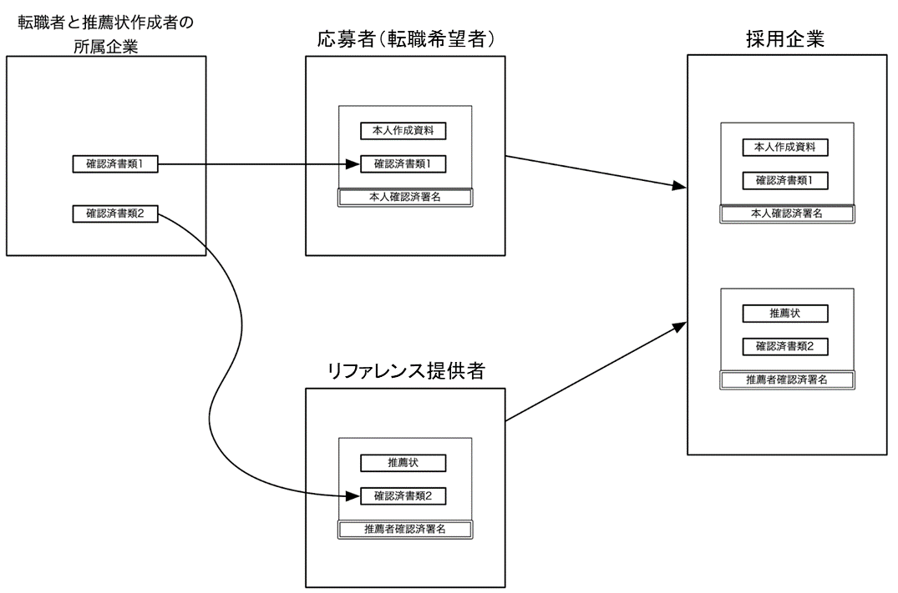

図 2‑1 転職におけるユースケース

#### (b). ペインポイント

14. ペインポイントを、整理・集約すると、以下のようになる

<!-- -->

1)  全ての参加者の視点

    1.  情報をやりとりする相手が、主張する通りのアイデンティティに結びつく本人であるかを検証できない

    2.  相手が示した情報が正しいのかを検証できない

    3.  相手が所属（現在あるいは過去）を主張している企業への在籍の事実があるかを検証できない

    4.  やりとりする情報が改ざんされているかどうか検証できない

2)  情報の提供側の視点

    1.  提供する情報が正しく管理されていることを知り得ない

    2.  提供する情報が不正に開示されるリスクがある

    3.  目的外利用や第三者提供のリスク

    4.  提供する必要がない情報の開示を求められる場合がある

    5.  提供した情報を撤回できない

3)  情報の受け取り側の視点

    1.  受け取った情報が正しく管理されていることを情報提供側に示すことができない

    2.  不必要な情報を受け取るリスクがある

#### (c). プロトタイプ開発
[^3]
##### (i). 検討経緯

15. 2021年度におけるTrusted Webに係るプロトタイプ開発は、a. シンプルながら「データが確認された状態で選択的に渡す・受け取れること」を世の中に分かりやすく「見せて」訴求すること、また、b.  具体的なプロトタイプを作った上で、必要な機能や課題を洗い出し、議論・検証することを目的として、実際にブラウザベースで、初めてTrusted Webの「見える化」を試みた取組である。

16. 　具体的には、「個人」のスキル・実績等の転職応募時におけるやりとりのユースケースをベースに、情報の「出し手」である転職応募者本人とリファレンス提供者、その「受け手」である採用企業との間でやリとりされる情報をVerifiable Credentials（以下 VC）を利用して自ら検証できるようにするとともに、誰がどのような情報を見られるかをそれぞれ定義して必要な情報などの精査を行った上で、実装を行った。

17. また、利用者（転職応募者本人、リファレンス提供者、採用企業の採用担当者）へのサービス提供時のインターフェースについては、モバイルアプリ等も検討したが、そもそもTrusted “Web”が検討の起点であること、また、アプリでの提供となるとモバイルアプリプラットフォーム事業者への依存が前提となることなどを考慮し、複数のブラウザで利用できるブラウザエクステンションとして提供することを選択した。

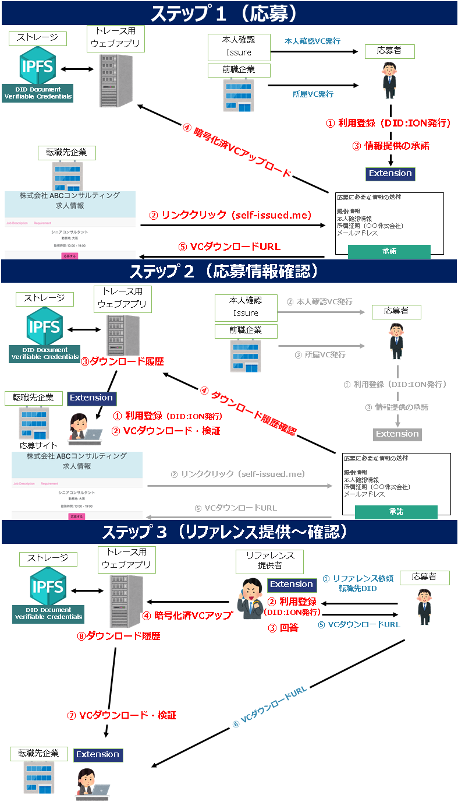

図 2‑2 プロトタイプのプロセス

##### (ii). プロトタイプとして技術的に不完全な点

18. UI/UXの観点では、「DID/VC（Decentralized IDentifiers/Verifiable Credentials）」のしくみを採用したが、この仕組みを理解している人でないと、DIDやVCがもたらす価値が伝わりにくいユーザインターフェースとなった点や、データの格納先としてIPFS（InterPlanetary File System）[^4]に保存される仕様としたため、リファレンスに関する情報を送付する場合にはダウンロードリンクを別の手段で伝える必要があるなど、ユーザエクスペリエンスとしては、さらに洗練させていくことが必要と考えられる。

19. 加えて、IPFS自体にはファイルへのアクセスを制御する機能がないため、IPFS上でファイルを特定するコンテンツIDをそのまま伝えると、誰がいつダウンロードしたか、といった履歴が残らなくなることが懸念される。このため、別途、集中的にアクセスを制御するサーバで認証やアクセス履歴の記録を行うこととしたが、これによっても迂回ができてしまうため、アクセス制御としても不十分なものとなった点も課題である。

20. さらに、トレースを行えるのは、あくまで一次ダウンロードだけであり、一度ダウンロードされた上で、正当なデータ受領者によって復号されたデータが誰の手に渡ったのかという点については、トレースできない点が課題となる。この課題を解決するために、例えば、デジタルデータをコピーできないようにしたり、画面キャプチャや写真で写らないようにしたりすることも想定されるが、技術的にほぼ不可能と考えられるため、こうした点も踏まえて、引き続き検討が必要である。

##### (iii). 今後のさらなる社会実装に向けた課題

21. まず、本件（2021年度）のプロトタイプでは、「必要なVCはあらかじめ発行されており、各VCのIssuerが署名済みであること」を前提条件としていたが、社会に実装していく上では、VCを発行する主体の公開鍵が正当性を担保した状態で公開されている必要があり、また、署名や検証をするための仕組みをすべての参加者が備えていることが求められる。

22. 次に、その公開鍵に対応する秘密鍵を各主体が管理する必要があるため、本件のプロトタイプでは、利用者のインターフェースであるブラウザエクステンションがその管理を行った。その際、ブラウザやブラウザエクステンションを削除してしまうと秘密鍵が失われてしまうため、HDWallet[^5]の仕組みを採用したが、12種類の単語を覚えておく必要がある等、社会実装時には、さらなる利便性向上が求められるといえる。こうした中で、今後、秘密鍵を管理するサービスが提供される可能性もありうるが、そもそも、そうした鍵管理サービスやブラウザエクステンション等をいかに信頼（Trust）するかという課題が残ってしまう点には留意が必要となる。

23. さらに、本件のプロトタイプでは、ユースケース固有のデータのみを扱い、それに伴ってVCのデータフォーマットも独自の固定フォーマットを採用したが、今後、社会実装を進めていくにあたっては、様々な種類のデータを取り扱うことが想定されるため、各データに応じたVCのデータフォーマットへの対応が必要となると考えられる。

24. そして、既存の広く普及しているWeb APIの機能をどう拡充・拡張していくかという観点からの接続性についても、今後、検討・実証が求められる。

#### (d). 本ユースケースにおける特異な点

25. 　応募者とリファレンス提供者のプライバシーを保ちつつ、企業への十分かつ検証可能な情報提供が困難である点が特異である。本人、採用企業、リファレンス提供者のそれぞれが必要かつ十分な情報のやりとりをする必要があり、それぞれのエンティティが、どの情報を誰に見せるかを厳密にコントロールできる必要がある。また、本人確認情報に加え、現・前職における在籍確認の証明も必要となるが本人のプライバシーを確保した方法が必要である。

#### (e). 本ユースケースで抽出された検討すべき課題

26. 個人情報の開示という側面を持つため、特に開示した個人情報が他の第三者に提供されていないか、といったデータのトレースをどのように実装するかが課題と言える。復号されたデータが誰の手に渡ったのかをトレースすることは現状技術的に困難であるが、少なくとも長期的な視点での安全性の確保の方法を検討することが必要である。また、どの項目を誰に見せるか、といった、柔軟なアクセスコントロールを行う手段は実装されておらず、また詳細なアクセスコントロールを個人が自身で設定できるのか、といった課題が残る。機能実装した上で、信頼できる第三者に委任することも考えられるが、できるだけ第三者に依存せずに済むような方式の検討が必要である。

    　

27. 　また、データモデルの対象領域毎の共通化や標準化が必要である。

### b. ユースケース：学習歴（東京大学/富士通Japan）

#### (a). 背景

28. 　労働人口が減少する社会において、企業の人材獲得競争は激化する傾向にあり、優秀な人材を獲得するため、企業の採用方法も変化している。また、変化の激しい時代において、仕事に必要なスキルや能力は大きく変化している。

29. 　このような状況の中、企業が求める人材とのマッチングや、キャリアアップ・能力開発に必要な教育とのマッチングのニーズはより一層高まっている。この際に重要となるのが、個人が備えている学修成果やスキルを可能な限り正確に、かつ効率的に企業や教育機関と共有することである。しかし、応募者が入力した情報が正しいかどうかを企業・教育機関側が検証することが困難であったり、証明書の真正性を確認するための時間や事務コストが発生したりするなどの課題がある。また、応募者としても、各企業や大学に自身の情報を共有する手続きや入力フォーマットの違いによる煩雑さや、申請した情報が正しく企業・大学に扱われているかの懸念といった課題がある。これらの要因により、効率的・効果的なマッチングが阻害されている。

30. このため、個人の多種多様な学修成果や保有スキルと、それらを効果的に発揮できる職業・業務等とのマッチングを、信頼性を高めつつ、利用者主体で簡易に活用可能なデジタル情報流通の仕組みで実現することを検討した。

図 2‑3 学習歴のユースケース（東京大学）

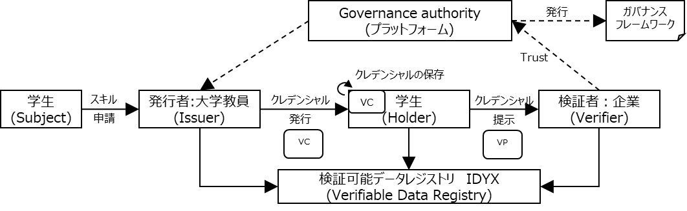

図 2‑4 学習歴のユースケース（富士通Japan）

#### (b). ペインポイント

31. 転職の机上検討で述べたペインポイントに加え、実際にデジタルの学習履歴を発行する際の課題を、それぞれのユースケースにおいて検討した。

<!-- -->

1)  学生の視点

    1.  情報提示の際に、応募とは直接関係の無い情報も開示されてしまう

    2.  部活動やボランティアなど成果の証明が困難な情報を活用できない

2)  応募先企業の視点

    1.  学生が所属を主張している大学への在籍の事実や学業成績を検証できない

3)  大学の視点

    1.  個別具体的な学習内容や能力を企業に対して連携できず、個別最適な就職支援ができない

    2.  効率的かつ容易な本人確認を行う必要がある

#### (c). ユースケース実現による恩恵

32. 個人の多種多様な学修成果や保有スキルに対し、信頼性を高めつつ、利用者主体で簡易に、職業・業務等とマッチングしたり、18歳人口が減少する中、教育プログラムを提供したりすることで、大学の新たな収入源となることが期待される。

33. 各証明書発行者の年間利用料を100～500万円とすれば、国内での潜在的利用者が3万団体（ 国内の小学校が約2万校、中学校が約1万校、大学が約790校、専門学校が約2,800校）として潜在市場規模は300億～1,500億円と推計される。

#### (d). プロトタイプ開発

##### (i). 東京大学におけるプロトタイプ

> 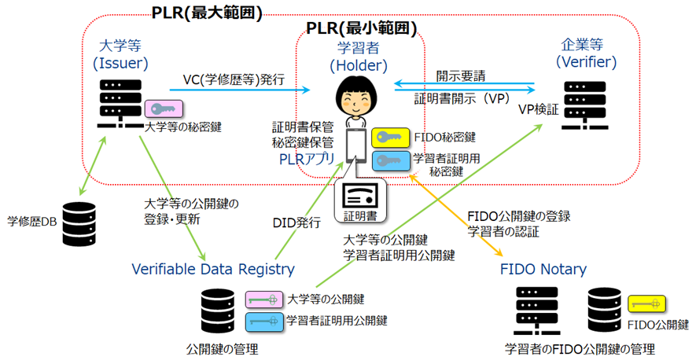

図 2‑5 東京大学におけるプロトタイプ

34. FIDO Notary[^6]を導入し、FIDO認証のトラストモデルを踏襲し、学習者（holder）の本人認証を強化すると同時に、企業等（verifier）が検証者として学習者（holder）の本人性を検証可能とするVC形式の学修歴証明書を発行するシステムを開発し、動作を検証した。ここでは、汎用的に認証に用いるFIDO鍵とは異なる本人証明用の鍵ペアを生成し、その公開鍵を学習者のDIDと共にVDRに配備することによって企業等が学習者の本人性を検証することができ、学修歴証明書のトラストが向上した。また、選択開示機能を導入し、発行済のVCの一部分のみを開示する機能を追加した。

##### (ii). 富士通Japanにおけるプロトタイプ

> 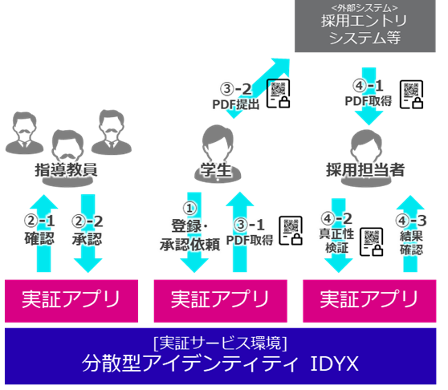

図 2‑6 富士通Japanにおけるプロトタイプ

35. 富士通提供の分散型アイデンティティ環境を活用し、学生が指導教員に承認依頼した活動・スキルの内容を指導教員が確認・証明する。学生が選択した属性情報の内容を指導教員の署名により証明し、学生及び指導教員の本人確認に認証技術を導入することで、本人性を検証することができ、トラストを向上している。

#### (e). 本ユースケースにおける特異な点

36. 学修歴証明に関するサービスを事業化するための本質的な課題は、署名の検証による技術的なトラストではなく、学修歴データの内容に関するトラスト（質保証）である。そのための社会環境が整うには、働き方改革、ジョブ型雇用、リスキリングなどの進展が必要であり、逆に学修歴証明の普及がそれらの進展を促す、という鶏と卵の状態にある。

#### (f). 本ユースケースで抽出された検討すべき課題

##### (i). 東京大学のユースケースから抽出された検討すべき課題

37. 一般に検証すべき対象は多様であり、データ検証のみでは十分ではないことが多い。特にデータの内容の正しさや精度の検証には他の手段が必要である。たとえば学修歴証明の本質は電子署名の検証などの技術というよりは証明内容の正しさの保証である。これは学修歴証明の発行者である大学等を含む社会システムに対するトラストに基づくため、トラストの根拠は電子署名の検証などではなく社会的相互作用の蓄積である。こうした事例は学修歴証明に限られたものではない。また、ブロックチェーン上のDIDが検証できても、一般に利用者のアイデンティティ（属性情報等）の検証には十分ではない。

38. 署名検証などの既存技術によりデータの改竄は検出できる。しかし、それに必要な情報（署名検証の場合には公開鍵）を検証者が入手可能とは限らない。データのトラストを高めることを優先するあまり、元々入手できないデータの開示を迫らないようにすべきである。

39. 今後、本人確認を民間の認証基盤に依存するのではなく、公的個人認証や免許証など、様々な公的サービスと連携し、より確実な本人確認が実施できる方策も検討すべきである。

##### (ii). 富士通Japanのユースケースから抽出された検討すべき課題

40. 自らがデータへのアクセスをコントロールできる仕組みであるため、自身の都合の良いデータのみを開示制御できてしまうという点は、ユースケースによっては、問題になる場合がある。

41. 富士通Japanのユースケースでは評価者（Issuer）である指導教員や教授による証明書を作るが、データ利活用範囲が制限される中で、評価者の信頼度をいかに構築するかの考慮が必要となる。

42. データの利活用範囲が制限されるために、ステークホルダーの中にはTrusted Webを利用したくなる動機づけが弱く、活用が進まない可能性がある。Issuer、Holder、Verifierにとって、この仕組みを利用することのUI/UXとしてのメリットを明らかにし、各ステークホルダーから成るバリューチェーン全体でのWin-Winの構造をユースケース毎に作り上げる必要がある。

43. ユースケースでは、学生（Holder）から企業（Verifier）への評価結果の開示など上流（大学、学生）から下流（企業）として対応したが、企業発行の証明書を活用し学生に企業評価をフィードバックするなど、下流から上流に対する情報の紐づけ管理も検討すべきと考える。

## (3). 「メディア」の属性情報のやりとり

### a. ユースケース：広告（DataSign）

#### (a). 背景

44. 　オンラインマーケティングにおいて、生活者のメールアドレスや電話番号、Cookieやそれに紐づく行動履歴、位置情報などのパーソナルデータが本人の意思に関わらずさまざまな企業によって収集されている。

45. パーソナルデータがいつの間にか知らない企業に収集・利用され「気持ちが悪い」といった印象論だけでなく、ウェブサイトを閲覧する「サイト閲覧者」、ウェブサイトを運営する「サイト運営者」、ウェブサイトに広告を配信する「広告配信事業者」、ウェブサイトのアクセス解析を行う「アクセス解析事業者」（「広告配信事業者」「アクセス解析事業者」を総称して「アドテク事業者」と記載する場合もある）により収集されたパーソナルデータが本人の意図しない利用をされることにより、本人の権利利益を害する事案が起きている。

46. これらの問題を解決するために、主に法的な対応を含めたガバナンスによって、個人の権利利益を保護するような動きは世界で活発化しているが、技術的な解決の方法は未だ社会実装されていない。

47. また、パーソナルデータを利用するサイト運営者、アドテク事業者等にとっても、広告識別子が利用できなくなっていくなどの社会情勢もあり、加えて、収集するデータがすべて正しいとは限らないため、アドフラウドやボットにより生成される不正なデータをフィルタリングする等の対策を行っているが、堂々巡りの状態が続いている。

> 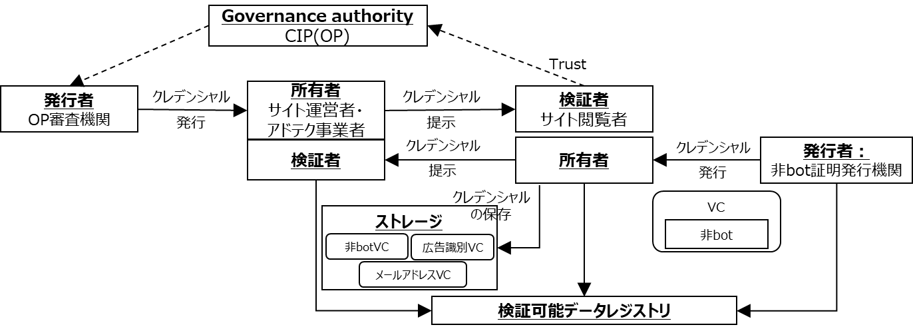

図 2‑7 広告のユースケース

#### (b). ペインポイント

48. Webサイト閲覧者に対する広告表示などのオンラインマーケティングの場において、サイト閲覧者の行動履歴等パーソナルデータが本人の知らない内に様々な事業者に収集されている。また、サイト運営者、アドテク事業者等にとっても収集するデータが正しいデータなのか分からない状態にある。

49. サイト閲覧者（利用者）は知らないうちに自分のパーソナルデータが不正な第三者によって収集・利用されている

50. サイト運営者はアドテク事業者の正当性を確認できず、収集したサイト訪問者（生活者）の情報が不正なアドテク事業者に渡ってしまうなど、適切な制御ができていない

51. アドテク事業者は、サイト閲覧者を装って広告効果があるように見せかけるボット[^7]等の存在によって、広告詐欺などの被害が出ている

#### (c). ユースケース実現による恩恵

52. パーソナルデータの利活用に対し生活者の関与を強め、検証できる領域を広めて、オンラインマーケティング全体のTrustを向上させる。

53. アドフラウドによる被害額はSpider Labs[^8]の調査によると 1,000 億円以上に上ると推定されており、生活者にとっても、サイト運営者にとっても、アドテク事業者にとっても公平公正なビジネス環境を構築することで、より多くの信頼性の高いパーソナルデータが活用できるようになり、利用者にとって真に価値のあるサービスが開発されていくことが期待される。

#### (d). プロトタイプ開発

> 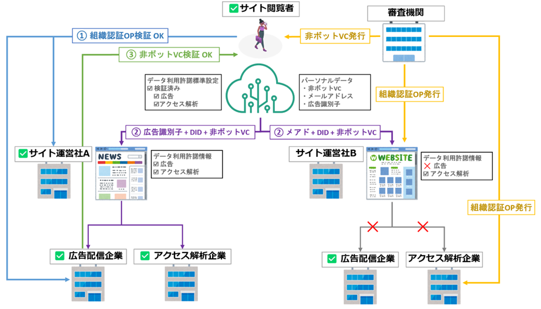

図 2‑8 広告におけるプロトタイプ

54. 　本ユースケースでは、サイト閲覧者、サイト運営者、広告配信事業者、アドテク事業者を対象とし、それぞれのエンティティに対して審査機関が正当性の認証を行い、証明書を発行してお互いに提示・検証しあうことによって、ペインポイントの解消を目指した。

55. 「サイト運営者」、「アドテク事業者」に対しては、審査機関がOriginator Profile

    （OP）[^9]を発行し、「サイト閲覧者」がOPを検証することで、正当性を確認した上でパーソナルデータを提供し、「サイト閲覧者」に対しては、ボットではないことを証明する非ボット証明をVerifiable Credentials（VC）として発行し、「サイト運営者」および「アドテク事業者」が人間による正当なアクセスであることを検証することで、広告詐欺ではないことを確認できるようにプロトタイプの開発を行った。

#### (e). 本ユースケースにおける特異な点

56. 識別子を連携する相手ごとに発行することでプライバシーリスクの低減を目的として、「サイト閲覧者」が「サイト運営者」に渡すDIDにはペアワイズDIDを用いることで、「サイト運営者」が無断で第三者にデータを提供することによるIDを用いた名寄せができない仕様としている。ただし、ペアワイズDID を用いることで、Issuerから発行されるVCに記載されているDIDとVerifierに受け渡す際のVPに記載されているDIDが異なることにより、通常の方法ではVCの検証を行うことができない、という課題が残されている。

57. また、サイト閲覧者がデータ取得した際の履歴等をローカルに保存する場合、消失時の復元や容量等の課題がある。これらを解決するため、分散型のストレージである Decentralized Web Node（DWN）を用いていることも特異な点である。DWN等の分散型のストレージにおいては、その運用者をどのようにトラストするのかといった課題や、自分専用のDWNを用いることでそのエンドポイントが個人を識別する識別子となってしまうという課題が残されている。

#### (f). 本ユースケースで抽出された検討すべき課題

58. 本ユースケースでは、審査機関が重要な役割を担うものの、審査機関や審査方法に対するトラストをどのように担保するかについては課題が残った。本ユースケースに限らず、VC等の証明書を発行する際の審査スキームにおけるガバナンスモデルを検討すべきである。

59. また、上記と同様にDWNのようなデータ管理基盤を提供する主体やウォレットを提供する主体についても、どのようなガバナンスモデルでトラストを担保するのかという課題に対して検討を行っていくべきである。

60. また、本ユースケースにおいては「サイト運営者」および「アドテク事業者」がOPを利用していることを前提としたが、これらの事業者がOPを利用するメリットや、根本的にはデータのコントロール主体がユーザ（個人や法人）となることに対する事業者側のインセンティブを設計することも必要となる。分散型のアプローチは現在の集中型のビジネスモデルを少なからず変革することが前提となるため、これらに対する強力なインセンティブ設計を検討すべきである。

## (4). 「ヘルスケア」の属性情報のやりとり

### a. ユースケース：臨床データ/ヘルスケアデータ（シミック/ORPHE）

#### (a). 背景

61. ヘルスケア領域においては、ゲノム情報や医療機関での診療情報等、機微性の高い情報を扱い、その多くは個人情報保護法においても要配慮個人情報に該当するものとして慎重な取扱いが求められる。

62. また、保険医療の枠組みや臨床研究等としての特別なルールが多く存在する領域である。例えば、電子カルテに関しては、「見読性」、「真正性」、「保存性」の３つ[^10]が確保されている必要がある。

63. 一方で、健康に関しては、医療現場を中心とした医療情報だけでなく、健康診断での情報や職場での健康情報、日常生活におけるあらゆるタイミングでの多様な情報が関わりうる。

64. ヘルスケア業界におけるデータの取扱いに関しては、政府における医療DXの推進に象徴されるように、いくつかのデータベース整備等の取り組みが進められてはいるものの、依然として電子カルテを導入していない医療機関も多数存在し、重要な情報及びプロセスが紙媒体に記録されていることが多い。

65. 以上のように、個人の権利保護や、科学的な妥当性の観点等から、信頼性の担保を含めたパーソナルデータの適切な取り扱いが求められているなかで、２つのユースケース検討（シミック、ORPHE）を行った。

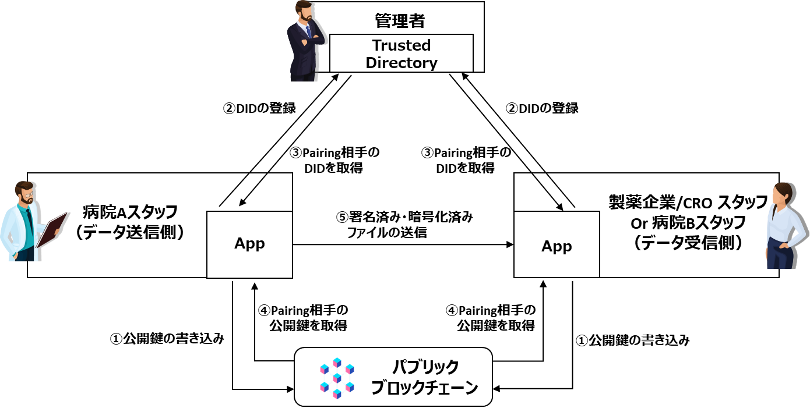

図 2‑9 臨床データのユースケース（シミック）

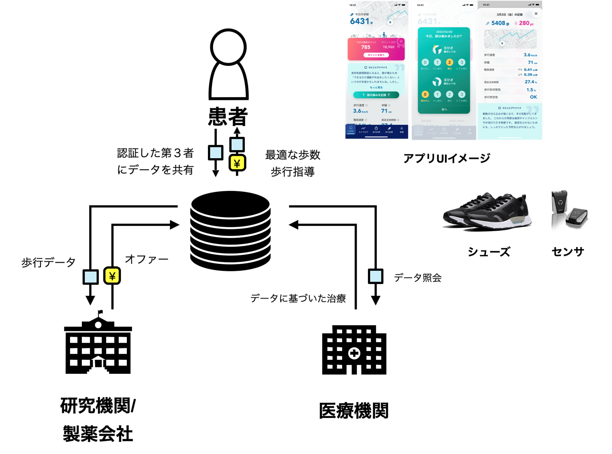

図 2‑10 ヘルスケアデータのユースケース（ORPHE）

#### (b). 議論しているペインポイント

66. ヘルスケア領域においては、一般に、

    -  改ざんリスクへの対応（真正性の担保）

    -  なりすましの防止（本人、適切な関係者に限定した流通）

    -  データ流通のトレーサビリティの担保

    -  （特に患者や研究協力者からの）同意取得状況の確認

    -  （個人情報としてのカルテ情報などに関する）本人からの開示等請求への対応

    といったものが求められ、Trusted Webはこれらの解決に機能することが期待される。

67. そこで、今回の２ユースケースでは、特に以下のようなペインポイントに着目して検証を行った。

##### (i). シミックでのペインポイント

68. 臨床試験等及び医療業界では、重要な情報やプロセスが紙媒体に記録されていることが多く、運用コストの増大につながっている。また薬の臨床試験等では製薬会社担当者が紙媒体に記録された情報を確認するために病院等に訪問しており、その訪問のためのコストもかかっている。これらのコストは創薬コスト、ひいては薬価というかたちで社会保障費の上昇につながっている。さらに、現場に担当者が行くにしても、情報の受け渡しを行う関係者間で本人性・非改ざん性を厳密には保証できていない。

59. また臨床試験等の情報のやりとりで既に医療情報システムを導入している場合にも、以下のような課題がある

    - ライセンス取得・構築・運用に多額のコストが必要になると共に、専門人材が必要（例：臨床試験等でいえばEDC（Electronic Data Capture）など）
    -  他人のアカウント情報を使用した関係者によるなりすましリスクがあり、アイデンティティ管理やトレーサビリティが不十分

##### (ii). ORPHEでのペインポイント

- 下肢運動器疾患患者は日常の歩行や痛みのデータを専門家に共有し意見を聞きたいと思っているが、データを共有する際に送り先の確認に不安がある

-  医師や理学療法士は下肢運動器疾患患者の日常のデータを活用し治療を最適化したいが、通院時に対面でヒアリングするしかない

- 研究者や製薬会社は下肢運動器疾患患者の日常の歩行や痛みのデータを活用したいが、個人情報の懸念があり、また改ざんのリスクがあるため活用できない

#### (c). ユースケース実現による恩恵

##### (i). シミックにおける恩恵

67. 臨床試験業界における分散型臨床試験（Decentralized Clinical Trial: DCT[^11]）デザインの確立、医療業界におけるPHR（Personal Health Record[^12]）及び EHR（Electronic Health Record[^13]）データの利活用が期待できる。

68. 既存のEDCのサービスを置き換えるものではないが、利用料（セットアップ及び運用・管理）と比較した際のサービス提供のコストを10分の1から5分の1に抑えることが期待できる。

69. DCT デザインの臨床試験で活用するWearable DeviceやePRO等への実装により、臨床試験及び臨床研究等全体のコスト削減を図ることができると共に、デバイス毎且つ被験者数に依存する従量課金によるビジネスモデルが構築できる。

##### (ii). ORPHEにおける恩恵

70. 変形性膝関節症の患者が膝の痛みを恐れて外出することが怖くなり、結果として筋力低下を招き転倒率を上げてしまうという悪循環から回避できる。

71. 日常生活における実際の歩行データを、動的な同意取得のもと臨床の現場で活用できる。

#### (d). プロトタイプ開発

##### (i). シミックにおけるプロトタイプ

72. 本ユースケースでは、データの送信側（病院スタッフ）は送信データ（臨床試験データを含むファイルの内容）が改ざんされていないことを担保するため、署名及び暗号化を行う。そしてPairing[^14]した受信側の相手のみが署名の検証及び復号化が可能であるため、送信側のなりすましが行われていないことを確認できる。

73. また、データの送信側と受信側（製薬会社/CROスタッフ）が「互いが信頼できる相手であること」及び「データの授受」について合意する。データ送信者及び受信者が、ファイルの復号化が可能なDIDのリスト（信頼している相手のリスト）を確認した上で署名及び暗号化／署名検証及び復号化を行うことで合意が形成される。合意した内容とその履行について、暗号化及び復号化が行われた履歴（監査証跡）を確認することでトレース可能である。

##### (ii). ORPHEにおけるプロトタイプ

74. 本ユースケースでは、患者は、データ共有先（医師、研究機関等）が信頼できる対象かを確認するために、データ共有先から発行されたリレーションシップVC[^15]の署名検証を行う。歩行計測データや主観的痛みなど本人の入力データが改竄されていないことを証明するため分散ストレージにハッシュを記録する。

75. また、データ提供者とデータ閲覧者が、データを共有することについて、Web管理画面から発行されたリクエストをデータ提供者がアプリで同意した場合、履行された同意について、VCの利用ログによりトレース可能である。また、情報提供の取り消しも可能である。

#### (e). 本ユースケースにおける特異な点

76. ヘルスケアデータに関しては、次世代医療基盤法や研究倫理指針、3省2ガイドラインのようなハードロー・ソフトローでのルールや、CDISC[^16]、DICOM[^17]、HL7[^18]等、医療情報の標準も存在しており、これらの要求を満たすことも求められる。

77. 特に、個人データに関する本人の同意の状況は運用上重要なポイントとなっている。誰のどのような同意・許諾により、どの範囲でデータを流通させても良いかという点が、ヘルスケアのユースケースにおいては論点となる。

78. シミックのユースケースでは、本人の同意が完全に存在している前提の中で、病院・製薬企業等中心の（いわば古典的な）データ流通のモデルとなっている。一方で、ORPHEのユースケースでは、本人中心・本人の同意が確認できる状態でのデータ流通のモデルとなっている。

79. なお、シミックに関しては、特定の臨床研究に参加するメンバーという「一部の許可されたユーザ同士によって形成される動的なコミュニティ」内でのデータのやり取りを行う点もまた特徴となっている。

#### (f). 本ユースケースで抽出された検討すべき課題

88. 医療データの信頼ある流通のためにはTrusted Webのアーキテクチャの周知を行い、社会的な理解を更に得た上で、コスト等の面でも実装可能性が高いモデルを作っていく必要がある。

89. その点、シミックのユースケースにおいて、コスト面への有用性が示唆されたが、実際のコスト削減効果に関しては引き続き検証が必要である。

90. また、シミックのユースケースからは、動的で多数なコミュニティ内でのデータのやり取りに真に有用であるか否か、また、有用となるためにはどのような要件が求められるかという点は引き続き検討すべき課題である。

91. シミックのユースケースでは、病院スタッフまたは製薬会社/CROスタッフの故意により、本来登録されるべきではないドメインにURIの登録ができてしまい、担当外の試験情報を入手出来ることや、相互のドメイン名が突合しないとPairing[^19]が実行されないといった課題から、Paring情報を集中管理する方式を採用しており、ユーザ自らが関連する情報をコントロールする範囲は検討すべき課題である。

92. ORPHEのケースでは、ユーザの属性の証明、患者データの無改ざん証明に取り組んでいる。一方で、ビジネスモデルとしての持続性の他、実際に靴を履いた人物の患者本人性の証明も課題となっている。PHR一般においても共通の課題であり、PHRサービス事業協会等の関連団体においても引き続き検討が望まれる。

93. また、Trusted Webの限界として、データはコピー可能であるので、プラットフォーム内のやりとりは記録できても、トレースしきれない場でコピーされてしまうリスクがある。合意した事項が記録に残っていることをお互いに担保し、得られたデータが２次的にも適切に扱われることに関しては、既存のヘルスケアデータのガバナンスのルールとあわせて検討が必要である。

94. ヘルスケア領域では、他にもTrusted Webにとって参考になるケースもいくつか存在しており、そうしたケースも含めて検討を深めていくことで、ヘルスケア領域でのモデル化と展開に資するものと考える。

## (5). 法人の行政庁との情報のやりとり

### a. 机上検討：法人と補助金/ユースケース：法人と補助金（電通）

#### (a). 背景

87. 　中小企業等が補助金等を行政に対し申請する際、申請書とともに様々な添付書類を提出する。申請書は申請企業が記載するが、添付書類として国や中小企業支援機関等によって一定のお墨付きを与えられた書類を提出する。現状では、申請書自体の形式が補助金によって異なるので、それに合わせて手作業により情報を入力したり、他の文書から文字情報としてコピーしたりする必要がある。ここには間違いが入り込む余地があるとともに、手間がかかる。また、添付書類については、確からしさを容易に確認できない場合があり、実際に改ざんされた決算申告書を用いた不正補助金申請の事例報告がある。

88. また、中小法人・個人事業者の把握・捕捉のしづらさが、補助事業者等による不正や、確認行為に伴う事務局の審査コストの増加、そして、煩雑な申請手続きにつながっている。

89. 　《法人と補助金》机上検討（ホワイトペーパーver.1.0及びver.2.0に掲載） では、令和4年度1月20日募集を開始した、事業再構築補助金の第５回公募[^20]の情報を元に、法人が通常枠での補助金額3,000万円を越える申請を行う場合について検討した。

90. 電通のユースケースでは、中小法人・個人事業者を対象とした補助金・給付金等を対象としたプロトタイプ開発実証を実施した。プロトタイプでは、公的支援（補助金・給付金等）を申請する中小法人・個人事業者（申請者）は、国、自治体、金融機関（証明者）に電子証明書（VC）の発行を依頼し、ローカルストレージ上で管理する。補助金・給付金執行事務局等（申請先）は申請者からの申請情報に基づき、審査を実施する。

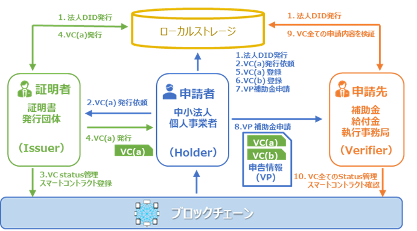

図 2‑11 中小法人・個人事業者を対象とした補助金・給付金等のユースケース（電通）

#### (b). ペインポイント

91. 　ユースケースで解決したいペインポイントについて、以下にまとめる

    -  補助金の募集及び受付をする受付機関、申請者、申請に関係した情報を扱う業者等のステークホルダー間でやりとりされる情報の形式が、補助金毎に必要な情報が異なることで提出機会毎に異なることが多々あり、結果、複数の補助金申請をする場合、情報を揃えて提出する側に大きなペインが生じる。

    -  申請する側は、一度申請に用いた情報を再利用することができず、申請を受ける側は、同一補助金の複数年度重複申請や他補助金との重複受給などの状態管理が困難である。

#### (c). ユースケース実現による恩恵

92. 申請者は、紙の申請書をPDF化する作業が不要になり、申請書類の発行のため窓口に来訪する手間が削減される。また、申請先にとっては、証明書類確認工数が大幅に削減され、不備申請の減少による事務コスト削減効果が期待できる。そして、証明者にとっては、事務手続きの効率化や窓口業務のコスト削減につながるだけでなく、地方の人手不足に対する社会的な貢献にもつながる。

#### (d). 本ユースケースにおける特異な点

93. 申請手続きにあたり、属性情報を証明する証明書だけでなく、申請者の営業についての会計システムや人事労務システムといった情報に関与するエンティティとの連携によって実現されている。

94. 申請手続部分において、GビズID、jGrants等の既存の事業者のためのサービスが今すぐに活用可能である。

#### (e). プロトタイプ開発

95. Webアプリを用いた申請業務のデジタル化、VCによる検証可能なデジタル証明書の発行、ブロックチェーン上のスマートコントラクトによる証明書のステータス管理等を利用することで、コスト低減と申請情報の信頼性向上の実現を目指した。

#### (f). 本ユースケースで抽出された検討すべき課題

96. 背景における申請書や添付書類といったどのようなデータに対して、真正性や非改ざん性を検証する対象とするのかの整理が必要である。まず、法人と法人に属するアイデンティティ管理システム[^21]との連携は欠かせない。一方、アイデンティティ管理システムは実装によっては属性情報をサーバ側で管理することを前提としている場合があり、今回のユースケースのように、あらかじめサーバ間の連携を前提としないシステムの場合は、アイデンティティ管理システムは適用できない場合がある。

97. 次に、法人や法人に属する従業員についての本人性[^22]、法人への所属の表現[^23]をどのように確認するのかの整理が必要である。

98. そして、法人間の情報連携における人事労務のデータなど、それぞれの領域（ドメイン）での固有のデータモデルをどのように扱うのかの整理が必要である。

99. また、書類のやり取りにおいて、各連携組織で行われている「確認」には、程度の違いがあることが明らかとなった。たとえば、本机上検討においては、銀行や認定経営革新等支援機関が計画書を精査した上で確認書を発行する。一方、税務署に提出された書類に対しては、受け取り確認を行っている[^24]。これら二つの確認は書類の中身の確認と提出事実の確認という全く異なる種類の確認であり、これらについて区別して議論する必要がある。

100. 　エンティティ間のデータのやり取りのモデル化が必要である。法人と補助金の机上検討における書類のやり取りのモデルを単純化した図を下記に示す。

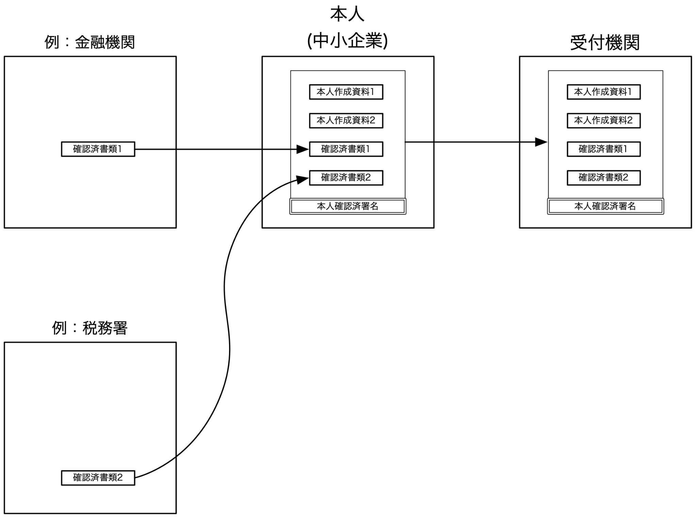

図 2‑12 法人と補助金におけるデータのやり取りモデル

101. 　机上検討においては、確認済みの書類（確定申告書第一表の控え（収受日押印済のもの等）、金融機関による事業計画の確認証など）を本人（中小企業等）が集約し、本人の作成した資料とともに受付機関に提出する。それぞれの書類の確認という点では、受付機関は書類を提供する組織（金融機関等）に強く依存せずに書類が改ざんされていないことを確認できることが望ましい[^25]。この場合、データは各組織あるいはエンティティとは独立に確認可能となり、エンティティとの結合を解くこと（アンバンドル）が可能となる。通信の視点では、基本的には、一対一の通信では送信元および送信先が互いに確認できる必要がある。また、送信元か送信先の受信後に証明できる仕掛けが必要である。

###  b. ユースケース：法人税制と工業会証明書（JISA）

#### 背景

102. 本ユースケースでは、法人税制における租税特別措置法上の政策税制のひとつである、中小企業経営強化税制について、情報サービス産業協会（以下 工業会）による証明書交付事業を対象としている。本税制は、中小企業者が適用対象設備を取得した後、当該設備を販売した製造事業者等の申請に応じて工業会が発行した工業会証明書を添えて、当該中小事業者が経営力向上計画を申請し、主務大臣の認定を受け、税制上の要件を満たしている場合は、本税制を適用できる。

103. 工業会は、証明書交付事務における添付書類の不足や記載不備等による申請者と事務局との間の頻繁なやり取りや、申請者からの問い合わせや国税庁や中小企業庁からの疑義発生時の照会対応といった課題を抱えている。

104. 法人向け政策税制では、多くの場合、確定申告内容の信頼性を補完することを目的として、第三者による証明が必要であり、その証明内容の信頼性を確保したシステムを設計することで、証明に係る事務負荷を軽減すると共に、関係者間のデータ連携を図ることにより、政策税制に係る運用の効率化及び活用促進に寄与することを目指す。本プロトタイプでは、中小企業者は、購入した製造事業者等に適用対象設備等の利用証明（納入済証明）を申請した上で、製造事業者等が発行したデジタル証明書を工業会に申請し、発行された工業会証明書を、所管省庁や税務申告時の所管の税務署に提示をするというプロセスを対象としている。

> 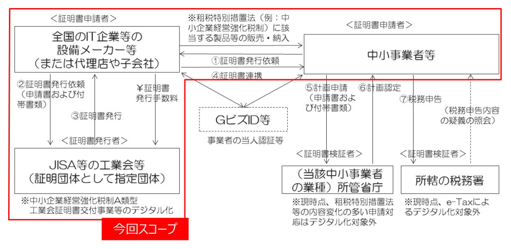

図 2‑13 法人税制と工業会証明書のユースケース（JISA）

#### ペインポイント

105. ユースケースで解決したいペインポイントについて整理・集約すると以下のようになる。

<!-- -->

1)  証明書申請者の視点

    1.  複数の証明書が相互運用性のある形でデジタル化されていない[^26]

2)  証明書発行者の視点

    1.  交付した証明書が申請者であるIT企業の手元にあるのか、それとも納税者に渡っているのかトレースできない

3)  証明書検証者の視点

    1.  証明書に記載されている事項が改ざんされていないこと、有効性が検証できない

    2.  当該の証明書が意図した発行者から発行されているか検証できない

#### ユースケース実現による恩恵

106. 政策立案者が支援措置を講ずるにあたり、納税者が当該措置の対象であるかを判別する手段として、しかるべき第三者に証明を委ねることが必要であり、第三者からの証明書は

     EBPM[^27]の実現に資すると考えられる。

107. また、本ユースケースの対象であるA 類型（生産性向上設備）の工業会証明書に係る事務手数料の削減も見込まれる。

#### プロトタイプ開発

108. 今回のユースケースでは、申請手続きのデジタル化によって業務の効率化を図るとともに、各種デジタル証明書としてVCを活用することで提出書類の信頼性を向上させている。具体的には、メーカーや工業会、所轄官庁など複数の異なる主体がデジタル証明書を発行することができ、発行者が発行したVCを取り消すことができる。これらの主体に関して、GビズIDを利用しない確認手法としてDNSドメインとDIDのバインディングに関する規格を導入しており、ブラウザベースのWalletアプリを利用して、中小企業は工業会証明書の申請や、デジタル証明書と照会内容の紐づけや確認を行うことができる。

> 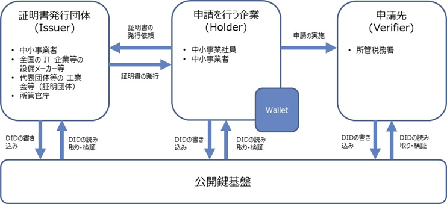

図 2‑14 法人税制と工業会証明書におけるプロトタイプ

#### 本ユースケースにおける特異な点

109. 申請手続において、GビズIDやjGrants等の既存の行政オンライン手続に関わる事業者のためのサービスは、証明書交付者である工業会が民間団体であることから工業会証明書は行政文書の適用対象外扱いのため、利用できないとされている。

110. 複数のデジタル証明書が相互運用性のある形式で共有され、逐次発行・バインディングした状態で提示することにより、それぞれのステークホルダーによって段階的に検証しながら証明書のやり取りを進める必要がある。

#### 本ユースケースで抽出された検討すべき課題

111. ユースケースによって、VCが文章のデジタル証明となるのかや、アイデンティティの属性情報やアイデンティティ間の関係性といった目的や意味合いが異なるため、ユースケースごとに目的に合わせた形で複数のアイデンティティグラフを作成することが有益である。

112. 当人性認証の信頼性強度については、VC単体では成立せず、エビデンスの属性や、アーキテクチャ依存で信頼性担保の差異が生まれやすいため、ある程度、データ標準やガイドラインの策定の検討が望ましい。

113. VCの有効期限については、業務的観点や保管期間的な観点等、複数の有効期限の管理が必要になるケースも想定されるため、有効期限の検討時に留意する必要がある。

## (6). 「サプライチェーン」における情報のやりとり 

### a. 机上検討：化学物質の含有量の管理

#### (a). 背景

114. 各国・地域において、製品に含有される有害性の高い物質等の化学物質の製造・輸入や使用等に関する法規制がある。我が国においても、化学物質の審査及び製造等の規制に関する法律（以下「化審法」という）により、化学物質の製造、輸入、使用等を規制している。また、環境の保全上の支障を未然に防ぐために、特定化学物質の環境への排出量の把握等及び管理の改善の促進に関する法律により、事業者による化学物質の自主管理の改善を促している。欧州では、​​REACH規則により化学物質の登録、評価、許認可、制限、情報伝達等を規制している。また、電気・電子機器については、特にRoHS （Restriction of Hazardous Substances Directive）指令により特定有害物質の使用等を制限している。

115. 上市する最終製品（成形品）がこのような規制に適合していることを証明するためには、化学物質の含有量を管理する必要があり、材料や部品等のサプライヤーから中間製品を経由して最終製品まで情報を伝達する必要がある。特に、サプライチェーンにおいては、材料の加工や部品の組み立てにより、化学物質の含有量を集計し直す必要があり、また、化学反応を伴う工程では、規制対象の化学物質自体が変化することもあるため、これを正しく集計し適切に伝達することが重要となってくる。一方で、情報伝達の過程でデータも集計・加工されることで、最終製品まで伝達された情報の信頼性を機械的に担保したり検証したりすることは困難である。そのため、現在のワークフローにおいては、契約や検査により信頼性を確認することが多い。

116. 本ユースケースでは、サプライチェーンにおける化学物質の含有量の管理についての最も代表的なシナリオを例にとり、そのペインポイント、要求事項、Trusted Web技術の適用可能性（効果を期待できるポイント）を議論した。

#### (b). 最も代表的なシナリオ

117. 　本ユースケースで取り扱うサプライチェーンにおいては、上流にある原材料メーカーや部品メーカー等の川上企業、原材料や部品から中間製品を製造する企業や商社等の川中企業、これらの中間製品から最終製品を製造する川下企業が中心的なエンティティとなる。また、化学物質の規制を行う化学物質安全管理規制当局や、各規制から業界に関連する化学物質リストを管理する各業界の業界団体や国際標準化団体もエンティティである。また、規制対象の化学物質の調査等を委託するコンサルタントや、これらの管理ソフトウェアを提供するソフトウェアプロバイダがサプライチェーンの各企業に関係する。製品上市後、消費者の手に渡った製品については、そのユーザやリサイクラーがエンティティとなりうる。また、規制当局の検査やリサイクル時に含有化学物質を分析する業者も本ユースケースに関係するエンティティである。

118. 　ここで、最も代表的なシナリオとして、成形品を上市する川下企業が製品上市前に管理対象物質の使用状況を確認し、保存、管理、規制当局への提出を行う場合を考える。本シナリオは、現状、以下の手順により化学物質の管理を実現している。

<!-- -->

1)  川下企業が川上、川中企業に管理対象物質のデータを要求する。

2)  川上企業が川中企業にデータを送る。

3)  川中企業が様々な川上企業から集まるデータを足し合わせて一つのユニットにして川下企業にデータを送る。

4)  川下企業が様々な川中企業から集まるデータを足し合わせて一つのユニットにして保存、管理する（規制当局に提出する）。

<!-- -->

119. 　つまり、本シナリオでは、川下企業から川上、川中企業に管理対象物質のデータを要求し、取得するPull型・Request&Reply型のモデルである。また、サプライチェーンにおける製品・部品の流れとデータの流れは原則として一致する。

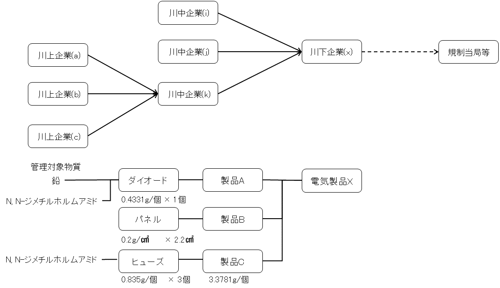

図 2‑15 サプライチェーンの机上検討

#### (c). 議論しているペインポイント

120. 　上述した化学物質管理の代表的なシナリオにおけるペインポイントを以下のとおりまとめ、各課題・ペインポイントについて議論した。

     -   営業秘密の保持：製品に含有する化学物質の情報は、各社の秘伝のノウハウや営業秘密など秘匿性が極めて高い情報も含まれる。そのため、川中企業が川下企業に情報を伝達する際に、川上企業に関する情報を明らかにせずに集計した情報を伝達することが多い。このような事情により、中央集権的なデータベースで各製品・部品に含有する化学物質情報を管理することには注意が必要である。

     -   開示範囲の制御：サプライチェーンにおける化学物質管理の現状では、企業間の契約による情報の提供が前提となっている。このような一対一の契約を前提としている場合、川上企業から川下企業へは川中企業を経由して開示することになるが、管理対象物質のリストは最終製品の種類ごとに異なるため、川上企業が川中企業に情報を開示する場合において、川上企業は川下企業の最終製品がわからず、開示対象の情報が最終製品の規制対象であるか（開示すべき情報であるか）どうかが不明である。このように、データの連続性・連鎖性が流通において途切れることで、適切に（必要十分な）情報の開示対象や開示範囲の制御が困難になっている。

     -   既存規制・新規制への対応：化学物質の含有量等はモノに紐付く情報であるが、サプライチェーンにおいては管理対象物質を集計した形で流通するため、新しい規制に対応するためには再度情報を収集する必要がある。

          製造現場の４M変更への追従：製造現場においては、４M（Man: 人、Machine: 機械、 Method: 方法、Material: 材料）の変更が常に行われている。しかし、上記シナリオのように、川下企業からの問い合わせにより管理対象物質の含有量を調査する方法では、これらの４M変更に対して情報の更新が行われず、モノとそれに紐付くデータである化学物質含有量の一貫性が失われ、信頼性が担保できないおそれがある。

     -   企業・データの識別子管理：企業や製品・部品、化学物質の識別子管理は各企業の内部的な独自の識別子（製品番号・部番等）を採用していることもあり、統一的な管理方法がない。また、採用している管理ソフトウェアのソフトウェアプロバイダに依存する面もある。加えて、化学物質の識別子は標準化団体・業界団体で規制に従い策定されている。そのため、規制外・管理外の物質は識別子が振られていないこともある。さらに、規制対象となる化学物質データは業界ごとに使用する化学物質が異なり、また法規制の変更によっても規制対象が変化するため、複数の規制リストとバージョンにより管理する必要がある。このように、同一の材料・部品でも最終的な規制により管理に使用する識別子の体系が異なるということが起こりうる。

     -   データの信頼性の担保：上記シナリオにおけるデータの集計や伝達においては、システム的・機械的に担保されているわけではない。そのため、仮にデータの集計を間違えたり、改ざんがあったりする場合にも検証できない。また、複社購入（複数の企業から同種の製品・部品を調達すること）を行っている場合もあり、部品の調達元ごとに管理対象物質を管理しきれない場合、それらの最大量を取るなどして、規制の目的を満たす最悪値を判断している場合もある。このため、規制は満たすものの情報としては正確性に欠くという問題もある。

#### (d). 本ユースケースにおける特異な点

121. 　本ユースケースの特異な点としては、営業秘密の保護や開示対象及び開示範囲の制御が必要である点が最も大きい。特に、川上企業から川中企業、川中企業から川下企業へと情報を伝達する際に、加工や組み立ての状況に従い、データを集計して伝達する。そのため、データの中身は集計後のものであり、また、流通過程におけるサプライヤー情報なども情報が中継される際に秘匿した形で伝達される。すなわち、開示範囲を制御し、連鎖性を秘匿しながら、その信頼性を担保したいという要求が、本ユースケースにおける特異な点である。

#### (e). 本ユースケースで抽出された検討すべき課題 

122. 　本ユースケースでは、中継によりデータが加工され、その通信履歴の開示範囲を制限しながら、データの信頼性を担保するような機能の検討が必要である。そこで、ここでは本ユースケースで必要となるエンティティ間の関係について検討する。この視点でエンティティ間の関係を整理したのが下記の図である。

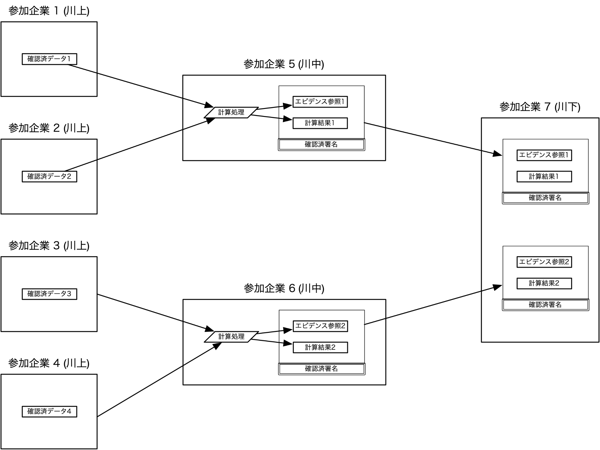

図 2‑16 化学物質の含有量の管理における机上検討

123. 　本ユースケースでは、川上企業と川中企業または川中企業と川下企業といった契約関係がデータのやりとりを行う通信路であり、開示範囲もこの契約関係のある間に制限されることが原則である。一方で、製品の加工や組み立ての状況に従い、受け取ったデータを集計（加工）して、次の通信先に送信する。このデータの通信経路において、データの中身は中継される際に加工され、元のデータとしては連鎖しておらず、また、通信経路も中継される際に秘匿される。このため、データを受け取った場合には、元のデータやサプライヤーの情報などの営業秘密にあたるものは秘匿できる。一方で、信頼性を検証する場合など、元データを確認する場合には、通信経路（開示範囲の順路）を逆にたどることで、元のデータまで確認することができる。

     　本ユースケースの要求事項から開示範囲の制御とデータの加工を行いながら、信頼を連鎖する仕組みを取り入れた機能をアーキテクチャに組み入れる必要がある。

### b.  ユースケース：炭素排出量トレース（DataGateway）

#### (a). 背景

124. 　温室効果ガスを巡る世界の動向として、脱炭素・カーボンニュートラルの実現に向けた取り組みが各国・地域で実施されている。炭素排出量の可視化や炭素税の導入、排出権取引など、様々な施策が議論されており、サプライチェーンにおいて炭素排出量を検証可能な状態でトレースできることが必要である。

図 2‑17 炭素排出量トレースのユースケース（DataGateway）

#### (b). 議論しているペインポイント

125. 本ユースケースで対象としている現在の炭素排出量の開示においては、以下の３つのペインポイントが挙げられている。

<!-- -->

     1.  アナログな計測による数値算出や転記、外部への開示等の作業が人力中心で行われているため、工数がかかるだけでなく、数値の客観性が担保できない。

     2.  第三者機関等外部の認証を通すことが少なく、各社独自基準の自社認証や団体ごとに異なる基準に依るため、相対的な評価ができない。

     3.  炭素排出量の計算のためにサプライチェーン上で機密情報に相当する情報を共有せざるを得ない。

#### (c). ユースケース実現による恩恵

126. 欧州規制の導入やカーボンクレジット市場が活性化した際に、一次データや改ざんされていない正確なデータの取扱いや開示が求められる可能性が高まる。

#### (d). プロトタイプ開発

127. 本ユースケースでは、ペインポイントに対して、以下の４項目に取り組んでいる。

<!-- -->

     1.  IoT機器を用いた計測された数値入力の自動化と客観性の担保

     2.  ブロックチェーンおよび分散型ストレージによる改ざん防止

     3.  リレーションシップクレデンシャル（VC）によるサプライチェーン上での情報共有およびトレーサビリティの実現

     4.  DIDと秘密計算による企業の機密情報に相当する情報の選択的開示

#### (e). 本ユースケースにおける特異な点

128. 本ユースケースにおける最も特異な点としては、サプライチェーン上で共有され、検証対象のデータ（炭素排出量）が機密情報に相当する情報であるため、元のデータを秘匿したまま集計し、共有したいという要求がある点である。また、サプライチェーン上の企業や従業員の関係を定義した上で、情報の公開範囲を管理（選択的開示）する点も特異である。

#### (f). 本ユースケースで抽出された検討すべき課題

129. 外部システムとなるIoT機器から取得する一次データを信頼するためには、センサーに対して改ざん防止の対策や、データの異常検知といった仕組みも併せて検討する必要がある。

130. 工場などのデジタル化が十分に進んでいない場合、データの検証可能性の向上やサプライチェーンにおけるデータ連携、トレーサビリティの仕組みは、事業者からメリットが見えにくく、コスト増につながることから、後回しにされてしまうため、強いインセンティブの設計が必要となる。

### c.  ユースケース：機械製品修理（ヤンマーホールディングス）

#### (a). 背景

131. 　機械製品のライフサイクルにおいて、修理履歴等の多くのデータが発生するが、これらのデータが適切に共有できないため局所的な利用に限定されており、十分に利活用されているとはいえない。本ユースケースでは、機械製品など工業製品のサプライチェーン上で発生するデータを対象として、機械製品のライフサイクルのうち、保守サービスにおける修理依頼シーンに着目し、安全なデータ共有の仕組みを検討した。

> 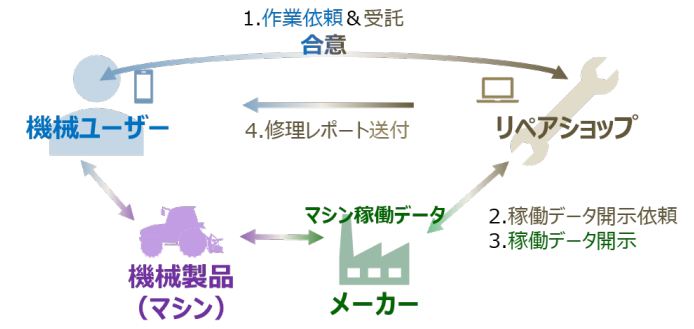

図 2‑18 機械製品修理のユースケース（ヤンマーホールディングス）

#### (b). 議論しているペインポイント

132. 　本ユースケースにおける機械製品のデータ蓄積およびその共有においては、データが安全に共有できる必要がある。データの利用者としてはデータの真正性、データの提供者としてはデータの開示範囲や利用範囲を限定できることが求められる。

#### (c). ユースケース実現による恩恵

133. 製品のトレーサビリティ強化により、不具合発生時の不具合工程の早期特定（品質・生産性の向上）、リコール対象製品の早期特定（リスク管理強化）、顧客への製品製造過程の情報の見える化（顧客からの信頼性の向上）などの効果が期待できる。

#### (d). プロトタイプ開発

134. 本ユースケースでは、メーカーが保有する稼働データを対象に、必要な範囲でデータを安全にリペアショップと共有することを目標としており、開示相手の選択には鍵ペア方式を用い、選択した相手のみがデータを閲覧可能とし、データのダウンロードについては閲覧に限定する方式とした。

135. また、特にマシン署名検証により、開示先の正当性だけでなく、開示依頼の正当性も検証した上で適切に条件を設定しデータを開示できる。

136. モノである機械製品にアイデンティティを付与しているが、モノは責任主体とはなり得ないため、責任主体としてユーザとの紐付けを行い、その本人確認を販売会社が行う仕様とした。そのため、機械製品のオーナー変更や盗品等の不正対象品の修理依頼の防止、リペアショップによるデータ不正要求の防止などにも対応できる。

137. アイデンティティの発見には「機械製品とメーカー」、「機械製品ユーザと機械製品」、「機械製品ユーザとリペアショップ」、「リペアショップとメーカー」の4つの関係者間において整理した。

     -   機械製品が他のアイデンティティを発見する方法：機械製品出荷時にメーカーとの Pairing（出荷手続きの一部）を行うことで、メーカーのDIDを発見し、機械製品販売時に機械製品ユーザとのPairing（販売手続きの一部）により、他のアイデンティティを発見する。

     -   機械製品ユーザが他のアイデンティティを発見する方法：上記、機械製品販売時におけるPairingと、機械製品ユーザがアプリ経由でリペアショップを選択（リペアショップのDIDを取得）することで発見する。

     -   リペアショップが他のアイデンティティを発見する方法：メーカーのDIDはリペアショップのアプリに初期登録し、機械製品ユーザのDIDは修理依頼データに含むことでこれらのアイデンティティを発見する。

     -   メーカーが他のアイデンティティを発見する方法：メーカーはリペアショップからの開示依頼データに含まれるリペアショップのDIDにより発見する。

#### (e). 本ユースケースにおける特異な点

138. サプライチェーンにおいては、エンティティ間の関係は相対的なものであり、テータの提供者と利用者がエンティティとして区別されず、どのエンティティもデータの提供者にも利用者にもなり得る。各プレーヤーは互いに相対的な関係にあり、誰もがデータの提供者にも利用者にもなって、互いにデータをやり取りする必要がある。

139. 本ユースケースでは、これらのエンティティ間の関係を定義しており、モノと人（自然人・法人）との関係はPairingを用い、人同士の関係はアプリの登録時の本人確認により解決を試みる点が特異であるといえる。

#### (f). 本ユースケースで抽出された検討すべき課題

140. 自然人・法人とは異なり、モノには意思がなく単独では責任主体になりえないため、本ユースケースではモノのアイデンティティに対し、意思主体である機械ユーザを関連付ける必要があると考えた。責任主体との関連付けがなければ、そのモノ自体のアクションの正当性が問われるケースなどが想定されうる。モノのアイデンティティの取扱い方について考え方の整理が必要である。

141. トレースにおいて、当事者間のトレースのみのケース、第三者におけるトレースを必要とするケースなど、誰を主体としてトレースを行うのか、また、第三者へのアクセスコントロールも検討が必要である。

### d.  ユースケース：ITシステム品質保証（アラクサラネットワークス）

#### (a). 背景

142. ITインフラ調達と運用におけるサプライチェーンセキュリティ[^29]、機器真正性セキュリティ[^30]、運用セキュリティ[^31]（含む脆弱性セキュリティ）の向上は、社会課題となっている。

143. ITインフラの調達取引において、各IT機器の調達・利用者（事業者）の独自かつ個別な情報収集や取組によって個々のベンダやインテグレータを信頼することで取引が成立している。事業者個別の情報収集には事業者個別にコストが発生し、ベンダやインテグレータの情報提供にも個別のコストが発生している。

144. 一方、サプライチェーンを標的としたサイバー攻撃のリスクが増大しており、今般制定された経済安全保障推進法[^32]において、基幹インフラ業種で導入する重要設備（IT機器を含む）の事前審査を受けることが事業者に義務付けられているが、IT機器の安全性を担保するための信頼できる情報をサプライチェーン全体に渡って、どのように確認・検証するのか、技術と業界全体での取組体制が確立していない。

図 2‑19 ITシステム品質保証のユースケース（アラクサラネットワークス）

#### (b). 議論しているペインポイント

145. 事業者は、IT機器の使用部品やソフトウェア脆弱性対応、リスクスコアリングに関して、信頼性・安全性に関する情報を提供する仕組みが存在せず、確認することができない。

146. さらに、ソフトウェア／ハードウェア改ざんの一律的な自律検知やセキュリティ運用連携の仕組みは確立されておらず、運用中のIT機器に脆弱性が生じていないか、発覚していないかを確認するためには、サプライチェーンをさかのぼって製品の構成情報を入手する必要がある。

147. また、IT機器、部品、ソフトウェアのベンダ、インテグレータごとに対応する場合のコストは膨大となる。

#### (c). ユースケース実現による恩恵

148. サイバーセキュリティが引き起こす経済損失は6,000億ドルから22.5兆ドルと言われており、日本国内でも1社あたり数億円の損失と算出[^33]されている。そのため、サイバーセキュリティが引き起こす損害を補償するサイバー保険も出てきている。製品のサプライチェーンにおける脆弱性情報やリスクスコアリングを実施することで、企業としてサイバーセキュリティ対策への取り組みを示すことで、サイバー保険料の高騰を抑える可能性がある。

#### (d). 本ユースケースにおける特異な点

149. OSSを含むSoftware Bill of Materials（SBOM）やOEM製品などのIT機器やサイバーセキュリティ対策において考慮すべきサプライチェーン全体を取り扱っている点が、本ユースケースにおける特異な点である

#### (e). 本ユースケースで抽出された検討すべき課題

150. アーキテクチャにおいて、トランスポート層を実装の対象とすると、非オープンな実装となり、他業界や越境における相互接続の課題があり、OSI参照モデルの複数層にまたがるオーバーレイとなるのか、目的や用途に応じたオーバーレイとするかという指針が必要である。

151. Trusted Webにおける検証可能性の拡大が、「事前検証性」や「事後検証性」をカバーするのか、その場合は任意かどうかの方針を検討するべきである。

152. グローバル・サプライチェーンにおいて、二者間のデータのやり取りは越境を前提とするため、相互接続性や標準化といった観点で検討すべきである。

## (7). 「IoT」の属性情報のやりとり

### a. ユースケース：複合機(MFP:Multifunction Peripheral)（東芝テック）

#### (a). 背景

153. 新型コロナウイルス感染拡大の影響によって、テレワークや、働き方改革の推進による時短勤務やフレックスタイム制など、多様な働き方が普及した。こうした中で、企業にとっては、従業員がどこにいても業務に支障が出ないテレワークの環境整備が急務となっている。

154. 一方で、真正性を求められる文書を扱う経理部門や特定の業種業務では、未だ紙を基本としたアナログ業務が存在する。 紙で管理される文書を電子化した際には、「電子帳簿保存法」（1998年7月施行）、「e-文書法」（2005年4月施行）にて、真正性の担保が求められる。対象となる文書は、国税関連書類、会計帳簿、証憑書類（見積書・納品書・請求書・契約書など）など対象は多岐にわたる。このため、テレワークの環境整備には、これらの文書を扱う業務において、紙の文書を電子化し、管理する仕組みを整備する必要がある。

155. 文書管理業務のデジタル化を従来の仕組みで実現する場合、スキャン機能を搭載したデジタル複合機（以下 MFP）を利用して電子化した後、文書管理システムへ送信し、保管、利用することが一般的である。真正性が求められる文書において、上記の仕組みを実現するために、特定MFPデバイスからスキャンされた電子化文書の真正性を担保する仕組みを検討する。

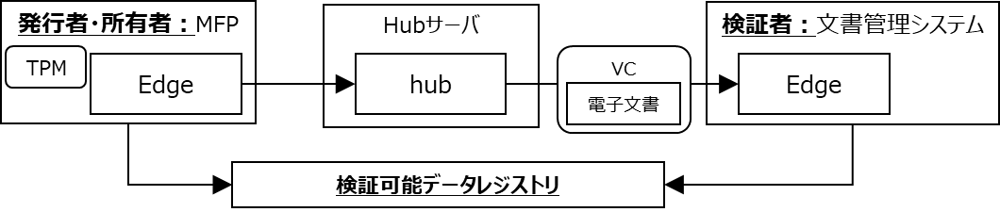

図 2‑20 複合機(MFP)のユースケース（東芝テック）

#### (b). ペインポイント

156. 本ユースケースにおけるペインポイントを取りまとめ、下記に列挙する。

     -   検証可能なデータ流通: MFPからスキャンされた電子化文書の保管に際し、真正性を保つことが要件であるため、特定のMFPでスキャンされて以降、改ざんがされておらず、当該MFPでスキャンされた文書であることが検証可能な仕組みを実現する必要がある。 この場合、通信経路上または文書管理システム上に保管された電子化文書を改竄されるリスクが存在し、改ざんされた場合、検知可能である必要がある。

     -   デバイスの高度な認証・認可: 上記検証可能なデータ流通を実現するためには、MFPおよび送信先となる文書管理システムの認証・認可をする必要がある。この場合、MFPに対して暗号鍵をインストールするなどのプロビジョニング（初期設定）を行う必要があり、MFPのメーカー視点では、プロビジョニングのためのコストが課題となる。また、　MFPを識別し、MFPを認証するための暗号鍵等を、安全に保管し運用する必要がある。

#### (c). ユースケース実現による恩恵

157. 文書管理に特に高い真正性が求められる金融・保険、会計監査、防衛システムの開発と製造に関する請負業者、行政機関の4つのセグメントにおいて、120万台の導入余地があり、2,400億円程度の市場規模が見込まれる。

#### (d). プロトタイプ開発

158. 本ユースケースにおいては、MFPおよび文書管理システムをエンティティとして捉え、MFP中のTPM[^34]上で保管される秘密鍵を用いてVerifiable Credentialsの形式でスキャンした電子化文書を送信するプロトタイプを開発した。プロビジョニング[^35]にはTPM上で生成された秘密鍵とDecentralized Identifiersを活用することで、認証局から公開鍵証明書を取り寄せて手動でインジェクションする工程の自動化を達成した。これにより、電子化文書にデジタル署名を付与し、スキャン以後の改ざんの検知が可能な仕組みを実現した。また、送信する際には文書管理システムとMFP間で相互に認証し、当該MFPおよび文書管理システム間で安全な通信路を確保することを実現した。

#### (e). 本ユースケースにおける特異な点

159. 本ユースケースでは、MFPおよび文書管理システムという、自然人/法人ではないIoTデバイスおよびシステムが主体であることが、特異な点として挙げられる。「4. Trusted Webが目指すべき方向性」における、「ユーザ（自然人又は法人）自身が自らに関連するデータをコントロールすることを可能と」する試みとして、ユーザが操作するデバイスおよびシステムを起点として検証可能性が拡大する取組と捉えられる。また、「データのやり取りにおける合意形成の仕組み」の実現については、電子化文書の送信時に、都度合意形成を行うのではなく、規定されたプロトコルや送信の設定に従って動作するものと考えられる。したがって、「合意の履行のトレースを」に関しても、IoTデバイスやシステムのみで完結する機能としては成立せず、MFPのメーカーや本スキームを導入する企業といったスキームの提供者および運用者間での契約関係等に基づいた機能の実現が必要である。

#### (f). 本ユースケースで抽出された検討すべき課題

160. 本ユースケースでは、自然人/法人ではないIoTデバイスやシステムが主体であるため、「データのやり取りにおける合意形成の仕組みを取り入れ、その合意の履行のトレース」に関しては主体上に実装されるシステムやプロトコルのみで実現されるものではないことが明らかになった。一方で、IoTデバイスやシステム自体がそれぞれ自律して動作するとしても、それぞれのスキームの提供者や運用者が存在する。したがって、システム外で行われる契約関係等によってそれぞれの機能に準じた対応が可能であろうことも議論された。 すなわち、Trusted Webの目指すべき方向性は技術的な解決策のみならず、導入にかかるスキーム提供者と運用者間の合意や運用自体のガバナンス等で複合的な取り組みによって実現されることが明確化された。

161. 技術的に検証可能性を担保できる項目と、できない項目の整理は各ユースケースの目的毎に異なることが考えられる。したがって、個別のユースケースにおける目的に沿って効果的にTrusted Webを実現するためには、対象のデータおよびエンティティの関係性を整理しながら技術的に検証可能な範囲を拡大しつつ、検証ができない範囲に関してはガバナンス等によって整備する等の議論をすることが重要である。

## (8). ユースケースの課題と示唆

162. 2021年度の机上検討を踏まえ、ホワイトペーパー ver.1.0が改訂された。その上で、2022年度のユースケース実証では、ver.2.0で示されたアーキテクチャや構成要素に対する考え方に対して、改善すべき事項、見直すべき事項などを抽出した。例えば、アーキテクチャやガバナンス、セキュリティなどを検討する論点として、エンティティ、トレース、合意形成の範囲の具体化、ウォレットと秘密鍵等といった示唆が抽出された。この節ではこれらについて、実証事業に参画した事業者からのご意見とともに、協議会やタスクフォースでの議論を踏まえて提起されたものを含め、述べることとする。

### a. ガバナンス

163. ユースケース実証において、技術検証に重点を置いていた事業者が多く、その中でIssuerの信頼性が検討課題としてあげられており、テクノロジーとガバナンスの両輪で進めていくことの重要性が示唆された。「2(2)b.  ユースケース：学習歴（東京大学、富士通Japan）(f)」

164. 特に、組織、業界を横断してトラストデータを流通させるために、トラストフレームワークが重要であり、「DNPのユースケース（共助アプリにおけるプラットフォームを超えたユーザトラストの共有）」では、先行して取り組んでいるGAINやOIXの取り組みなどを参照している。その上で、各ステークホルダーや業界において守るべきルールが順守されているかといった監視の仕組みも検討してはどうか。

165. Issuer/Holder/Verifierのエンティティが存在するモデルにおいては、それぞれの信頼性の構築が重要である。主にユースケース実証からは、証明書の発行者であるIssuerの信頼を構築するために、認定資格の審査やマネジメントプロセスのもとでの付与や、ユーザ間での評価や評判に基づいた信頼度の構築「2(2)b.  ユースケース：学習歴（東京大学、富士通Japan）(f)」が必要といった提言が得られた。

166. そして、Issuerの信頼だけでなく、HolderになるWalletの信頼やVerifierの信頼を構築するという観点で、Verifierからの証明書の提示依頼に対して、Holderはどのような信頼をもってアクセプトするかという観点も考慮すべきである。

167. また、検証における「申請者とエビデンスが示す対象との当人性検証」は、VC単体では成立しないというHolder Bindingの観点があげられた。

168. そして、DNSドメインが当該機関であることを示す仕組みを信頼の起点とする場合と、業界におけるガバナンスの下でメタデータをTrust Listとして管理、運用するといった段階があり、詳細は実装編にて記述する。

### b.  Issuerのインセンティブ

169. 発行者のインセンティブの設計が必要であり、発行者が提供するアプリケーションに対して発行する場合、双方向での通信や、プッシュ通知、または利用履歴といった情報が取れる等のメリットがあるが、事業をまたいだ共通のウォレットアプリケーションに発行する場合に、発行者側が得られる情報や、提示したことによるベネフィットの考慮がないと各社独自ウォレットを開発してしまうという事例がある。

### c.  エンティティとしての法人

170. エンティティが法人の場合に、申請者が、代理人（社員等）の場合があり、法人自体の実在性確認に加え、所属証明や権限の委譲といった仕組みの検討が必要である。

171. また、法人のユースケースにおいて、証明書を格納するウォレットにあたるものは、複数の従業員によって共同利用される場合がある。その際、従業員に対する権限のコントロールや代理、委任といった役割の違いの考慮が必要である。また、実装方式として、スマートフォンのネイティブアプリケーションがよいか、クラウド上のウォレットがよいかといった論点が考えられる。

### d.  トレース

172. データ受領者がスクリーンショットや印刷、ダウンロード等によりコピーされることは避けがたく、データが再利用されているのか、合意範囲外に利用されていないかはコントロールできないため、ガイドラインを含めた検討が必要である。「2(4)a. ユースケース：臨床データ、ヘルスケアデータ（シミック、ORPHE）(f)」。なお、この点については、ホワイトペーパーver.2.0において「合意形成を伴わずに移転された場合は、トレースは困難である」という整理をしている。

### e.  合意形成の範囲の具体化

173. 自然人ではなくIoT機器を主体とする場合、Trusted Webの目指すべき方向性である合意形成やトレースはガバナンスによって担保される領域も多く、技術的な解決策とガバナンスの領域を明確に分離して議論することが望ましい。「2(7)①ユースケース：複合機(MFP:Multifunction Peripheral)（東芝テック）(f)」

### f.  アーキテクチャのわかりやすさ

174. ホワイトペーパーver.2.0で提唱されたアイデンティティグラフに関して、事業者が執筆する上で、アイデンティの種別（自然人やシステム等のエンティティに対するアイデンティティ）の例示やグラフとして記載する目的を示すことが望ましい。

175. 次に、Trusted Web ver.2.0で示されたオーバーレイアプローチについて、OSI参照モデルのトランスポート層を通信効率の観点から検討するとしていたが、実際にトランスポート層を検討した事業者は存在せず、事業者の混乱を招いていた。この点については、トランスポートの位置づけに対する考え方等について、実装編にて記載することとする。「2(6)④ユースケース：ITシステム品質保証（アラクサラネットワークス）(e))」

176. さらに、類似プロジェクトがTrusted Webのアーキテクチャを満たしているのか、満たさない場合に要件を示すべきという示唆があった。この点については、アーキテクチャは仕様書ではなく、具体的な技術スタックを示すものではないが、アーキテクチャの位置づけについては、再度整理の上、実装編にて記載する。また、上記のような示唆に対応するため、Trusted Webの目指すべき方向性を実現するための実装の指針を示すことは有用であり、実装ガイドラインを策定することとした。

### g. ウォレットと署名鍵

177. Trusted Webで議論しているアイデンティティを扱うウォレットにおいて、デバイス上に署名鍵を安全かつ適切に保護する方法、ユーザがデバイスを紛失した際における署名鍵の復旧方法等の鍵のライフサイクル管理が重要であり、どのように運用されるべきであるかを整理する必要がある。

### h. Trusted Webの今後の普及

178. Trusted Webの今後の普及においては、Issuer/Holder/Verifierの各エンティティにおけるメリット、既存の仕組みからシフトしていくプロセスのイメージ、今後のロードマップなどが示されることが必要である。

179. ユーザ側からはTrusted Webのメリットが見えにくいため、具体的にどのような実益をもたらすか、また、わかりやすいUI/UXの検討することで、各ステークホルダーからなるバリューチェーン全体でのWin-Winの構造をユースケースごとに作り上げる必要がある。「2(2)b.  ユースケース：学習歴（東京大学、富士通Japan）(f)」

180. 実装ガイドラインに以下を示すことで、ユースケースからのフィードバックを得ることが出来る。

     -   Trusted Webの仕組みによってどこが検証可能になったか

     -   既存システムから段階的に移行する上での注意点

     -   ミドルウェアが持つべき機能

181. また、ガバナンス面も既存の諸制度や認証制度の担い手がどのような役割を果たし得るのかといった整理が必要となる。

[^1]:
    > https://www.kantei.go.jp/jp/singi/digitalmarket/trusted_web/pdf/trustedweb_appendix.pdf

[^2]:
    > https://www.kantei.go.jp/jp/singi/digitalmarket/trusted_web/2022seika/index.html

[^3]:
    > 開発したプロトタイプは以下のリポジトリにて公開されている。
    >
    > https://github.com/TrustedWebPromotionCouncil/

[^4]:
    > 本件のプロトタイプではIPFSを利用したが、Trusted Webにおけるデータの保管場所はIPFSのみを想定しているものではなく、データの保管場所としては様々な実現方式がありうる。

[^5]:
    > Hierarchical Deterministic Wallets（階層的な決定論的ウォレット）。コインを使用する機能の有無にかかわらず、さまざまなシステムと部分的または完全に共有できるウォレットを指す。

[^6]:
    > FIDO 認証の機能の一部をマイクロサービス化したもの

[^7]:
    > 人間を模した操作や作業を行うソフトウェアやシステムのこと。本ユースケースではサイト閲覧者（人間）を装いWebサイト・広告の不正な閲覧数を増加させるものを指す

[^8]:
    > https://bit.ly/3B2aEi9

[^9]:
    > Originator Profile 技術研究組合によって仕様策定が行われている情報の発信者や流通経路を検証可能にする技術、およびその証明書のことを指す。 （https://originatorprofile.pages.dev/ja-JP/ )

[^10]:
    > https://www.mhlw.go.jp/content/10808000/001102570.pdf

[^11]:
    > デジタル技術を活用し、病院に来院することなく患者の自宅など遠隔地で実施する臨床試験等のこと。

[^12]:
    > 個人の健康・医療・介護に関する情報のこと。

[^13]:
    > 医療機関が患者の既往歴、病態把握に必要な各種検査の結果（医用画像も含む）、医師の所見と診断を記録する診療録、処方箋（オーダー情報）などを電子的に記録・管理するしくみのこと。

[^14]:
    > DIDによって関係者同士が信頼できる相手方であることを確認し、データの受け渡しをするために相互接続を確立すること

[^15]:
    > ユーザ（患者）とパートナー（医療機関・製薬会社等）の両方にDIDを発行し一連の双方の関係性を規定した証明書

[^16]:
    > Clinical Data Interchange Standards Consortium　<u>https://www.cdisc.org/ja/standards/foundational</u>

[^17]:
    > Digital Imaging and COmmunications in Medicine　https://www.dicomstandard.org/

[^18]:
    > Health Level Seven　http://www.hl7.jp/whatis/

[^19]:
    > 2 つの DID が互いに信頼している状態

[^20]:
    > <https://jigyou-saikouchiku.go.jp/>

[^21]:
    > OpenID等の標準を用いたシステムや、DID/VCといった技術を用いた実装などが考えられる。

[^22]:
    > VC Data ModelのHolder act on behalf of the subjectにおいては、証明書発行者または対象者が、所有者と対象者との関係を表現したプロパティや、新しいVerifiable Credentialsを発行する仕様を示している。https://www.w3.org/TR/vc-data-model/#holder-acts-on-behalf-of-the-subject

[^23]:
    > OpenID Connect for Identity AssuranceのAuthority Claims Extensionでは、自然人と他の自然人または法人との関係を信頼できる方法で伝達するため、自然人が法人に対して持つ関係や関係の詳細、また自然人が別の自然人に対して持つ関係やその関係の詳細がどのように確立されたかについての仕様を示している。https://openid.bitbucket.io/ekyc/openid-authority.html

[^24]:
    > 紙での確定申告書の控えの収受日押印済のもの、あるいは申告に対するe-Tax受信通知が該当。

[^25]:
    > ここでの「強く依存しない」は、認証認可などのその時点での有効性確認が極めて重要な場面ケースと異なり、書類を提供する組織から直接受領して、その場で当該書類の有効性を確認することを行わないユースケースを想定している。

[^26]:
    > 民間団体が担う行政機関の代行手続きは、行政文書と扱われておらず、政策税制は制度の内容が概ね２年毎に変更される等実態から固まった仕様でのシステム環境整備が困難である。

[^27]:
    > Evidence-BasedPolicyMaking証拠に基づく政策立案

[^28]:
    > 10～20万円程度の報酬を想定し、A類型以外の申告件数より算出。

[^29]:
    > ベンダが製品を提供するために調達するハードウェア（部品）やソフトウェアのトレーサビリティを管理し改ざんを防止・保証するための仕組みや、インテグレータがシステムを提供するために調達した製品のトレーサビリティを管理し改ざんを防止・保証するための仕組み、そして事業者がサービスを提供するために調達するシステムのトレーサビリティを管理し改ざんを防止・保証するための仕組み。

[^30]:
    > 機器を構成するハードウェアとソフトウェアに改ざんが無いことを担保するための仕組み。

[^31]:
    > サービスの運用において、サービスを構成する機器の脆弱性と機器へのサーバーセキュリティ攻撃及び不正アクセスを管理しデータを保全することで、サービスの安定と永続的な提供を確保するための仕組み。

[^32]:
    > https://www.cao.go.jp/keizai_anzen_hosho/

[^33]:
    > https://www.soumu.go.jp/johotsusintokei/whitepaper/ja/r01/html/nd113320.html

[^34]:
    > Trusted Platform Module

[^35]:
    > ネットワーク環境に合わせてセットアップすること
