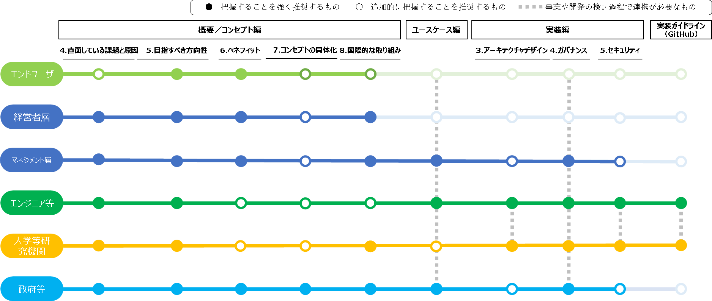
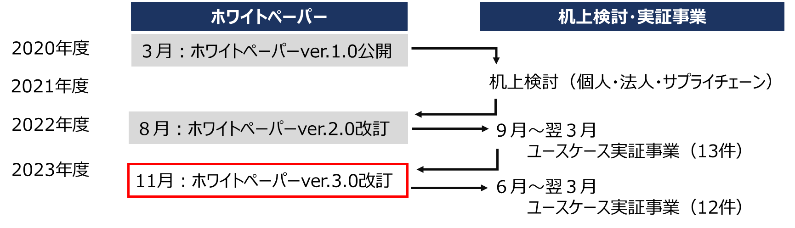
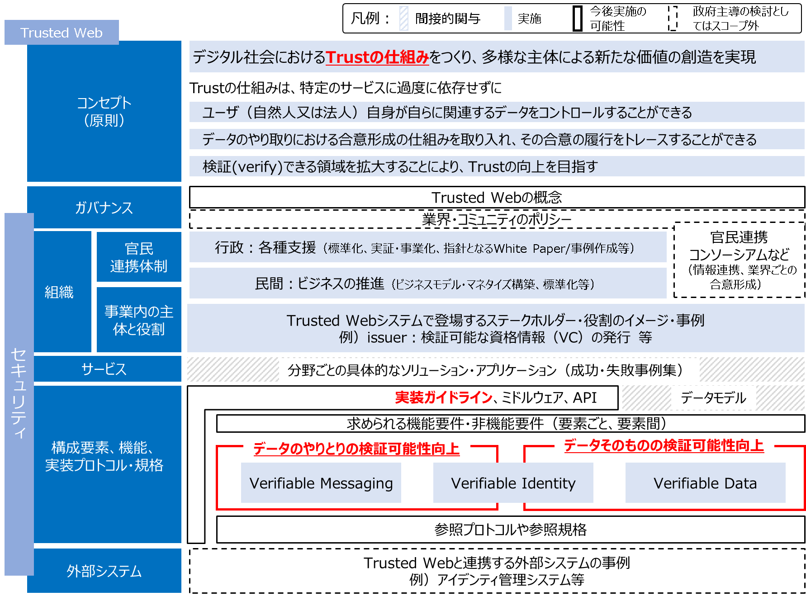
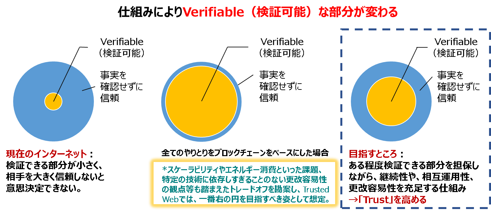
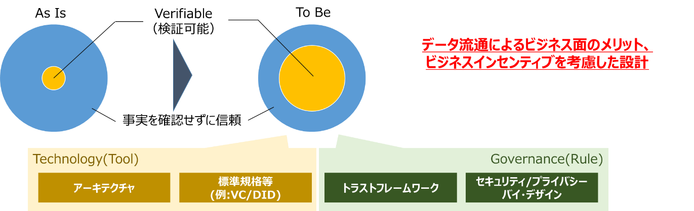
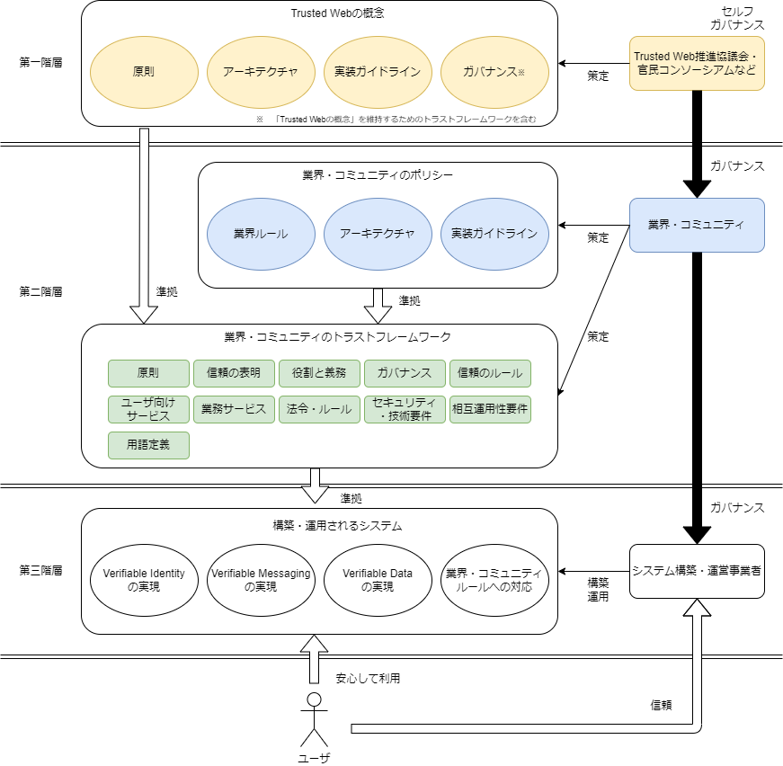
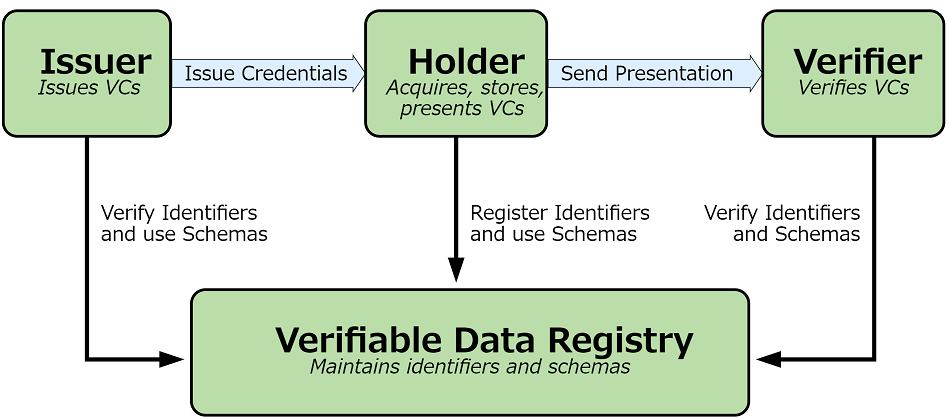

| **TRUSTED WEB WHITE PAPER DRAFT** |
| --- |

Trusted Web ホワイトペーパー
概要／コンセプト編
===
Ver3.0
2023年12月04日
Trusted Web推進協議会

# Trusted Web White Paper ver.3.0 Executive Summary

1.背景

1. フェイクニュースや生成AIによる偽情報など流れるデータの信頼性への懸念やそれに伴う社会の分断、プライバシー侵害リスク、勝者総取りに伴う特定サービスへの過度な依存、サイロ化した産業データの未活用など、デジタル化の中で様々なペインポイントが生じている。

2. 「デジタル社会」への移行にあたり、現行のインターネットやウェブでは、社会活動において求められる責任関係や安心を十分に体現できておらず、Trustの再構築が不可欠。

3. これまでのTrustの仕組みでは、データのやり取りにおいて検証できる領域が狭く、事実を確認せずに、プラットフォーム事業者等を信頼せざるを得ない状況。

4. こうした中で、内閣官房デジタル市場競争会議において、“Trusted Web”の構想が提唱され、2020年10月に産学の専門家からなる「Trusted Web推進協議会」が発足。コンセプトの提示・具体化とユースケースからのフィードバックを繰り返しつつ、国際的な動向も踏まえながら議論が進められてきた。

2.Trusted Webとは何か

5. Trusted Webは、特定のサービスに過度に依存せずに、個人・法人によるデータのコントロールを強化する仕組み、やり取りするデータや相手方を検証できる仕組み等の新たな信頼の枠組みを構築するイニシアティブである。

6. これにより、「デジタル社会」における様々な社会活動に対応できるTrustの仕組みを、一定のガバナンスや運用面での仕組みとそれを可能とする機能を付加していくことにより形成し、多様な主体による新しい価値の創出を実現することを目指す。

7. また、Trusted Webによるデータのやり取りにおける信頼の仕組みの構築は、様々な主体が業種や部門を超えて協創することが求められるデジタル・トランスフォーメーション（DX）を進めるに当たって、その前提となる「事業者間連携」を円滑にする上でも極めて重要な取組であり、ひいては、DFFTの具体化にも資するものである。

3.実現に向けた道筋

8. 実証事業等を通じて、様々なユースケースを創出し、内外の関係者と共有し議論を重ねることによって、Trusted Webの目指すべき方向性に沿った取組を通じた新たなビジネスの創出につなげるとともに、国際連携を推進する。

9. Trusted Webが目指す仕組みを具現化する様々なサービスが提供され、その利用領域が拡大。その過程において、既存のTrustを向上させる仕組みも活用しながら、共通化すべきAPIやデータモデル、プロトコルが特定されていく。それらが共通化されることで相互運用性の確保、標準化につながり、Trusted Webが具現化されていくことが期待される。

4.ホワイトペーパーver.2.0（2022年８月公表）からの進展

10. 2022年度「Trusted Web共同開発支援事業」等を通じて、民間事業者等による様々なユースケースの具体化が進みつつある中、そこで示されたベネフィットや課題を共有し、企業における自社のビジネスとの接点を見出すための材料を提供、ビジネス創出につなげる。

11. Trusted Webを実装していく上で必要なプラクティスや実現方式の整理等を行うことで、エンジニア等が具体例を把握し、相互に議論し更新しながらサービス開発に活用していく場をGitHub上に構築し公開。

12. 実証事業におけるプロトタイプ開発からのフィードバックを踏まえ、アーキテクチャを再構築するとともに、それを車の両輪として支えるガバナンスのあり方を提示。

> 本ホワイトペーパーをお読みいただくに当たってのガイダンス

13.  本ホワイトペーパーは、エンジニアや大学等研究機関にとどまらず、DXに取り組む産業界の関係者、政策立案に携わる関係者など幅広い読者層にお読みいただくことを期待している。このため、バックグラウンドや視点の異なる読者層のご関心の違いに応じて読みやすい形とするよう、本ホワイトペーパーver.3.0は、「概要／コンセプト編」「ユースケース編」「実装編」の３つとし、同時にGitHub上で「実装ガイドライン」も併せて公開することとした。

14. 「概要／コンセプト編」では、直面している課題やTrusted Webの考え方の大枠を理解いただき、Trusted Webの目指すべき方向性に沿った取組を展開していただくきっかけとなることを目的としている。このため、経営層を含めた産業界の関係者、エンジニアなど技術バックグラウンドをお持ちの方、ユーザーなど幅広い読者層にお読みいただくことを想定している。

15. 「ユースケース編」では、プロトタイプの開発を含め、これまでに民間企業や大学関係者などによって取組が進められてきたユースケースを紹介している。主に産業界の関係者が、これらのユースケースの具体例から自らのビジネスとの接点を見出し、Trusted Webの目指すべき方向性に沿った取組を通じて新たなビジネスの創出に繋げていただくことを目的としている。

16. 「実装編」では、エンジニアや大学等研究機関の方が構想を具現化するに当たって、実装時に必要な機能やガバナンス、守るべきセキュリティ要件を示すことで、ビジネスへの展開などにおける実装面でのガイドを示すことを目指している。併せて、アーキテクチャの検討を深化させ、様々なモジュール・サービス等の開発や国際標準化を推進していただくことを目的としている。

17. また、前述の３つの編とは別に、GitHub上に公開[^1]している「実装ガイドライン」については、エンジニアや大学等研究教育機関といった関係者が具体的な実装例を把握し、相互に議論し更新しながらサービス開発に活用していく場となることを期待している。

18. このように、今般、公表するホワイトペーパーver.3.0は、これまでに取り組まれてきたユースケースやそれを踏まえた様々な議論から得られたビジネス上の知見、実装上の知見を幅広く提供することにより、経営層を含む産業界の関係者、エンジニアや大学関係者等の皆様が、Trusted Webの考え方に賛同いただき、自らのビジネスなどにおいて取組を進めていただくための様々なツール、土台を提供することを目指すものとしている。幅広い関係者にご活用いただき、取組が広がっていくことを期待している。

19. 最後に、読者に応じて特に把握いただきたい点等を下記図1でお示ししているので、お読みいただく際に活用いただきたい。

図 1読者に応じて特に把握いただきたい点

- [概要／コンセプト編](#概要コンセプト編)
- [Trusted Web White Paper ver.3.0 Executive Summary](#trusted-web-white-paper-ver30-executive-summary)
- [1. 検討の背景とこれまでの検討経緯](#1-検討の背景とこれまでの検討経緯)
  - [(1). 検討の背景](#1-検討の背景)
  - [(2). これまでの検討経緯](#2-これまでの検討経緯)
  - [(3). ホワイトペーパーver.3.0の全体像](#3-ホワイトペーパーver30の全体像)
- [用語定義](#用語定義)
- [3. 直面している課題とその原因](#3-直面している課題とその原因)
  - [(1). 直面している課題（ペインポイント）](#1-直面している課題ペインポイント)
    - [a.  流れるデータに対する懸念](#a--流れるデータに対する懸念)
    - [b.  プライバシーに対する懸念](#b--プライバシーに対する懸念)
    - [c.  プライバシー保護と公益とのバランス](#c--プライバシー保護と公益とのバランス)
    - [d.  サイロ化した産業データが活用しきれない](#d--サイロ化した産業データが活用しきれない)
    - [e.  勝者総取りなどによるエコシステムのサステナビリティへの懸念](#e--勝者総取りなどによるエコシステムのサステナビリティへの懸念)
    - [f. ガバナンスの機能不全](#f-ガバナンスの機能不全)
  - [(2). ペインポイントをもたらしている原因・背景](#2-ペインポイントをもたらしている原因背景)
    - [a.  インターネットとウェブの成り立ち](#a--インターネットとウェブの成り立ち)
    - [b.  生じている様々な歪み](#b--生じている様々な歪み)
    - [c.  今後における懸念と方向性](#c--今後における懸念と方向性)
- [4. Trusted Webが目指すべき方向性](#4-trusted-webが目指すべき方向性)
  - [(1). 目指すべき方向性](#1-目指すべき方向性)
  - [(2). 必要となる原則](#2-必要となる原則)
- [5. Trusted Webのもたらすベネフィット](#5-trusted-webのもたらすベネフィット)
  - [(1). Trusted Webの産業全体にとっての意義](#1-trusted-webの産業全体にとっての意義)
  - [(2). 企業にとってのベネフィットと期待される役割](#2-企業にとってのベネフィットと期待される役割)
  - [(3). Trusted Webのエンドユーザーにとってのベネフィット](#3-trusted-webのエンドユーザーにとってのベネフィット)
  - [(4). ユースケースにおいて示されたベネフィットなど](#4-ユースケースにおいて示されたベネフィットなど)
    - [a.  個人のキャリアに関する履歴データに関するユースケース](#a--個人のキャリアに関する履歴データに関するユースケース)
    - [b.  サプライチェーンに関するユースケースの解説](#b--サプライチェーンに関するユースケースの解説)
  - [(5). 企業の取組の促進に向けて　](#5-企業の取組の促進に向けて)
- [6. Trusted Webのコンセプトの具現化](#6-trusted-webのコンセプトの具現化)
  - [(1). テクノロジーとガバナンスの両輪による具現化](#1-テクノロジーとガバナンスの両輪による具現化)
  - [(2). アーキテクチャについて](#2-アーキテクチャについて)
  - [(3). ガバナンスについて](#3-ガバナンスについて)
  - [(4). ユースケースから得られた示唆について](#4-ユースケースから得られた示唆について)
- [7. 国際的な取組について](#7-国際的な取組について)
  - [(1). 海外連携の推進](#1-海外連携の推進)
  - [(2). 国際標準化組織の連携について](#2-国際標準化組織の連携について)
- [8. 今後の取組について](#8-今後の取組について)
  - [(1). 今後の課題](#1-今後の課題)
  - [(2). 検討にあたっての視点](#2-検討にあたっての視点)
  - [(3). 今後の道筋](#3-今後の道筋)
  - [(4). 今後の協働において各ステークホルダーに期待する役割](#4-今後の協働において各ステークホルダーに期待する役割)
  - [(5). Trusted Web推進協議会の今後の活動](#5-trusted-web推進協議会の今後の活動)

> 　

# 1. 検討の背景とこれまでの検討経緯

## (1). 検討の背景

20. 昨今、データやデジタル技術の活用が急拡大し、特に、COVID-19を契機に「ニューノーマル」の時代を迎え、社会全体のデジタル・トランスフォーメーションに向けた動きが一層加速している。

21. こうした中で、様々な課題も顕在化してきている状況を踏まえ、デジタル市場競争の観点から検討を行っている内閣官房デジタル市場競争会議では、サイバーとフィジカルが高度に融合するSociety5.0におけるデジタル市場の在り方について、中長期的な観点から検討を行い、2020年６月、「デジタル市場競争に係る中期展望レポート」（以下「中期展望レポート」という。）をとりまとめた。

22. この「中期展望レポート」においては、デジタル市場の目指すべき姿として、“一握りの巨大企業への依存”でも、“監視社会”でもない第三の道として、

   - 多様な主体による競争

   - 信頼（Trust）の基盤となる「データ・ガバナンス」

   - Trustをベースとしたデジタル市場
   の実現を目指すとの提言がなされた。そして、その実現の一つの方策として、「データ・ガバナンスの在り方をテクノロジーで変える分散型の“Trusted Web”の実現」が提言された。

23. この提言の背景として、「中期展望レポート」においては、以下のような指摘がなされている。

    「データは本来誰がどこまでコントロールすべきもので、どのようなデータに対して誰がどのような条件の下でアクセスすることができ、誰がそのデータの内容に介入することができるのか、データのアクセスや移転の履歴がどうなっているかといった点を把握したり、これを検証したりするメカニズムが存在していない。」

24. また、プラットフォーム事業者をはじめ様々な事業者により中央集権的にデータが管理・利用されている中で、データがどのように使われるかは利用者からみてブラックボックスとなっており、これらの事業者への信頼が成り立たない場合には、パーソナルデータの利活用への懸念の高まりや、事業者間のデータ連携の足かせによって、DXの推進を阻害するおそれがあると指摘されている。

    　こうした状態に対し、法律や契約だけでは信頼の担保には限界があり、データの公正な取扱いのガバナンスを技術も含めた組合せによって担保することが求められている。

25. 以上のような問題意識から提起されたのが“Trusted Web[^2]”であり、  
    G20大阪サミット2019の首脳宣言[^3]に盛り込まれたData Free Flow with Trust（DFFT：信頼性のある自由なデータ流通）の具現化にもつながるものである。

## (2). これまでの検討経緯

26. この「中期展望レポート」で掲げられた“Trusted Web”の構想を具現化するため、2020年10月に、産業界、学術界の専門家からなる「Trusted Web推進協議会」が立ち上げられ、その下に設置されたタスクフォースとともに精力的に検討を進めてきた。

    　本推進協議会においては、デジタル市場という視点に限らず、広くデジタル社会における様々な社会活動に対応できる信頼の仕組みを構築する（Trustの構築）という視点から、デジタル社会の一つの基盤となるインターネットやウェブの在り方について議論を行い、2021年３月31日にTrusted Web ホワイトペーパー ver.1.0を公開した。

27. ホワイトペーパーver.1.0は、直面している課題（ペインポイント）やその原因、それらを踏まえたTrusted Webが目指すべき方向性や、主な機能、ガバナンス、創出が期待される経済的価値、実現に向けた道筋などをとりまとめるなど、Trusted Webに係る基本的な考えを明らかにすることで、内外の様々なコミュニティと協働して検討を深めていくための「たたき台」としてまとめられた。

    　その後、2021年度においては、内外の産官学の関係者に発信、議論を行い、Trusted Webの考え方を広め、連携して取り組む仲間づくりを進めるとともに、ホワイトペーパーver.1.0で示された考え方や構想の具体化、深掘りを図るため、ユースケース分析やプロトタイプ開発を行ってきた。

28. ホワイトペーパーver.2.0は2022年８月15日にver.1.0を改定する形で公開された。Trusted Webの目指すべき方向性や、産業界をはじめとする様々なステークホルダーにもたらされるベネフィットを具体化するとともに、2021年度に行ったユースケース分析やプロトタイプ開発の成果を踏まえ、Trusted Webが目指す信頼の姿のさらなる具体化、それを実現するためのアーキテクチャの提示、あるべきガバナンスの検討などを行い、Trusted Webの実現に向けた今後のさらなる道筋を示した。

    　その後、2022年度においては、「Trusted Web共同開発支援事業」を通じて、様々な産業分野における13件のユースケースを選定し、プロトタイプ開発を行ってきた。

29. 本ホワイトペーパーver.3.0は、2022年度の「Trusted Web共同開発支援事業」によるプロトタイプ開発の進捗に応じたレビュー及びフィードバックを通じた提言や示唆を踏まえ、アーキテクチャと、それを車の両輪として支えるガバナンスのあり方、普及に向けた課題の深掘りやメリットの見える化、Trusted Webを社会実装していく上で必要なプラクティスや実現方式などを示すものとしている。

30. Trusted Webの実現を目指すに当たっては、引き続き、内外の様々な関係者とともに議論し、共に構想を練り、実行に移していくことが不可欠である。

    　かかる観点から、ホワイトペーパーver.3.0は、産業界の関係者やエンジニアの方々などが、各分野での実装や事業展開を進めていく上で、Trusted Webに則した設計思想や実装がどのようなものかをわかりやすく理解いただくためのガイダンスを示すとともに、取り組む際の素材として活用できるように取りまとめたものである。

図 1‑1ホワイトペーパー改訂に向けた道のり

## (3). ホワイトペーパーver.3.0の全体像

31. Trusted Webの全体像とホワイトペーパーver.3.0との対応関係を以下の図 1‑2に示す。この全体像は、Society 5.0におけるスマートシティリファレンスアーキテクチャ[^4]を参考に、Trusted Web実現にあたって必要な要素をレイヤー毎に整理したものである。

> 

図 1‑2 Trusted Webにおける全体像

32. ホワイトペーパーver.3.0では、本編の「概要／コンセプト編」に加え、「ユースケース編」や「実装編」、「実装ガイドライン」を同時に公開している。

    - 「ユースケース編」は、これまで実証してきたユースケースにおけるペインやゲイン、実際に開発したプロトタイプ開発や課題を整理している。

    - 「実装編」は、実装にあたり必要なガバナンスとアーキテクチャデザインに関して整理している。

    - 「実装ガイドライン」は、具体的な実装方式を示している。

以下にそれぞれのドキュメントのポイントを記載する。

33. 「ユースケース編」では、2021年度の机上検討や2022年度に実施した13件のユースケース実証におけるプロトタイプ開発・企画において、個人、メディア、ヘルスケア、法人と行政、サプライチェーン、IoTのそれぞれの分野に対して、Trusted Webの考え方を取り入れた成果概要を記載している。

34. 2021年度の机上検討では、実装機能が典型的と考えられ、国際的な動きもあり関心が高いと想定される３パターンを分析した。また、2022年度のユースケース実証では、ビジネス化を念頭に、関連するステークホルダーが抱えるペインポイントを発見するとともにその解消に向けてプロトタイプ開発を行い、社会実装に至る上での課題を整理した。

35. 加えて、ユースケースに関する分析を通して得られた、今後取り組むべき課題や示唆を整理している。これらについては、「実装編」において整理したガバナンスやアーキテクチャデザインを議論する際のインプットとなっている。

36. 「実装編」では、ユースケースに関する分析を踏まえ再整理を行ったアーキテクチャデザインや、実証事業者から必要性を提起されたガバナンス、セキュリティに対する観点を記載している。

37. アーキテクチャデザインについては、既存のTrustのメカニズムを組み合わせることで、Verifiable(検証可能)な領域を拡大するとともに、様々な既存のテクノロジーを組み合わせることで、データのやり取りにおけるTrustの向上を実現するために、検証可能な領域を拡大する抽象度の高いアーキテクチャとして整理している。

38. ガバナンスについては、Trusted Webを実現する上で、必要となる複数の構造を整理している。具体的には、Trusted Webの原則自体が失われることなく運営・利用され続けるために必要なガバナンスと、Trusted Webの原則に則り構成される系（業界やサプライチェーン等のエコシステム、また、それらを構成するシステム）がその原則を失うことなく運営・利用され続けるために必要なガバナンスである。また、この系が原則を失うことなく運営・利用されていることを確認するための仕組み（トラストフレームワーク）のアウトラインを記載している。

39. 「実装ガイドライン」については、Trusted Webに則った設計思想に基づいて、事業者が実装するに当たり、参考となるプラクティスとして利用されることを想定している。このため、ユースケース毎に抽出した機能要件に対して、どのような実現方式のバリエーションがあるかを整理するとともに、ユースケースに組み込む際の留意点や、サンプル、コンポーネント配置等を提示する。また、「概要／コンセプト編」の目指すべき方向性と「実装編」のアーキテクチャデザインとの対応関係が整理されており、実装に当たって、Trusted Webに則った設計思想かを確認するのに役立てることができる。

40. 「実装ガイドライン」はGitHub上に公開されており、エンジニアや大学等研究教育機関といったステークホルダーが積極的に関与することで、進歩の早い技術動向を速やかに取り入れ、サービス開発に活用されるように更新されていくことが望まれる。

# 用語定義 

<table>
<colgroup>
<col style="width: 5%" />
<col style="width: 27%" />
<col style="width: 66%" />
</colgroup>
<tbody>
<tr class="odd">
<td>項番</td>
<td>用語</td>
<td>解説</td>
</tr>
<tr class="even">
<td>1</td>
<td>
アイデンティティ

(Identity)
</td>
<td>
エンティティに関連する属性のセット。

出典：ISO/IEC 24760-1
</td>
</tr>
<tr class="odd">
<td>2</td>
<td>
アイデンティティ管理

(Identity Management)
</td>
<td>
組織の権限とアイデンティティに関連するその目的を実現するために使用される一連の原則、実践、プロセス、および手順。

出典：Pan-Canadian Trust Framework
</td>
</tr>
<tr class="even">
<td>3</td>
<td>
エンティティ

(Entity)
</td>
<td>
個人や組織のように、明確で独立した存在を持ち、文脈の中で立法、政策、規制を受けることができ、一定の権利、社会的及び法的責務を持つことができるもの。エンティティは、デジタルエコシステムにおいて4つの役割(すなわち、Subject、Issuer、Holder、Verifierである。)の1つ以上を実行できる。

出典：Pan-Canadian Trust Framework
</td>
</tr>
<tr class="odd">
<td>4</td>
<td>
合意

(Agreement)
</td>
<td>
ユーザーが自分のデジタル・アイデンティティや属性がどのように共有されるかを理解していることを確認するもの。

出典：UK digital identity and attributes trust framework beta version (0.3)
</td>
</tr>
<tr class="even">
<td>5</td>
<td>
真正性

(Authenticity)
</td>
<td>
データが意図された情報源から得られたものであるというプロパティ。

出典：NIST Special Publication 800-63
</td>
</tr>
<tr class="odd">
<td>6</td>
<td>
相互運用性

(Interoperability)
</td>
<td>技術のみだけでなく、法制度、ガバナンス、組織等の社会システム全体について異なるシステム間で連携可能であること。</td>
</tr>
<tr class="even">
<td>7</td>
<td>
属性情報

(Attribute)
</td>
<td>
名前、生年月日、パスポート番号、資格、予防接種など、誰かまたは何かに固有または起因する品質または特徴。

出典：Open Identity Exchange "A Guide to Trust Frameworks for Smart Digital ID"
</td>
</tr>
<tr class="odd">
<td>8</td>
<td>
DID

(Decentralized Identifiers)
</td>
<td>
DIDとは、Decentralized Identifiers （分散型識別子）の略で、新しいタイプのグローバルに一意な識別子である。個人や組織が、自らが信頼できるシステムを使って自分の識別子を生成できるように設計されている。この新しい識別子は、デジタル署名などの暗号証明を用いて認証することにより、エンティティがその識別子を管理していることを証明することが可能。

これらの識別子の使用は、さまざまな状況に応じて適切に設定が可能であり、識別子の継続的な存在を保証する中央機関に依存することなく、個人情報やプライベートデータをどの程度公開するかを制御しながら、エンティティが自分自身や自分が管理するものを識別することをサポートする。

出典：W3C Decentralized Identifiers (DIDs) v1.0

<u>https://www.w3.org/TR/did-core/</u>
</td>
</tr>
<tr class="even">
<td>9</td>
<td>
デジタル署名

(Digital Signature)
</td>
<td>公開鍵暗号技術を用いて、デジタル文書が公開鍵で特定されるエンティティが認めたものであることを確認できるデータ列。</td>
</tr>
<tr class="odd">
<td>10</td>
<td>
トラストアンカー

（Trust Anchor）
</td>
<td>公開鍵暗号の公開鍵。<a href="#fn1" class="footnote-ref" id="fnref1" role="doc-noteref">1</a></td>
</tr>
<tr class="even">
<td>11</td>
<td>
トラストフレームワーク

(Trust Framework)
</td>
<td>
運用規則、スキーム規則、運用方針などの仕様、規則、協定の集合。エコシステム内においてトラストフレームワークに準拠していることを示すことができる認証プロセスや、準拠状態を維持・監査するための、ガバナンスや監査機関を含むこともある。

出典：Open Identity Exchange “A Guide to Trust Frameworks for Smart Digital ID”
</td>
</tr>
<tr class="odd">
<td>12</td>
<td>
信頼

(Trust)
</td>
<td>事実の確認をしない状態で、相手先が期待したとおりに振る舞うと信じる度合い。</td>
</tr>
<tr class="even">
<td>13</td>
<td>
VC

(Verifiable Credentials）
</td>
<td>
クレデンシャルとは、発行者による一つまたは複数の「発行者によって主張された属性の集合」である。検証可能クレデンシャルとは、改ざん検出が容易なクレデンシャルであり、誰が発行したかを暗号学的に検証できるものである。

出典：W3C Verifiable Credentials Data Model 1.0

<u>https://www.w3.org/TR/vc-data-model/</u>
</td>
</tr>
</tbody>
</table>
<section class="footnotes footnotes-end-of-document" role="doc-endnotes">

<ol>
<li id="fn1" role="doc-endnote"><blockquote>

トラストアンカーの定義は文書によって揺れがある。NIST のGlossary https://csrc.nist.gov/glossary/term/trust_anchor )にもあるように(NISTの文書間でも定まっていない。例えば、NIST SP800-63-3 による定義では “A public or symmetric key that is trusted because it is directly built into hardware or software, or securely provisioned via out-of-band means, rather than because it is vouched for by another trusted entity (e.g. in a public key certificate). A trust anchor may have name or policy constraints limiting its scope.”となっており、公開鍵あるいは共通鍵を直接さしている。一方、NIST SP800-57 Part 1 Rev.5 の定義では “An authoritative entity for which trust is assumed. In a PKI, a trust anchor is a certification authority, which is represented by a certificate that is used to verify the signature on a certificate issued by that trust-anchor.”となっている。これらの事情から、本文書では、より狭い定義である「公開鍵暗号の公開検証鍵」とした。

</blockquote>
<a href="#fnref1" class="footnote-back" role="doc-backlink">↩︎</a></li>
</ol>
</section>

# 3. 直面している課題とその原因

## (1). 直面している課題（ペインポイント）

41. 社会全体のデジタル化が急速に進み、サイバーとフィジカルの融合が進む中で、様々な課題（ペインポイント）が顕在化してきている。

    　その主なものとして、例えば、以下のようなものが挙げられる。

### a.  流れるデータに対する懸念

42. 個人をはじめ、様々な主体が広く世界に情報発信し、コミュニケーションをとることが可能になった一方で、フェイクニュースやエコーチェンバー効果などにより言論空間に歪みが生じる問題が顕在化している。データを受け取る側にとっては、目に触れるデータがバイアスのかかった形で恣意的に選別されて提示されるなど、判断がコントロールされかねない状況にある。そのことが社会に混乱や分断を生み、さらには民主主義基盤を揺るがすインパクトにまでなってきている。

43. また、そうした問題への対応の在り方について、プラットフォーム事業者が担うのか、国家の関与がどうあるべきかなど、答えが見いだされていない状況にある。  
    　特に、こうしたバイアスのかかったデータの提示が、世界では、政治的なコントロールに利用される状況もみられる中で、この問題はより複雑さを増している。

44. 一方で、今後、サイバーとフィジカルとの融合が様々な分野で進展していく中で、都市交通などの社会システムやヘルスケアなどを含む機器制御等において、虚偽のデータによって、個人の身体や財産、果ては社会全体にも思いがけない悪影響があることも懸念される。

45. また、急速に発展している生成AIを巡っては、広範な認識と急速な普及によって、様々な分野でイノベーションを加速させ、世界に劇的な変化をもたらすことが期待される一方で、精緻な偽画像や、偽情報による社会の混乱など、経済社会を脅かすようなリスクや課題も指摘されている。

### b.  プライバシーに対する懸念

46. ユーザーから収集されたデータは、事業者において集約・統合され、かつ、その処理がブラックボックス化することによって、そのデータの利用を通じて、深刻なプライバシー上の懸念を生んでいる。

    　ユーザー側としては、気づかぬうちに、また、ユーザーが「同意する」をクリックしても、実質的に理解しているかには懸念がある中で、ユーザーの思いも及ばないような利用・提供がなされたり、利用によってユーザーの選別がなされたりしている。また、プラットフォーム事業者等により、個人にほぼ固定的に付与される識別子（Identifier）で名寄せされ、様々なデータの統合が行われてしまっている状況にある。

    　今後、バイタル・データ[^5]の活用拡大などが進むことが想定される中で、ユーザーが意識する前の段階ですらリコメンドが行われるなど、人々の判断自体が左右される状況となり、プライバシー問題が更に先鋭化する懸念もある。

### c.  プライバシー保護と公益とのバランス

47. COVID-19の患者の発生状況や行動履歴の活用などにおいて、プライバシー保護と全体の公益確保（感染拡大防止）のバランスが国際的に議論されてきた。

    　全体の公益確保を重視しすぎると国家監視の懸念に転嫁しかねないが、こうした議論がより円滑に行われていくためには、データのやり取りにおける合意形成プロセスの中で公益目的[^6]が具体的に織り込まれ明確な合意が十分になされているかや、その後、利用目的どおりに利用されたかについての検証が担保されているかといった観点などが重要となってくると考えられる。

### d.  サイロ化した産業データが活用しきれない

48. サプライチェーン等でサイロ化された産業データを関係者間で共有し、新たな価値を生む取組はこれまで十分に成功していない。その背景には、コストの問題やビジネスモデルの問題など様々なものが考えられるが、そのベースとして、自らのデータへのアクセスをどこまでコントロールできるか、共有するプレイヤーのデータの取扱いをどこまで信頼できるのかといった問題も懸念の一つとして考えられる[^7]。

### e.  勝者総取りなどによるエコシステムのサステナビリティへの懸念

49. デジタル・ビジネスにおいては、例えば、強い顧客接点を持つことにより、ネットワーク効果でユーザーを事実上ロックインし、顧客接点を活かしてデータを収集してAI等で分析し、顧客に新たな価値を提供するモデルが力を持つことになる。この際、強力なネットワーク効果から、勝者総取りになる傾向が強く、その結果、多様なイノベーションが妨げられる懸念がある。

50. さらには、そうした勝者となった少数の巨大なプラットフォーム事業者が、人々の生活や企業の経済活動のインフラとなるに従い、民主主義等のプロセスを経ていない巨大プラットフォーム事業者の判断が、社会や経済のありように大きな影響を及ぼすまでに至ってきている。

51. 社会システム的には、極めて多くの者がそのサービスに依存しているため、当該サービスが障害を起こしたときの社会的影響が大きくなり、サステナビリティの観点から懸念がある。

### f. ガバナンスの機能不全

52. 社会全体のデジタル化が進む一方で、デジタルでの意思決定がプログラムのコード上で自動処理され、かつ、それがAI等の活用とあいまってブラックボックスとなってしまっている結果、それが当事者の意思決定を正しく反映したものなのかも含め、どのようなプロセスやルールにより処理が行われたのか外部から検証することが困難となっている。このため、政府による法制度の執行やステークホルダーによる監査など、社会システム全体を機能させるためのガバナンスを効かせることが困難になってきている。

53. また、AI等の活用において、コード自体がブラックボックスとなっていても、コードを実行した結果として、例えば、コンテンツに偏りが生じているといったことは証明できる可能性があり、偏りがあれば、罰金を課すなどの処置をとることも考えられるが、現時点においては、そういったガバナンスが十分に効いているとは言えない状況にある。

54. また、デジタル上のコミュニケーションは人々の生活に大きなメリットをもたらす一方で、集団行動による誹謗中傷などが容易に規模を拡大して行われ得るようになっており、また、誰が誹謗中傷したかの特定が難しいこともあいまって、これまでの規律の在り方が機能しないケースも出てきている。

## (2). ペインポイントをもたらしている原因・背景

55. 社会全体のデジタル化が進む中で顕在化してきている以上のようなペインポイントをもたらしている原因、背景は何だったのか。特に、我々が議論の対象とするインターネットやウェブにフォーカスしながら以下で考察する。

### a.  インターネットとウェブの成り立ち

56. インターネットとウェブの成り立ちに立ち返れば、インターネットという基盤が生まれ、その上で、当初からグローバルに共通なものとして設計され、情報を自由に広げるという発想でウェブが誕生した。

    　そこでは、技術が標準化され、その技術はオープンに皆が自由に使うことのできるものとして発展していった。これにより、技術の標準化に乗れば、ブラウザで閲覧でき、ハイパーリンクを利用して飛ぶだけで情報にアクセスできる世界がもたらされた。

    　そうした技術的な自由の上で、様々なサービスが生み出されるようになった。特に、人々が欲しい情報がどこにあるかをハイパーリンクによって示す検索サービスが登場し、その上で広告モデルが誕生してハイパーリンクのつながりを市場的価値に変えることに成功した。このモデルは、サイバー空間の「無償」サービスモデルを支える一方、人々をなるべく長時間惹きつけることに注力するアテンション・エコノミーとして発展していくこととなった。

57. そうした中で、ネットワーク効果を活かしたプラットフォーム・ビジネスが発展し、デジタル・ビジネスにおける収益逓増・費用逓減等の特性によって、独占・寡占に至りやすい状況の中で、ユーザーをロックインすることで、その力を増していくこととなった。そして、強い顧客接点を通じて人々の趣味嗜好を捉えるための大量のデータ収集・統合が進み、プラットフォーム事業者にデータが集中していくこととなった。

58. すなわち、サイバー空間では、データを収集・統合・分析することでアテンションを高めて成長期待を上げ、それが更なる投資を呼び込む循環を作り出し、成長したプラットフォーム事業者がそれぞれの領域の中で、データの取扱い等に関するトラストポイント[^8]を担うこととなった。

    　このビジネスモデルは、AI等の技術ともあいまって、データを活用して新しい価値を生み出し、社会に多大なベネフィットを提供してきた。

### b.  生じている様々な歪み

59. しかしながら、その過程において、様々な歪みが生じてきている。

60. まず、アテンション・エコノミーで優位に立つべく、ユーザーの趣味嗜好を探り、ユーザーに心地よい情報を届けるため、ユーザーのデータを収集・統合・分析する動きが、技術の発展とともに先鋭化していった。こうしたデータの収集は、ユーザーが気づかぬうちに、また、同意があってもユーザーが実質的に理解しているかには懸念がある中で進められていった。

    　また、ネットワーク効果等によって、プラットフォーム事業者が顧客接点を抑え、プラットフォームを利用する事業者（ビジネス・ユーザ）はそれに依存せざるを得ない状況となっている。こうした中で、プラットフォーム事業者がデータを活用して価値を生み出す過程において、ビジネス・ユーザのデータがプラットフォーム事業者によって不当に利用されていないかといった懸念も生まれている。

    　加えて、外部からの検証が困難なAIの活用が、ブラックボックスの度合いを更に強めている。AIによりプロファイルされ、場合によっては、差別等が生まれることにつながりかねないリスクをはらんでいる。

    　これらの問題の背景として、プラットフォーム事業者側においても近年努力がなされているものの、引き続き、ユーザー側が自らのデータへのアクセスを実効性ある形でコントロールできる仕組みが十分に整えられていないことが挙げられる。加えて、双方の意思を反映した合意形成が行われ、その後の履行状況を検証する仕組みがないことが、この問題の解決をより困難にしていると考えられる。　

61. また、人々をつなぎ、自由に情報をやり取りすることができ、人々の英知を結集するとの目的で設計されたウェブの空間において、悪意の入り込む隙があった。これが悪質な情報やフェイクニュースの氾濫や短時間での拡散を生んでいるが、それに対して、ネットの自由、表現の自由もあり、多くのプラットフォーム事業者は、しばらくの間、そうした事態に介入することについて抑制的な対応をとった。

    　この点については、投資家に対するリターンを求められる状況において、アテンション・エコノミーとその下での広告モデルにおける競争の中で、ともすれば、より刺激的でアクセスを生みやすいコンテンツの方がリターンを生みやすいというインセンティブ構造からくる歪みのおそれも懸念されている。

    　現在においては、SNS等で共有されるコンテンツに対してプラットフォーム事業者が一定の介入を行うケースがみられるが、不適切な情報の削除を行っていない、あるいは情報の削除が一方的に行われている、との両面からの批判がなされ、一民間企業であるプラットフォーム事業者が、人々が触れる情報の是非の判断を左右する力を持ってよいのかとの議論に至っている。

    　ここでの問題の一つは、SNS等で流れる情報について、元々の情報がどの程度信頼できるソースから発信されたものか、それがどのような経路をたどって、どの程度信頼できる介在者がどのように加工したのかなどが不透明であり、現状では一部のプラットフォーム事業者が付すラベリングに頼らざるを得ない点にあると考えられる。すなわち、本来は情報の信頼性について多角的に検証でき、判断ができることが必要である。こうした情報の信頼性の検証は、機器制御等に用いられるデータの真正性を確保する際にも同様に重要となる。

62. サイバー空間においては、現実社会と比較すると、匿名性が強い状況にある。こうした中で、社会的規範を破ることについてのペナルティが十分に機能せず、「やった者勝ち」になりがちであることも歪みの要因の一つである。例えば、SNS上においては、多数の誹謗中傷の投稿が行われ、それが人格を深く傷つけ、社会問題となる事案も生まれている。

63. これについては、本質的には、匿名性の問題というよりも、デジタル上の行き過ぎた行為に対し、フィジカル空間では機能しているはずの社会規範によるガバナンスが実効的となっていないことに起因する問題であると考えられる。

64. さらに、こうしたインターネットとウェブの空間において、政府による介入は、監視社会にならないよう抑制的であるべきだが、他方で、あくまでも民主的なプロセスを踏まえることを前提とした上で、現状において、ステークホルダーの一つとして、法制度の整備や執行を担う役割としての政府の位置づけがこれまで曖昧に過ぎるのではないかという見方もある。

65. これらの問題については、インターネットとウェブにおいて、政府も含めたマルチステークホルダーによるガバナンスが十分に機能していない点が背景の一つにあると考えられる。

66. もちろん、これまでインターネットやウェブにおいては、電子署名、タイムスタンプ、発行元の組織を示すeシール、サーバ証明書、「電子書留」としてのeデリバリーなど、CA（Certification Authority：認証局）が公開鍵証明書を発行し、信頼性を高める仕組みが既に存在しており、大きな役割を果たしてきている。

    　また、プラットフォーム事業者がそれぞれのサービス領域内でのID認証、データ保護、ポジティブリスト/ネガティブリストの策定と執行などの機能を果たしている。

67. 他方、信頼の源泉である電子証明書を発行するCAについて、単一障害点の問題が生じる懸念がある。さらに、データの出し手と受け手が事前に一定の関係性を構築していることが前提となることから、デジタル化が進展すればするほど生じてくる、関係性が何ら構築されていない不知の者同士のやり取りの場合の信頼を高めることには制約がある。

68. 以上、みてきたように、これらの歪みについては、これらに対応する仕組みがインターネットとウェブに存在しなかったことが要因であったと考えられる。

    　その意味で、これらの問題は、必ずしもプラットフォーム事業者に帰責すべきものではなく、プラットフォーム事業者は、こうした課題を抱えたインターネットとウェブの上で、様々な便益をもたらす一方で、これらの問題への対応に苦慮してきた立場であったとも言える。

### c.  今後における懸念と方向性

69. 以上のように、インターネットとウェブは、グローバルに共通な通信基盤として拡大し、広く情報へのアクセスを可能としたが、他方で、その上で動くサービスにおいては、様々な歪みが生まれている。

    　そして、こうした歪みを抱えたままのこれまでのデジタル空間のパラダイムでは、おそらく、社会活動において求められる責任関係やそれによってもたらされる安心を体現できないのではないか。こうした状態のまま、サイバーとフィジカルの融合が更に進み、多くの社会活動のデジタル化が進行すれば、これまでの歪みが更に増幅することとなるのではないか。

70. こうした中では、これまでのインターネットとウェブがもたらしてきたベネフィットを活かしつつ、そこに上から重ね合わせるオーバーレイのアプローチで、一定のガバナンスや運用面での仕組みとそれを可能とする機能を付加していく必要があるのではないか。

71. すなわち、これまでのインターネットやウェブの空間においてはコードや市場によるガバナンスが中心となり、フィジカルで人々が社会活動を行う上で前提となってきた社会規範によるガバナンスが十分に機能していなかったと考えられる。今後、サイバーとフィジカルが融合していく中では、こうした社会規範によるガバナンスが有効となるよう基礎的な機能やそれを継続的に改善し運用する仕組みを再構築していくことが求められるのではないか。[^9]

72. その際には、これまでみてきたペインポイント、その原因となっている歪みを解消すべく、

   - 自らがデータへのアクセスをコントロールできること

   - アクセス数ではなく、信頼できる情報が価値を持ち、ユーザーの選択によりそうした情報に触れることができること

   - より透明な形で合意形成を行い、その過程・履行状況を検証できること

   - 多様な主体がガバナンスに関与すること

    によって、データをやり取りしつつ、それを通じて価値を創出しながら社会活動を行っていくことができるよう、これらを具現化する仕組みを、社会の基盤となるインターネットとウェブに付加していくことが求められているのではないか。

73. その鍵となるものがTrustである。ここでは、Trustを、「事実の確認をしない状態で、相手先が期待したとおりに振る舞うと信じる度合い」と定義する。その場合、Trustは、全てを確認するコストを引き下げ、システム全体のリスクを関係者で分担することに意義がある。利用者はTrust維持コストと問題発生時のリスク（被害の程度×蓋然性）のバランスでTrustするか否かを判断することになる。

74. 現在のインターネットやウェブにおけるこれまでの仕組みでは、不知の者同士の信頼を確保するには制約があるなど、検証（verify）できる領域が狭くなっており、事実を確認せずに、仲介するプラットフォーム事業者等を信頼せざるを得なくなっている。

75. しかしながら、プラットフォーム事業者等がその領域内において行っているデータの取扱いは、サイロ化され、ブラックボックスとなっているために外部から検証が困難であり、単一障害点となるリスクも抱えており、デジタル社会のTrustを高めるためには必ずしも適切な構造とはいえなくなってきている。こうした中で、プラットフォーム事業者への過度な依存が上述の様々な歪みを生み出している。

76. これに対し、デジタル技術の進展によって、相手が不知の者であっても過程や結果の検証が可能となってきており、リスクを少なくして取引することができるようになっている。これにより、従来事実を確認せずに信頼せざるを得なかった領域を縮小し、検証できる領域との最適な組合せを再構築することが可能となっている。   図 3‑1仕組みによるVerifiable（検証可能）な部分

77. 以上を踏まえれば、データの「出し手」が相手に開示するデータをコントロールすることを可能にし、データのやり取りにおける条件設定に関する合意の仕組みも取り入れつつ、相手から提供されるデータや合意の履行について検証（verify）できる領域を拡大し、これまで事実を確認せずに信頼していた領域を縮小できる新しいTrustの枠組みを構築することにより、相手先が期待したとおりに振る舞うと信じる度合い、すなわち、Trustを高めることを目指すこととしてはどうか。[^10]

78. なお、昨今、Transformersアーキテクチャや、OSSコミュニティ、コンピューティング能力の向上により、大規模な言語モデルをはじめとする生成AIモデルが急速に普及している。生成AIに対するベンチャーキャピタルの投資額は急増しており、OECDのレポートによると、2023 年上半期だけで全世界で 120 億米ドルと推定されている。[^11]

79. 2023年４月のG7デジタル・技術大臣会合[^12]では、「AI ガバナンスや著作権を含む知的財産権の保護、透明性の促進、外国からの情報操作を含む偽情報への対処方法や、責任ある形での生成 AI を活用する可能性といったテーマを含む生成 AI に関する G7 における議論を引き続き行うための場を設ける」ことに関して合意し、５月のG7広島サミットの結果、「広島AIプロセス」が立ち上げられた。その後、本プロセスにおいて10月には、「高度なAIシステムを開発する組織向けの広島プロセス国際指針」や「高度なAIシステムを開発する組織向けの広島プロセス国際行動規範」が示される等、国際的な議論が進められている。

    　なお、広島AIプロセスにおける議論のためにOECDが９月に公表したレポートでは、G7 メンバー間で懸念される主要な分野として、特に、生成AIの開発と使用に関する透明性、偽情報、知的財産権、プライバシーと個人情報保護、公正性、セキュリティと安全性等を挙げている8。

80. こうした中で、やり取りするデータや相手方を検証できる仕組みなどにより新たな信頼の仕組みを構築するTrusted Webの取組は、生成AIに関するトラスト確保という観点において、重要な一翼を担い得ると考えられる。

81. また、次世代のインターネットやウェブの在り方の一つとして、「Web3」という概念がある。現状のインターネットやウェブに対する問題意識や、分散型で検証可能な部分を広げることを志向しているという意味での方向性は、Trusted Webと共通するものがあると考えられるが、「Web3」の厳密な定義については様々な見解があり、定義は定まっていないと考えられる。

82. こうした中で、Trusted Webについては、アイデンティティ管理の在り方に重点を置くほか、技術中立的な取組として進めているものであり、ブロックチェーン技術を含め、検証可能性を高める様々な枠組を活用し、組み合わせることにより、Trustのレベルを高めることを目指すものである。[^13]

    　また、Trusted Webの実現に当たっては、インターネットやウェブといったインフラは漸進的に作っていくことが重要であるとの認識の下、現在のインターネットアーキテクチャ等との継続性や既存の仕組みとの相互運用性、特定の技術に依存しすぎることのない更改容易性を充足しながら、Trustのレベルを高めたデジタル社会のインフラを目指していくこととしている。

# 4. Trusted Webが目指すべき方向性

## (1). 目指すべき方向性

83. 以上を踏まえ、Trusted Webは、「デジタル社会」における様々な社会活動に対応できるTrustの仕組みを作り、多様な主体による新しい価値の創出を実現することを目指していくこととする。

84. Trusted Webが実現を目指すTrustの仕組みは、特定のサービスに過度に依存せず、

   - ユーザ（自然人又は法人）自身が自らに関連するデータをコントロールすることを可能とし、

   - データのやり取りにおける合意形成の仕組みを取り入れ、その合意の履行のトレースを可能としつつ、

   - 検証（verify）できる領域を拡大することにより、Trustの向上を目指すものである。

85. この際、既存のインターネットやウェブの上に、一定のガバナンスや運用面での仕組みとそれを可能とするTrustに関する機能を、上から重ね合わせるオーバーレイのアプローチで追加していくこととする。

86. Trusted Webの実現に向けては、例えば、以下のような道筋が仮説として考えられる。

   - Trusted Webが目指す仕組みを具現化する様々なサービスが提供され、その利用領域が拡大していく。

   - この過程において、既存のTrustを向上させる仕組みも活用しながら、例えば、用途に応じた多種多様な特性に対応できる（APIを含む）ミドルウェアが提供されることが考えられる。

   - そして、個々のサービスに特化したAPI群からなるミドルウェアにおいては、その発展の過程において、トランザクションを行う上で共通化すべきAPIやデータモデル等が特定されていく。そして、それらが共通化されることにより相互運用性が確保され、標準化につながり、インフラとしての信頼の枠組みが形成されていくこととなる。

   - この際、実際にユーザーが利用するのは、インフラの上で展開される様々なサービスである。このインフラとしての信頼の枠組みは、その上で動くサービスから共通化すべき部分等へ、得られた知見を逐次取り入れることにより、社会的受容性を高めつつ、社会実装が進められる形でアップデートがなされていくこととなる。

## (2). 必要となる原則

87. Trusted Webの設計・運用などに当たって考慮されるべき原則は、ホワイトペーパーver.1.0において、以下のとおり整理している。

【支える仕組み】

a.  . 持続可能なエコシステム
   88. ステークホルダーがそれぞれの責任を分担し、責任を果たすインセンティブがあること。
b.  . マルチステークホルダーによるガバナンス

<!-- -->

   89. マルチステークホルダーがガバナンスに関与し、ステークホルダーの責任が明確で、問題が発生したときに原因究明ができること。

<!-- -->

c.  . オープンネスと透明性

<!-- -->

   90. アーキテクチャ設計、実装とそのプロセスがオープンであり、透明性が高く相互に検証可能であること。

【機能をシステムとして実装する際に必要なこと】

　\<ユーザーの観点\>　

d.  . データ主体によるコントロール

<!-- -->

   91. データへのアクセスのコントロールは、データ主体（個人・法人）に帰属すること。

<!-- -->

e.  . ユニバーサル性

<!-- -->

   92. 誰も排除せず、弱い立場にある人を取り残さないこと。誰でも自由に参加できること。

<!-- -->

f. . ユーザー視点

<!-- -->

   93. ロックインフリーでユーザーに選択肢があること。ユーザーにとって分かりやすく安心して使えること。

\<システムの観点\>

⑦. 継続性

<!-- -->

   94. 既存のインターネットアーキテクチャを基礎として、上位に構築することとし、transitionalな形で現行ウェブに付加されること。既存のTrust手段とのフェデレーションも考慮すること。

<!-- -->

⑧. 柔軟性

<!-- -->

   95. 構成部品が疎結合で構成され、拡張可能なアーキテクチャであること。

<!-- -->

⑨. 相互運用性

<!-- -->

   96. 技術のみだけでなく、法制度、ガバナンス、組織等の社会システム全体について異なるシステム間で連携可能であること。

<!-- -->

⑩. 更改容易性・拡張性

<!-- -->

   97. 特定の技術に依存し過ぎず、中長期での利用を意識して継続的に機能拡張が容易でスケーラブルであること。

# 5. Trusted Webのもたらすベネフィット

## (1). Trusted Webの産業全体にとっての意義

98. 1990年代にWebが登場して以降、デジタルサービスの活用が産業競争力の観点で重要性を増している。

99. Webは、データのやり取りにほぼ限定したその機能構造上、特定企業に依存しやすいデジタルサービス拡大と少数企業の巨大化につながった。

100. こういった課題に対して、例えば、EUにおいては、分散型で自らの属性情報を管理するDigital Identity Walletを域内政府等において導入する法案が2021年６月に発表されるなど、Webの構造的課題に行政がアプローチすることで、域内産業の競争力を底上げしようとしている。

101. こうした中で、グローバルなデジタルサービスが深く関与する経済圏から、日本が取り残されることなく産業の競争力を向上させていくためには、データの流通やDX、DFFTの実現を阻害する要因となっている様々なペインポイントに対して、Trusted Webの思想に則ったアーキテクチャの設計と実装を通じて解消していくことが必要となる。

102. もちろん、企業へのベネフィットだけでなく、デジタル社会に参画するエンドユーザーにとっても、データの確からしさが高まる安心感の向上や、企業によって創出される様々なサービスによってもたらされる価値を享受することが期待される。

## (2). 企業にとってのベネフィットと期待される役割

103. ホワイトペーパーver2.0では、企業のベネフィットとして、社会全体のDXを進める上で求められる、「既存の部門や業種の垣根をなくし、生活者価値を共有する同業種・異業種をはじめとした様々な主体が有機的かつ自律的に協創を進めるモデル」を追求するため、その大前提である「事業者連携」を実現するデジタル技術を活用した共通財であるデジタル・インフラとして、Trusted Webへの期待やその効果が説明された。

104. 例えば、サプライチェーン上で供給源を多角化し、需要サイドのデータも活用しながら取引高度化や業種を超えた物流の効率化を目指すといったサプライチェーン全体のレジリエンスの向上や、人手不足や気候変動問題といった社会的課題に対応するために、卸業者や物流事業者をはじめとした異業種間でAPIなどを介したソフトウェア（機能）の連携やデータのリアルタイム処理、統計的処理を実施するといったことなど、一事業者内の最適化を超えて、複数の事業者間でデータ連携することが求められる。

     　こうしたことを実現する際に、過度に特定サービスに依存することなく、やり取りされるデータが信頼できるか、また、データのやり取りについて、相手が誰でデータの活用意図や内容について合意されているかといったようなことを検証できるデジタルの仕組みづくりとして、前述した「Trusted Webの目指すべき方向性」が必要となる。

105. 道路や通信回線が経済発展の土台としての公共財として整備されてきたように、これからの経済発展には、共通財であるデジタル・インフラを土台として整備する必要がある。

106. 共通財であるインフラの整備については、それが道路のように建設に必要な規格を一度決めれば再現性が高い公共財の場合、公共セクターが主導することで普及してきた。一方で、デジタル・インフラは、一度創って終わりではなく、大きな見取り図であるアーキテクチャや細かな共通的仕様を産業界も積極的に連携しつつ継続的に改善しながら運用していく必要がある。

107. 例えば、IPA DADC（デジタルアーキテクチャ・デザインセンター）では、「Ouranos Ecosystem（ウラノス・エコシステム）」として、欧州の産業データ連携のアーキテクチャとの相互運用性の確保や欧州電池規則等への対応を見据えつつ、社会課題解決や産業構造の変革による経済成長を実現するため、産学官をあげた体制を構築し、企業、業界、国境を跨いだデータ連携・利活用の実現を目指している。

108. こうした取組を通して、企業間取引のレイヤーにおける、「Trusted Webが目指すべき方向性」を具備した仕組みの素地を整えていくことが必要である。今後は、Trustの向上に向けて、データ提供者がデータ提供を管理・制御できること、データの提供や利用、基盤への接続が安全で信頼できること、また、官民の健全なガバナンスが働いていることなどを実現するための取組が求められている。

109. 企業は、こうしたアーキテクチャや、ガバナンスを踏まえたデジタル・インフラ創りに早期から関わるとともに、先行的に実装を進めることで、ビジネスプロセスやサービスの価値をいち早く検証し、相互運用性を確保しつつ、検証したビジネスをスケールすることが可能となると期待される。

110. 特に、グローバルにサービスを展開するに当たっては、国や地域、業種などによってバラバラな基準が乱立することは多大なコストを発生させることとなるため、グローバルに共通した基盤作りとして国際標準などのルール形成に積極的に関与していくことがビジネス上の国際戦略となる。

111. また、一部の企業が強い影響力を持つ中で、より多様性のあるマルチステークホルダー指向のガバナンスを実現するためには、より多様な企業やエンジニアが共有財の構築・運用に携わっていくことが求められるとともに、期待されている。
     
112. 加えて、将来の競争力強化にも資することを踏まえ、今後、起こる可能性のある変化から逆算して、自らのビジネスにおいて、追求すべき「価値の特定」や「課題の特定」を明確にし、企業内人材の育成やユースケースの創出に積極的に取り組むことも期待される。

## (3). Trusted Webのエンドユーザーにとってのベネフィット

113. Trusted Webにおいては、個人・エンドユーザーを中心に置き、エンドユーザーが、このデジタル・インフラ上で、自由意思に基づき、コントロールを行使してデータをやり取りすることができることを目指すものである。このため、企業のみならず、個人・エンドユーザーにもベネフィットがある。

114. 現在、プラットフォーム事業者などに多くのデータが集約されており、多くの場合、ユーザーがデータを利用・共有しようとするたびに、プラットフォーム事業者などの　Identity Provider によるサービスの利用が必要となっている。このため、データをユーザーのもとに集約させること等により、データを集約するプラットフォーム事業者をはじめとした第三者の関与なしで情報を利用・共有できることが期待される。

115. また、やり取りされるデータの確からしさが高まる安心感のあるインフラが整備されることによるベネフィットは大きいものと思われる。さらに、Trusted Webを実装する過程で事業者によって創出される様々なサービスや、それによってもたらされる価値をユーザーが享受することも期待される。

## (4). ユースケースにおいて示されたベネフィットなど

116. 以上のような、Trusted Webホワイトペーパーver1.0やver.2.0で示されたベネフィットの具体例の提示やアーキテクチャの改善・具体化等を行うため、2021年に3件の机上検討、2022年度に13件のユースケースの企画検討・実証が行われた。

117. これらの中から、個人のキャリア履歴とサプライチェーンに関するユースケースを例示しつつ、企業にとってのTrusted Webのベネフィットとその必要性について解説する。

### a.  個人のキャリアに関する履歴データに関するユースケース

118. 一般的に、個人の学修やキャリアに関する履歴データはリスキリングや仕事のマッチングにおいて重要な情報である。マッチングを通して就職や転職活動として仕事を探す場合、応募者である個人は学修やキャリア履歴をオンラインで入力し、仕事をマッチングする会社に提供し、マッチング会社のデータ管理と仲介のもと、仕事のマッチング機会の提供が行われる。

119. 今後、リスキリング等が社会的に一層求められる中で、卒業等の履歴情報のみならず、どのような学修内容をどこまで達成したかという学修履歴や、どのような経験を積んできたかというキャリア形成にかかる履歴が重要になってくる。

120. こうした中で、学修履歴やキャリアに関する履歴といった個人の機微に係る情報の取扱についての懸念やリスクが高まっている。また、仲介する企業や採用する企業としても、採用時のミスマッチを回避するべく、応募者に関する信頼できる情報の獲得ニーズが高まる中で、履歴書や職務実績、勤務状況といった応募内容について偽りがないか確認するコストが高まりつつある。こうした要因により効率的・効果的なマッチングが阻害されているとの指摘がある。

121. こうした背景の下、Trusted Webの目指すべき方向性に則って、学修やキャリアに関する履歴データの信頼性を高めつつ、利用者主体で簡易に活用可能なデジタル情報流通の仕組みの構築を実証した。この実証を通して、応募者や採用企業、仲介企業それぞれに対して、様々なベネフィットを見出すことができる。

122. 応募者としては、仕事を探す際に、学修履歴やキャリアに関する履歴データを、雇い手が信頼できる形で簡易的に提示することが可能となる。加えて、仲介する企業のような特定の機関に全ての履歴や情報を預けるのではなく、提示する情報の活用先や活用目的について同意した上で、どのような雇い手が情報にアクセスしたか等について、応募者自身がトレースできるようになる。このため、より安心感が増し、就職や転職に関するデジタルサービスの活用が一層促進されるものと考えられる。

123. 同様に、雇い手や仲介する企業としては、個人による自己申請だけでは検証プロセスが必要となる中で、学習機関や過去に働いていた場所からの証明といった、第三者によるお墨付きの付加をデジタル上のやりとりで可能とすることで、検証可能性を高め、検証コストを下げることにつながる。

124. また、履歴情報に関する取扱いについて、応募者の合意形成やトレーサビリティを確保することで、例えば、AIをはじめとした情報を活用するデジタルサービスの利用にかかるハードルを下げることにつながり、新たなデジタルサービスによる市場拡大や雇用流動性、リスキリングのさらなる促進などに貢献することが期待される。

125. データに対する信頼を高める課題は、学修・キャリア履歴に限らず、様々なサービスに共通するボトルネックとなっている。例えば、保育や高齢者見守りといった各種分野について、生活者同士の「手助け」をマッチングする共助アプリのユースケースが挙げられる。このユースケースでは、ユーザーが、「手助け」を提供するサポーターを安心して選択できることが必要とされる中で、サポーターの共助実績を複数の共助アプリを横断して検証可能とするシステムを開発している。

     　現状では、ある共助アプリで作成された実績などの属性情報が、異なる共助アプリを利用するユーザーのニーズを満たしているかどうかについて検証できる環境にない。これは、異なる共助アプリ間で検証する上で前提となる、アプリ間で相互性を担保するために必要な指標や事前に合意されるべき事項などが整備されていないことに起因している。このため、テクノロジーによる対応だけでなく、複数の共助アプリからなるエコシステムのガバナンスを担保させるため、新たにトラストフレームワークの策定が進められている。

126. このように、ユーザーによるトラストの検証範囲を広げ、プラットフォームを横断した共助エコシステムのトラストを形成することで、超高齢化社会といった社会課題解決に対する持続可能なインフラ基盤の構築や、共助データを活用した自治体によるデジタルサービス展開の促進など、他業界サービスとの連携等が可能となる。また、例えば、大学入試や就職活動において共助実績を活用できるようにするといった共助エコシステムに参画するインセンティブを組み込むことができれば、共助アプリという一つのデジタルサービスのトラストを高めることで、社会的・経済的な価値を生み出すだけでなく、関連する様々なエコシステムの活性化を後押しすることにもつながり得る。

### b.  サプライチェーンに関するユースケースの解説

127. 各国・地域において、製品に含有される有害性の高い物質等の化学物質の製造・輸入や使用等に関する法規制があり、これらへの対応は大きな課題・負荷となっている。

128. 特に、サプライチェーンにおいては、材料の加工や部品を組み立てる中で、化学物質の含有量を再度集計する必要がある。また、化学反応を伴う工程では、規制対象の化学物質が変化する場合もあるため、これを正しく集計した上で適切に伝達することが重要となってくる。一方で、情報伝達の過程でデータも集計・加工されるため、最終製品まで伝達された情報の信頼性を機械的に担保したり検証したりすることは困難である。

129. ユースケースの検証においては、従来ペインポイントとなっている、

   - 秘匿性の極めて高い各社の秘伝のノウハウや営業秘密などを示す製品に含有する化学物質の情報の管理や、

   - 最終製品の種類ごとに、川上企業が川下企業に対して、含有する化学物質の情報の開示対象や開示範囲を適切に制御することが求められること、

   - 無数の化学物質が多数の事業者間から集められることによるデータの集計誤りや改ざん時の検証性が低いこと、

     といった課題に対して、技術的に解消できることを示し、サプライチェーン上での情報伝達の推進や新たな事業者間連携の推進に寄与することが示されている。

130. また、サプライチェーンを標的としたサイバー攻撃のリスクが増大する中で、サイバーセキュリティが引き起こす経済損失は6,000億ドルから22.5兆ドルと言われており、日本国内でも1社あたり数億円の損失と算出[^14]されている。こうした中で、サイバーセキュリティが引き起こす損害を補償するサイバー保険も出てきている。このため、企業としては、サイバー保険料の高騰を抑えるため、製品のサプライチェーンにおける脆弱性情報やリスクスコアリングを実施することで、企業としてサイバーセキュリティ対策への取り組みを示すことが求められている。

131. 2022年に成立した経済安全保障推進法[^15]においては、基幹インフラ業種で導入する（IT機器を含む）重要設備の事前審査を受けることが事業者に義務付けられている。一方、IT機器の安全性に関しては、IT機器の使用部品やソフトウェア脆弱性対応等に関して、信頼性・安全性の情報を提供する仕組みは整っていない。加えて、ソフトウェア／ハードウェア改ざんの一律的な自律検知やセキュリティ運用連携の仕組みが確立されていないため、運用中のIT機器に脆弱性が生じていないか、発覚していないかを確認するためには、サプライチェーンを遡って製品の構成情報を入手する必要がある。

132. こうした中で、ベンダがインテグレータを通して、ユーザー事業者に対して IT 製品のSoftware Bill of Materials（SBOM）を含む製品信頼情報を安全に提供し利用する仕組みが求められており、ユースケース実証を通して、その実現可能性が示されている。

133. こういったユースケースに限らず、今後、ウラノス・エコシステムにおいて取り組む、蓄電池の炭素排出量等のケースについても、Trusted Webの考え方に沿った取組により、先に述べたサプライチェーンのペインポイントを解消することで大きなベネフィットが得られることが期待される。これらを実現するためには、「Trusted Webが目指すべき方向性」を具備した仕組みを、官民が連携して「共通財であるデジタル・インフラ」として構築していくことが必要となる。

## (5). 企業の取組の促進に向けて　

134. こうした企業側へのベネフィットが明確化されることで、各企業や業界などでTrusted Webの考え方に沿った取組が促進されることが期待される。

135. しかしながら、企業の内部や業界内において、解決すべき課題や生み出すべき価値を特定し、具体的な取組として進めていく上では、 企業の経営層や実務を動かす事業部門、実装を担うエンジニア等の関係者が、必要な取組のステップを理解・共有し、取組状況を自己診断によって随時把握しつつ、アクションを進めていくことが必要である。

136. このため、こうした企業や業界の関係者が活用できるよう、今後、Trusted Webの考え方に即した取組を進めていく上で求められる取り組むべき内容を参照できる道標となる「推進ステップ（仮称）」をとりまとめ、公表していくことを検討している。

137. こうした「推進ステップ」を活用することによって、企業や業界が踏み出すべき最初の一歩やその後の推進プロセスが明らかになり、Trusted Webを実現するための各主体の取組が促進されるだけでなく、例えば、自己診断の結果を外部に開示することで、企業やサービスに対する評価への寄与や、様々なレイヤーにおける相互運用性を担保する上で相互に参照できるといったメリットがあると考えられる。

138. 一方で、「推進ステップ」の活用を促していく上では、企業や業界にとってのインセンティブが示されることも重要である。このため、推進ステップの検討に当たっては、既に運用されている類似の事例等を参考に、インセンティブの在り方も併せて検討していくことが必要となる。

139. ホワイトペーパーver.3.0公表後、こうした企業の取組を促す「推進ステップ」についての議論を加速し、迅速に公表していくこととする。

# 6. Trusted Webのコンセプトの具現化

## (1). テクノロジーとガバナンスの両輪による具現化

140. Trusted Webのコンセプトを具現化するため、前述したように、2021年度に実施した有識者の議論に基づく３件の机上検討と、2022年度に実施した13件のユースケース実証におけるプロトタイプ検証・企画を行い、具現化に向けた課題の深堀を行ってきた。

141. 特に、前述の「直面している課題」で触れた様々なペインポイントに対して、テクノロジーによって検証可能な領域を拡大するアプローチに着目した上で、机上検討やユースケース実証においては、例えば、以下のような潜在ニーズがフォーカスされた。

142. データを受領するユーザーは、

- 意図した発行者からデータが改ざんされていない状態でデータを受領したい

- 必要に応じて、データが改ざんされていないことや意図した発行者であることを検証したい （例：発行者が証明したい属性情報を証明する能力があるか、authoritative resourceからの属性情報なのか受領者は分からず、意図した発行者であることを検証でき、検証者に提示できる形式でデータを受領できない）

143. データを提示するユーザーは、受領者との間で、

    -   データの開示範囲をコントロールしたい　（例：発行者が常時ネットワークリーチャブルでない場合に、選択的な情報開示ができない。受領者が開示依頼するデータの範囲が正当かどうかコントロールできない）

    -   双方の意思を反映した合意形成やデータ提示後の合意履行状況を検証したい　（例：データのやり取りの合意、データの受領の記録がされたか分からない）

144. これらの潜在ニーズをテクノロジーで解決することに着目した机上検討やユースケース実証の成果の分析を通じて、検証可能性を上げるためには、アーキテクチャをはじめとしたテクノロジーのみならず、標準的かつ、グローバルで合意された仕組みのようなガバナンスが、車の両輪（図 6‑1）として必要であることが明らかとなった。このため、アーキテクチャに加えて、ガバナンスのあり方についても議論を進めてきた。

図 6‑1技術（Tool）とガバナンス（Rule）の両輪

## (2). アーキテクチャについて

145. まず、Trusted Webでの根源的な価値は「検証できる領域の拡大によるTrustの向上」である。デジタルにおけるTrustを別の言葉で表現するなら「何者かによって検証済みと認められたデータを、検証した者を信じることによって、検証の詳細にまで立ち戻った確認を省略できること」と表現できる。

146. Trusted Webにおける検証の対象は、何者かによって生み出されたデータと、生み出されたデータのやり取りの過程と整理できる。このため、それぞれの検証可能性を何らかの形で担保する必要がある。前者については、デジタル署名技術等により実現する。後者については、やり取りをモデル化しデジタル署名技術と組み合わせることで実現する。

147. ここで、デジタル署名技術を用いてデータの検証を実現するためのデジタル署名のモデルを整理する。データの検証においては、

<!-- -->

   1)  「署名対象となるデータ」、「署名」、「署名に用いられた鍵」の3点と、その関係によって署名を検証できるとともにデータの完全性が確認できたことになり（《署名自身》の検証）、

   2)  署名に対応する公開鍵から鍵のアイデンティティを示すデータ（例：証明書）を必要に応じて取得し、検証でき（《署名者》の検証）、

   3)  署名の意図（intention）が明確であること（《署名の意図》の明確化）、

   によって、署名を含むデータ全体を検証できることになる。

148. このうち１点目は署名自体の技術的検証であり、２点目は署名者の技術的検証である。

149. ３点目の署名の意図（intention）の明確化とは、予め合意されたデータのやり取りの枠組み（例：ある目的を達成するためにステークホルダー間で合意された業務プロセスやそれを表現するフレームワーク）において、目的を達成するために署名が果たす機能が、特定されている状態を指す。署名者による署名の意図は、社会一般ですべて共通化・一般化されるものでは必ずしもなく、データのやり取りの枠組み（及びそれによって達成が期待される目的）によって異なる場合がある。また、実際には、対象となるデータのやり取りの枠組みを採用している時点で、ステークホルダーは署名の意図に事前に合意しているため、データのやり取りが発生する際にその意図そのものが都度問われることはなくなる。

150. 他のエンティティとやり取りをする際、そのやり取りの過程（やり取りの順序、内容、実際にそれを受け取ったかどうかなど）を記録し、検証可能とすることで、データを確実に受け渡した上で、受け渡しのためのやり取りが実際起きたということを後で示すことができるようになる。様々な側面で、やり取りの検証可能性は意味を持つ。やり取りを検証できるようにすることによって、Trustの向上を図ることができる。

151. 検証可能なデータのやり取りのモデルは、Verifiable Messagingという形で整理した。そして、やり取りの最小単位をメッセージ（Verifiable Message）とする。複数のメッセージのやり取りがトランザクション（Verifiable Transaction）を構成する。やり取りの開始に当たっては、相手を検証した上でメッセージを送信できる仕掛けを用意する。そして、トランザクションを、トランザクションに含まれるメッセージとともに記録する。

152. メッセージの送信において、データを選ぶことによってデータの選択的開示を行うことができる。

## (3). ガバナンスについて

153. 前述したように、Trusted Webはアーキテクチャ等のテクノロジーだけで実現するものではない。例えば、Trusted Webで実現するアーキテクチャを適用する際、システムを構成するエンティティがコミュニティ単位のルールや既存のトラストフレームワークに則っていることを求めるケース、あるいは、技術的な中立性の維持や特定のステークホルダーへ過度に依存しないようにマルチステークホルダーで合意するケース等がある。こうしたケースにおいては、コミュニティ毎のガバナンスが有効であると確認することが必要となる。

154. また、アーキテクチャは将来的な技術の発展や変化、法令等の社会システムの変化に応じて、更新されていく[^16]ことが想定される。こうした変化によりTrusted Webの根源となる原則が失われることがないように、仕組みや枠組みとしてのガバナンスを構築することが必要である。

155. このように、Trusted Webを実現する上で、データのやり取りに関係するエコシステム参加者がそれぞれ講ずるべき取組についてのガバナンス、また、ガバナンスを有効に働かせるための仕組み（トラストフレームワーク）は、極めて重要な要素である。

156. こうした背景のもと、ガバナンスの全体像を、目的等に応じて複数の階層で構成されるものとして、図 6‑2のように示す。   図 6‑2 Trusted Webにおけるガバナンスの全体像

157. 第一階層は、Trusted Webの原則が一部の事業者等のみによって改変され失われることを防ぐことを目的としている。現在、Trusted Web推進協議会により定義されている、Trusted Webの概念（本ホワイトペーパーを含むTrusted Webの原則やアーキテクチャ、実装ガイドライン等）を将来的な技術の進歩や社会環境の変化等に適応させていくため、ガバナンス主体となる組織の運営体制に関する考え方や、役割を整理している。

158. 第二階層は、Trusted Webの原則に加え、業界・コミュニティ単位のルール・慣習等に従い策定される業界・コミュニティ単位のTrusted Web準拠のトラストフレームワークを取り巻くエコシステムの維持を目的としている。Trusted Webが特定の業界・コミュニティに特化するものではない汎用的な概念であるため、適用対象となる業界・コミュニティ毎のルールや認定制度といった自由度を維持しつつもTrusted Webとして機能するためには、各業界・コミュニティにおいてトラストフレームワークの策定・提供を行う事業者等に対する「適度な」ガバナンスが必要となる。

159. 第三階層は、業界・コミュニティ毎に策定されたトラストフレームワークに準拠した形で実際に構築・運用されるシステムが、Trusted Webの原則に則って構成・運用されている状態を維持することを目的としている。具体的には、第二階層で策定されたトラストフレームワークに則り各システムが構成・運用されていることを確認（例えば、アセスメント等により認定する等）する運用を継続的に実施していくこととなる。

160. こうした第一階層から第三階層までのガバナンスが有効に機能することによって、ユーザーに対して信頼を与え、安心してシステムを利用することが可能となる姿を目指している。（各階層におけるガバナンスの目的・対象・主体については実装編にて解説する）

## (4). ユースケースから得られた示唆について

161. これまで述べてきたアーキテクチャの見直しやガバナンスに関する提案は、これまで行われてきたユースケース検討や実証から得られた課題や示唆をもとに、取りまとめたものである。

162. 以下に、2021年度に実施した机上検討と2022年度に実施したユースケース実証事業から抽出された諸課題や示唆を記述する。なお、2021年度に実施した机上検討の詳細なレポートについては、ホワイトペーパーver.2.0のAppendix　A、B、C[^17]を、また、2022年度に実施したユースケース実証事業の詳細なレポートについては、ユースケース最終報告書[^18]をそれぞれ参照いただきたい。

表 6‑1 2021年度 Trusted Web の実現に向けたユースケース実証事業一覧

|     |                                          |                  |
|-----|------------------------------------------|------------------|
|     | 机上検討のタイトル                       | 分野             |
| 1   | 個人の就業等における属性情報の管理・証明 | 個人             |
| 2   | 法人と補助金                             | 法人             |
| 3   | サプライチェーンにおける化学物質管理     | サプライチェーン |

表 6‑2 2022年度 Trusted Web の実現に向けたユースケース実証事業一覧

<table style="width:100%;">
<colgroup>
<col style="width: 5%" />
<col style="width: 51%" />
<col style="width: 20%" />
<col style="width: 21%" />
</colgroup>
<tbody>
<tr class="odd">
<td></td>
<td>ユースケース名</td>
<td>事業者名</td>
<td>分野</td>
</tr>
<tr class="even">
<td>1</td>
<td>オンラインマーケティングにおけるパーソナルデータの流通</td>
<td>株式会社DataSign</td>
<td>メディア</td>
</tr>
<tr class="odd">
<td>2</td>
<td>仮想現実空間におけるサービス利用資格と提供データのTrust検証</td>
<td>
NRIデジタル

株式会社
</td>
<td>
個人

（メタバース）
</td>
</tr>
<tr class="even">
<td>3</td>
<td>学修歴等の本人管理による人材流動の促進</td>
<td>
国立大学法人

東京大学
</td>
<td>
個人

（人材スキル）
</td>
</tr>
<tr class="odd">
<td>4</td>
<td>人材育成のためのTrustedな学修情報流通システム</td>
<td>
富士通Japan

株式会社
</td>
<td>
個人

（人材スキル）
</td>
</tr>
<tr class="even">
<td>5</td>
<td>臨床試験及び医療現場における信頼性及び応用可能性の高い情報流通システム</td>
<td>シミック株式会社</td>
<td>ヘルスケア</td>
</tr>
<tr class="odd">
<td>6</td>
<td>下肢運動器疾患患者と医師、研究者間の信用できる歩行データ流通システム</td>
<td>株式会社ORPHE</td>
<td>ヘルスケア</td>
</tr>
<tr class="even">
<td>7</td>
<td>分散型IDを活用した炭素排出量トレースシステム</td>
<td>DataGateway PTE LTD</td>
<td>サプライチェーン（CO2）</td>
</tr>
<tr class="odd">
<td>8</td>
<td>機械製品サプライチェーンにおけるトレーサビリティ管理</td>
<td>ヤンマーホールディングス株式会社</td>
<td>サプライチェーン（製造業）</td>
</tr>
<tr class="even">
<td>9</td>
<td>Trusted Networkによる社会ITインフラの信頼性・強靭性向上の実現</td>
<td>アラクサラネットワークス株式会社</td>
<td>サプライチェーン（経済安保）</td>
</tr>
<tr class="odd">
<td>10</td>
<td>ワークプレイスの信頼できる電子化文書の流通システム</td>
<td>東芝テック株式会社</td>
<td>文書（IoT）</td>
</tr>
<tr class="even">
<td>11</td>
<td>中小法人・個人事業者を対象とする補助金・給付金の電子申請における「本人確認・実在証明」の新しい仕組み</td>
<td>株式会社電通</td>
<td>行政</td>
</tr>
<tr class="odd">
<td>12</td>
<td>法人税制と工業会証明書</td>
<td>一般社団法人情報サービス産業協会</td>
<td>行政</td>
</tr>
<tr class="even">
<td>13</td>
<td>共助アプリにおけるプラットフォームを超えたユーザトラストの共有　※企画のみ、開発なし</td>
<td>大日本印刷株式会社</td>
<td>個人</td>
</tr>
</tbody>
</table>

163. 2022年度のユースケース実証では、多くの事業者がVerifiable Credentials Data Modelを参考に企画・開発を行っていることが確認された。

> 

図 6‑3 Verifiable Credentials Data Modelにおける基本的な役割と情報の流れ[^19]

164. 実証事業に参画した事業者からの課題・示唆や、課題・示唆をもとに協議会やタスクフォースで議論された主な論点として、ガバナンス、Issuerのインセンティブ、エンティティとしての法人、アーキテクチャ、今後の普及が提起された。

165. まず、ガバナンスについて、図 6‑3のような、Issuer/Holder/Verifierのエンティティが存在するモデルを用いる場合は、それぞれの信頼性の構築が重要となる。具体的には、

   - 証明書の発行者であるIssuerの信頼を構築するためには、認定資格の審査やマネジメントプロセス、ユーザー間での評価や評判に基づいた信頼度の構築の必要性、

   - Holderに位置付けられるウォレットに格納する秘密鍵やデータの適切な管理、

   - Verifierからの証明書の提示依頼に対して、Holderはどのような信頼をもってアクセプトするか、

     　といった観点も考慮すべきであるとの提言が得られた。

166.   また、組織や業界を横断してデータを流通させるためには、トラストフレームワークが重要であり、各ステークホルダーや業界において守るべきルールが順守されているかといった監視の仕組みの重要性が示唆された。

167. 次に、発行者のインセンティブの設計に関して、発行者が提供するアプリケーションに対して発行する場合、双方向での通信や、プッシュ通知、または利用履歴といった情報が取れる等のメリットがあるが、事業をまたいだ共通のウォレットアプリケーションに発行する場合に、発行者側が得られる情報や、提示したことによるベネフィットの考慮がないと各社独自ウォレットを開発してしまうという懸念が提起された。

168. エンティティとしての法人では、代理人（社員等）が申請者の場合に、法人自体の実在性確認に加え、

   - 所属証明や権限の委譲といった仕組みや、

   -  複数の従業員によって共同利用される可能性のある証明書を格納するウォレットへの権限のコントロール、

   - 代理や委任といった役割の違いの考慮、

   - 実装方式（スマートフォンのネイティブアプリケーション・クラウド上のウォレット）

     といった論点が議論された。

169. アーキテクチャに関しては、Trusted Webのアーキテクチャを満たしているかどうかの要件を示すべきという提言があった。この点については、アーキテクチャは仕様書ではなく、具体的な技術スタックを示すものではないことから、Trusted Webの目指すべき方向性を実現するための実装の指針を示すため、ホワイトペーパーとは別途、実装ガイドラインを策定することとした。

170. 最後に今後の普及に関して、既存の仕組みからシフトしていくプロセスのイメージやその注意点、今後のロードマップに関する様々な課題や示唆が提言された。ガバナンス面も既存の諸制度や認証制度の担い手がどのような役割を果たし得るのかといった整理が必要となる。

171. 2023年度のユースケース実証事業では、ホワイトペーパーver.3.0を踏まえ、アーキテクチャだけでなく、ガバナンスやインセンティブ、事業性にフォーカスして議論を進めていく。

表 6‑3 2023年度 Trusted Web の実現に向けたユースケース実証事業一覧

<table style="width:100%;">
<colgroup>
<col style="width: 5%" />
<col style="width: 51%" />
<col style="width: 20%" />
<col style="width: 21%" />
</colgroup>
<tbody>
<tr class="odd">
<td></td>
<td>ユースケース名</td>
<td>事業者名</td>
<td>分野</td>
</tr>
<tr class="even">
<td>1</td>
<td>ウォレットによるアイデンティティ管理とオンラインコミュニケーション</td>
<td>株式会社DataSign</td>
<td>個人</td>
</tr>
<tr class="odd">
<td>2</td>
<td>共助アプリにおけるプラットフォームを超えたユーザートラストの共有</td>
<td>大日本印刷株式会社</td>
<td>個人</td>
</tr>
<tr class="even">
<td>3</td>
<td>国際間の教育拡充と労働市場の流動性を高める信頼ネットワーク構築 
～お金の問題なく学び自らの可能性を広げられる世界へ～</td>
<td>Institution for a Global Society株式会社</td>
<td>個人（人材）</td>
</tr>
<tr class="odd">
<td>4</td>
<td>大学技術職員の活躍に向けたスキルの見える化：スキルの質保証と主体的情報開示の試行</td>
<td>富士通Japan株式会社</td>
<td>個人（人材）</td>
</tr>
<tr class="even">
<td>5</td>
<td>海外人材還流におけるクロスボーダー型個人情報流通システム</td>
<td>株式会社Pitpa</td>
<td>個人（人材）</td>
</tr>
<tr class="odd">
<td>6</td>
<td>ものづくりのサプライチェーンにおける製品含有化学物質情報等の確実な伝達を可能とするChemical Management Platform（CMP）</td>
<td>みずほリサーチ＆テクノロジーズ株式会社</td>
<td>サプライチェーン</td>
</tr>
<tr class="even">
<td>7</td>
<td>事業所ＩＤとそのデジタル認証基盤</td>
<td>ＳＢＩホールディングス株式会社</td>
<td>サプライチェーン</td>
</tr>
<tr class="odd">
<td>8</td>
<td>臨床試験及び医療現場における信頼性及び応用可能性の高い情報流通システム（該当分野：医療・ヘルスケア）</td>
<td>シミック株式会社</td>
<td>ヘルスケア</td>
</tr>
<tr class="even">
<td>9</td>
<td>下肢運動器疾患患者と医師、研究者間の信用できる歩行データ認証・流通システム</td>
<td>株式会社ORPHE</td>
<td>ヘルスケア</td>
</tr>
<tr class="odd">
<td>10</td>
<td>「KYC/KYBに基づいたトラストのある取引」を促進する新しい仕組み</td>
<td>株式会社電通国際情報サービス</td>
<td>法人、金融</td>
</tr>
<tr class="even">
<td>11</td>
<td>補助金事業を題材とした法人向け行政手続DX社会基盤化のプレ検討</td>
<td>一般社団法人情報サービス産業協会</td>
<td>行政</td>
</tr>
<tr class="odd">
<td>12</td>
<td>Trusted web advertising system with Originator Profileを活用したWeb広告取引における信頼性付与</td>
<td>Originator Profile 技術研究組合</td>
<td>メディア</td>
</tr>
</tbody>
</table>

# 7. 国際的な取組について

## (1). 海外連携の推進

172. Trusted Webの仕組みを既存のインターネットやウェブにオーバーレイするとともに、国際的な規範形成に取り組むためには、海外動向を踏まえつつ各国や国際機関を含む内外のステークホルダーとの連携が不可欠である。

173. 2023年４月30日のG7群馬高崎デジタル・技術大臣会合においては、デジタル・アイデンティティやデジタル証明書について、ベストプラクティスを共有することに合意した。また、本会合の関連イベントとして、「トラストのためのデジタル技術に関するステークホルダー会議」において、Trusted Webの政策的取組や具体的なユースケース、関連する諸外国の取組などについて議論が行われた[^20]。G7での議論を踏まえて、各国とは、ユースケースベースでの情報共有や相互運用性に関する議論を進めていくこととしており、引き続き、各国や専門家との連携を推進することが求められる。

174. （参考）G7群馬高崎デジタル・技術大臣会合

（G7群馬高崎デジタル・技術大臣会合（令和５年４月30日）における閣僚宣言）＜抜粋＞

   - 経済社会のイノベーションと新興技術の推進

> 我々は、デジタル・アイデンティティ・システムやデータ共有における信頼やセキュリティ構築のためのその他の手段についての政策的な議論を発展させることの重要性を共有する。また、デジタル・アイデンティティやデジタル証明書についてのベストプラクティスを共有し加速させるとともに、現在行われているデジタル・アイデンティティのガバナンスに関する OECD の勧告案の進展にかかる議論を支持する。我々は、トレーサビリティの向上やデータの可制御性、データの共有相手の検証性の向上などの論点を含む、信頼できる形でのデータ交換のための互換性ある政策的アプローチと技術について、2023 年 3月 29 日の「信頼確保のためのデジタル技術の活用に関する G7 ステークホルダーカンファレンス」における議論に留意する。

   - DFFT具体化のためのＧ７ビジョン及びそのプライオリティに関する附属書

> 我々は DFFT 具体化に向けた取り組みの一環として、データ共有を促進すべく、デジタル証明書やデジタル・アイデンティティに係る技術やユースケースの役割を支持する。データの利用促進は、経済成長のための戦略的な機会でもある。

175. 関連する諸外国の動きとして、まず、EUでは、2021年６月、分散型で自らの属性情報を管理するDigital Identity Walletを域内各国政府等において導入する法案が発表された[^21]。2030年までに広く普及することを目指しており、Trusted Webと類似した発想であるといえる。この法案は、大規模プラットフォーム事業者などにDigital Identity Walletの受入れを義務付けるといった特色もあり、2023年２月には技術仕様を定めたArchitecture and Reference Framework(ARF)が公表された[^22]。

176. UKでは、2022年３月に、Department for Science, Innovation and Technology と Department for Culture, Media and Sport (DCMS)が提案したData Protection and Digital Information Billのpart 2で、Digital verification services trust frameworkを導入している。ここでは、Digital verification services（DVS）について、ある個人に関するある事実を、当該個人以外から提供された情報に基づき、インターネットを用いて確認及び検証し、他者に対してそうした事実が確認及び検証されたことを確約するサービスと定めている。政府がこのDVSに関するTrust frameworkを定め、当該Trust frameworkに沿った認証を取得したDVSを政府は登録する。政府機関は個人の依頼に基づいて、登録済のDVSに対して当該個人に関する情報を開示できることを規定している。また、DCMSは2021年にプロトタイプのUK digital identity and attributes trust frameworkを公表し、2023年７月に３つ目の更新したバージョンを公開している。

177. カナダでは、政府・民間企業から構成される非営利組織であるDigital ID & Authentication Council of Canada（DIACC）が決済と経済全体のデジタル化を念頭に作成した、Pan-Canadian Trust Framework (PCTF)と、政府CIOのグループであるJoint Councils of Canadaと連邦や州の行政サービスのベストプラクティスをシェアするグループであるPublic Sector Service Delivery Councilが協力して作成したPublic Sector profile of the PCTFがある。両者ともにボランタリーなフレームワークを規定している。また、VCを活用し、越境を想定したデジタル学修証明書のユースケースを進めている。

178. 以上のような各国の動向も踏まえ、例えば、日EUデジタルパートナーシップに基づいたDigital Identity Wallet構想を手がけるEU当局との情報共有や、日英デジタル・パートナーシップを踏まえたDCMSとの情報共有を行ってきている。また、カナダとは学修証明書といった具体的なユースケースでの連携に向けた検討を行っている。引き続き、海外連携を推進していくことが不可欠である。

179. （参考）日EUデジタルパートナーシップ

     （日EUデジタルパートナーシップ閣僚級会合（令和５年７月３日）における共同声明）＜抜粋＞

> ３９　双方は、強力なデータ保護規則に支えられた、自由で信頼性のある越境データ流通の確保を目指す。双方は、日 EU 経済連携協定を補完するための越境データ移転に関する進行中の交渉を妥結することの重要性を認識し、越境データ流通に対する正当化できない障害に対処する意図を有している。G7 広島サミットにおいて、双方は、信頼性のある自由なデータ流通（DFFT）の具体化に向けたパートナーシップのための制度的アレンジメント（the Institutional Arrangement for Partnership: IAP）を立ち上げるという優先事項を支持した。日EUデジタルパートナーシップ閣僚級会合の初会合に際し、双方は、G7 及び G20 の文脈において、eID、Trusted Web、デジタル ID ウォレット及びトラストサービスの活用を通じて DFFT を可能にする二国間のベストプラクティスを推進することに一致した。双方は、日EU 間のデータスペース関係者の協力が日 EU 間の信頼性あるデータ共有の促進及び加速に寄与することを認識し、関係者間の協力を強化及び深化させる意図を有している。公正で革新的、オープンで信頼できるデータ経済を促進するため、双方は、欧州の共通データスペース、DATA-EX を含む「データ戦略」で確立された日本のデータスペース、日本の OuranosEcosystem（ウラノス エコシステム）間のデータとシステムの相互運用性を促進することの重要性を認識する。

180. （参考）日英デジタル・パートナーシップ

     （日英デジタル・パートナーシップ（令和４年12月７日））＜抜粋＞

> 第二の柱：データ  
> c. データ・イノベーション：データ・イノベーションに関する相互協力の機会を探る（例えば、Privacy Enhancing Technologies（PETs）、日本の Trusted Web Initiative のような分散データ管理システムに関する情報共有、データ共有の改善と国際標準の比較など）。

181. また、G7のみでなく、その他の諸外国政府との連携、GAIN、BGINをはじめとする産学官等様々な組織との連携を広げていくことが必要である。

## (2). 国際標準化組織の連携について

182. Trusted Webのコンセプトの普及を国際的に推進するためには、まずは他国政府や企業、技術者等の間で認知度を高め、理解を得ることが必要である。このため、規格策定を前提としない自由度の高いディスカッションの場に参加することが有益である。

183. 国際的な認知度を向上させるのと同時に、具体的な標準規格の提案内容や、Trusted Webを国際的に推進するために必要な要素（例えば、技術的な相互運用性、各国制度との整合性）を明確にする必要がある。その議論を国内で深めた上で、スコープや粒度が近い国際標準化機関・団体を選定することにより、効果的な国際連携ひいては国際標準の提案や検討を行うことができると推測される。

184. なお、Trusted Webに関連する標準やTrusted Web 実現に向けての今後の課題の整理、必要となる標準策定についての検討の詳細については、「Trusted Webの国際標準化に向けた調査」[^23]を参照されたい。

# 8. 今後の取組について

## (1). 今後の課題

- ユーザーの行動変容を含めた、Trusted Webのあるべき姿のデプロイメント

- 実践的な導入例の創出に向けたユースケースベースでの具体的な実装の検証とそれによるさらなる課題の抽出

- デジタル・インフラの構築に対する産学官連携による関与の在り方の検討と実践

- 企業のさらなる取組の推進に向けた「推進ステップ（仮称）」の具体化やインセンティブの検討

- 既存の仕組みからシフトしていくプロセスのイメージやその注意点、今後のロードプの検討

## (2). 検討にあたっての視点

185. 今後の検討深掘りや実装に当たっては、特に以下の点が重要となる。

   - Trusted Webが実装されることによる効果をユーザーが実感するためには、Trustが担保されていることが、ユーザーにとって分かりやすく示されることが重要であり、その観点から、ユーザーとの共創プロセスを確立することで、ユーザー体験の設計（UX）を早期に行うとともに、ユーザインターフェース（UI）に反映を行っていく。例えば、検証されていることをユーザーが分かりやすく実感できるようになっていること、合意の際にどのような検証がなされたかが容易に理解できるようになっていること等が重要である。

   - 同じ動作やプロセスを経ることで、誰もが同じ結果を得られるため、安心して信頼が醸成されていくというセレモニー（例えば、挨拶するときのお辞儀や神社にお参りするときの２礼２拍手１礼などのような統一されている儀式）を確立するという観点において、ユースケースをまたいだ統一化の検討も重要である。

   - 中長期的な視点に立って、実装と運用について持続的、継続的に発展させていくためのサイクルを回し続けることが重要である。

   - また、ラフなコンセンサスをとりながら、ワークしない場合にすり合わせを行うなど、相互運用性を担保していく上でアジャイルであることが重要である。

   - そのためには、設計が進んでいる取組（例：ウラノスエコシステム）や既存システムと連携するにあたり、Trusted Webとのデザイン的な整合性の比較検討が重要である。

   - さらに、EU、米国、英国、オーストラリアで検討されているトラストフレームワークなどと連携する際の相互運用性の確保に向けた検討も重要である。

   - プラットフォーム事業者や一般市民といったそれぞれのステークホルダーが持っているインセンティブの利益構造を踏まえて、Trusted Webの社会実装を見据えたビジネスの在り方や、ガバナンスするための透明化などの検討が重要である。

   - 技術的なトラストがどういう背景（ガバナンス、インセンティブ）の下で成立しているのかを考えて全体を最適化するという視点が重要である。

   - インターネット上にあるデータを活用する生成AIに対して、Trusted Webの要素が欠けるとどのような弊害が起きるのか、また、どのような貢献があり得るかについて検討していくことが重要である。

   - さらに、データの流れ（動脈）だけでなく、データの流れに対して対価等も流れる（静脈）枠組みを実現していくことも重要である。このことは、特に生成AIが普及していくにあたって、コンテンツの流通などにおいて、より重要性が増すものと考えられる。

## (3). 今後の道筋

2023

〜STEP1〜　　始動期（後半）

\<コミュニティ形成\>

186. 「Trusted Web共同開発支援事業」、「Trusted Web開発等推進事業費」において、ユースケース実証事業者を中心としたコミュニティを立ち上げることで、様々な産業分野における普及を促進

187. GitHubを活用して「実装ガイドライン」などの技術的な検討を常時更新（エンジニア等の積極的な関与も想定）

\<ユースケース創出\>

188. 「Trusted Web開発等推進事業費」を通じて、様々な産業分野におけるユースケースを選定、開発の進捗に応じたレビュー及びフィードバックを通じた課題の抽出

189. 2022年度の「Trusted Web共同開発支援事業」で提言された整理するべきトピック（Issuerのインセンティブやデータのやり取りにおけるトラストフレームワーク、相互運用性等）の検討・整理

190. ユースケースを起点とした各分野での更なる巻き込み

\<海外連携\>（詳細は下記「7(1)海外連携の推進」）

191. 国際標準化機関、BGINなど類似の取組みをしている団体との情報交換、更なるネットワーク構築

192. 2023年4月30日のG7群馬高崎デジタル・技術大臣会合を踏まえ、Digital IdentityやDigital Credentialsの普及のためのG7各国の取組との連携、相互運用性を念頭に置いた国際協力の推進

\<全体\>

193. 2023年度の取組状況について、イベント（ハッカソン含む）を開催することなどにより情報発信

2024

〜STEP2〜　　データのやり取りに関係するエコシステム参加者が取り組むべきガバナンス設計やベネフィットの検討

\<さらなるユースケースの拡大\>

194. 企業の取組を推進するためのインセンティブ設計と「推進ステップ（仮称）」の公表

195. Trusted Webを具現化するための官民の情報連携や、業界ごとに合意形成するための場の検討

196. ユースケースから抽出した最小要件に基づく、Trusted Webの実現を支えるコンポーネントの検討

197. 新たな産業領域におけるユースケースの発掘

\<海外連携\>

198. 類似の取組みをしている諸外国の団体等との情報交換を踏まえた、相互運用性に関する実証やユースケースにおけるニーズ調査

2025 以降

〜STEP3〜　　各分野での実装、普及フェーズ

199. Trusted Webを具現化するサービスの商用利用が開始される

200. 各分野において多様なサービスを検討、実証

201. 他方、各コンポーネントは、収斂するだけでなく、運用しやすいように進化していくことが必要であり、そのサイクルは維持

2030頃

〜STEP4〜　　インターネット全体での実装

## (4). 今後の協働において各ステークホルダーに期待する役割

202. 今後、Trusted Webの構想を具現化していくためには、内外の各ステークホルダーが協働していくことが必要であり、また、各ステークホルダーが連携していくことのできる場を形成していくことも必要である。

203. 各ステークホルダーに期待する役割としては、例えば以下のとおり。

<!-- -->

① 産業界

<!-- -->

204. 産業界は、自らのデータの「出し手」あるいはデータの「受け手」でもあり、Trusted Webに沿った取組を自らの事業において実装し、新たなサービスとして事業化を担っていく重要な主体である。

205. 「5.Trusted Webのもたらすベネフィット」で触れたとおり、データの利活用や信頼の価値変換などにより、様々な分野での新たなサービスを提供すること、信頼の創出に貢献するサービスを提供すること、Trusted Webを具現化する機能等を提供することなどが期待される。ひいては、DXの推進、DFFTの実現につながるものと期待される。

206. 従来型のビジネスの延長線上でなく、デジタル社会におけるTrustを新たなビジネスモデルの競争軸としてこうした新しいビジネスを生み出していくことが期待される。特にベンチャー企業にとっては、アンバンドルされた基盤の開発・提供はよいビジネス機会にもなると考えられる。

207. それは必ずしも特定の業界の中で閉じる話ではなく、複数の業界を横断的にデータ流通する場合におけるトラストの担保が期待される。

208. また、Trusted Web に関連する様々な技術開発を行いつつ、社会の課題解決のための実装プロジェクトを推進するとともに、国際標準化などに参加することが期待される。

209. 今後のデジタル社会のインフラの形成に関与を深めることは、各企業にとっても意義があることと考えられ、自社のエンジニアが標準化やリファレンスモデルの構築に貢献する活動に対し、産業界としてインセンティブを与えていくことも期待される。

210. プラットフォーム事業者にとっても、その技術力を生かし、マルチステークホルダーの一員として、Trusted Webを具現化する機能等の開発に協力参加することなどにより、Trustの基盤形成に参画することが期待される。こうした基盤の上での多様な主体による競争とイノベーションが実現されれば、自らもコアサービスに集中できるメリットを享受できるとともに、社会からの信頼を高める機会と考えられる。

<!-- -->

② ユーザー

<!-- -->

211. ユーザーは、Trusted Webにおいては、その自由意思に基づき、コントロールを行使してデータをやり取りすることができる主体である。場合によってはプラットフォームを介さず、直接相手とやり取りし、自らが情報のTrustや合意形成について自由な判断を行う反面、一定の責任を追う立場でもある。

212. 従来の受動的立場だけではなく、系全体のTrustを支えることが自らの利益にも資することからTrustをレビューして評価属性を与える、あるいは検証する側に回るなど、能動的なプレイヤーとしてルール形成にも参画することが期待される。

213. さらに、UI/UXの観点からレビューを行い、その改善について開発・運用者に対して積極的にフィードバックしていくことが期待される。

214. また、消費者保護の視点や、誰も取り残さないという観点から、例えば消費者保護団体やシビルソサイエティなどからのインプットも期待される。

<!-- -->

③ エンジニア等

<!-- -->

215. エンジニアは、疎結合を志向するTrusted Webの中で協働して、アーキテクチャの検討を深化させ、リファレンスモデルを作って普及を拡大し、様々なモジュール開発やサービス開発を行うとともに、保守運用を担うことなどが期待される。これらについては、オープンかつ高い透明性を持って取組が進むことが望まれる。

（基盤に関する標準化やリファレンスモデルづくり）

216. Trusted Webを実現する上で肝となるのが、様々なウェブ上の標準化やリファレンスモデルづくりである。特にこうした標準化やリファレンスモデルづくりに貢献したエンジニアに対しては、その貢献が評価され、Trusted Webの価値を向上させることが自らの利益にも資するようなインセンティブ設計を検討していく必要がある。

（開発）

217. アーキテクチャの中でモジュールごとに、Trusted Webを具現化するために組み合わせて利用できるようにすることが期待される。

（保守・運用）

218. 系を正しく運用していくこと、系が正しく動いているかをモニターし、改善を加えていくこと、中期的にもサステイナブルにしていくことが重要であり、こうした運用面を担うエンジニアの役割も重要である。

（試験）

219. 長期運用性、セキュリティ・バイ・デザイン視点で、システムの設計、実装、運用保守にわたり、それぞれの段階で、試験可能性、動作の検証可能性を追求する必要がある。

（サービス）

220. これまでのプラットフォームサービスとは異なる競争軸で、データ主体のコントロールを尊重する新しいビジネスモデルを創出していくことが期待される。

（UI/UX）

221. Trustが担保されていることが、ユーザーにとって分かりやすく実感できるよう、デザイナーの参画によって、UI/UXを重視した実装を行うことが期待される。

<!-- -->

④ 大学等研究教育機関

<!-- -->

222. 大学等については、中立的な立場でTrusted Webの技術開発や技術評価、国際標準化等を進めることが期待される。

223. 先行的に市場に投入されつつある事例の標準化に当たっては、参加するステークホルダーの思惑から国際標準の精度が不十分となったり、十分に活用されない標準となったり、実際に運用することが不可能なものとなるような事例が過去にある。プロトタイプの実装など、｢動くコード｣で実証していくことが求められるが、大学等の研究機関が他のステークホルダーと共に中立的な立場で開発に参加することで、Trusted Webを実験的な利用にとどまらず、広く使われる技術を用いて成熟させることが可能になる。

224. 特に、Trusted Webはセキュリティ関連技術と密接な関係がある。エンジニアと連携しながら設計段階から検証を可能とするようにするなど、手法の確立などを含め、セキュリティ・バイ・デザイン思想で進める点では、研究機関からの協力が欠かせない。

225. また、大学に限らず、Trustに関連する技術についての教育が不足していることは否めない。大学が当該領域の教育を推進する中心的な役割を担う必要がある。

<!-- -->

⑤ 国際標準機関

<!-- -->

226. Trusted Webの実現に向けては、国際標準機関との協働が不可欠である。まずは、本ホワイトペーパーにおける今後の課題も含め、フィードバックが得られることを期待する。技術面だけでなく、運用やガバナンスも併せて考えていく必要があり、こうした点も含めて、今後議論が活発に行われていくことが期待される。この際、当協議会としては、検討や実装によって得られる知見をフィードバックする等により、貢献していく。

<!-- -->

⑥ 政府等

<!-- -->

227. 政府は、Trusted Web上の機能としては、本人確認や登記等についてのトラストアンカーとしての役割（なお、トラストアンカー自体は、必ずしも政府に限定されない）や、Trustを担保するための制度を整備し、執行する役割を担っている。

228. このため、トラストアンカーを担う制度等の整備とそれへの接続を可能とすること、国際標準機関に政府としてのユースケースを提示するなどにより議論に貢献すること、関連する法制度を整備し、コード上も含めたエンフォースメントの担保やルールメイキングを担うこと、Trusted Webのマルチステークホルダーによるガバナンスに参加することが期待される。

229. また、各国政府間で問題意識を共有し、議論を深めていくことも必要である。

## (5). Trusted Web推進協議会の今後の活動

230. 上記の今後の様々な取組を推進していくため、引き続き、関係するステークホルダーの活動を活性化し、ファシリテートする役割を果たしていく。

[^1]: 【最終化に際して、URLを記載予定】

[^2]:
    > Trusted Webは、新たなTrustの仕組みを既存のインターネットとウェブの上にオーバーレイのアプローチで追加していくことを目指すものであるが、命名としては「Trusted Web」とした。

[^3]:
    > 首脳宣言においては、「データ、情報、アイデア及び知識の越境流通は、生産性の向上、イノベーションの増大及びより良い持続的開発をもたらす一方で、プライバシー、データ保護、知的財産権及びセキュリティに関する課題を提起する。これらの課題に引き続き対処することにより、我々は、データの自由な流通を更に促進し、消費者及びビジネスの信頼を強化することができる。この点において、国内的及び国際的な法的枠組みの双方が尊重されるべきことが必要である。このようなデータ・フリー・フロー・ウィズ・トラスト（信頼性のある自由なデータ流通）は、デジタル経済の機会を活かすものである。」とされている。  
    > https://www.mofa.go.jp/mofaj/gaiko/g20/osaka19/jp/documents/final_g20_osaka_leaders_declaration.html

[^4]:
    > https://www8.cao.go.jp/cstp/stmain/a-guidebook1_200331.pdf

[^5]:
    > 人間が生きている状態であるということを示す兆候を「バイタル・サイン」と呼び、それらをデータ化したものを「バイタル・データ」という。

[^6]:
    > 「公益目的」は、公共における Legitimate Interestを意味するが、それが本人に危害を与えないということをPIAを通じて立証する必要がある。それによって、無制限な公益目的利用という、OECDで議論されているUnlimited Government Accessに類するようなプライバシー侵害が未然に防げると考えられる。

[^7]:
    > なお、規格が統一されることは、データの提供を容易にする上で、重要である。実際、英国やブラジルなどのように強制的に規格統一した法域ではデータが流れ始めている一方、規格が統一されていない法域ではこれが進んでいないという現実もある。

[^8]:
    > 「トラストポイント」とは、利用者等が無条件にトラストせざるを得ない中央集権的要素をいう。  
    > https://www.fsa.go.jp/policy/bgin/ResearchPaper_Summary_qunie_ja.pdf

[^9]:
    > 社会規範によるガバナンスについては、例えば、OECDでも昨年末から注目されており、デンマークでは法制化されるなど、倫理規定やその運用（倫理審査委員会など）に関する取組みもみられている。こうした取組みは、同意に依存せざるを得ない範囲を小さくするという意味でも価値があると思われる。

[^10]:
    > なお、4.(1) で記載されたペインポイントの全てをTrusted Webで解決できるとは限らない点について留意する必要がある。

[^11]:
    > 生成 AI に関する G7 の共通理解に向けた OECD レポート
    >
    > https://www.oecd-ilibrary.org/science-and-technology/g7-hiroshima-process-on-generative-artificial-intelligence-ai_bf3c0c60-en

[^12]:
    > https://www.soumu.go.jp/menu_news/s-news/01tsushin06_02000268.html

[^13]:
    > ブロックチェーン技術は、Trusted Webを具現化する上で有用な技術の一つと考えられるが、一方で、スケーラビリティやエネルギー消費といった課題もあり、また、本文にもあるように特定の技術に依存しすぎることのない更改容易性の観点も踏まえ、全てを検証可能とすることに伴うトレードオフを勘案し、Trusted Webにおいては、技術中立的なアプローチをとりつつ、図 3-1.における一番右の円を目指すべき姿として、想定している。

[^14]:
    > https://www.soumu.go.jp/johotsusintokei/whitepaper/ja/r01/html/nd113320.html

[^15]:
    > https://www.cao.go.jp/keizai_anzen_hosho/

[^16]:
    > 電子署名、タイムスタンプ、発行元の組織を示すeシール、サーバ証明書、「電子書留」としてのeデリバリーといった信頼性を高める仕組みもガバナンスの構成要素の一つである。

[^17]:
    > https://www.kantei.go.jp/jp/singi/digitalmarket/trusted_web/pdf/trustedweb_appendix.pdf

[^18]:
    > https://www.kantei.go.jp/jp/singi/digitalmarket/trusted_web/2022seika/index.html

[^19]:
    > https://www.w3.org/TR/vc-data-model-2.0/

[^20]:
    > https://www.soumu.go.jp/joho_kokusai/g7digital-tech-2023/index.html

[^21]:
    > Proposal for a REGULATION OF THE EUROPEAN PARLIAMENT AND OF THE COUNCIL amending Regulation (EU) No 910/2014 as regards establishing a framework for a European Digital Identity (2021年６月３日公表)：新たなRegulationの下で、加盟国は市民とビジネスに対して、運転免許、学位、銀行口座等の個人的属性の証明と加盟国内におけるデジタルＩＤとをリンクできるデジタルウォレットを提供しなければならないこと等を規定。  
    > 　Digital Identity Walletは、オンラインやオフラインのサービスを利用するために、オンラインやオフラインで認証するために、ユーザユーザーが必要な個人の識別データや属性情報の電子証明を取得、保存、共有等することを可能とするものを指す。

[^22]:
    > The European Digital Identity Wallet Architecture and Reference Framework  
    > https://digital-strategy.ec.europa.eu/en/library/european-digital-identity-wallet-architecture-and-reference-frameworkC

[^23]:
    > 「令和３年度産業標準化推進事業委託費（戦略的国際標準化加速事業：ルール形成戦略に係る調査研究　Trusted Webの国際標準化に向けた調査）」
